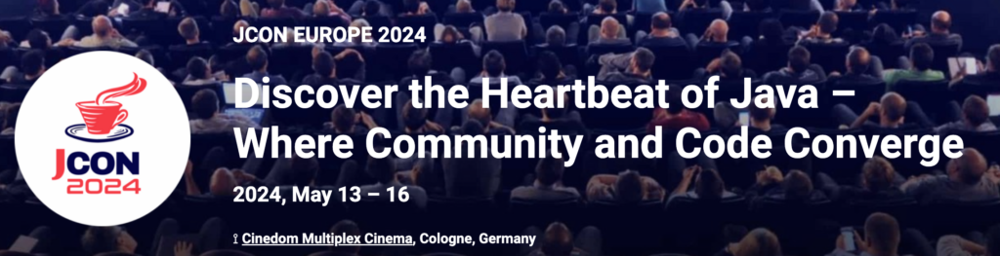
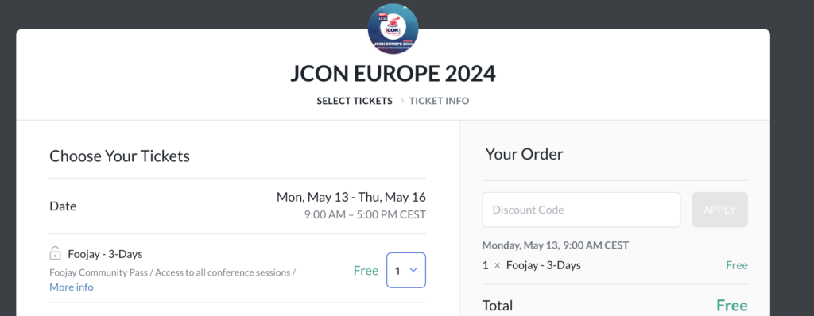

[Welcome to JCON EUROPE](https://2024.europe.jcon.one/) (May 13 - 16, 2024) - a conference and unique platform to come together with Java developers from all over the world to network, learn from each other and develop your personal skills. At JCON EUROPE, we create room for complex topics to unfold. Literally, hosted in a multiplex movie theater, Java code, concepts and programming are brought to life on impressively large cinema screens.

What makes JCON EUROPE truly special is the strong community that characterizes the conference. Organized and hosted by developers for developers, the inclusive atmosphere makes the difference, coined by a strong and joint passion that drives progress and creates value for everyone on site.

**Go here for free tickets for Foojay.io collaborators of all shapes and sizes, whoever you are reading this, you are welcome to join in for free via this link: <https://bit.ly/3xv9yfT>**

The core of JCON EUROPE is high-level content and practice-oriented topics. International speakers from the Java community share inspiring insights and help participants foster and expand their know-how.

JCON EUROPE offers a unique experience for Java developers by combining professional and personal growth, encouraging networking on an equal footing, and further strengthening our Java community.
