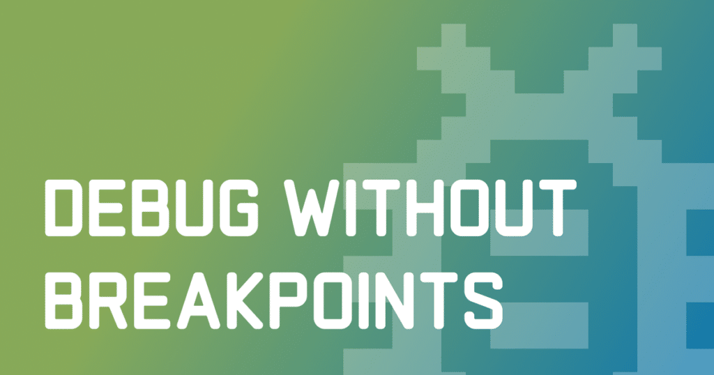
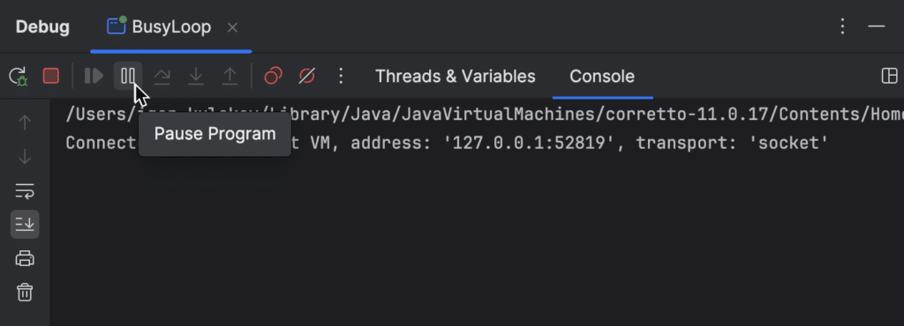
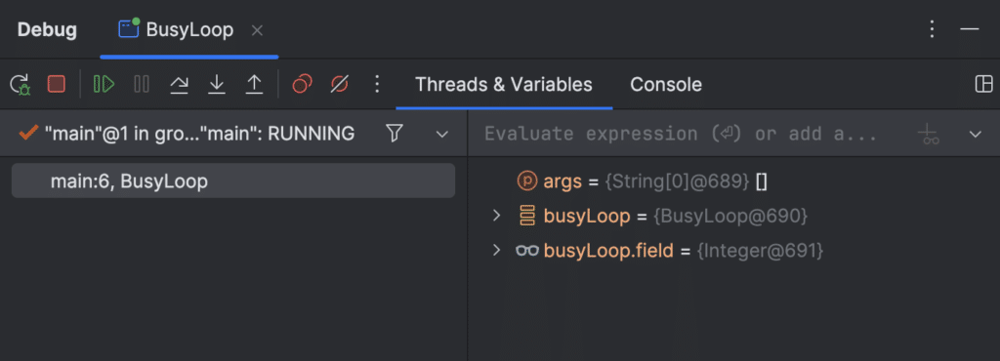
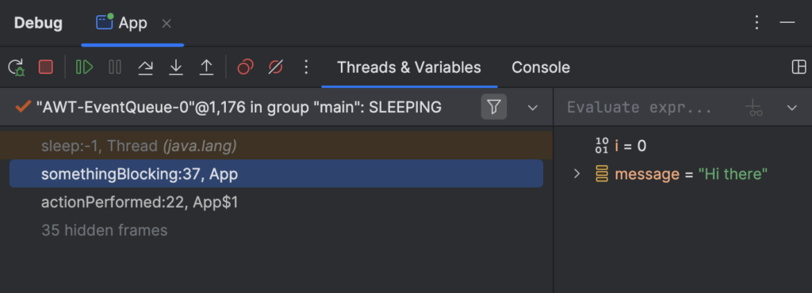
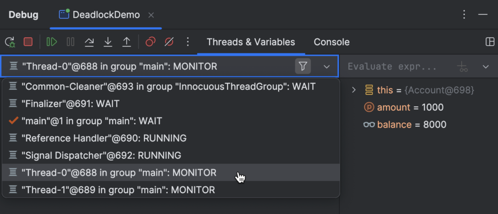

Read in other languages: [中文](https://flounder.dev/zh/posts/debug-without-breakpoints/) [Español](https://flounder.dev/es/posts/debug-without-breakpoints/) [Português](https://flounder.dev/pt/posts/debug-without-breakpoints/)

In a typical debugging scenario, you would set breakpoints to tell the debugger when to suspend your program. A breakpoint usually corresponds to the moment that marks the starting point of the further investigation.

However, in some situations you aren't certain about where to set a breakpoint. Other times, you might prefer to suspend the program at a particular *time* rather than aiming at a specific *line*.

In this article, we'll look at IntelliJ IDEA's **Pause** -- a lesser known debugging technique,  

which can be extremely powerful in some scenarios, including the ones described above.

We'll discuss its use-cases and limitations as well as discover the *secret stepping trick*.

## What Is Pause?

**Pause** is a feature in IntelliJ IDEA's debugger that enables you to arbitrarily suspend your application at any given point of time. To use it, you don't have to be familiar with the application code. In fact, you can completely ignore it!

<figure class="wp-block-image size-large is-resized">
 
</figure>

To pause a program, click **Pause** on the debugger's toolbar. As a result, the program gets suspended right in the middle of what it is currently doing.

## Limitations

At first sight, a paused program may look exactly like the one that has been suspended at a breakpoint. However, this is only true to a certain extent.

<figure class="wp-block-image size-large is-resized">
 
</figure>

It would be correct to consider **Pause** a sort of *thread dump plus* . You can still inspect variables and threads just as you typically would. However, some of the more advanced features, such as **Evaluate expression**, won't work.

## Use-cases

There are countless ways you can use **Pause** . Often, it can be used interchangeably with traditional breakpoints. But there are also scenarios where **Pause** fits better. Let's consider a couple of them.

### Unresponsive apps

If you encounter a UI freeze, that's usually because the UI thread is blocked or doing something heavy. **Pause** might be useful in both those cases.

<figure class="wp-block-image size-large is-resized">
 
</figure>

Pause the application while it is being unresponsive and examine the call stack of the UI thread. Often this is sufficient to diagnose the problem.

For a hands-on example of this scenario, see [Debug Unresponsive Apps](https://flounder.dev/posts/debug-unresponsive-apps/).

### Missing sources

As I mentioned before, **Pause** allows you to ignore the source code. Actually, the source code might as well be completely missing for you! This scenario is not typical, but when you encounter it, breakpoints wouldn't be of any help.

... which is not a problem for **Pause**.

<figure class="wp-block-image size-full is-resized">
 
</figure>

For a hands-on example of this scenario, see [Debugger.godMode()](https://flounder.dev/posts/debugger-god-mode/).

### Locks

If you suspect a synchronization problem, such as a deadlock or a livelock, **Pause** might help you find exact threads and monitors that are causing the issue.

<figure class="wp-block-image size-large is-resized">
 
</figure>

Pause the program and inspect the thread list. It will show which threads are blocked.  

By navigating to the execution point, you will also see the critical sections they are locked in. This information might guide you towards a solution.

## Secret Stepping Trick

As I pointed out earlier, **Pause** indeed limits your access to some of the advanced debugger features. Nevertheless, there is a workaround for this restriction.

After you have paused an application, proceed by performing any stepping action. **Step Into** or **Step Over** will do. After that, you'll find yourself in a regular debugging session, which is similar to suspending an application using a breakpoint.

All advanced features are now unlocked!

## Conclusion

That's it for today! Hope you find these tips and tricks useful.

For updates and feedback, [follow me on X](https://twitter.com/flounder4130) or subscribe to the mailing list on [my blog](https://flounder.dev/posts/debug-without-breakpoints/).

If there's something specific you want me to cover about Java debugging, don't hesitate to reach out. Your feedback will help me in prioritizing and publishing the content that is the most interesting to you.

See you soon!
