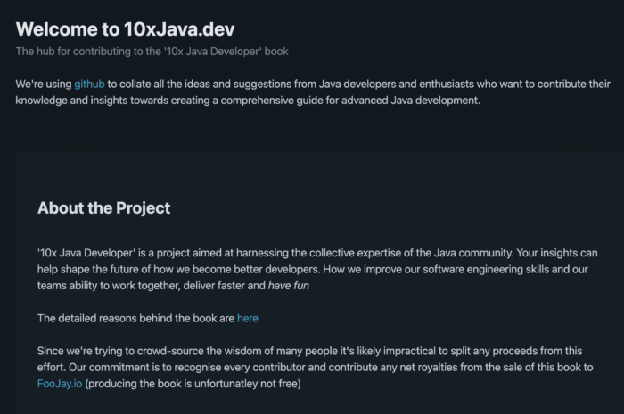

**Java transformed the world of software development as we know it and continues to evolve as a platform and language. Nevertheless, the "[enlightenment roadmap](https://github.com/devoxx/JavaRoadmap)" of a Java developer can be scary. How do you become the 10x Java Developer you always dreamed of becoming?**

That's the question Steve Poole and Olimpiu Pop embarked on to respond. And, what better way to achieve it than to tap into the best resource Java has: its community!

 

We(all of us) will write a [book](https://10xjava.dev/ "book") in an era when you ask and the AI assistant answers. A community crowd-sourced book to show you the track on how to become the expert you always wanted to be.

The book will be a series of practical advice - real recipes on mastering a trade of the development flow. We will look at architecture, algorithms, tooling, cloud, platforms, collaborations and more.

And because we are developers, we will do it using development practices: submit an issue and we will look to find who's the best person to respond. Do you have somebody in mind, great! Propose her/ him too. Do you want to submit some thoughts: do a PR and we will make sure it is reviewed and then it becomes part of the knowledge base.

I know what you think: this is a never-ending story. Agree! That's why we will have releases once a year we will have a GA version that contains the stable part of it.

And because we like to give, any money that might be generated will be donated to Foojay.

**What can you do? Keep an eye out and better yet keep both of them on the [site](https://10xjava.dev/ "site"). Share this article with your network, join the conversation on the [foojay slack](https://foojay.slack.com/archives/C06UUC5HN11 "foojay slack"), star and follow the [GitHub repo](https://github.com/10xjava-dev/10xjava-dev.github.io "GitHub repo").**
