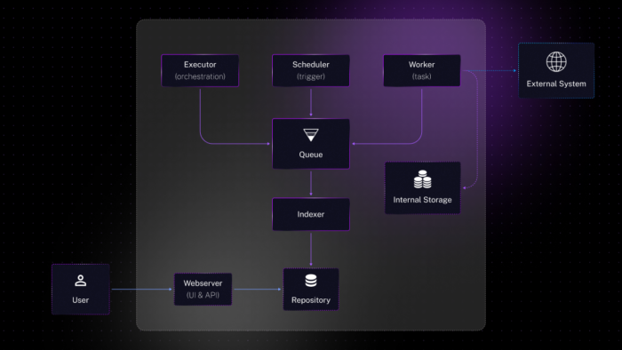

**A data orchestrator is a platform to schedule, organize, and monitor data-oriented workflows. A workflow is a set of tasks, most data orchestrators come with built-in tasks for a wide range of technologies and provide support for custom processing via a scripting language. A data orchestrator can have multiple types of triggers to start a workflow.**

*Most Data orchestrators are written in Python.*

*Most Data orchestrators mandate that **you** write Python code.*

Kestra is a declarative data orchestrator where workflows, called flows, are written in YAML.

*As Kestra is a declarative orchestrator, you don't need to use a programming language to use Kestra, so that **it** can be written in a language other than Python.*

Kestra is an Open Source project that can be found here: <https://github.com/kestra-io/kestra>, for an introduction to its functionalities, you can read [this article](https://blog.devgenius.io/introduction-to-kestra-a-declarative-orchestration-alternative-to-apache-airflow-10eaac05143d "this article") on the subject.

Unlike many existing data orchestrators, Kestra is written in Java.

Let's discover what makes Kestra unique amongst all the data orchestrators and how we leverage the power of the Java platform and its ecosystem to build a performant, scalable, and feature-rich data orchestrator.

## Kestra's Distributed Architecture Explained

Kestra's architecture is built on a distributed system, where various components interact asynchronously, primarily through messaging queues. Below is an overview of the key components that make up Kestra's architecture:

### Core Components of Kestra:

* **Executor**: This component is the component behind the orchestration logic, managing the execution lifecycle of data workflows.
* **Scheduler**: Responsible for initiating workflows based on trigger events, the Scheduler ensures tasks are executed at the right time.
* **Worker**: The Worker executes the individual tasks within a flow, interacting with both internal data storage and external systems as needed.
* **Indexer**: An optional but valuable component, the Indexer enhances data retrieval by indexing workflow metadata into a database.
* **Webserver**: The front-facing component of Kestra, providing user interface and API access to manage and monitor their workflows.

### Deployment Modes and Runners:

Kestra supports several deployment modes, with all components in a single process or microservice with one component per process.

For data management and queueing, Kestra offers two runners:

* **JDBC Runner**: Ideal for environments preferring traditional databases, this runner supports H2, PostgreSQL, and MySQL for both queueing and repository functions.
* **Kafka Runner**: For more demanding scalability requirements, this runner employs Kafka for queue and Elasticsearch for repository, available exclusively in the enterprise edition.

### Implementation details:

This micro-service architecture with flexible deployment mode is allowed thanks to the microservice Java framework Micronaut that offers built-in configuration management, dependency injection, database connectivity, and way more.

For example, switching from one runner to another is a question of changing a single configuration option, and then Micronaut will choose the right runner implementation thanks to conditional bean support.

To support different modes of deployment, we package all services in a single Jar via the Gradle build tool then decide at runtime which Kestra service to run based on the options passed to the Kestra CLI. The Kestra CLI is a Picocli application, when launched we will select which server component to start, locate its bean inside the Micronaut application context then run it.

## Kestra's extensibility

Kestra is an extensible platform: almost everything is a plugin.

Plugins are written in Java with Gradle. Writing a plugin is simple if you already know Java: there is a small learning curve as it only needs vanilla Java.

Kestra on itself uses the Micronaut framework but you don't need to know Micronaut to write a plugin.

Plugins can be used to extend Kestra's:

* Internal storage
* Flow tasks
* Flow triggers
* Trigger conditions (used to restrict triggering a flow on some conditions like a specific day in a week, state of a flow execution, ...)
* Secrets manager
* Task runner (used to run an embedded script in Docker, Kubernetes or Cloud platform runner)
* Even the API can be extended by providing additional Micronaut controllers!

If you want to create your own plugin, start from the Plugin Template (<https://github.com/kestra-io/plugin-template>), then follow our Plugin Developer Guide (<https://kestra.io/docs/plugin-developer-guide> ).

## API first

Kestra is API first, everything that you can do with its UI can also be done by directly calling its API.

This allows us to support automation via Terraform or Github actions easily, they both call the Kestra API.

Thanks to Swagger, the API is automatically documented so the API is easily discoverable. By the way, we use the same documentation mechanism used by Swager (OpenAPI) to document tasks and triggers.

## Written in Java

Kestra takes advantage of the Java language:

* Flow inputs and outputs are strongly typed, which is important for data gouvernance.
* Java dynamicity makes it easy to create a plugin system. We have a custom isolated classloader with one instance by plugin that allows each plugin to have its own set of libraries isolated from the others.
* The Java ecosystem provides built-in support to run scripting language inside the JVM. We leverage the Nashorn script engine for efficient row-to-row transformations directly in the JVM process, bringing tremendous performance compared to launching an external process or Docker container for simple row-to-row transformations. This is possible thanks to the Java *invokedynamic* facility.

Kestra takes advantage of the Java ecosystem:

* Huge ecosystem of libraries that support almost everything related to data.
* Java libraries and drivers are often the reference implementation, so the first to be updated with the best functionality coverage.
* JDBC (Java Database Connectivity) makes it easy to support tens of databases.
* Docker support, Kubernetes support, popular Cloud services support, ...
* Multiple data formats are supported: JSON, AVRO, Parquet, CSV, XML, ...

Kestra takes advantage of the JVM:

* High performance
* Multi-threads
* Highly scalable
* Java Security for worker task isolation using the Security Manager

The JVM is a robust platform widely known by operational teams. It is present already in a lot of IT departments so running Kestra is usually not a big deal for enterprises already running JVMs in their infrastructure.

We provide everything that operation teams are used to: logs, metrics, liveness and readiness check, Helm charts, ...

Moreover, thanks to its build once, run everywhere principle, Kestra can run in a lot of different environments without needing any complex compilation or installation steps.

Kestra Enterprise Edition leverages Kafka Stream:

* No SPOF (Single Point Of Failures): every component can be replicated including the Scheduler, which, on the opposite, cannot be replicated using the JDBC runner.
* Distributed scheduling of tasks
* Blazing-fast task orchestration, on a simple benchmark, the Kafka runner offers much superior performance compared to the JDBC runner.
* Transactional stateful stream processing
* Global State store: we leverage global state stores to store execution contextes between Kafka Stream instances, allowing each step of an execution to be run in different instances, improving performance and scalability.
* Kafka Stream Punctuation allows to process timely event distributed, we used it for example, to handle paused execution globally on the cluster.
* Fault tolerance

## Conclusion

We strongly believe that Java is a good fit for a data orchestrator and allows us to deliver a robust, performant, and scalable platform without compromising the set of data-oriented features that we provide.

Kestra is designed to run inside containers, in the near future, we plan to leverage its container-native nature and make it a true Kubernetes-native platform by implementing scripting task run as Kubernetes pods and a Kubernetes operator that will leverage our API to manage Flow definitions as custom resources.

Stay tuned for the next episode! ;).
