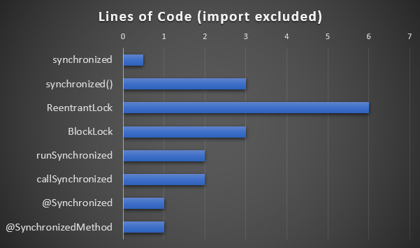

**Let's see in this article different ways to replace the synchronized keyword to make our code more virtual threads friendly.**  
 Lines of code of the different solutions discussed in this article

## Synchronized and pinning threads

Since Java 21, we can enjoy virtual threads and have more than 1 million threads in Java.  

But it has a condition, the virtual thread shouldn't be pinned to the OS thread.

Pinning means that a virtual thread is blocking the OS thread from being used by any other virtual threads.

This pinning happens when you're executing code in a synchronized block or calling a native method.

The solution of synchronized block is to replace them with re-entrant locks. This will make the code more verbose, so let's see how we can make the code more readable when replacing synchronized code with more virtual threads friendly code.
> Note that if your synchronized block is not doing IO operations like a network call or pauses, they is no need to replace the synchronized block as the virtual thread is not suspended.
> Note also that the OpenJDK project is working on making synchronized not to pin virtual threads but no date has been announced and if it will ever be shipped in a future release.

## 1️⃣ReentrantLock

Using `java.util.concurrent.locks.`[ReentrantLock](https://docs.oracle.com/en/java/javase/21/docs/api/java.base/java/util/concurrent/locks/ReentrantLock.html) is the official replacement for `synchronized` (from [JEP-425](https://openjdk.org/jeps/425)).

```java
ReentrantLock lock = new ReentrantLock();
public List<LocalDateTime> getReservedDates(String userId) {
    lock.lock();
    try {
        return databaseRepo.getDatesForUser(userId);
    } finally {
        lock.unlock();
    }
}
```

Now let's see how to get this code simplified.

[**Virtually**](https://github.com/japplis/Virtually) is an open source library released under the Apache license meant to ease the migration of code to be more virtual threads friendly.

## 2️⃣ BlockLock

`com.japplis.virtually.sync.`[BlockLock](https://github.com/japplis/Virtually/blob/main/src/main/java/com/japplis/virtually/sync/BlockLock.java) is an [AutoCloseable](https://docs.oracle.com/en/java/javase/21/docs/api/java.base/java/lang/AutoCloseable.html) `ReentrantLock`. This means that you can get rid of the finally block.

```java
BlockLock lock = new BlockLock();
public List<LocalDateTime> getReservedDates(String userId) {
    try (lock.lock()) {
        return databaseRepo.getDatesForUser(userId);
    }
}
```

## 3️⃣ SyncUtils

`com.japplis.virtually.sync.`[SyncUtils](https://github.com/japplis/Virtually/blob/main/src/main/java/com/japplis/virtually/sync/SyncUtils.java) contains a set of static methods that makes it easier to run synchronized blocks using a `ReentrantLock` by levering lambda calls.

You don't need to create a lock object or add a try block.

```java
import static com.japplis.virtually.sync.SyncUtils.*;

public List<LocalDateTime> getReservedDates(String userId) {
    return runSynchronized(() -> databaseRepo.getDatesForUser(userId));
}
```

This call will synchronized on the class (like `synchronized` on methods). You can also synchronize based for example on the user id.

```java
public List<LocalDateTime> getReservedDates(String userId) {
    return runSynchronized(userId, () -> databaseRepo.getDatesForUser(userId));
}
```

User id will be mapped to a `ReentrantLock`. You can also pass a `ReentrantLock` object if you prefer.

When you're calling a network method, it may also throw exceptions, so you would like to propagate them.

```java
public List<LocalDateTime> getReservedDates(String userId) throws Exception {
    return callSynchronized(userId, () -> databaseRepo.getDatesForUser(userId));
}
```

In this `callSynchronized` the lambda is a `Callable` instead of a `Supplier`.

## 4️⃣ AspectJ

Aspect Oriented Programming allows to execute code before or after specified methods for example for logging or caching.

Virtually is providing [@Synchronized](https://github.com/japplis/Virtually/blob/main/src/main/java/com/japplis/virtually/sync/Synchronized.java) and [@SynchronizedMethod](https://github.com/japplis/Virtually/blob/main/src/main/java/com/japplis/virtually/sync/SynchronizedMethod.java) annotation to replace the `synchronized` keyword.

`@Synchronized` will synchronized at the class level and `@SynchronizedMethod` at the method level.

```java
import com.japplis.virtually.sync.Synchronized;

@Synchronized
public List<LocalDateTime> getReservedDates(String userId) {
    return databaseRepo.getDatesForUser(userId);
}
```

Note that you will need to add [AspectJ](https://en.wikipedia.org/wiki/AspectJ) to the build and decide when to do the the bytecode transformation.

## 5️⃣ Hidden synchronized

Sometimes your virtual thread will not be pinned by a direct synchronized block but by a JDK method call that uses a synchronized block.

Virtually offers classes and methods replacements that are more virtual threads friendly.

`Map.computeIfAbsent()` -\> `com.japplis.virtually.Maps.`[computeIfAbsent](https://github.com/japplis/Virtually/blob/main/src/main/java/com/japplis/virtually/Maps.java#L53)`(Map map, E key, CallableFunction mapper)`  
`ReadableByteChannel` -\> `com.japplis.virtually.`[ReadByteChannel](https://github.com/japplis/Virtually/blob/main/src/main/java/com/japplis/virtually/ReadByteChannel.java)

## Conclusion

Virtual threads are a major improvement in Java. In some cases, it will allow much more requests per server, reducing costs and CO^2^ emissions.

But it doesn't come for free, you may need to update libraries and code.

Hopefully, this doesn't come to the price of more code complexity and the Virtually library can help you in some cases.
