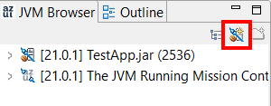
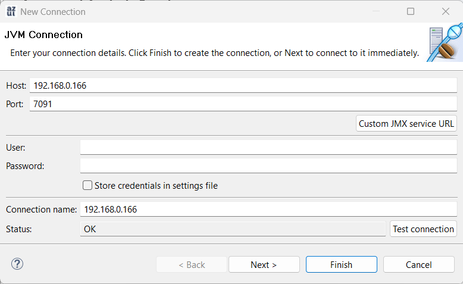
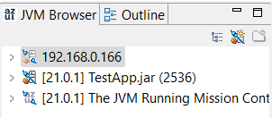
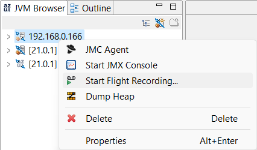
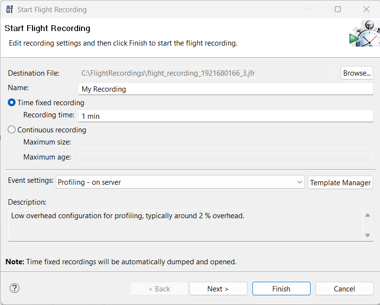
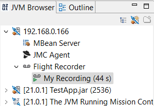

Java Flight Recorder (JFR) is the go-to technology for recording and viewing JVM and system metrics.

JFR records JFR logs which reveal much about the running application, the health of the JVM and the stability of the system. JFR logs are easily obtained by simply going into the command line / terminal and entering a few commands.

But what if you don't have access to the command line or terminal directly on the system where the JVM is running, like when the JVM is running in a container?

Don't worry. In this quick guide, you can learn how to do just that with a little configuration using JVM's JMX connector and Azul Mission Control.

Before you can access your JVM outside of the command line / terminal, you must set up your JVM to be discoverable and accessible over remote connections. You can accomplish this simply by enabling the JVM's JMX connector.

Configure your Java application with the following VM parameters:

* `-Dcom.sun.management.jmxremote`: enables JMX/JMXRMI connectivity.
* `-Dcom.sun.management.jmxremote.host=[IP/Hostname]`: Sets the address for JMX connection. Use an external IP address or host name of the computer or container where the Java program is running.
* `-Dcom.sun.management.jmxremote.port=[port]`: Sets the TCP port for JMX connection.
* `-Djava.rmi.server.hostname=[IP/Hostname]`: Sets the address for JMXRMI connection. Use the same IP/hostname you used for JMX connection.
* `-Dcom.sun.management.jmxremote.rmi.port=[port]`: Sets the TCP port for JMXRMI connection. Use the same TCP port you used for JMX connection.
* `-Dcom.sun.management.jmxremote.local.only=false`: If you are connecting to the JVM from a different machine, you have to unbind ports from localhost.
* Additionally, you may want to enable JMX authentication/SSL using:
  * `‑Dcom.sun.management.jmxremote.authenticate=true`
  * `-Dcom.sun.management.jmxremote.ssl=true`

For example:

```
-Dcom.sun.management.jmxremote \
-Dcom.sun.management.jmxremote.host=192.168.0.166 \
-Dcom.sun.management.jmxremote.port=7091 \
-Djava.rmi.server.hostname=192.168.0.166 \
-Dcom.sun.management.jmxremote.rmi.port=7091 \
-Dcom.sun.management.jmxremote.local.only=false \
‑Dcom.sun.management.jmxremote.authenticate=false \
-Dcom.sun.management.jmxremote.ssl=false \
```

## Connecting to a Remote JVM Using Azul Mission Control

If you don't have Azul Mission Control yet, head over to the [Azul Mission Control download page](https://www.azul.com/products/components/azul-mission-control/#downloads).

In Azul Mission Control, go to the JVM Browser and click the **Add JVM Connection** button to create a new custom JVM connection.



Specify the host name/IP address of the remote system and the JMX port number.

If JMX authentication is enabled, enter User and Password.

Click **Test Connection** to make sure your remote JVM is reachable and click Finish.



Your remote JVM now appears in the JVM Browser.



*Depending on your network and container setup, port forwarding may need to be set up. Contact your network's administrator if you need help with port forwarding.*

## Recording a JFR from your Remote JVM

Now that you're connected to your JVM remotely, it's time to make a JFR recording.

In Azul Mission Control, go to the JDK Browser, right-click your remote JVM connection and select **Start Flight Recording...**



Select your preferred options and time intervals (either a fixed time recording or continuous recording based on the JFR log's size and/or age), and click **Finish**.



Your remote JFR recording has begun. You're almost there!

Check the progress of the recording by expanding the remote JVM connection in the JVM Browser.



Once your recording has finished, your JFR log opens automatically in Azul Mission Control.

You can now check the Outline tab to take a deeper look into your JVM's performance portfolio.
