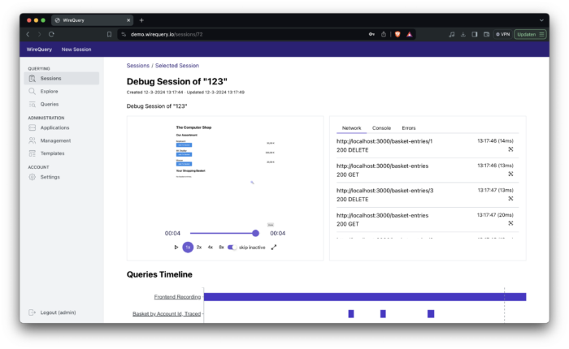
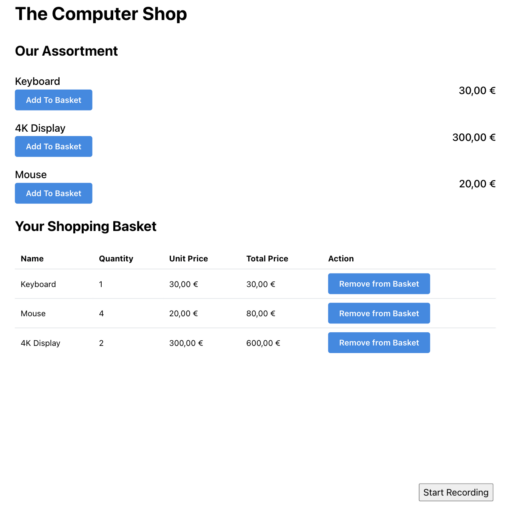
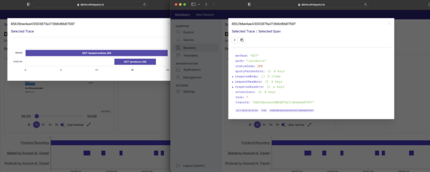

**As a developer, I've often struggled with diagnosing user-reported issues, which is often caused by a lack of information to reproduce the problem. While a ticket may contain a screenshot of the problem and a description, it often does not portray the complete picture. For example: what did the user do that led up to the issue? What endpoints were called from the frontend, and how did they respond? What did the underlying systems communicate? Etc.**

Logs often help, but may also be insufficient - because, generally, logs do not provide sufficient detail to create a complete picture. Generally, as soon as you notice that you need more information, you add additional log statements. But in case of a user-reported issue, you're already too late.

In contrast, if you would be able to observe all the inputs and outputs that go into a system, you generally have all the information you need to reproduce a bug.

Similarly, while a screenshot may be worth more than a thousand words, they are not always provided as part of the issue, nor do *they* tell the whole story. And while there are tools to capture to create a video-like recording of an issue (so-called Session Replay tools), they often only capture what happens on the frontend; not the interactions that happened two layers deep. This makes most Session Replay tools insufficient for debugging distributed systems.

As such, you often end up with to a series of calls between the customer, the support team and the development team. A very inefficient process, which is accompanied by a lot of frustration. WireQuery aims to solve this problem.

WireQuery is a tool that allows you to combine Session Replay with capturing network requests between (micro)services, including their payload and optionally supplemented with logs, metrics and other types of information. By doing so, you get a complete picture of happened during an issue. Not just on the frontend OR on the backend, but on every part of your entire stack.

In other words: WireQuery provides complete visibility of what happened during an issue.  
  

Depending on your needs, the recording can either be started by the end user or by a support employee. When the recording is complete, the support employee can then add a link to the recording to the issue's ticket. Or, the engineer can access the recording directly.

When the engineer opens the recording, the engineer is welcomed by a video player of the interactions of the end user. On the side, the frontend console logs are shown, together with the network calls.

If the problem turns out to be upstream or downstream, the developer can easily share that same link with the relevant team. By clicking on a network call, the developers that receive the ticket can drill down to see what their service received and responded. Instead of ping ponging between different teams, this stimulates and enables collaboration.

The only real way to experience the power of WireQuery is by giving it a try. As such, let's do a deep dive into WireQuery by setting up a demo environment. This demo environment will simulate a microservice environment of a webshop, consisting of three applications:

* Products: the catalog of the webshop
* Basket: the order basket backend
* Frontend: the frontend of the webshop

In this demo, the user will be presented with the ability to put different products in his or her basket. At the bottom, there will be a "Start Recording" button, which will start a recording that can be captured by WireQuery.

Do take note, however, that in real world applications, the user is probably better off with a form and some information to describe the problem rather than a gray button that says "Start Recording". But in order to focus on the essence of the product, the demo is kept simple.

To get started, first clone the WireQuery repository and start the server:

```bash
git clone <a href="/cdn-cgi/l/email-protection" class="__cf_email__" data-cfemail="adcac4d9edcac4d9c5d8cf83cec2c0">[email protected]</a>:wirequery/wirequery.git
cd wirequery
docker-compose up
```


Open a browser and log in at `localhost:8090` using `admin` / `admin`.

Next, head over to Applications and create two of them:

1. Basket
2. Products

For both of them, take note of the API Key by going into the created projects, clicking on Actions and "Show API Key".

The next step is to create a template that will allow us to capture the interactions. Head over to templates, and click "Actions" and "Add Query". Use the following settings:

* *Name:* Debug Session by Account Id
* *Description:* Debug Session by Account Id
* *Name Template:* Debug Session of {{accountId}}
* *Description Template:* Debug Session of {{accountId}}
* *Allow User Initiation:* Checked

The first two fields identify the name of the templates. Templates can in turn be used to create a recording session, where the name and description of this session corresponds to the information in the remaining fields.

Next, we need to add a query to the template. Use the following settings:

* *Name Template:* Basket by Account Id, Traced
* *Query Template:* `Basket | filter has(it.requestHeaders.accountid) | filter it.requestHeaders.accountid[0] == {{accountId}}`
* *Type:* Query With Tracing

And:

* *Name Template:* Products by Account Id, Traced
* *Query Template:* `Products | filter has(it.requestHeaders.accountid) | filter it.requestHeaders.accountid[0] == {{accountId}}`
* *Type:* Query With Tracing

These two queries are used to capture the information that we need within a service.

The next step is to take note of the `User initiation api key`, which can be found by clicking on `Details`. Also take note of the template's id, which can be found in the URL. For example, in the case of `/templates/3`, the id is 3.

Next, since we're on Foojay, let's have a look at the JVM examples for the backend systems.

Open the WireQuery project folder using IntelliJ. Then, head over to `sdk/jvm/examples/spring-boot/products`. Open the `application.yml` file and change the Api Key according to the Api Key in WireQuery. Then, head over to the `ProductsApplication` and launch it.

Next, head over to `sdk/jvm/examples/spring-boot/basket`. Open the `application.yml` file and change the Api Key according to the Api Key in WireQuery. Then, head over to the `BasketApplication` and launch it. You should now have two applications running.

Next up is the frontend. Open `sdk/js/examples/shop` in your IDE and change the second and third argument of `new RecorderClass(wireQueryBackendPath, ..., ...)` to the template's id and Api Key respectively.

In a terminal, head over to `sdk/js/examples/shop`. Make sure you have Node.js installed and run: `npm install` and `npm run dev`. Open a browser and navigate to `localhost:3000`. You should now see something that looks like a "computer webshop".



On the bottom, there is a "Start Recording" button. This will start the recording in WireQuery. Click on this button, click on a few other buttons and then stop the recording. Next, head back to WireQuery, and click on Sessions, where you should see a single entry.

Open it and play the video. This should correspond with the actions that you took. Whenever you clicked on something, it should result in a network requests on the right side of the screen and on the bottom of the screen.

When you click on the purple bars at the bottom of the screen, a modal should open with the complete journey that the selected request has taken through your systems. If you drill down, you should see the API call that was made, including the request and response body, headers, the time it took, and more.



In many cases, these screens should provide you with all the information you need to fix most user-reported issues.

Now that we've seen how to set up a demo environment, let's take a closer look into how the demo applications were set up to communicate with WireQuery.

Backend
-------

In the `application.yml`, a few properties were added, such as the Api Key, the name of the application and the location of the WireQuery server. Similarly, the following dependencies were added to the `build.gradle.kts` file that are relevant for using WireQuery:

```kotlin
implementation("com.wirequery:wirequery-spring-boot-3-starter:${project.version}")
implementation("io.micrometer:micrometer-tracing-bridge-brave")
```


The former dependency is the WireQuery Spring Boot Starter and the latter is used for making sure that each request is traced, which is required for using WireQuery effectively.

Furthermore, there is a `WireQueryConfig` file that will set up the "TraceProvider" (which makes sure the trace id is sent correctly to WireQuery):

```kotlin
package com.example.basket.config

import com.wirequery.spring6.TraceProvider
import io.micrometer.tracing.Tracer
import org.springframework.context.annotation.Bean
import org.springframework.context.annotation.Configuration

@Configuration
class WireQueryConfig {
    @Bean
    fun traceProvider(tracer: Tracer) =
        TraceProvider {
            tracer.currentSpan()?.context()?.traceId()
        }
}
```


Frontend
--------

On the frontend, the following dependencies were added:

```json
"@wirequery/wirequery-js-core": "0.0.5",
@rrweb/types": "^2.0.0-alpha.11",
"rrweb": "^2.0.0-alpha.11",
"rrweb-snapshot": "^2.0.0-alpha.11",
```


The recorder is initiatialized using the following code:

```javascript
const recorder = new RecorderClass(<wireQueryBackendPath>, <templateId>, '<apiKey>')
```


When the "Start Recording" button is clicked, the following logic is executed:

```javascript
recorder.startRecording({ accountId: '123' })
```


And when the recording ends, the following logic is executed:

```javascript
recorder.stopRecording()
```


In this article, we covered the main use case of WireQuery: debugging user-reported incidents in distributed systems. However, there is a lot more to cover.

For example, you may still be wondering: why did you need to enter queries in the templates? What does the Explore tab do?

These and other questions will be answered when you look at the other use case that WireQuery covers: understanding the (edge case) behaviour of the systems within your IT landscape. More information can be found on the [website](https://www.wirequery.io) of WireQuery and in separate articles.

Nevertheless, I hope I have been able to provide you with a good idea what WireQuery can mainly be used for: debugging user-reported incidents.

Instead of a process that requires going back-and-forth between the customer, support employees and the development teams, WireQuery's unique take on the matter increases efficiency and stimulates collaboration. It's free and open source and takes only a few minutes per microservice to integrate.

Check it out on [GitHub](https://github.com/wirequery/wirequery) or visit [wirequery.io](https://www.wirequery.io) for more information.

Or join us on the upcoming Amsterdam JUG event at [Picnic](https://www.meetup.com/amsterdam-java-user-group/events/300632803/).
