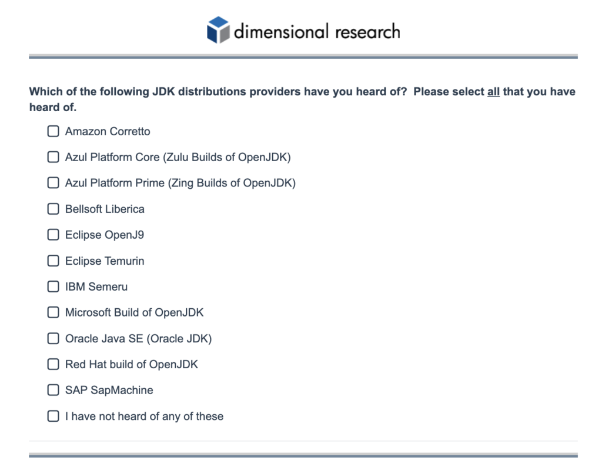

[Azul](https://azul.com/) is planning to issue an Oracle Java "alternatives" Report in late July, and would like your help to complete the survey.

The focus of this report is to explore the following themes:

* highlight the frictions created by Oracle with their pricing policies and tactics
* show whether customers are in fact moving off of Oracle Java to OpenJDK alternatives
* prove the extent to which customers are willing to pay for commercial support and application migration expertise

Below is the link to the survey.

<https://survey.alchemer.com/s3/7845442/Azul>

There are only 25 questions in total, including the screener questions, so this should only take about 10 - 15 minutes to complete.

The survey will close in two weeks time, so if you could complete this report within that timeframe that would be great!

You will all receive a copy of this report once finalized.
