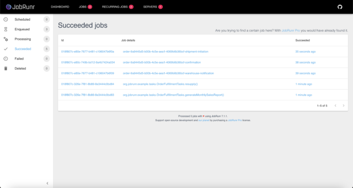

## What is JobRunr

### Task scheduler in Java

JobRunr is an open-source Java library for **task scheduling** and **distributed background job** processing. It offers an effortless way to **perform background tasks using only Java 8 lambdas**.

Whether it is a **fire-and-forget** , **scheduled** or **recurring job** , JobRunr analyzes the lambda and stores the metadata needed to process the job in a database. This simple architecture, with a few other mechanisms, allows a job to be **executed on any available server** running your application (👋 k8s).

In the event of a failure, JobRunr **automatically retries** the job. Thanks to the built-in dashboard, it's **easy to monitor the system** to see why a job failed or to perform actions such as requeuing or deleting a job.

The **software** **integrates** **easily** **into** **any Java application** by adding JobRunr as a dependency. It also works seamlessly with frameworks like Spring Boot, Quarkus, and Micronaut.

### JobRunr use cases in Java

The applications of JobRunr are almost limitless: **anything that can be done in Java can be automated and scheduled with JobRunr**. Would you like to send mass notifications, fire webhooks, process images, or videos? JobRunr can do it all for you, so you can focus on solving the business problems at hand.

JobRunr is **used in various industries** from retail to healthcare to marketing, no matter the size of your company. We have written a few articles about how JobRunr Pro is used in those industries: [visit to learn more](https://www.jobrunr.io/en/use-case/ "visit to learn more").

### Core task scheduler features for Developers

* **Developer friendly:** the API of JobRunr is simple, flexible and straightforward - with a simple, yet extensive set up.
* **Simple adoption:** JobRunr fits into any software architecture and requires little changes to your codebase while requiring a low amount of dependencies.
* **Framework integration:** JobRunr supports the most popular Java frameworks: Spring, Quarkus and Micronaut.
* **Various storage options:** persistent storage is done via either RDBMS (e.g. Postgres, MariaDB/MySQL, Oracle, SQL Server, DB2 and SQLite) or NoSQL (ElasticSearch, MongoDB and Redis)
* **Cloud native and cloud agnostic**: deployable anywhere, either on your preferred cloud provider or on-premise
* **Distributed processing:** scale is not an issue - JobRunr supports job distribution across a cluster.
* **Fault tolerance**: JobRunr is also fault-tolerant - is an external web service down? No worries, the job is automatically retried 10-times with a smart back-off policy. The retry policy is of course configurable!
* **Real-time monitoring:** JobRunr provides a dashboard that allows users to monitor jobs, trigger or delete recurring jobs and requeue or delete jobs.
* **Virtual threads:** JobRunr supports virtual threads to allow for an increased throughput of I/O jobs.
* **Comprehensive documentation:** the documentation covers everything from setup to advanced features, easing the learning curve.

### What's next: Carbon-aware jobs

JobRunr is now in collaboration with MindWave to add [carbon-aware](https://www.linkedin.com/pulse/introducing-carbon-aware-jobs-jobrunr-jobrunr-wtyee/?trackingId=%2Fg1pS789Y0r6BoaHf%2B1ppg%3D%3D "carbon-aware") task scheduler in Java. The **carbon-aware job feature** aims to optimize job execution by selecting periods with the **highest availability of renewable energy** . The goal is to work towards achieving one of the [**SDGs' objectives**](https://sdgs.un.org/goals/goal12 "SDGs’ objectives").

## An example: Automated order fulfillment system using JobRunr

To illustrate how JobRunr works, let's simulate an [order fulfillment](https://en.wikipedia.org/wiki/Order_fulfillment "order fulfillment") system. Order fulfillment involves tasks required to completely satisfy a customer order. It's a process where each step can affect another, which happens on several levels. For example, a confirmed order reduces stock and to avoid stock-outs it is important to monitor and replenish the inventory.

The order fulfillment workflow has a lot of potential for automation where events can trigger jobs, which in turn trigger events until all steps are completed. As some of the workflow happens in the background, it's a good opportunity to illustrate JobRunr! The setup of this example is as follows:

* We'll create an order confirmation that will trigger three tasks that can run asynchronously: 1) send a confirmation email to the customer, 2) notify the warehouse of the arrival of the order, and 3) initiate shipment by calling the preferred carrier's API.
* Some tasks are recurring. We illustrate this using two tasks: 1) a job that generates sales reports monthly, and 2) a job that monitors the inventory on a daily basis.
* Something may go wrong while executing the tasks, in those cases, we want to trigger an alert.

This setup will allow to learn:

* How to setup JobRunr in [Spring Boot](https://spring.io/ "Spring Boot") application
* How to enqueue jobs using a Java 8 lambda configured via the [@Job](https://www.jobrunr.io/en/documentation/#job-annotation) annotation and the [JobBuilder](https://www.jobrunr.io/en/documentation/#jobbuilder)
* How to create recurring jobs using the [@Recurring](https://www.jobrunr.io/en/documentation/background-methods/recurring-jobs/) annotation
* How to hook into a job lifecycle using a [JobFilter](https://www.jobrunr.io/en/documentation/pro/job-filters/)

> Please note that this example focuses on JobRunr side of things, we leave the implementation of object such as the Inventory, the `Order`, the `Product`, etc. as an exercise. Also the running of tasks is simulated by `Thread.sleep` which implies explicit handling of `InterruptedException`, you probably won't need those in an actual application. Although if you encounter such a case in your project it's a [best practice to throw the InterruptedException](https://www.jobrunr.io/en/documentation/background-methods/deleting-jobs/ "best practice to throw the InterruptedException"), JobRunr will handle it.

### Setting up JobRunr in a Spring Boot application

#### Adding the JobRunr Spring Boot starter dependency

The setup is very easy for Spring Boot, it often consists of adding JobRunr's Spring Boot starter artifact as a dependency. The following snippet shows how to include it when using Maven as a build tool.

```xml
<dependency> 
    <groupId>org.jobrunr</groupId> 
    <artifactId>jobrunr-spring-boot-4-starter</artifactId>
    <version>${jobrunr.version}</version> 
</dependency>
```

JobRunr requires adding database dependencies. We can skip this step as this is usually done when initializing the Spring Boot application. Nonetheless, it's worth noting that JobRunr [supports several databases](https://www.jobrunr.io/en/documentation/installation/storage/ "supports several databases"). Another DB related feature is that all JobRunr related migrations are automatically handled by default. You can always decide otherwise and [take control over the DB setup](https://www.jobrunr.io/en/documentation/installation/storage/#setting-up-the-database-yourself "take control over the DB setup").

JobRunr also needs a JSON processing library, but as Spring Boot by default comes with Jackson support this is already covered.
> Note: JobRunr also supports the older [Spring Boot 2](https://www.jobrunr.io/en/documentation/configuration/spring/ "Spring Boot 2") and other frameworks such as [Quarkus](https://www.jobrunr.io/en/documentation/configuration/quarkus/ "Quarkus") and [Micronaut](https://www.jobrunr.io/en/documentation/configuration/micronaut/ "Micronaut"). The library can be [found on Maven Central](https://mvnrepository.com/artifact/org.jobrunr "found on Maven Central"), feel free to use your [preferred build tool](https://www.jobrunr.io/en/documentation/installation/ "preferred build tool").

#### Configuring JobRunr

JobRunr can be configured using `application.properties`. Job processing and the dashboard are disabled by default. To enable them, we'll add the following to the configuration file:

```
org.jobrunr.dashboard.enabled=true
org.jobrunr.background-job-server.enabled=true
```

While we're still in `application.properties` we will also add:

```
monthly-sales-report.cron=0 0 1 * *
daily-resupply.cron=0 0 * * *

stock-locations=Brussels,Antwerp,Bruges,Liege
```

Those will be useful to our recurring jobs as we'll see later!

JobRunr offers [advanced configuration](https://www.jobrunr.io/en/documentation/configuration/spring/#advanced-configuration "advanced configuration") options allowing to fine tune the application. When using the JobRunr's Spring Boot starters or the other frameworks integrations, it's also possible to override the predefined Beans.

### Implementing the order fulfillment system

Now that the setup is done, we can start implementing our simulated order fulfillment processes. We'll focus on the JobRunr sides of things, i.e., enqueueing jobs, creating recurring jobs and hooking into a job lifecycle.

### Triggering tasks on order confirmation

Once an order is confirmed, our system will trigger three tasks:

* Send the order confirmation to the customer.
* Notify the warehouse of the arrival of the order so work on the packaging can be swiftly done. This step may also involve generating and optimizing packing slips.
* Initiate shipment by making a call to the selected carrier's booking API.

To automate these tasks with JobRunr we will create the following classes: a Spring's `RestController` (namely `OrderFulfillmentController`), an `OrderFulfillmentService`, and an `OrderFulfillmentTasks`.

The `OrderFulfillmentController` will provide an endpoint to enqueue jobs. These jobs' logic are implemented by the `OrderFulfillmentService`. We could stop here, but we would like the business logic to be separated from the job processing logic which will include features from JobRunr. Thus the introduction of `OrderFulfillmentTasks`.

Here is an initial implementation of the `OrderFulfillmentService` class, we'll add more to it later.

```java
@Service
public class OrderFulfillmentService {
    private static final Logger LOGGER = LoggerFactory.getLogger(OrderFulfillmentService.class);
    public void sendOrderConfirmation(UUID orderId) throws InterruptedException {
        // TODO retrieve order from database, generate an invoice and send the confirmation to the customer
        LOGGER.info("Order {}: sending order confirmation%n", orderId);
        Thread.sleep(2000);
    }

    public void notifyWarehouse(UUID orderId) throws InterruptedException {
        // TODO notify the warehouse of the arrival of a new order after retrieving/computing the necessary data using the orderId
        LOGGER.info("Order {}: notifying the warehouse", orderId);
        Thread.sleep(1000);
    }

    public void initiateShipment(UUID orderId) throws InterruptedException {
        // TODO call the carrier's shipment initiation endpoint after retrieving/computing the necessary data using the orderId
        LOGGER.info("Order {}: initiating shipment", orderId);
        Thread.sleep(5000);
    }
}
```

*Note that we use `Thread.sleep` to simulate work, this forces us to explicitly handle `InterruptedException`, in an actual application, it's probably not needed.*

The `OrderFulfillmentTasks` class makes use of the `OrderFulfillmentService`. Notice the additional `@Job`, which allows setting values to a job's attributes. This annotation is very handy! You may also use the alternative: the `JobBuilder`. We're doing exactly that in the body of the method, the jobs are configured using the `JobBuilder` and then saved atomically. This method is essentially a job that creates other jobs, so it also benefits from JobRunr's fault tolerance capabilities.

```java
@Service
public class OrderFulfillmentTasks {

    private final OrderFulfillmentService orderFulfillmentService;

    public OrderFulfillmentTasks(OrderFulfillmentService orderFulfillmentService) {
        this.orderFulfillmentService = orderFulfillmentService;
    }

    @Job(name = "order-%0")
    public void enqueueConfirmedOrderTasks(UUID orderId) {
        BackgroundJob.create(of(
                aJob()
                        .withName(format("order-%s-confirmation", orderId))
                        .withDetails(() -> orderFulfillmentService.sendOrderConfirmation(orderId)),
                aJob()
                        .withName(format("order-%s-warehouse-notification", orderId))
                        .withAmountOfRetries(20)
                        .withDetails(() -> orderFulfillmentService.notifyWarehouse(orderId)),
                aJob()
                        .withName(format("order-%s-shipment-initiation", orderId))
                        .withDetails(() -> orderFulfillmentService.initiateShipment(orderId))
        ));
    }
}
```

Note the use of `withAmountOfRetries(20)` for the warehouse notification task, we have to increase the amount of retries since our internal service is quite unstable.

The `OrderFulfillmentController` is quite simple as it exposes a single endpoint that requests JobRunr to enqueue jobs. Once the metadata of these jobs are saved in the database, the server workers will process them asynchronously when they are ready.

```java
@RestController
public class OrderFulfillmentController {

    @GetMapping("/confirm-order")
    public String confirmOrder() {
        UUID orderId = UUID.randomUUID();
        BackgroundJob.<OrderFulfillmentTasks>enqueue(x -> x.enqueueConfirmedOrderTasks(orderId));

        return "Done";
    }
}
```

### Creating recurring tasks

The first part of our order fulfillment system is done. Now, we'll add recurring tasks to know how well the company is doing and to make sure we never go out-of-stock!

Let's update the `OrderFulfillmentService` to add the logic for these two tasks.

```java
@Service
public class OrderFulfillmentService {
    // ...

    // Add the following methods to the class

    public void generateMonthlySalesReport(YearMonth month) throws InterruptedException {
        // TODO aggregate monthly sales, generate PDF and send it to managers
        LOGGER.info("Sales report: generating monthly sales report on {} for month {}", Instant.now(), month);
        Thread.sleep(10000);
    }

    public void resupply(String stockLocation) throws InterruptedException {
        // TODO check the stock and contact supplier if needed
        LOGGER.info("Inventory resupply: resupplying the inventory on {} for stock {}", Instant.now(), stockLocation);
        Thread.sleep(5000);
    }
}
```

We now update the `OrderFulfillmentTasks` to register those tasks. As they are recurring, we annotate them with `@Recurring` and a few attributes.

```java
@Service
public class OrderFulfillmentTasks {

   // Add the following attribute to the class

    @Value("${stock-locations}")
    private List<String> stockLocations;

    // ...

    // Add the following methods to the class

    @Recurring(id = "monthly-sales-report", cron = "${monthly-sales-report.cron}", zoneId = "Europe/Brussels")
    public void generateMonthlySalesReport() throws InterruptedException {
        YearMonth previousMonth = YearMonth.now().minusMonths(1);
        orderFulfillmentService.generateMonthlySalesReport(previousMonth);
    }

    @Recurring(id = "daily-resupply", cron = "${daily-resupply.cron}", zoneId = "Europe/Brussels")
    public void resupply(JobContext jobContext) throws InterruptedException {
        JobDashboardProgressBar jobDashboardProgressBar = jobContext.progressBar(stockLocations.size());
        for(String stockLocation : stockLocations) {
            orderFulfillmentService.resupply(stockLocation);
            jobDashboardProgressBar.increaseByOne();
            jobContext.logger().info(format("Resupplied stock %s", stockLocation));
        }
    }

}
```

JobRunr will automatically register methods annotated with `@Reccuring` and schedule them for execution at the specified times!
> Note the use of application properties, we promised to come back to them. We use them to configure the CRON expressions of our recurring jobs. The last property is used to provide the locations of our different warehouses. Here we have assumed that our imaginary company operates from Belgium and set the zoneId accordingly.

### Triggering an alert on task failure

The system may encounter an issue that causes jobs to fail during execution. In our scenario, it's important to alert the operations team so they can make sure the failed task is one way or another completed.

JobRunr allows us to hook into a job lifecycle using [Job Filters](https://www.jobrunr.io/en/documentation/pro/job-filters/ "Job Filters"). The following code simulates the idea of sending a notification when all retries have been exhausted.

```java
@Component
public class OrderFulfilmentTasksFilter implements JobServerFilter {
    private static final Logger LOGGER = LoggerFactory.getLogger(OrderFulfilmentTasksFilter.class);

    @Override
    public void onFailedAfterRetries(Job job) {
        // TODO alert operational team of Job failure
        LOGGER.info("All retries failed for Job {}", job.getJobName());
    }
}
```

JobRunr does not automatically register custom job filters. We need additional code to make sure our hook will be called by JobRunr's background job servers. We can achieve this by overriding the `BackgroundJobServer` bean. Here, we illustrate another approach using Spring's `BeanPostProcessor`.

```java
@Component
public class BackgroundJobServerBeanPostProcessor implements BeanPostProcessor {
    private final OrderFulfilmentTasksFilter orderFulfilmentTasksFilter;

    public BackgroundJobServerBeanPostProcessor(OrderFulfilmentTasksFilter orderFulfilmentTasksFilter) {
        this.orderFulfilmentTasksFilter = orderFulfilmentTasksFilter;
    }

    @Override
    public Object postProcessBeforeInitialization(Object bean, String beanName) throws BeansException {
        if(bean instanceof BackgroundJobServer backgroundJobServer) {
            backgroundJobServer.setJobFilters(Collections.singletonList(orderFulfilmentTasksFilter));
        }
        return bean;
    }
}
```

### Running the application

And we're done, let's enjoy the results! Start the application and head over to <http://localhost:8000/dashboard>. You should land on a beautiful dashboard, feel free to visit other pages.  

Once you're satisfied, visit <http://localhost:8080/confirm-order> to trigger the order fulfillment tasks. Head back to the dashboard, you can observe the jobs moving from one state to another until they succeed.

<figure class="wp-block-image wp-image-110991 size-medium">
 
 <figcaption class="wp-element-caption">
  Monitor jobs processing by visiting the jobs page of JobRunr dashboard
 </figcaption>
</figure>

If you haven't done so yet, visit <http://localhost:8000/reccuring-jobs> to see the recurring jobs. Have fun triggering them!

### Going further

We could not include all the features of JobRunr in our example. We encourage interested developers to explore the library. You can [fork the example project](https://github.com/jobrunr/example-order-fulfillment "fork the example project") and make it your own! We also have a few more examples to get you started: [example-spring](https://github.com/jobrunr/example-spring "example-spring"), [example-quarkus](https://github.com/jobrunr/example-quarkus "example-quarkus"), [example-micronaut](https://github.com/jobrunr/example-micronaut "example-micronaut"). If you're having trouble, you can [find most of the information you need in the documentation](https://www.jobrunr.io/en/documentation/ "find most of the information you need in the documentation") or [start a discussion on Github](https://github.com/jobrunr/jobrunr/discussions "start a discussion on Github") to get help.

Here is a non-exhaustive list of potential things to explore:

* **Distributed processing**: if our imaginary company gets successful a single machine will probably not be enough to handle all the tasks. See what happens when you run two or more of the example applications in parallel. Note: it'll not work with an in memory database.
* **Scheduling jobs** : technically recurring jobs are scheduled (unless they are triggered manually). You could also create non recurring [scheduled tasks](https://www.jobrunr.io/en/documentation/background-methods/scheduling-jobs/ "scheduled jobs") (a.k.a., delayed jobs).
* **Retries** : It may be necessary to [change the amount of retries](https://www.jobrunr.io/en/documentation/background-methods/dealing-with-exceptions/ "change the amount of retries") as some jobs should not be retried at all. In the example we do so using the `JobBuilder`, the same can be achieved via the `@Job` annotation.
* **Dashboard**: delete or requeue jobs, check servers statuses on the servers page, notifications on the dashboard page (if any)
* **Best practices** : read on the [best practices to follow](https://www.jobrunr.io/en/documentation/background-methods/best-practices/ "best practices to follow") when using JobRunr
* **Logging job progress** : keep an eye on the [progress of a job](https://www.jobrunr.io/en/documentation/background-methods/logging-progress/ "progress of a job") by adding a progress bar. If you want to see this live in action, trigger the recurring job that with id `daily-resupply`, find the job on the jobs page, click on the job id and wait until it starts processing 👀
* **Different ways of configuring jobs** : [check out 'Enqueueing jobs'](https://www.jobrunr.io/en/documentation/background-methods/enqueueing-jobs/ "Check out ‘Enqueueing jobs‘") for some usage examples on how to enqueue jobs configured using annotations or builders.

## Conclusion

JobRunr is a great solution for processing your background jobs. It can be run in a distributed system and has built-in monitoring. The library is actively maintained, which means it's always getting new features and improving existing ones. That's in part thanks to the great community helping us by contributing and providing feedback. We'd love for you to contribute or provide feedback on [GitHub](https://github.com/jobrunr/jobrunr "GitHub").

To make open source development sustainable, we develop and maintain JobRunr Pro. It offers [Enterprise grade features](https://www.jobrunr.io/en/documentation/pro/ "Enterprise grade features") such as Batches, Rate Limiters, Dashboard Single Sign-On (SSO), and many more. If you need those extra features, consider taking a [subscription](https://www.jobrunr.io/en/pricing/). You'll not only support open source development but also our [planet](https://www.jobrunr.io/en/blog/2024-01-18-trees-planted/ "planet").

### Resources

The complete source code for the example is available [over on GitHub](https://github.com/jobrunr/example-order-fulfillment "over on GitHub").

Check out the video of [Josh Long's review](https://www.youtube.com/watch?v=e9POHS0BjEg&t=1s&ab_channel=SpringDeveloper%20(opens%20in%20a%20new%20tab)) of JobRunr.
