Multiple improvements have been implemented in the new release, V2.6.0 (2024-04-29) of Pi4J, a friendly object-oriented I/O API and implementation libraries for Java Programmers to access the full I/O capabilities of the Raspberry Pi platform. This blog post will give you a quick overview and an interview with Tom Aarts and Robert von Burg, two of the main contributors.

* [Ongoing I2C Improvements](#i2c-improvements)
* [PWM Hardware Support on Raspberry Pi 5](#hardware-pwm)
* [New Class to Get Board Info](#board-info)
* [Interview with Robert von Burg](#interview-robert)
* [Interview with Tom Aarts](#interview-tom)
* [Conclusion](#conclusion)

Ongoing I2C Improvements {#i2c-improvements}
--------------------------------------------

Robert von Burg worked on improvements to the I2C implementation in Pi4J. The changes are in [pull request #351](https://github.com/Pi4J/pi4j-v2/pull/351/files) and allow atomically executing multiple I2C calls in a thread safely, plus other improvements. See [this blog post for more details](https://pi4j.com/blog/2024/20240418_i2c_improvements/).

PWM Hardware Support on Raspberry Pi 5 {#hardware-pwm}
------------------------------------------------------

Tom Aarts added PWM hardware support for the Raspberry Pi 5 via a new provider `linuxfs-pwm`. The previous PWM PiGpio provider does not support the Raspberry Pi 5 RP1 chip. To use this new provider, changes are required in your dependencies and Java code. See [this blog post for more details and a code example](https://pi4j.com/blog/2024/20240423_pwm_rpi5/).

<figure class="wp-block-gallery has-nested-images columns-default is-cropped wp-block-gallery-1 is-layout-flex wp-block-gallery-is-layout-flex">
 <figure class="wp-block-image size-large">
  <a href="led-connection.jpg" target="_blank" rel="noopener">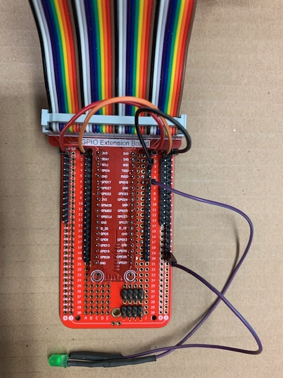</a>
 </figure>
 <figure class="wp-block-image size-large">
  <a href="pwm-config-txt.jpg" target="_blank" rel="noopener">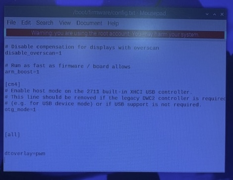</a>
 </figure>
</figure>

New Class to Get Board Info {#board-info}
-----------------------------------------

The new `BoardInfoHelper` class and the related enums and methods can provide the type of Raspberry Pi board and real-time info about memory use, voltage, board temperature,... This new class is needed to define which type of Raspberry Pi is executing the code to make sure the priority of the plugins is correct to support all the GPIO interfaces. More info on [this page on the Pi4J website](https://pi4j.com/documentation/board-info/).

This new class is already used as the basis for the website [api.pi4j.com](https://api.pi4j.com), which visualizes all the info defined inside the library, like board info, header pins, type of pins, etc. This website runs on a Raspberry Pi board, so the [System Information screen](https://api.pi4j.com/system-information) shows the info about that board, using this new class.

<figure class="wp-block-gallery has-nested-images columns-default is-cropped wp-block-gallery-2 is-layout-flex wp-block-gallery-is-layout-flex">
 <figure class="wp-block-image size-large">
  <a href="api-boards.png" target="_blank" rel="noopener">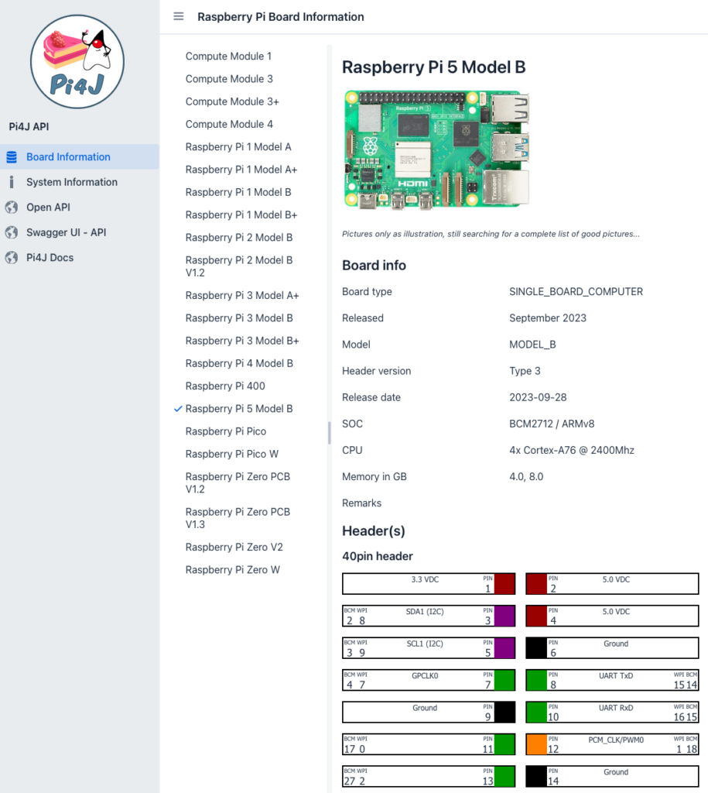</a>
 </figure>
 <figure class="wp-block-image size-large">
  <a href="api-system-information.png" target="_blank" rel="noopener">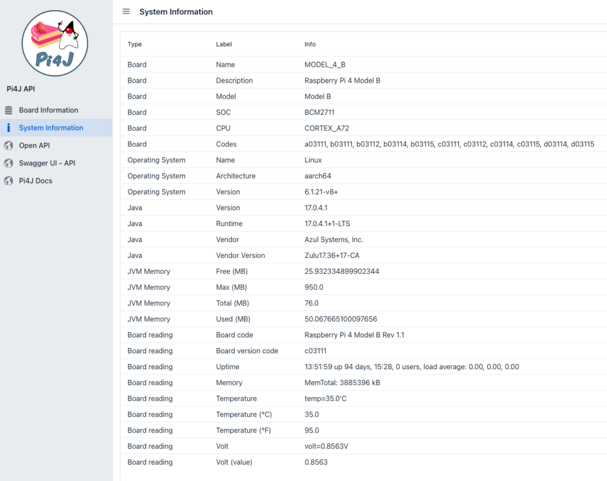</a>
 </figure>
</figure>

Interview with Robert von Burg {#interview-robert}
--------------------------------------------------

The Pi4J project has two important Roberts. The first one is **Robert Savage** (living in the US), who started the Pi4J development. You can read more about him and why Pi4J was created in [this interview on F](https://foojay.io/today/interviews-with-robert-savage-and-johan-vos-on-the-state-of-java-on-raspberry-pi/)oojay. He also created V2 of Pi4J, but hasn't been involved much in the project since its release. Luckily, we have another Robert in [the Pi4J team](https://pi4j.com/about/team/)! **Robert von Burg** (living in Switzerland), also known as **Eitch** , is the [main maintainer now of the Pi4J V2 sources](https://github.com/Pi4J/pi4j-v2) and takes care of the releases.

***Can you introduce yourself? What is your history in software (Java) development?***

My name is Robert von Burg. I've started programming in 1998 learning a bit of C, but quickly moved to Java, which became my favourite language. I first worked on programming workflow control systems, taking orders from ERP systems, and controlling the shop floor by communicating with PLCs, e.g. Siemens using TCP/IP. Later i worked a bit on enterprise clinical information systems using Java Enterprise Beans, and it's ecosystem.

For the last decade I've been working at [Atexxi](https://www.atexxi.ch/), where I'm a co-owner and founder. We are developing our eSyNet platform, enabling hospitals, pharmacies, and elderly/nursing homes to digitize their drug logistics. Our platform is software-based, but it could not work without our electronic cabinets and accessories, with which the users of our system interact and thus allow inventory to be tracked. Our goal is to unburden nurses and move the administrative work surrounding drug logistics of nurses to the pharmacy.

<figure class="wp-block-gallery has-nested-images columns-default is-cropped wp-block-gallery-3 is-layout-flex wp-block-gallery-is-layout-flex">
 <figure class="wp-block-image size-large">
  
 </figure>
 <figure class="wp-block-image size-large">
  <a href="IMG_8095-scaled.jpg" target="_blank" rel="noopener">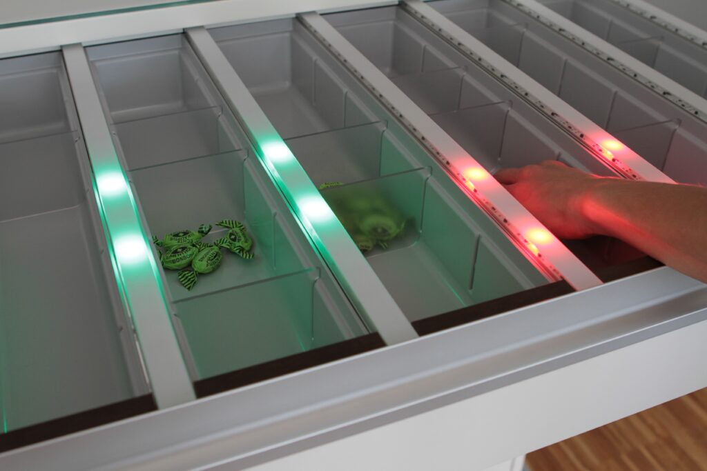</a>
 </figure>
 <figure class="wp-block-image size-large">
  <a href="IMG_20200430_153450.jpg" target="_blank" rel="noopener">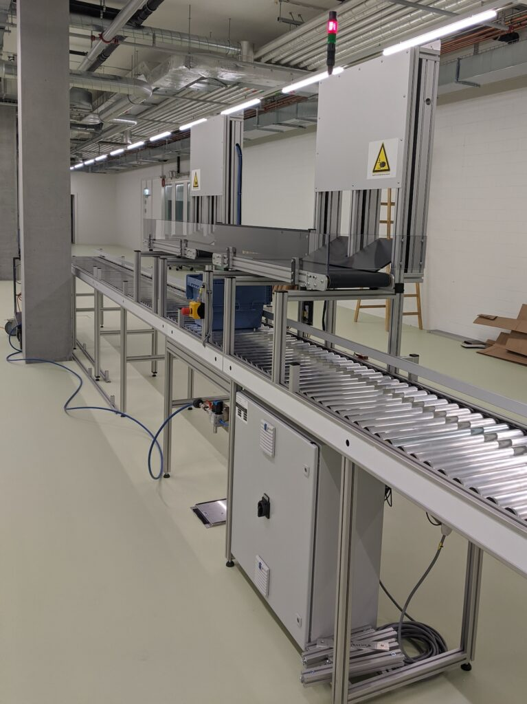</a>
 </figure>
</figure>

***How did you get involved in the Pi4J development?***

We use Raspberry Pis as the embedded platform for our electronic cabinets to communicate with our custom PCBs using I2C. As we want to use the same programming language and domain model on the server and the cabinets, we looked for a Java library giving us access to the Raspberry Pi's I/Os. Thus, the Pi4J project was selected. During our use, we detected a bug, and since the Pi4J maintainer was a little busy, I offered to send a merge request for the fix. Over time, this led to more involvement with the core project.

***What are you focusing on in the Pi4J project?***

My focus is on code review and testing of GPIO and I2C interfaces, as I have some understanding of these interfaces.

***Do you use Pi4J in any personal projects?***

Yes, I use it for some LED and power outlet control.

***Do you think Java on Raspberry Pi is a valid choice for business use?***

Absolutely. Thanks to the community, of which [Azul](https://www.azul.com/) has done a lot, we have a robust JVM on the Raspberry Pi, and we can stay in our domain model on the server and the embedded systems, which makes developing the software easier.

***How do you think the Pi4J project can evolve further?***

We are focusing on making the API easier to understand and use, making it work on the different Raspberry Pi versions, and then helping the community create a standard suite of components to communicate with different hardware that people use in their projects. This makes it easier for newcomers to start using Java on the Raspberry Pi and thus strengthens the Java community as a whole.

***What is the future of Java on embedded or small systems like the Raspberry Pi?***

These devices, as they become more powerful with each generation, make it easier to implement more features at home. If we think about how people use them to extend their home networks for security, media playback, or home automation, I see a bright future. Our goal with the Pi4J project is to make onboarding newcomers as easy as possible.

Interview Tom Aarts {#interview-tom}
------------------------------------

**Tom Aarts** started contributing to the Pi4J project when he did his first commit in the [pi4j-example-devices repository](https://github.com/Pi4J/pi4j-example-devices/). Currently, you can find example implementations for a long list of devices (see screenshot below), using V2 of Pi4J. While creating these implementations, he found some missing pieces and bugs in the core library and also fixed them. For instance, this blog post is [about the ongoing PWM improvements for the Raspberry Pi 5](https://pi4j.com/blog/2024/20240423_pwm_rpi5/). Furthermore, Tom often assists users who [filed a Pi4J V2 issue](https://github.com/Pi4J/pi4j-v2/issues) or [started a discussion](https://github.com/Pi4J/pi4j-v2/discussions).

<figure class="wp-block-gallery has-nested-images columns-default is-cropped wp-block-gallery-4 is-layout-flex wp-block-gallery-is-layout-flex">
 <figure class="wp-block-image size-large">
  
 </figure>
 <figure class="wp-block-image size-large">
  <a href="desk.jpg" target="_blank" rel="noopener">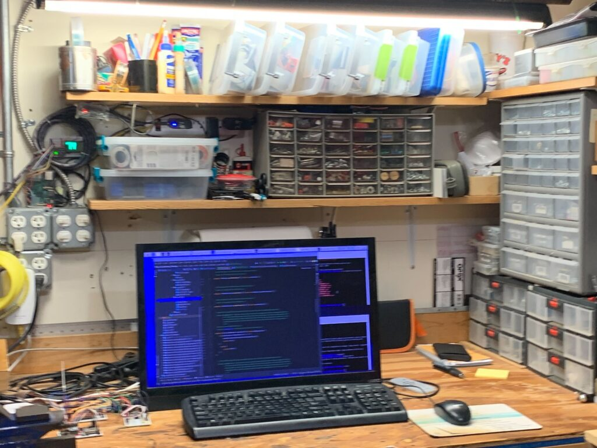</a>
 </figure>
 <figure class="wp-block-image size-large">
  <a href="pi4j-example-devices.png" target="_blank" rel="noopener">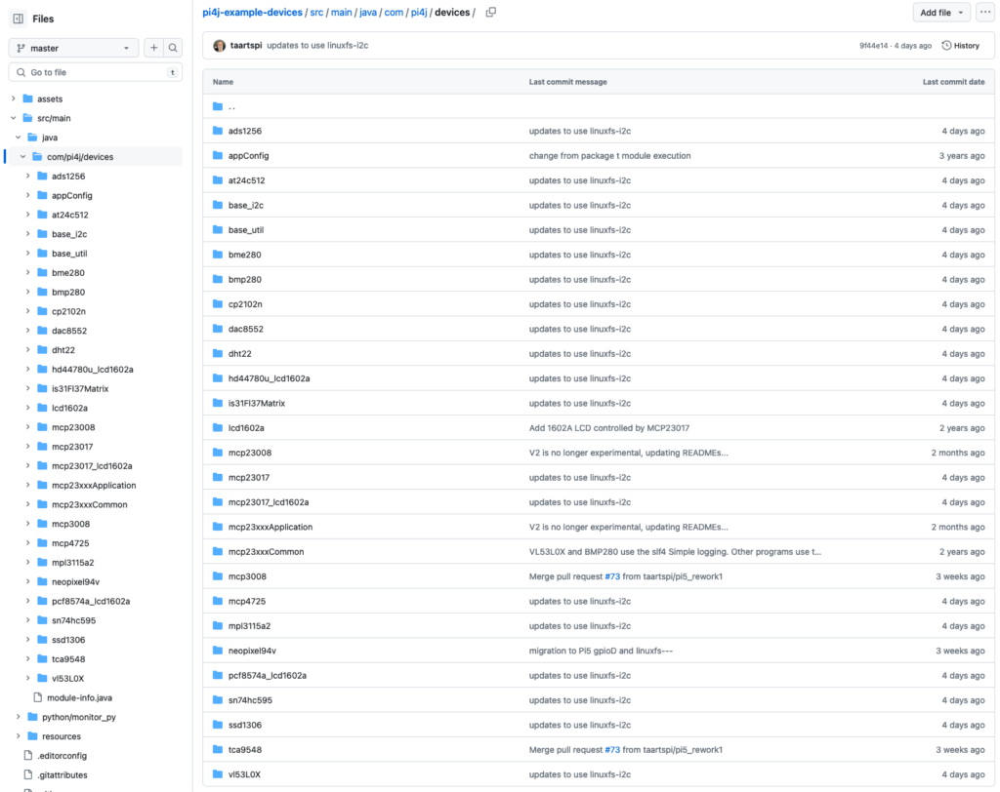</a>
 </figure>
</figure>

***Can you introduce yourself? What is your history in software (Java) development?***

Hi, I'm Tom. My degree and career started in hardware. In 1971, I worked on HF transmitters that used vacuum tubes the size of your fist. By the eighties, I transitioned to firmware and software engineering.

My first Java involvement was at IBM in the 90s when Java was first implemented on the AS400 to support the SOM (SystemObjectModel) architecture. This was the initial Java compiler, JIT, and Garbage collector for the AS400. So, although I was doing Java implementations, I interacted with these teams, learning from them.

Then next was WebSphere, implementing a distributed Java financial application. After this time, my work was in server firmware development and, later, hardware simulation. Although the languages used were not Java, Java remained my preferred language to code any required tools.

***How did you get involved in the Pi4J development?***

As I neared retirement, I looked for future activities of interest and selected Raspberry Pi as one of them. At that time, Pi4J was V1, and I used it to use some I2C chips. When V2 was released, and I migrated my existing code to V2, I became more interested in the Pi4J implementation.

In V2, the direction was no longer to provide device-specific implementations. I offered to make my existing device implementations public if they could assist new users in understanding Pi4J. Ongoing, while assisting in the discussions, I used the chip in question to create an example to demonstrate a way to solve a question. Along the way, I supplied a couple of Pi4J fixes and enhancements, becoming more involved in maintaining the Pi4J V2 code base.

***What are you focusing on in the Pi4J project?***

I focus on device support and examples to assist in issues and discussions. I am also helping with the work brought on by the new Raspberry Pi 5 to support the RP1 chip, bug fixes, and enhancements that result from various questions.

***How do you use Pi4J in your own personal or company projects?***

I have a couple of home projects for clocks and temperature and a large number of prototype boards to support the various chips I implemented.

<figure class="wp-block-gallery has-nested-images columns-default is-cropped wp-block-gallery-5 is-layout-flex wp-block-gallery-is-layout-flex">
 <figure class="wp-block-image size-large">
  <a href="setup-1.jpg" target="_blank" rel="noopener">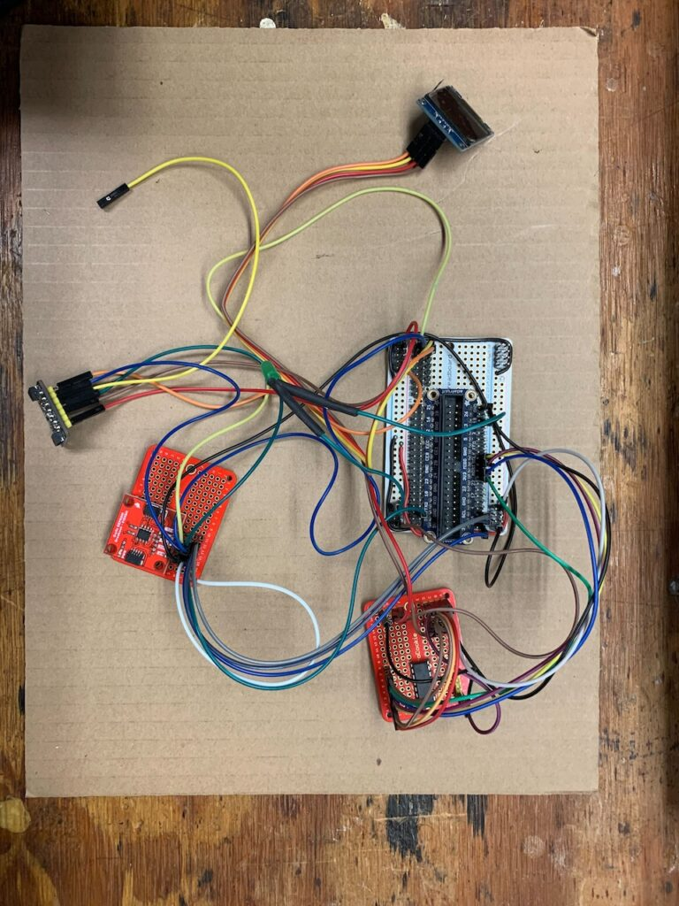</a>
 </figure>
 <figure class="wp-block-image size-large">
  <a href="setup-2.jpg" target="_blank" rel="noopener">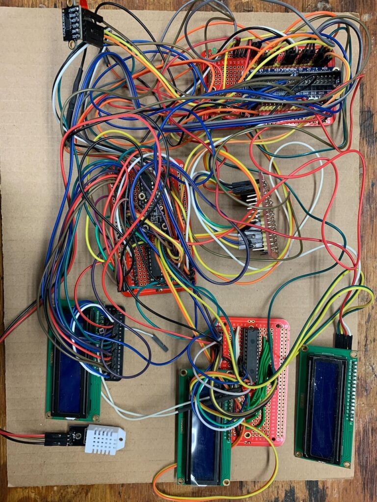</a>
 </figure>
 <figure class="wp-block-image size-large">
  <a href="setup-3.jpg" target="_blank" rel="noopener">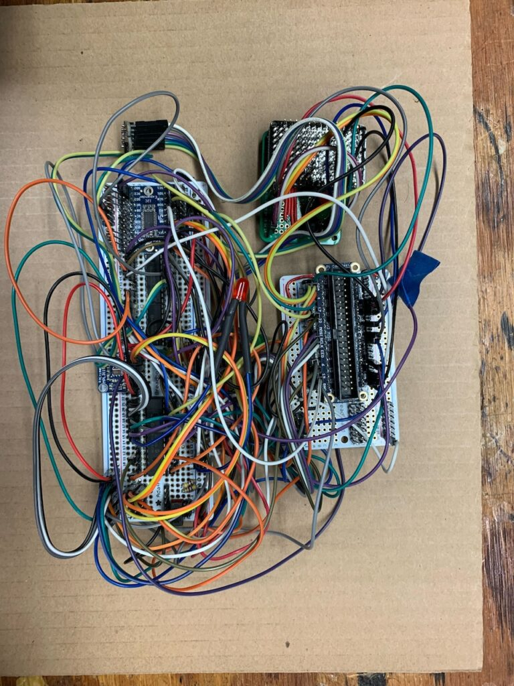</a>
 </figure>
</figure>

***You answer a lot of questions in the Pi4J discussions and tickets. What is the most challenging part of being able to help users?***

Users usually ask specific questions. The difficulty is determining what level of response they need. Based on some questions, the details given, and what is asked, I think this user is experienced and understands Pi4J and the Raspberry Pi, so a technical response to their question will be good.

Some questions include details that make me conclude this person is new to Pi4J. So, I need to consider what 'newbie' mistakes could be made and provide a larger list of recommended steps and references where more details are available.

The questions that fall between these two categories make it more difficult to help the user rapidly. If I think they have more understanding, they feel my response is too short, and the user tries to accomplish what I suggested, making little or no progress and likely getting frustrated. On the other hand, if I think they are not experienced and give a great deal of information, the user views it as a waste of their time as they have already correctly completed what I suggest, which certainly frustrates that user.

***How do you think the Pi4J project can evolve further?***

By adding more demonstration cases of Pi4J, we can increase the interest and number of users. Pi4J doesn't intend to implement IOT devices or supply Machine Learning applications, but we need these as reference projects. These should be simple but fully functional projects to demonstrate the capability of a Raspberry Pi using Pi4J. I believe this will bring in more users wanting to implement Home or Work IOT and do the implementation themselves. In addition, it can encourage STEM learning centers to use the Raspberry Pi and Pi4J as the Raspberry Foundation originally intended: *a learning tool*.

***What is the future of Java on embedded or small systems like the Raspberry Pi?***

I think Java will remain a valuable choice for these cases. Currently, there is an emphasis on languages that prevent memory leaks and provide security; Java does both of these items. I think we can assume the Java Runtime Environments will continue to improve Java's performance and memory usage. Also, very useful IDEs are available for development and, of course, Java portability.

Conclusion {#conclusion}
------------------------

The Pi4J project is open-source and can only evolve through its contributors. Luckily, we have fixed team members and enthusiast users who maintain and evolve the code while answering issues and discussions. Are you a Pi4J user who created a project or wants to help improve the code and/or documentation? Let me know!
