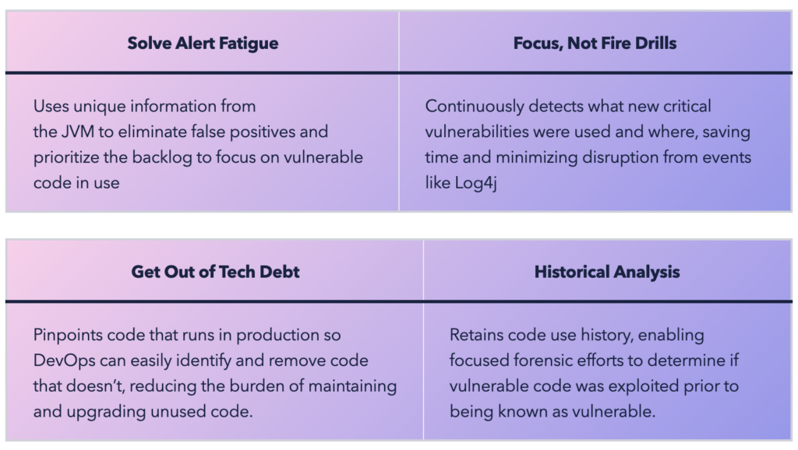

For decades DevOps teams have been under pressure to do four things: make software faster, make it cheaper, keep it secure, and accelerate time to market.

But with fewer engineering resources, enterprises that use Java must find a way to speed up application innovation and fortify application security across their entire Java estate more efficiently.

The rewards (and costs of not doing so) are high – companies in the top quartile of [McKinsey's Developer Velocity Index (DVI)](https://www.mckinsey.com/industries/technology-media-and-telecommunications/our-insights/developer-velocity-how-software-excellence-fuels-business-performance) perform significantly higher than bottom-quartile companies:

* Grow 4-5x times faster
* Score 55% higher on innovation
* Deliver 60 percent higher total shareholder returns
* Maintain 20 percent higher operating margins

Two primary challenges to DevOps productivity are alert fatigue due to out-of-control false positives for vulnerabilities and unnecessarily maintaining unused code in legacy codebases. Modernizing codebases for cloud-native environments is made further complicated by the complex mix of JDK distributions and Java versions in use by many large enterprises.

[Azul Intelligence Cloud](https://www.azul.com/products/intelligence-cloud/) helps bring efficiency to these DevOps operations, making these DevOps initiatives achievable and even commonplace for Java applications.

### Benefits of Azul Intelligence Cloud

Intelligence Cloud is designed to help engineering managers effectively deal with the challenges of technical debt and security maintenance with the Code Inventory and Vulnerability Detection features.

And now, in an exciting new development, Intelligence Cloud works for any JVM from any Java vendor. Whether you're using a JDK distribution from Azul, Microsoft, Red Hat, IBM, Oracle, Eclipse Temurin, or any other Java provider, Intelligence Cloud works for you.

## Eliminate CVE false positives with Vulnerability Detection

[Azul Vulnerability Detection](https://www.azul.com/products/vulnerability-detection/) is a cloud service that eliminates false positives by accurately identifying and prioritizing known vulnerabilities in Java applications in production. Unlike other tools, it has no performance penalty.

And unlike security scanners that report vulnerabilities on all code, including code that is present but unused, Vulnerability Detection pinpoints code that actually runs in production to efficiently prioritize the backlog to focus on vulnerable code that is used. DevOps teams responsible for keeping applications secure can keep their attention on real threats without wasting time on code that never runs.



Vulnerability Detection helps teams prioritize and de-prioritize CVEs based on whether the component loaded in production. Intelligence Cloud now goes beyond this to address the question of unused code – do I need this code at all?

## Find unused code with Code Inventory

[Code Inventory](https://www.azul.com/products/components/code-inventory/) identifies code that exists in a company's servers but doesn't run. It's a clutter finder. It's the only solution that accurately identifies unused and dead code for removal by precisely detailing what custom and third-party code is running.



Inefficient prioritization of unused code for removal wastes effort, hampers agility, and reduces developer productivity due to unproductive code maintenance tasks.
> *With Code Inventory, we identified large portions of unused code, archived it, and now spend our time working on the important parts. This has significantly sped up our development cycles.*
> —Azul Intelligence Cloud user from a leading fintech trading firm

A [recent study from Goldman Sachs' DevOps organization](https://developer.gs.com/blog/posts/importance-of-deleting-unused-code) underscores the importance of deleting unused and dead code by revealing that they:

* Reduced the size of a codebase by 67% for a recent project
* Improved its product release cadence to more than 250 releases per year
* Reduced codebase size and greater confidence in their testing resulted in time savings and afforded opportunity for other investments

For many software engineers, the last decade of rapid feature design has amassed large amounts of code that they own. The authors of this code have often changed teams, or business owners have selected to prioritize features over reducing technical debt.

The pace of feature delivery has slowed for some applications and creates a stressful workplace for software engineers. Sometimes small changes that feel like they could be done quickly take entire sprints, leading to dissatisfaction from both the engineers and the stakeholders, both of whom want a faster pace.

An Azul Intelligence Cloud user from a leading fintech trading firm recently told us, **"We acquired another firm recently and aren't familiar with their codebase. It contains millions of lines of code – reading and understanding that code would take months. With Code Inventory, we identified large portions of unused code, archived it, and now spend our time working on the important parts. This has significantly sped up our development cycles."**

Code Inventory helps by passively building up an inventory of what code runs within the application. This inventory is built up based on the first-execution of each method. As an application runs over time, methods are invoked and recorded.

There is no need for teams to dedicate time towards finding dead or unused code. This inventory can include queries later to evaluate what ran, as well as the first/last time it was seen. Methods that never run are present in the source/bytecode but not the code inventory, making them a candidate for deprecation and removal.

Code Inventory is best used over time and helps teams build confidence the longer it runs. Often the application owner has an idea that some code is unused but just wants the comfort of verification. This first tier can be watched for a short time, maybe a few weeks, before making the decision to deprecate and remove that code.

The longest amount of code may deal with annual reporting modules, where teams should monitor execution. A shopping portal, for example, may need to go through a major annual holiday time to see what they can safely deprecate and get rid of. A large portion can be determined over a few months.

In general, though, the benefit is from teams passively building up the list of "what's still used" to identify "what's not used anymore" without impacting standard feature work and schedules.

## Try a pilot of Azul Intelligence Cloud Today

Intelligence Cloud works with any JVM from any vendor or distribution including Azul, Oracle, Amazon, Microsoft, RedHat, and Temurin to dramatically slash time from unimportant tasks across an enterprise's entire Java estate.

It frees up developers for more important business initiatives and improves DevOps productivity.

Try Intelligence Cloud, including Vulnerability Detection and Code Inventory, and see if it's right for your business.  

