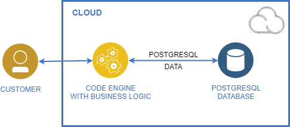
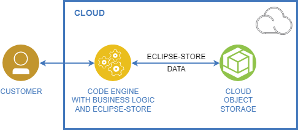
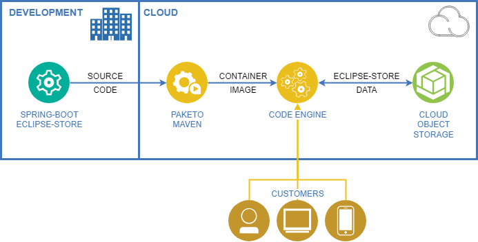
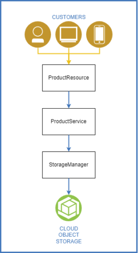
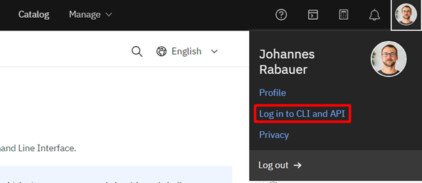

## A Case Study with IBM Cloud Code Engine, EclipseStore, and IBM Cloud Object Storage

In the dynamic realm of cloud computing, finding cost-effective solutions for stateful rest services that don't necessarily require scaling can be a nuanced challenge.

In this article, we'll take a pragmatic look at a use case leveraging [IBM Cloud Code Engine](https://www.ibm.com/products/code-engine "IBM Cloud Code Engine"), [EclipseStore](https://eclipsestore.io/ "EclipseStore"), and [IBM Cloud Object Storage (COS)](https://www.ibm.com/products/cloud-object-storage "IBM Cloud Object Storage (COS)"). The goal is to shed light on how this can be a practical and economical alternative, particularly when scalability is not a primary concern.

## Decoding the Components

1. **IBM Cloud Code Engine** provides an environment where developers can focus on coding without managing the underlying infrastructure. This serverless compute platform is not just applicable for stateless workload that scales very dynamically, but also very applicable for stateful services that are constantly running.
2. **EclipseStore**: Positioned as an in-memory storage system, EclipseStore offers a lightweight solution for persistent data storage in Java projects. Its efficiency makes it suitable for applications requiring high-speed data access, without the need for extensive scaling capabilities. Being a member of the Eclipse Foundation and Open Source ensures prolonged support and maintenance.
3. **IBM Cloud Object Storage**: This component acts as the foundational storage layer. Its pay-as-you-go model ensures businesses only pay for the storage they use, making it a flexible and cost-effective choice for cloud storage.
4. **Eclipse Store COS Connector** : The use of the [XDEV EclipseStore COS Connector](https://xdev.software/en/news/detail/now-available-ibm-cloud-object-store-connectors-for-microstream-eclipsestore?utm_source=ibm-ms-case-study "XDEV EclipseStore COS Connector") enables EclipseStore to write and read data directly on a COS Bucket. The project is available as open source on GitHub: <https://github.com/xdev-software/eclipse-store-afs-ibm-cos>.

## Value Proposition

Let's evaluate the trio based on the following criteria:

1. **Cost Implications** : The pay-as-you-go model of IBM Cloud Object Storage and Code Engine aligns costs with actual usage, avoiding unnecessary expenditures. By using the cheapest available Cloud Storage and keeping the data flow within the cloud, the storage creates only minimal costs.  
   Furthermore, EclipseStores open-source nature can potentially save on licensing fees associated with proprietary solutions.
2. **Infrastructure Management**: IBM Cloud Code Engine's serverless architecture eliminates the need for manual infrastructure management, a characteristic that simplifies operations and reduces operational overhead.
3. **Scalability**: In scenarios where scaling is not a primary concern, the lightweight nature of EclipseStore coupled with a stateful rest service on IBM Cloud Code Engine provides a tailored solution.

## Measurements

For our demo scenario, we'll assume data of about 5 GB with 5,000,000 entries. Our service is called about 2,592,000 times for reading and 259,200 times for writing in one month (1 read/s, 0.1 write/s).



The PostgreSQL Database hosted in the IBM Cloud with minimal configuration costs about 77$ for one month. You get 6 GB RAM, 10 GB Disk and 0 dedicated cores with included backups as seen in the [pricing table](https://cloud.ibm.com/docs/databases-for-postgresql?topic=databases-for-postgresql-pricing "pricing table").



The same constellation with EclipseStore costs about 2.81$ (0.11$ storing + 1.35$ reading + 1.35$ writing) for the whole month. Thanks to the [pricing model](https://cloud.ibm.com/objectstorage/create#pricing "pricing model") we don't need to pay for network bandwidth within the IBM Cloud. This way our Code Engine App can communicate with the Cloud Object Storage absolutely for free.  

This saves us over 95% of storage costs every month.

## Demo

To show you how this could work in the real world, we prepared a demo project for you. You can either use [the completed Repository from GitHub](https://github.com/xdev-software/eclipse-store-code-engine-demo "the completed Repository from GitHub") as template or follow the Step-by-step instructions here:



To keep our build as small and simple as possible, we are using [Spring Boot](https://spring.io/projects/spring-boot "Spring Boot") as a framework. In there, EclipseStore will handle the data persistence with the [XDEV IBM COS connector](https://github.com/xdev-software/eclipse-store-afs-ibm-cos "XDEV IBM COS connector").

We will create a Code Engine application from our [Maven](https://maven.apache.org/ "Maven") project, and Code Engine will use [Cloud Native Buildpacks from Paketo](https://paketo.io/docs/ "Cloud Native Buildpacks from Paketo") to automatically build a runnable container image.

This App will be reachable by the customer through the public cloud and will read and write data to the COS-Bucket.

## Getting Started

### Spring Boot with EclipseStore

To get started quickly we create a Spring Boot project through the start.spring.io Website: [Template](https://start.spring.io/#!type=maven-project&language=java&platformVersion=3.2.3&packaging=jar&jvmVersion=17&groupId=software.xdev&artifactId=eclipse-store-code-engine-demo&name=eclipse-store-code-engine-demo&description=Demo%20project%20for%20Spring%20Boot%20with%20Eclipse%20Store%20in%20IBM%20Code%20Engine&packageName=software.xdev.eclipse.store.ibm.code.engine.demo&dependencies=web "Template")

We need to add the two dependencies for [Eclipse-Store-Spring-Integration](https://docs.eclipsestore.io/manual/misc/integrations/spring-boot.html "Eclipse-Store-Spring-Integration") and the [IBM COS Connector](https://github.com/xdev-software/eclipse-store-afs-ibm-cos "IBM COS Connector"):

```xml
<dependency>
    <groupId>org.eclipse.store</groupId>
    <artifactId>integrations-spring-boot3</artifactId>
    <version>1.1.0</version>
</dependency>
<dependency>
    <groupId>software.xdev</groupId>
    <artifactId>eclipse-store-afs-ibm-cos</artifactId>
    <version>1.0.2</version>
</dependency>
```

To add minimal data, we create a `Product` and `Root` class:

```java
public class Product {
    private final String id;
    private String name;
    private double price;
…
}
```

```java
public class Root {
    private final LazyHashMap<String, Product> products = new LazyHashMap<>();
    public LazyHashMap<String, Product> getProducts() {
       return this.products;
    }
}
```

The root object is simply the entry-point into our complete data model. Every object must be reachable through the root object. For further information see the [EclipseStore Documentation](https://docs.eclipsestore.io/manual/storage/root-instances.html "EclipseStore Documentation").

Right now it only contains a LazyHashMap of Products. We use a LazyHashMap to optimize performance for more that 100 products (see [EclipseStore Documentation](https://docs.eclipsestore.io/manual/storage/loading-data/lazy-loading/lazy-collections.html "EclipseStore Documentation") for additional details).

If we start the app now, the root object of the data storage will be null. To initialize an empty root object, we add `@PostConstruct` to the `DemoApplication.class`:

```java
@Import(EclipseStoreSpringBoot.class)
@SpringBootApplication
public class DemoApplication {
    @Autowired
    @Qualifier("COS-StorageManager")
    private EmbeddedStorageManager storageManager;

    @PostConstruct
    public void initialize() {
        if (storageManager.root() == null) {
           Root initiatedRoot = new Root();
           // Add your demo data here
           storageManager.setRoot(initiatedRoot);
           storageManager.storeRoot();
        }
    }
}
```

* `@Autowired` EmbeddedStorageManager provides an injected interface to read and write data into the datastore.
* `@Qualifier(...)` is necessary to direct Spring to the correct Bean  
  Here we could also initialize some initial data like a few already existing products (see [demo repository](https://github.com/xdev-software/eclipse-store-code-engine-demo/blob/master/src/main/java/software/xdev/eclipse/store/ibm/code/engine/demo/EclipseStoreCodeEngineDemoApplication.java "demo repository")).



To ensure an easy-to-understand structure of the code, we use simple layering of classes.

We want to make the data available through a REST API, so we first create a service-class to handle communication with the EclipseStore library and therefore store and load the data.

```java
@Service
public class ProductService {
    @Autowired
    @Qualifier("COS-StorageManager")
    protected EmbeddedStorageManager storageManager;
…
}
```

* `@Service` provides a single instance of ProductService for CDI

```java
private Root getRoot(){
    return (Root)this.storageManager.root();
}
```

* `getRoot` is just a shorthand to get the root object from the data store.

```java
public void add(Product product) {
        Map<String, Product> products = getRoot().getProducts();
        products.put(product.getId(), product);
        this.storageManager.store(products); 
}

public Collection<Product> getAll() {
       return getRoot().getProducts().values();
}
```

These two methods simply add a Product or read all Products. Since the add method also writes data, it must call the `store` method of the storage to update the persisted `products` map.

In [the demo repository](https://github.com/xdev-software/eclipse-store-code-engine-demo "the demo repository") we added additional useful but simple methods to manipulate data.

Now we create the actual endpoint with the `ProductResource`:

```java
@RestController
@RequestMapping("/products")
public class ProductResource{
    @Autowired
    ProductService productService;
…
}
```

* `@RequestMapping` defines the path of the endpoint.
* `@Autowired` provides the injected service.

We add two methods to add a new product and get all products.

```java
@PostMapping
public Product create(@RequestBody Product product) {
    this.productService.add(product);
    return product;
}

@GetMapping
public Collection<Product> list() {
    return this.productService.getAll();
}
```

And now we already have a fully working Spring Application with local EclipseStore data. Run `mvn spring-boot:run` your app. To test your endpoints you can execute these commands:

|        Action         |                                                                                                                                                               Command                                                                                                                                                               |
|-----------------------|-------------------------------------------------------------------------------------------------------------------------------------------------------------------------------------------------------------------------------------------------------------------------------------------------------------------------------------|
| Retrieve all products | `curl http://localhost:8080/products`                                                                                                                                                                                                                                                                                               |
| Add a product         | Linux `curl --request POST --header 'Content-Type: application/json' --data '{"id":"vxr3i5","name":"Couch","price":199.99}' http://localhost:8080/products` Windows `curl --request POST --header 'Content-Type: application/json' --data "{\"id\":\"vxr3i5\",\"name\":\"Couch\",\"price\":199.99}" http://localhost:8080/products` |

## IBM Cloud Object Storage

We can finally move to the cloud. The only thing that's left to do in the code is add the CosCustomizer. This class configures the EclipseStore storage in a way that it reads the COS-Config from environment variables, connects to the IBM Cloud Object Storage (COS) and the reads/writes all the data to it.

You can simply copy \& paste the code from [the demo project](https://github.com/xdev-software/eclipse-store-code-engine-demo/blob/master/src/main/java/software/xdev/eclipse/store/ibm/code/engine/demo/data/CosCustomizer.java "the demo project").

Do not change the environment variable names because they are injected with these exact names in IBM Cloud Code Engine.

In the application we use the [SingleAccessManager](https://github.com/xdev-software/eclipse-store-afs-ibm-cos/blob/develop/eclipse-store-afs-ibm-cos/src/main/java/software/xdev/eclipse/store/afs/ibm/access/SingleAccessManager.java "SingleAccessManager") to ensure that only one EclipseStore instance is using the COS Bucket. Without it there might be some problems when two instances of the Code Engine App are running (even if it is just for a short time, for example during an update of the application).

Be aware that to keep this demo as simple as possible, our demo project will be publicly reachable and therefore accessible for everybody.

## Deploying the good stuff

First things first: if you have not yet, [create an account in the IBM Cloud](https://cloud.ibm.com/registration "create an account in the IBM Cloud") and [install the IBM Cloud command line interface (CLI)](https://cloud.ibm.com/docs/cli?topic=cli-getting-started "install the IBM Cloud command line interface (CLI)").

Login to the CLI, for example through the one time passcode that's created after you logged in the cloud console on [cloud.ibm.com](https://cloud.ibm.com/ "cloud.ibm.com").



From there you can paste the similar line to your command line:

```bash
ibmcloud login -a https://cloud.ibm.com -u passcode -p XXX
```

To be able to interact with COS and Code Engine, install two plugins:

```bash
ibmcloud plugin install cloud-object-storage 
ibmcloud plugin install code-engine
```

Then we create our resource group and set it as a target for the rest of the calls. Make sure that you have the necessary rights to create and edit resource groups, COS and Code Engine instances.

```bash
ibmcloud resource group-create spring-eclipsestore
ibmcloud target -g spring-eclipsestore
```

To be able to store data, we need a COS instance. This is how we create the service:

```bash
ibmcloud resource service-instance-create spring-eclipsestore-cos cloud-object-storage standard global -g spring-eclipsestore -d premium-global-deployment-iam
```

To create the actual bucket to use, we first read the service instance as JSON and must copy the UID to the following command:  

(The name of the bucket must be unique across all IBM Cloud customers. Make sure you use your own random suffix.)

```bash
ibmcloud resource service-instance spring-eclipsestore-cos 
ibmcloud cos bucket-create --bucket spring-eclipsestore-bucket-02082019 --class smart --ibm-service-instance-id $GUID$ --region eu-de
```

We are already finished with our COS bucket, now all that's left to do is create a Code Engine project and deploy our code on it.

Now we start building. Make sure your working directory of the console is your project directory.

```bash
ibmcloud ce project create --name spring-eclipsestore-ce 
ibmcloud ce app create --name spring-eclipsestore --build-source . --env CLOUD_OBJECT_STORAGE_BUCKET_LOCATION=eu-de --env CLOUD_OBJECT_STORAGE_BUCKET_NAME=spring-eclipsestore-bucket-02082019 --min-scale 0 --max-scale 1
```

The last command pushes the code into the cloud and takes a few minutes. Under the covers, the Paketo buildpacks detect your Maven project, build the Spring Boot JAR and package it together with a Java Runtime Environment into a container image. For this image, an application is created.

The final step is to bind our COS instance to the application:

```bash
ibmcloud resource service-instance spring-eclipsestore-cos
ibmcloud ce app bind --name spring-eclipsestore --service-instance-id $GUID$
```

Now we are done!

To get our application's url we can call the following command, and curl our urls again:

```bash
ibmcloud ce application get -n spring-eclipsestore -o url 
curl https://spring-eclipsestore.xxx.eu-de.codeengine.appdomain.cloud/products
```

Note: Eventually, your session in the IBM Cloud will run out and you will re-login and reselect the resource group and Code Engine project with these commands:

```bash
ibmcloud login -a https://cloud.ibm.com -u passcode -p XXX
ibmcloud target -g spring-eclipsestore -r eu-de
ibmcloud ce project select -n spring-eclipsestore-ce
```

## Postproduction

The default configuration is optimized for costs and allows the application to scale down (to zero) to avoid idling CPU when no workload is running. This comes with the additional latency of about 30s when the application is scaling up from zero. In a real production environment where we are talking about truly lightning-fast responses times, we want to keep the application active and pick the best suitable number of CPUs.

```bash
ibmcloud ce app update --name spring-eclipsestore --memory 1G --cpu 0.5 --min-scale 1 --max-scale 1
```

Our instance response now under a few milliseconds and has native java persistency.

Be aware that EclipseStore is an in-memory-datastore. That means that it loads all the data into memory which is not declared as Lazy (like `LazyArrayList`, `LazyHashMap`, etc.). If you work with a lot of larger objects, you must increase the memory of your Code Engine application accordingly.

Finally, we should weight the pros and cons of using EclipseStore with Code Engine:

### Pro

* Scale to zero is possible with minimal cost. This is useful e.g. scheduled, periodic jobs.
* Even without scaling to zero instances, we can use a very small and cheap instance to persist data.
* Complex data structures can be easily persisted without the overhead of defining database schemas, adding annotations or creating layers to access the data.
* Simplifies code by using native java classes.

### Con

* Scale to zero can be too slow for some use cases. Though, you can explore more options around [scale-down-delays](https://cloud.ibm.com/docs/codeengine?topic=codeengine-app-scale#app-scale-timeconcurrency "scale-down-delays") that allow your app to stay up during the day even if there is no request for some time, while it still eventually scales down to 0 when there is no traffic for a longer time during the night.
* Horizontal scaling is not possible since EclipseStore can only use the bucket data with one instance. In a microservice environment it's easily possible to create a simple REST Service that manages only the data persistency in that environment.
* Startup of the service gets slower as the storage grows. With a static instance that's no issue.

In the pursuit of a simple solution, the combination of IBM Cloud Code Engine, EclipseStore, and IBM Cloud Object Storage proves to be a viable option for stateful rest services that do not require dynamic scaling. The emphasis on serverless architecture, lightweight storage, and flexible object storage aligns well with the needs of applications that operate within a stable and predictable workload.

This approach offers a pragmatic alternative, potentially reducing costs associated with infrastructure management and licensing fees. While it may not suit scenarios demanding frequent scaling, it addresses a specific niche where stability and cost-effectiveness take precedence.

In the ever-evolving landscape of cloud solutions, the key lies in selecting tools that align with the unique requirements of your application. The trio of IBM Cloud Code Engine, EclipseStore, and IBM Cloud Object Storage presents a compelling option for those navigating the terrain of stateful rest services with a focus on stability and cost efficiency.

If you are interested in trying this solution, we have created [a complete template with detailed instructions to get you started](https://github.com/xdev-software/eclipse-store-code-engine-demo "a complete template with detailed instructions to get you started").

**Co-author:** [Sascha Schwarze](https://community.ibm.com/community/user/cloud/people/sascha-schwarze "Sascha Schwarze") - Senior Software Engineer @ IBM
