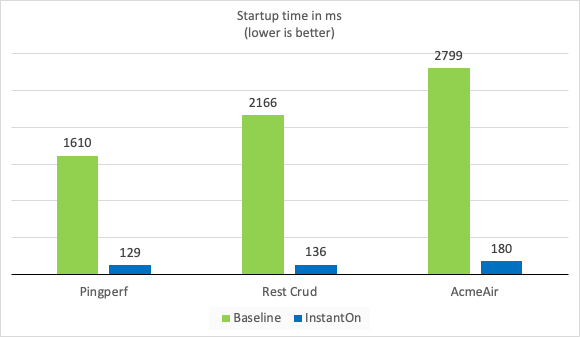
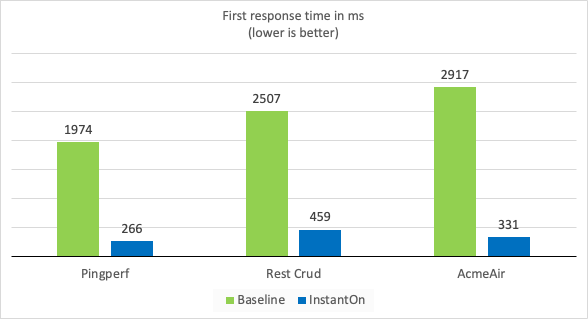
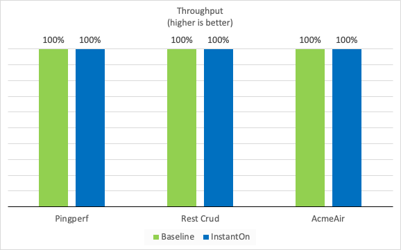

**Faster Java startup must not compromise developer experience, throughput performance, or security. We discuss how we achieved this with Liberty InstantOn.**

*By Vijay Sundaresan, Thomas Watson, Laura Cowen*

Many solutions that promise ultra-fast startup times for serverless Java apps force you to compromise on developer experience, throughput performance, or security. We'll show you how to get ultra-fast startup of your Java apps without these compromises.

Say, for example, you're writing a Java web service that provides a catalog of items that your business sells. At quiet times, your application needs to stop all unneeded instances of the catalog service so that your business is not paying unnecessary cloud bills; at busy times, your application needs to rapidly spin up more instances so that your customers get instantaneous response times on your website. This is "scale-to-zero," and your application needs to do it fast.

Several solutions have recently emerged to speed up Java startup, ranging from compiling a [native image](https://www.graalvm.org/latest/reference-manual/native-image/ "native image") that removes the JVM from the compiled app (the startup speed bottleneck in Java apps) to [taking a snapshot of the application](https://docs.azul.com/core/crac/crac-introduction "taking a snapshot of the application") after startup so that there are no startup tasks to complete when restored. But most of these solutions suffer from some compromises to developer experience, throughput performance, or security.

Solutions that vastly improve the startup time of Java apps should:

1. Be easy for developers to implement in apps.
2. Be easy for developers to use existing skills and APIs to write apps.
3. Be easy for developers to enable on-the-fly configuration at deployment (restore) time.
4. Ensure that the app's peak throughput performance is not degraded.
5. Ensure that the security of the app is not compromised.

We'll briefly talk through each of these points and describe how we've achieved them with [Liberty InstantOn](https://openliberty.io/blog/2023/06/29/rapid-startup-instanton.html?utm_source=foojay&utm_medium=article&utm_id=instanton "Liberty InstantOn").

Liberty InstantOn checkpoint/restore solution {#h2-0-liberty-instanton-checkpoint-restore-solution}
---------------------------------------------------------------------------------------------------

Liberty InstantOn is a checkpoint/restore-based solution for the fast startup of Java applications in serverless environments. Unlike other solutions, Liberty InstantOn was co-designed from the outset by the development teams working on a JDK ([IBM Semeru Runtimes](https://developer.ibm.com/languages/java/semeru-runtimes/downloads/?utm_source=foojay&utm_medium=article&utm_id=instanton "IBM Semeru Runtimes"), a free distribution of OpenJDK and Eclipse OpenJ9) and an application runtime ([Open Liberty](https://openliberty.io/?utm_source=foojay&utm_medium=article&utm_id=instanton "Open Liberty"), an open-source Java application runtime).

This collaboration reflects the many checkpoint and restore tasks that must be done collaboratively between the application runtime and the JDK: several changes were made to Liberty, either to delay tasks until after checkpointing (e.g., initialization of Liberty security features) or to complete them before checkpointing (e.g., waiting for background tasks to complete, such as ongoing JIT compilations and Liberty-specific initializers).

We tested the performance of three different applications, without (baseline) and with Liberty InstantOn, measuring both the startup time of the application and the time taken to serve the first request. See the following two graphs for results and our blog for [method details](https://openliberty.io/blog/2023/06/29/rapid-startup-instanton.html?utm_source=foojay&utm_medium=article&utm_id=instanton "method details").

The three applications ranged from a very simple application with a single REST endpoint ([pingperf](https://github.com/HotswapProjects/pingperf-quarkus/ "pingperf")) through a more complicated application using JPA and a remote database ([Rest Crud](https://github.com/johnaohara/quarkusRestCrudDemo/ "Rest Crud")) to a full application using MicroProfile features ([AcmeAir Microservice Main](https://github.com/blueperf/acmeair-mainservice-java#acme-air-main-service---javaliberty/ "AcmeAir Microservice Main")).

As well as providing very fast startup and first response times, the collaborative Liberty InstantOn checkpoint/restore approach provides a better developer experience than removing the JVM completely or implementing a checkpoint/restore solution only at the JDK level and then just stating that many kinds of tasks should not be done before checkpoint.

Easy to implement in apps {#h2-1-easy-to-implement-in-apps}
-----------------------------------------------------------

Checkpoint/restore solutions that are designed solely at the JDK level force you, as the application developer, to think about how the low-level OS tool [CRIU](https://criu.org/Main_Page "CRIU") works and how to set it up. They also require you to figure out when to checkpoint the application, how to make sure the application is in a safe state when at checkpoint, how to make sure the application runtime and the JVM are also in a safe state without having control over either, and how to make sure that all three (application, application runtime, and JVM) restore gracefully later.

While it is crucial that the checkpoint/restore support is provided at the JDK layer (so that the Java application doesn't need to directly interface with CRIU), good integration with a higher-level application runtime (such as Liberty) can do a lot to unburden you so that you can focus on your application's business logic.

With Liberty InstantOn, all you need to do to make your Java app start faster is containerize it using the official Liberty container images. In your build configuration, you need only to choose when to do the checkpoint (at one of two "phases," conveniently named "beforeAppStart" and "afterAppStart"), and the rest is handled transparently by a combination of Liberty and Semeru.

You then just build an application layer on top of the [official Open Liberty container image](https://openliberty.io/docs/latest/container-images.html?utm_source=foojay&utm_medium=article&utm_id=instanton "official Open Liberty container image"), which includes Semeru and everything else you need.

Use existing skills and APIs to write apps {#h2-2-use-existing-skills-and-apis-to-write-apps}
---------------------------------------------------------------------------------------------

Fast startup solutions that remove the JVM from the application force you to change how you think about developing applications. Also, most enterprise software is complex, with a lot of component reuse. Any dependencies on other open-source projects can mean waiting indefinitely for all those projects to be properly updated to adhere to the subset of standard Java features that can work without the JVM.

Liberty InstantOn performs a variety of tasks that allow you to stick with your familiar mental model for how Java applications are supposed to work. Dynamic class loading, reflection, and dynamic JIT compilation are all things that you are used to using in your apps and are just part of how you think as a Java developer.

Liberty InstantOn works seamlessly with the Semeru Cloud Compiler, which enables the [benefits of JIT compilation](https://developer.ibm.com/articles/jitserver-optimize-your-java-cloud-native-applications/?utm_source=foojay&utm_medium=article&utm_id=instanton "benefits of JIT compilation") without the memory and CPU load for each instance of the restored application. Liberty InstantOn also supports the usual API specifications, old and new, including Jakarta EE, MicroProfile, and [Spring Boot (currently in beta)](https://dzone.com/articles/containerize-spring-boot-app-for-rapid-startup "Spring Boot (currently in beta)"). So, your new applications, as well as your existing applications, can be containerized to start up much faster.

Enable on-the-fly configuration at deployment (restore) time {#h2-3-enable-on-the-fly-configuration-at-deployment-restore-time}
-------------------------------------------------------------------------------------------------------------------------------

Imagine it's 4 am, and you've been called out to diagnose problems in your production app. A native image solution to fast startup would require you to recompile the app and rebuild the application container image in order to debug certain problems that require further diagnostic information or disable certain configurations or optimizations.

Handily, with Liberty InstantOn, your operations team has already gathered traces for you because they could easily redeploy an instance of your app with method tracing turned on without having to recompile the app. Liberty and Semeru allow you to reconfigure a deployment at restore time and have those changes picked up subsequently.

These serviceability changes support practical use cases such as enabling method tracing or altering some Liberty behavior to work around a problem at deployment (restore) time. Importantly, you, as a developer, don't need to take most of these serviceability considerations into account when building the application container image because they're all handled by Liberty InstantOn.

The app's peak throughput performance is not degraded {#h2-4-the-app-s-peak-throughput-performance-is-not-degraded}
-------------------------------------------------------------------------------------------------------------------

While scale-to-zero and container deployments make startup time an important performance metric, application throughput is still a critical consideration because it ends up affecting the cost of operating a service in the long run.

If you improve startup speeds by removing the JVM from your app, you lose the [benefits of dynamic JIT compilation](https://developer.ibm.com/articles/jitserver-optimize-your-java-cloud-native-applications/?utm_source=foojay&utm_medium=article&utm_id=instanton) and Java's garbage collection (GC) technology. Dynamic JIT compilation using speculative optimizations is a key value proposition of the Java platform.

Retaining the JVM with Liberty InstantOn means that your app gets all the benefits of dynamic JIT compilation and GC technology that have been honed over the decades in the Semeru JDK.

A restored container simply picks up execution from where it left off before the checkpointing was done and so typically reaches the same (or very close to) peak throughput as it would have in a traditional Liberty container that did not use InstantOn (as you can see in the following graph from tests on the same three applications that were described previously).

The security of the app is not compromised {#h2-5-the-security-of-the-app-is-not-compromised}
---------------------------------------------------------------------------------------------

Checkpoint/restore solutions to fast startup can potentially compromise one of the most important considerations for enterprise deployments: security.

Firstly, Liberty InstantOn does not require that the application is run as root or using a privileged container. The Liberty and Semeru development teams worked with the CRIU project to reduce the set of Linux capabilities needed on restore to be a small enough set that there are no security concerns in production (see [How We Developed the Eclipse OpenJ9 CRIU Support for Fast Java Startup](https://foojay.io/today/how-we-developed-the-eclipse-openj9-criu-support-for-fast-java-startup/ "How We Developed the Eclipse OpenJ9 CRIU Support for Fast Java Startup")). The teams packaged the Liberty and Semeru container images so that you don't need to manage the Linux capabilities yourself.

Secondly, if sensitive information (such as cryptographic keys) is included in the container image and the image is then published to a container repository, that sensitive information could be compromised; such sensitive information must stay only in the deployment environment.

The Semeru JDK disallows most cryptographic algorithms from being used before checkpoint. Applications built on Liberty open network connections only on restore, and this is usually where cryptographic keys and other secrets are needed.

For the limited set of cryptographic operations that are still permitted on the checkpoint side, Semeru ensures that it clears all the sensitive information so that there is no security exposure in the checkpoint.

Fast startup with a slick developer experience without compromise {#h2-6-fast-startup-with-a-slick-developer-experience-without-compromise}
-------------------------------------------------------------------------------------------------------------------------------------------

While there is a range of approaches to improving Java startup times for serverless computing, it's essential that the developer experience is as slick as possible so that unnecessary additional responsibility, learning, and effort is not laid on the application developer.

We reiterate that solutions must:

1. Be easy for developers to implement in apps.
2. Be easy for developers to use existing skills and APIs to write apps.
3. Be easy for developers to enable on-the-fly configuration at deployment (restore) time.
4. Ensure that the app's peak throughput performance is not degraded.
5. Ensure that the security of the app is not compromised.

We worked hard to address all these requirements in our checkpoint/restore-based solution, not only for new applications but also for existing applications.

Liberty InstantOn aims to provide a great developer experience without compromising production performance. Where there are still some limitations in Liberty InstantOn, they are [clearly and openly documented](https://openliberty.io/docs/latest/instanton-limitations.html?utm_source=foojay&utm_medium=article&utm_id=instanton "clearly and openly documented") while the teams continue to work to fix them.

Meanwhile, since our initial release in 2023, we have continued to expand [InstantOn support for Jakarta EE and MicroProfile capabilities](https://openliberty.io/blog/2024/01/30/24.0.0.1.html?utm_source=foojay&utm_medium=article&utm_id=instanton "InstantOn support for Jakarta EE and MicroProfile capabilities"). So, get your application and [give it a go](https://openliberty.io/blog/2023/06/29/rapid-startup-instanton.html?utm_source=foojay&utm_medium=article&utm_id=instanton "give it a go").
