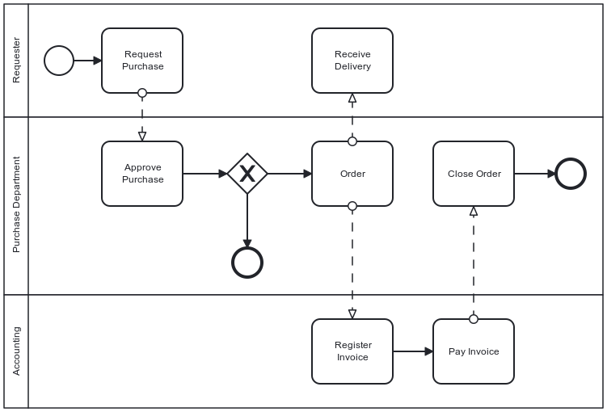
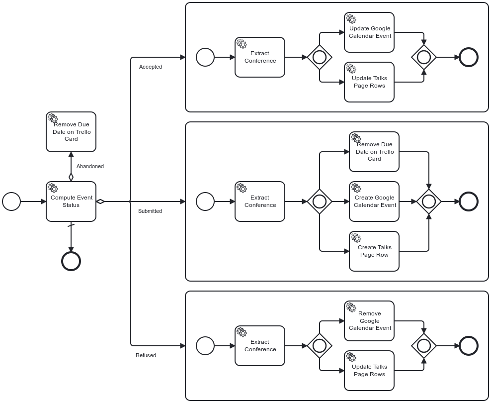
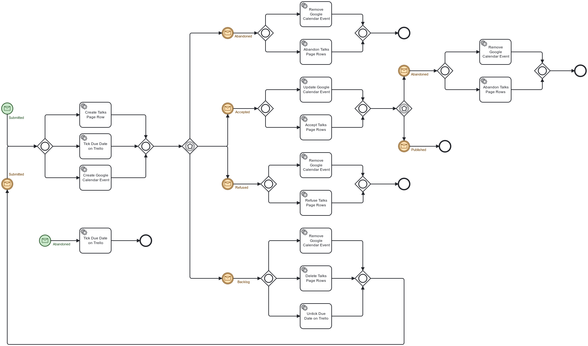

**A (long) time ago, my first job consisted of implementing *workflows* using the Staffware engine. In short, a workflow comprises *tasks*; an automated task delegates to code, while a manual task requires somebody to do something and mark it as done. Then, it proceeds to the next task - or tasks.**

Here's a sample workflow:

The above diagram uses [Business Process Model and Notation](https://en.wikipedia.org/wiki/Business_Process_Model_and_Notation). You can now design your workflow using and run it with compatible workflow engines.

Time has passed. Staffware is now part of Tibco. I didn't use workflow engines in later jobs.

Years ago, I started to automate my conference submission process. [I documented it](https://blog.frankel.ch/automating-conference-submission-workflow) in parallel. Since then, I changed the infrastructure on which I run the software. This post takes you through the journey of how I leveraged this change and updated the software accordingly, showcasing the evolution of my approach.

Generalities {#h2-0-generalities}
---------------------------------

I started on Heroku with the free plan, which no longer exists. I found that the idea was pretty brilliant at the time. The offering was based on *dynos* , something akin to containers. You could have a single one for free; when it was not used for some time, the platform switched it off, and it would spin a new one again when receiving an HTTP request. I believe it was one of the earliest *serverless* offerings.

In addition, I developed a Spring Boot application with Kotlin based on the [Camunda](https://camunda.com/) platform. Camunda is a workflow engine.

One of the key advantages of workflow engines is their ability to store the state of a particular instance, providing a comprehensive view of the process. For example, in the above diagram, the first task, labeled "Request Purchase", would store the requester's identity and the requested item (or service) references. The Purchase Department can examine the details of the requested item in the task after. The usual storage approach is to rely on a database.

The initial design {#h2-1-the-initial-design}
---------------------------------------------

At the time, Heroku didn't provide free storage *dyno* . However, I had to design my initial workflow around this limitation, which posed its own set of challenges. I couldn't store anything permanently, so every run had to be self-contained. My fallback option was to run in memory with the help of [H2](https://www.h2database.com/).

Here is my initial workflow in all its glory:

As a reminder, everything starts from Trello. When I move a card from one lane to another, Trello sends a request to a previously registered webhook. As you can expect, the hook is part of my app and starts the above workflow.

The first task is the most important one: it evaluates the end state from the event payload of the webhook request. The assumption is that the start state is always Backlog. Because of the lack of storage, I designed the workflow to execute and finish in one run.

The evaluation task stores the end state as a BPMN variable for later consumption. After the second task extracts the conference from the Trello webhook payload, the flow evaluates the variable: it forwards the flow to the state-related subprocess depending on its value.

Two things happened with time:

* Salesforce bought Heroku and canceled its free plan. At the same time, Scaleway offered their own free plan for startups. Their Serverless Container is similar to Heroku's - nodes start when the app receives a request. I decided to migrate from Heroku to Scaleway. You can read about [my first evaluation of Scaleway](https://blog.frankel.ch/evaluation-scaleway/).
* I migrated from H2 to the free [Cockroach Cloud](https://cockroachlabs.cloud/) plan

Refactoring to a new design {#h2-2-refactoring-to-a-new-design}
---------------------------------------------------------------

With persistent storage, I could think about the problems of my existing workflow.

First, the only transition available was from the Backlog to another list, *i.e.*, Abandoned, Refused, or Accepted. The thing is, I wanted to account for additional less-common transitions; for example, the talk was accepted but could be later abandoned for different reasons. With the in-place design, I would have to compute the transition, not only the target list.

Next, I created tasks to extract data. It was not only unnecessary, it was bad design. Finally, I used subprocesses for grouping. While not an issue *per se*, the semantics was wrong.

With persistent storage, we can pause a process instance after a task and resume the process later. For this, we rely on *messages* in BPMN parlance. A task can flow to a *message event* . When the task finishes, the process waits until it receives the message. When it happens, the flow process resumes. If you can send different message types, an *event-based* gateway helps forward the flow to the correct next step.

Yet, the devil lurks in the details: any instance can receive the message, but only one is relevant - the one of the Trello card. Camunda to the rescue: we can send a business key, *i.e.*, the Trello card ID, along with the message.

Note that if the engine finds no matching instance, it creates a new one. Messages can trigger start events as well as regular ones.

Here's my workflow design:

For example, imagine a Trello hook that translates to an Abandoned message. If there's no instance associated with the card, the engine creates a new instance and sends the Abandoned message, which:

* Starts the flow located at the lower left
* Ticks the due date on the Trello card
* Finishes the flow

If it finds an existing instance, it looks at its current state: it can be either Submitted or Accepted. Depending on the state, it continues the flow.

Conclusion {#h2-3-conclusion}
-----------------------------

In this post, I explained how I first limited my usage of BPMN and then unlocked its true power when I benefited from persistent storage.

However, I didn't move from one to the other in one step. My history involves around more than twenty versions. While Camunda keeps older versions by design, I didn't bother with my code. When I move them around, it will fail when handling cards that were already beyond Backlog.

Code needs to account for different versions of existing process instances for regular projects. I'm okay with some manual steps until every card previously created is done.

**To go further:**

* [Business Process Model and Notation](https://en.wikipedia.org/wiki/Business_Process_Model_and_Notation)
* [Camunda](https://camunda.com/)
* [My evaluation of the Scaleway Cloud provider](https://blog.frankel.ch/evaluation-scaleway/)

*** ** * ** ***

*Originally published at [A Java Geek](https://blog.frankel.ch/worfklow-stateless-stateful/) on May 20^th^, 2024*

*[BPMN]: Business Process Model and Notation
