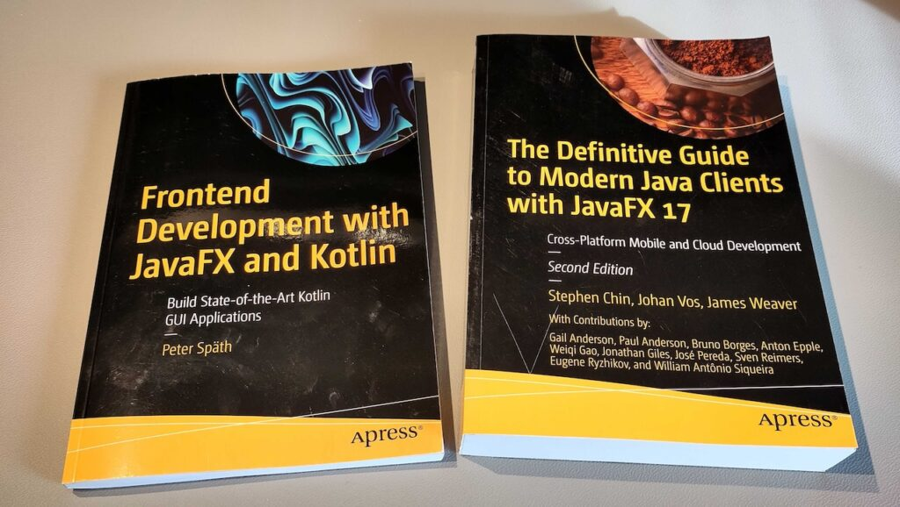
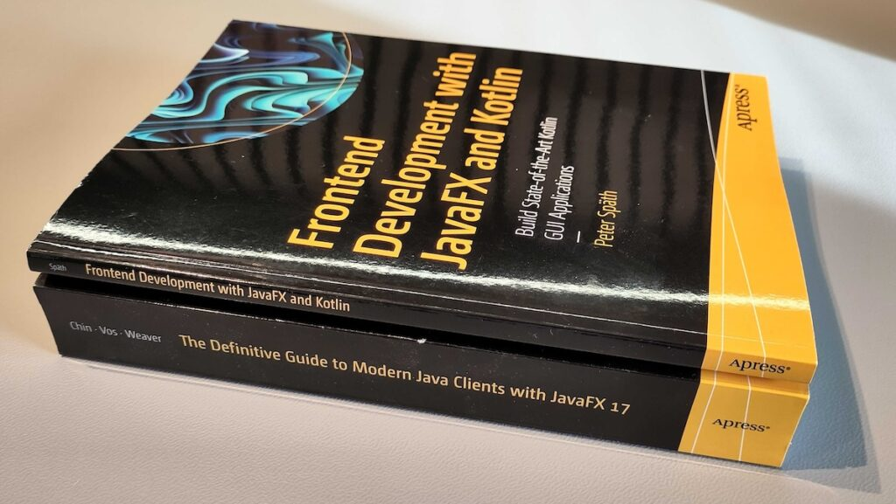



For a personal pet project, I started experimenting with JavaFX and Kotlin to create a user interface with a lot of Java / Kotlin background processing. As I knew there is a book available on this specific topic, Apress was so kind to send me a review copy of [Frontend Development with JavaFX and Kotlin: Build State-of-the-Art Kotlin GUI Applications](https://www.amazon.nl/Frontend-Development-JavaFX-Kotlin-State/dp/1484297164) by Peter Späth (152 pages, 48€ on paper, 35.5€ for ebook on Amazon.nl).

## Content

I received both a PDF and paper version of the book. The biggest difference is full color (PDF) versus black-white, which is unfortunate for a book about user interfaces with IDE and other screenshots.

### Chapter 1 - Getting Started

The book starts with an introduction to JavaFX and how it can be combined with Kotlin. A "Hello World" application is created with Gradle, Eclipse, IntelliJ IDEA, and Visual Studio Code. The author explains how to install Oracle's distribution of OpenJDK, but if you know me, you'll understand I would recommend other distributions...

Immediately, a nice example is given of the reduced amount of code that can be achieved with Kotlin, with a minimal example of a button with a click handler. This is the typical Java code:

```
Button btn = new Button();
btn.setText("Say 'Hello World'");
btn.setOnAction(new EventHandler<ActionEvent>() {
    @Override
    public void handle(ActionEvent event) {
        System.out.println("Hello World!");
    }
});
```

In Kotlin, the same can be achieved with:

```
val btn = Button().apply {
    text = "Say 'Hello World'"
    setOnAction { _ ->
        println("Hello World!")
    }
}
```

That's a reduction from 222 to 120 characters!

Other topics handled in this chapter are Kotlin utilities for JavaFX and direct downloads of JavaFX releases from [openjfx.io](https://openjfx.io/). The author also explains why FXML is not used in the book. I agree with his view that the XML files are not as dynamic as code and bring a mix of technologies into your project.

### Chapter 2 - Properties

This chapter explains Properties, Bindings, and Observable Collections (with FXCollections). You can use these to connect data and values (model) to JavaFX components (view).

### Chapter 3 - Stages and Scenes

Explanations of how you can read which physical screens are connected, what the difference is between Stage and Scene, and how you can create an application with multiple windows. Adding keyboard shortcuts, changing which node has the focus, node lookup, creating snapshots (screenshots), handle key presses and mouse events,... are all described in this chapter. Additionally, the Camera and 2D/3D are mentioned without more info, so the writer assumes you already have knowledge about this.

### Chapter 4 - Containers

In Chapter 4, you'll learn how to use different panes (or containers), such as StackPane, VBox, HBox, GridPane, BorderPane, etc., to add components to your application and how to style these panes.

### Chapter 5 - Visual Nodes

While the previous chapter dealt with the nodes that are used to group and lay out other nodes, this chapter deals with the visible nodes that eventually can also handle user interaction. It starts by describing the different ways of using a node's bounds to prevent them from overlapping.

Different types of visual nodes are described separately:

* Shapes: to show something but can't handle user input. For example: Text, Rectangle, Circle,...
* Canvas: to access the graphics system (without containers).
* Image: to place an image using the ImageView.
* Controls: nodes that accept user input. For example: TextField, TextArea, Button, Menu,...
* Control panes: panes (or containers) with some kind of user interoperability. For example: Accordion, ScrollPane, TabPane,...

### Chapter 6 - List and Tables

Lists, tables, and trees are a bit more complex and handled in a separate chapter. I always struggle to remember how you can create a custom view for an object in, for instance, a table, and this chapter gives a clear example of how to visualize a Person object's first and last name into a single ListView item. A perfect reminder of how to convert any object to a list node. By further extending that Person object with properties, an example is also given of a table with editable values, also with an example of a `DatePicker` cell.

### Chapter 7 - Events

Events are used in JavaFX to inform occurrences of interest to all parts of the application. This happens in two different directions, something I wasn't aware of. Event Filters must be used if your code must be invoked in the capturing phase (from the highest level to the component with the event). Event handlers must be used in the bubbling phase (from the component with the event to the highest level). This chapter gives a full overview of all the available types of events.

Drag and Drop Procedures are also described here as they rely on event handling.

### Chapter 8 - Effects and Animations

Although less used in business user interfaces, effects and animations are also part of JavaFX's core functionalities. Effects can be used on, for instance, images and text to change colors, or add blur, shadows, lighting, etc. With animations you can change the effects, position, and size of a node over time, using different types of transitions and keyframes.

### Chapter 9 - Concurrency

A user interface always needs to be "snappy" and react immediately to any user input. That's why business logic (happening in Java) and user interaction (with JavaFX) must happen in separate threads. In Chapter 9, the JavaFX Concurrency Framework is explained. With `Service` and `Task`, you can achieve such separation between long-running tasks and not blocking the user interface. This is demonstrated with an application with a `Slider` which progress is changed from a `Task` with `Thread.sleep`.

A short starting point is given about Kotlin Coroutines, which provide a new concurrent programming approach. This is explained with a quick example in which intermediate results of an ever-running PI calculator are displayed.

## Sources of the Examples

In a few places, a link to the sources of the code examples in the book is given, but these seem to be wrong (there is even a remaining "TODO" about this on page 18). The book's sources can be found here: [github.com/Apress/Frontend-Development-with-JavaFX-and-Kotlin](https://github.com/Apress/Frontend-Development-with-JavaFX-and-Kotlin).

## Conclusion

I'm probably a bit old-fashioned, but I still prefer paper books. I'm always disappointed that publishers still print this kind of book in black and white. Screenshots and effect examples are so much clearer when you check the ebook version, which has these images in full color. As there are only a few of these images in this book, I can't understand why they were not printed in color.

This book provides a lot of information on a limited number of pages, so there are many references to websites where you can find more information. It would have been nice if a few of those had been handled more in detail, especially the Kotlin-specific parts, such as the Kotlin Coroutines.

<figure class="wp-block-gallery has-nested-images columns-default is-cropped wp-block-gallery-1 is-layout-flex wp-block-gallery-is-layout-flex">
 <figure class="wp-block-image size-large">
  <a href="content-animating.jpg" target="_blank" rel="noopener"></a>
 </figure>
 <figure class="wp-block-image size-large">
  <a href="books-side-by-side.jpg" target="_blank" rel="noopener"></a>
 </figure>
 <figure class="wp-block-image size-large">
  <a href="books-on-top.jpg" target="_blank" rel="noopener"></a>
 </figure>
</figure>

If you are new to JavaFX+Kotlin, this book is a good starting point and gives enough examples to help you understand how to create an application and benefit from Kotlin's features. If you are new to JavaFX, I would advise you to combine it with the "JavaFX Bible" written by Stephen Chin, Johan Vos, James Weaver, and many others: [The Definitive Guide to Modern Java Clients with JavaFX 17: Cross-Platform Mobile and Cloud Development](https://www.amazon.nl/Definitive-Guide-Modern-Clients-JavaFX/dp/1484272676/) (635 pages, 63€ on paper, 44.3€ for ebook on Amazon.nl). BTW this book is printed in full color! 🙂
