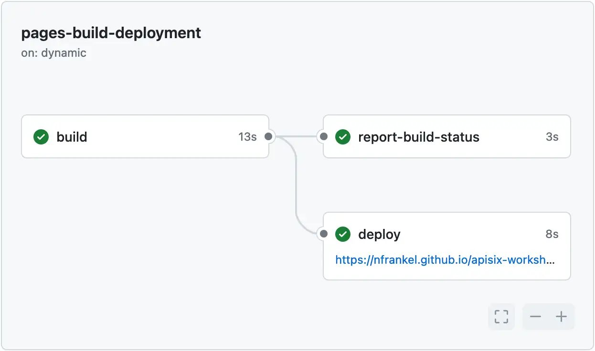

I moved my [blog](https://blog.frankel.ch/) from WordPress to [GitLab Pages](https://docs.gitlab.com/ee/user/project/pages/) in... 2016. I'm happy with the solution. However, I used [GitHub Pages](https://pages.github.com/) when I was teaching for both the courses and the exercises, *e.g.* , [Java EE](https://formations.github.io/javaee/cours/servlet.html). At the time, there was no GitHub Actions: I used [Travis CI](https://www.travis-ci.com/) to build and deploy.

Recently, I had to use GitHub Pages to publish my [Apache APISIX workshop](https://nfrankel.github.io/apisix-workshop/). Travis is no longer free. GitHub Actions are a thing. I used the now nominal path and faced a few hurdles; here are my findings.

## GitHub Pages, at the time

The previous usage of GitHub Pages was pretty straightforward. You pushed to a specific branch, `gh-pages`. GitHub Pages rendered the root of the branch as a website.

Travis works by watching a `.travis.yml` build file at the repository root. When it detects a change, it runs it. I designed the [script](https://github.com/formations/javaee/blob/master/.travis.yml) to build HTML from Asciidoc sources and push it to the branch. Here's the significant bit:

```yaml
after_success:
 # - ...
   - git push --force --quiet "https://${GH_TOKEN}@${GH_REF}" master:gh-pages > /dev/null 2>&1
```

## GitHub Pages now

When you enable GitHub Pages, you can choose its source: GitHub Actions or Deploy from a branch. I used a workflow to generate HTML from Asciidoctor, and my mistake was selecting the first choice.

### GitHub Pages from a branch

If you choose Deploy from a branch, you can select the branch name and the source root folder. Apart from that, the behavior is similar to the pre-GitHub Action behavior. A vast difference, however, is that GitHub runs a GitHub Action after each push to the branch, whether the push happens via an Action or not.



While you can see the workflow executions, you cannot access its YAML source. By default, the `build` job in the workflow runs the following phases:

* Set up job
* Pull the Jekyll build page Action
* Checkout
* Build with Jekyll
* Upload artifact
* Post Checkout
* Complete job

Indeed, whether you want it or not, GitHub Pages builds for Jekyll! I don't want it because I generate HTML from Asciidoc. To prevent Jekyll build, you can put a `.nojekyll` file at the root of the Pages branch. With it, the phases are:

* Set up job
* Checkout
* Upload artifact
* Post Checkout
* Complete job

No more Jekyll!

### GitHub Pages from Actions

The `pages-build-deployment` Action above creates a `tar.gz` archive and uploads it to the Pages site. The alternative is to deploy *yourself* using a custom GitHub workflow. The GitHub Marketplace offers Actions to help you with it:

* [configure-github-pages](https://github.com/marketplace/actions/configure-github-pages): extracts various metadata about a site so that later actions can use them;
* [upload-pages-artifact](https://github.com/marketplace/actions/upload-github-pages-artifact): packages and uploads the GitHub Page artifact
* [deploy-pages](https://github.com/marketplace/actions/deploy-github-pages-site): deploys a Pages site previously uploaded as an artifact

The [documentation](https://docs.github.com/en/pages/getting-started-with-github-pages/using-custom-workflows-with-github-pages) does an excellent job of explaining how to use them across your custom workflow.

## Conclusion

Deploying to GitHub Pages offers two options: either from a branch or from a custom workflow. In the first case, you only have to push to the configured branch; GitHub will handle the internal mechanics to make it work via a provided workflow. You don't need to pay attention to the logs. The alternative is to create your custom workflow and assemble the provided GitHub Actions.

Once I understood the options, I made the first one work. It's good enough for me, and I don't need to care about GitHub Pages' internal workings.

**To go further:**

* [GitHub Pages](https://pages.github.com/)
* [Using custom workflows with GitHub Pages](https://docs.github.com/en/pages/getting-started-with-github-pages/using-custom-workflows-with-github-pages)
* [configure-github-pages Marketplace Action](https://github.com/marketplace/actions/configure-github-pages)
* [upload-pages-artifact Marketplace Action](https://github.com/marketplace/actions/upload-github-pages-artifact)
* [deploy-pages Marketplace Action](https://github.com/marketplace/actions/deploy-github-pages-site)

*Originally published at [A Java Geek](https://blog.frankel.ch/refresher-github-pages/) on June 16^th^, 2024*
