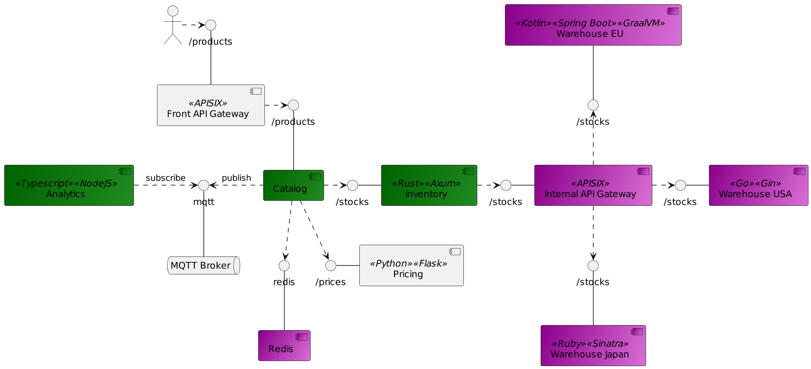
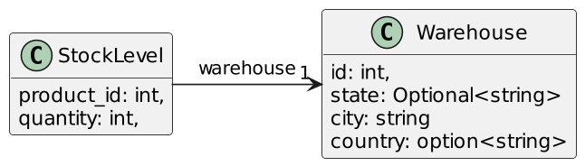
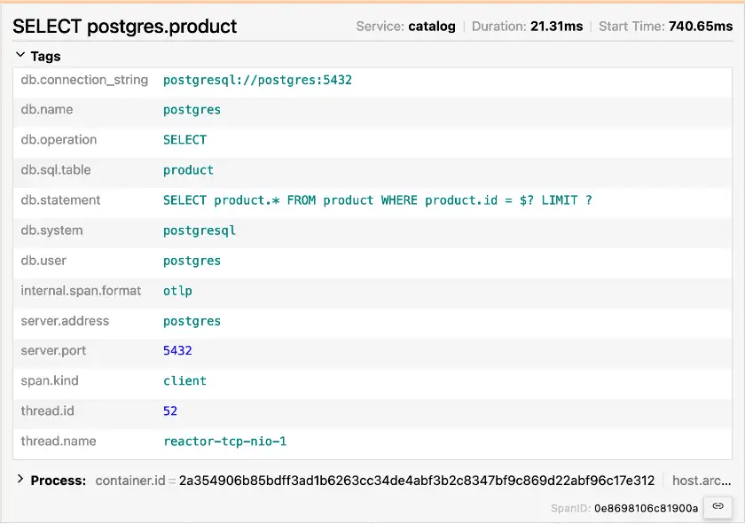
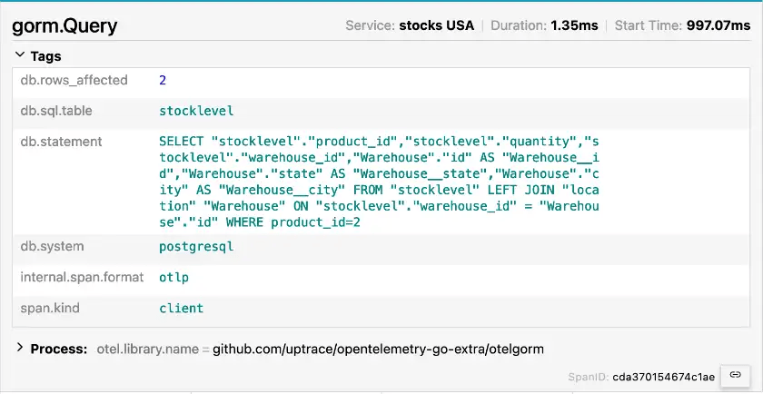
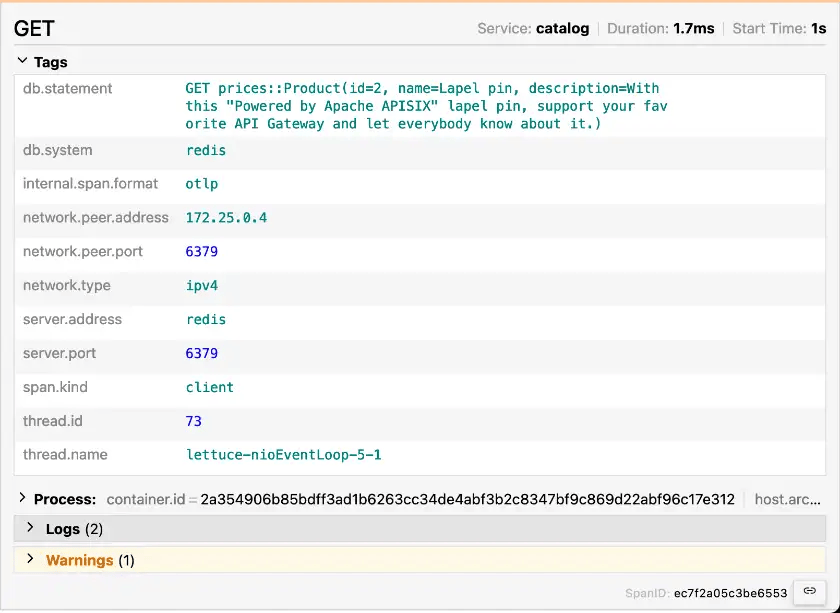

**I continue to work on my [Opentelemetry demo](https://github.com/nfrankel/opentelemetry-tracing). Its main idea is to showcase *traces* across various technology stacks, including asynchronous communication via an MQTT queue. Recently, I added a couple of components and changed the architecture. Here are some noteworthy learnings; note that some of them might not be entirely connected to OpenTelemetry.**

Here's an updated diagram. New components appear in violet, and updated components appear in green.

[](otel-component-model.png)I want to be able to add more components. Thus, I decided that instead of directly querying the database, the `inventory` component would query warehouses, which are supposed to be located in different regions. Each warehouse can be implemented in a different stack, and you can have as many as you want---PRs are welcome. I miss Elixir and .Net at the moment. The contract, which I need to write down, is easy:

* An endpoint `/stocks/${productId}`
* The ability to query PostgreSQL
* Return the stock in the form:

I've written about the changes in the inventory to account for the new configuration. Let's talk about the warehouse components.

The Go warehouse {#h2-0-the-go-warehouse}
-----------------------------------------

Let me be blunt: I dislike (hate?) Go for its error handling approach. However, with close to zero knowledge of the language, I was able to build a basic HTTP API that reads from the database in a couple of hours. I chose [Gin Gonic](https://gin-gonic.com/) for the web library and [Gorm](https://gorm.io/index.html) for the . OpenTelemetry provides an integration with a [couple of libraries](https://github.com/open-telemetry/opentelemetry-go-contrib/tree/main/instrumentation#instrumentation-packages), including Gin and Gorm. On the Dockerfile side, it's also pretty straightforward. I skipped optimizing the mount cache and the final base image, though I might return to it later.

All in all, that's the component I developed the fastest. I still dislike the Go language, but I begrudgingly understand that developers who want to get things done use it.

The Ruby warehouse {#h2-1-the-ruby-warehouse}
---------------------------------------------

While Ruby is not this famous anymore, I still wanted the stack in my architecture. I eschewed Ruby on Rails in favor of the leaner [Sinatra](https://sinatrarb.com/) framework. I use [sequel](https://sequel.jeremyevans.net/) for database access. The dynamic nature of the language was a bit of a hurdle, which is why it took me more time to develop my service than with Go.

I also spent a non-trivial amount of time on auto-instrumentation. For stacks with a runtime, auto-instrumentation allows developers to go on their merry way, oblivious to any OpenTelemetry concern. At runtime, the Ops team adds the necessary configuration for OpenTelemetry. For example, we achieve this with a Java Agent on the JVM.

I expected the same "carefree" approach with Ruby, but I couldn't find anything related to the stack. Ruby on Rails has a built-in plugin system, but not Sinatra. I tried to use `bash` to glue files together, but to no avail. If you're a Ruby expert or have any experience doing this, please let me know how.

The GraalVM native warehouse {#h2-2-the-graalvm-native-warehouse}
-----------------------------------------------------------------

This one is a regular Kotlin application on Spring Boot with a twist: I'm using [GraalVM native image](https://www.graalvm.org/latest/reference-manual/native-image/) to compile ahead-of-time to *native code* . This way, I can use a tiny Docker image as my base, *e.g* , `busybox`. It's not as efficient as Go or Rust, but it's a good bet if tied to the JVM.

OpenTelemetry did work on the JVM version but didn't when I compiled it to *bytecode* . Given the compilation time, it took me a couple of days of back-and-forth to make it work. The reason is simple: Spring Boot relies on *auto configuration* classes to activate or not features. Some auto-configuration classes rely on the presence of classes, others on the presence of beans, others on the opposite, others on existing properties, others on a combination of the above, etc.

In my case, the guilty class was `OtlpTracingConfigurations.ConnectionDetails`. It relies on the `management.otlp.tracing.endpoint` property:

```java
class OtlpTracingConfigurations {

  @Configuration(proxyBeanMethods = false)
  static class ConnectionDetails {

    @Bean
    @ConditionalOnMissingBean
    @ConditionalOnProperty(prefix = "management.otlp.tracing", name = "endpoint")
    OtlpTracingConnectionDetails otlpTracingConnectionDetails(OtlpProperties properties) {
      return new PropertiesOtlpTracingConnectionDetails(properties);
    }
}
```


If the property is not present **at compile-time** , the Spring Framework doesn't create a bean of type `OtlpTracingConnectionDetails`. Through a chain of missing beans, the final binary doesn't contain OpenTelemetry-related code. The solution is easy: set the property to an empty string in the `application.properties` file, and override it to its regular value in the Docker Compose file.

While auto-configuration is a compelling feature, you must understand how it works. That's the easy part. However, it's much more work to understand the whole chain of auto-configuration activation regarding a feature. Having distanced myself from the JVM, I'm no longer an expert in these chains, much less the OpenTelemetry one. I finally understand why some developers avoid Spring Boot and name it magic.

Migrating from JavaScript to TypeScript {#h2-3-migrating-from-javascript-to-typescript}
---------------------------------------------------------------------------------------

I used JavaScript in my first draft of a subscriber to the MQTT queue. Soon afterward, I decided to migrate to TypeScript. JavaScript code is valid TypeScript, so a simple copy-paste worked, with the addition of `@ts-ignore`.

However, when I tried to fix the code to "true" TypeScript, I couldn't see any OpenTelemetry trace. As for GraalVM, I went back and forth several times, but this time, I decided to solve it once and for all. I migrated code line by line until I isolated the issue in the following snippet:

```javascript
const userProperties = {}

if (packet.properties && packet.properties['userProperties']) {
    const props = packet.properties['userProperties']
    console.error('Props', props)
    for (const key of Object.keys(props)) {
        userProperties[key] = props[key]                         //1
    }
}
```


1. The TypeScript compiler complains with the following error message: `TS7053: Element implicitly has an any type because expression of type string can't be used to index type {}`

I earlier tried to fix it with the following:

```typescript
const userProperties = new Map<string, any>()
```


It compiled, but my limited understanding of JavaScript prevented me from realizing that a `Map` is not the same structure as an object. I understood the issue only when I isolated the exact line that went wrong. I just had to find the correct syntax to declare the type of an object:

```typescript
const userProperties: Record<string, any> = {}
```


Adding a Redis cache {#h2-4-adding-a-redis-cache}
-------------------------------------------------

So far, my services have used only PostgreSQL as a data store. Datastores don't implement OpenTelemetry by themselves, but the correct instrumentation of an app can show the trace going to the datastore. Here, you can see the trace created by the OpenTelemetry agent on a Kotlin/Spring Boot app that uses the PostgreSQL driver.



Here's the one from the Gorm framework, instrumented manually.



Both traces display the system, the statement, and a couple of other data. The Redis instrumentation shows the same information under the same structure!



Icing on the cake, if you use the Lettuce client, which is the default for Spring, you don't need additional changes. The OpenTelemetry agent already takes care of everything.

Another Apache APISIX instance {#h2-5-another-apache-apisix-instance}
---------------------------------------------------------------------

Last but not least, I've added another APISIX instance. Most organizations manage their APIs from behind a single multi-node API Gateway. However, it can be a significant burden depending on how the organization structures the teams. When a team needs to deploy a new or change the routing of an existing non-front-facing API, they want the change ASAP. If the team in charge of the centralized API Gateway doesn't respond to tickets, it slows down the API team and the business value they want to deploy.

For this reason, it's a perfectly valid pattern to set up API Gateways that are not front-facing under the responsibility of each API team - or business department. The granularity here depends on what works for each organization. It reduces friction when the infrastructure needs to change but does so at the cost of more diversified work for the API team. It also allows for different API Gateway technology (or technologies) from the front-facing one.

In my demo, I assume the team responsible for the `inventory` component has set up such an instance. It handles all routing to the warehouses. All other components still rely on the primary APISIX instance.

Conclusion {#h2-6-conclusion}
-----------------------------

In this post, I've described several changes I made in my OpenTelemetry tracing demo and the lessons I learned. I want to add additional warehouse components in other stacks. What stack would you be interested in? Would you like to contribute to such a component?

**To go further:**

* [End-to-end tracing with OpenTelemetry](https://blog.frankel.ch/end-to-end-tracing-opentelemetry/)
* [Improving upon my OpenTelemetry Tracing demo](https://blog.frankel.ch/improve-otel-demo/)
* [Parsing structured environment variables in Rust](https://blog.frankel.ch/structured-env-vars-rust/)

The complete source code for this post can be found on GitHub.


*Originally published at [A Java Geek](https://blog.frankel.ch/even-more-opentelemetry/) on June 2^nd^, 2024*

*[ORM]: Object Relational Mapper
