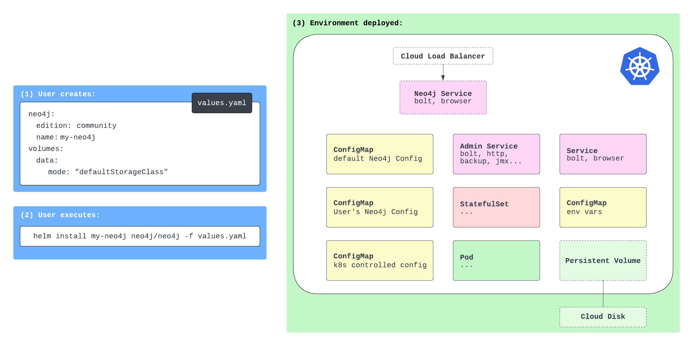
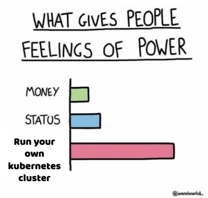

### Kubernetes is an open-source container orchestration platform that automates the deployment, scaling, and management of containerized applications. In this post, we walk through how to run the Neo4j graph database on Kubernetes.

**For an upcoming event, I was asked to give a demo of how to run Neo4j on Kubernetes. I had very little experience with Kubernetes, so I decided to document my journey for later reference.**

## What is Kubernetes?

Kubernetes is an open-source container orchestration platform that automates the deployment, scaling, and management of containerized applications. It was originally developed by Google and is now maintained by the Cloud Native Computing Foundation.

Kubernetes allows developers to run applications, databases, and other services in containers and manage them all together in a consistent, scalable, and reliable way. This will make a bit more sense when we look at what all is involved in running a database (such as Neo4j) on Kubernetes.

This technology is notorious for being complex and difficult to learn, and there are more than a few jokes and comics about it. But it is also incredibly powerful and customizable, as well as utilized by many companies and organizations to run enterprise workloads.

For a glimpse, check out the [Google's Kubernetes Comic](https://cloud.google.com/kubernetes-engine/kubernetes-comic).


## Neo4j on Kubernetes

Neo4j is a graph database and it is an excellent choice for applications that require complex data and relationships. Running a database on Kubernetes is a bit more complex than other services because there are a few more components involved (such as persistent storage, stateful sets, etc.).

The Neo4j documentation for running on Kubernetes is quite detailed and helpful, but I want to walk through a couple steps and then go beyond the docs by running an application alongside the database. First, here is a helpful diagram from the Neo4j documentation showing the components involved in running a database (Neo4j) on Kubernetes.



There are config maps, stateful set, persistent volume, and services containers. Now, we could run each of these containers, but handling scaling and management of all these indivdual pieces every time you want a database can get complicated and redundant. This is where Helm comes in.

[Helm](https://helm.sh/) provides a consistent, straightforward way to run complex Kubernetes applications. By creating a Helm chart that outlines all the components and configurations needed to run Neo4j on Kubernetes, we can deploy the database pieces as a single unit. It also allows us to easily customize and scale the database as needed. If you have used Docker Compose before, Helm is similar in that it allows you to define and run multi-container applications.

This is the approach we will use for this post. Let's start there!

## Setting Up Kubernetes

We need a few things set up for our environment. However, the Neo4j documentation is very thorough, and I was able to follow all the steps on [this page](https://neo4j.com/docs/operations-manual/current/kubernetes/quickstart-standalone/prerequisites/) to get everything ready (I used Docker Desktop for the Kubernetes environment).

## Helm Chart for Neo4j Kubernetes

Once the environment is ready, we can create our [Helm deployment for Neo4j](https://neo4j.com/docs/operations-manual/current/kubernetes/quickstart-standalone/create-value-file/). Neo4j publishes a Helm chart for running Neo4j on Kubernetes, so we need to set the config with a `values.yaml` file, which the documentation also provides a great starter file for us to use and customize as needed.

You'll need to select the example from the documentation that matches your environment (for me, I used the Docker Desktop example). Here is the `values.yaml` sample:

```yaml
neo4j:
  name: my-standalone
  resources:
    cpu: "0.5"
    memory: "2Gi"

  # Uncomment to set the initial password
  #password: "my-initial-password"

  # Uncomment to use enterprise edition
  #edition: "enterprise"
  #acceptLicenseAgreement: "yes"

volumes:
  data:
    mode: defaultStorageClass
    defaultStorageClass:
      requests:
        storage: 2Gi
```

This file sets up the resources, password, and storage for the database. You can customize this file with many more configurations (full list on [Github](https://github.com/neo4j/helm-charts/blob/dev/neo4j/values.yaml)). Once you have the `values.yaml` file set up, we can deploy the Helm chart with the following command:

```bash
helm install my-neo4j-release neo4j/neo4j --namespace neo4j -f my-neo4j.values.yaml
```

Now you have Neo4j running on Kubernetes! You can test it out by opening the Neo4j browser at <http://localhost:7474> and running some queries like ones listed below.

```cypher
// Retrieve the data model
CALL apoc.meta.graph();

// Find some nodes and relationships
MATCH (b:Book)<-[r:AUTHORED]-(a:Author) RETURN * LIMIT 20;
```

The next step is to run an application alongside the database. For that, we'll use Spring Boot with Spring Data Neo4j to interact with the database.

## Spring Data Neo4j application

The application is not anything fancy. It creates an API that allows us to hit an endpoint to retrieve some data from the Neo4j database. All of the code is available on the repository under the `book-service` folder.

While we won't go through all the code here, I'll highlight anything that needed to change to deploy the service into our Kubernetes cluster and get the app to connect to Neo4j in the cluster. First, we can either not set or comment out configuration for Neo4j database credentials in the `application.properties` file. Instead, we will set that outside the application for easier maintenance.

Next, we will need a Dockerfile (or other container setup) to build the app and run it in a container. The [Dockerfile I created](https://github.com/JMHReif/kubernetes-neo4j-java/blob/main/book-service/Dockerfile) is standard for what I usually create for my containers. Nothing special there. If you want to create your own Docker image to use (and not use mine), you will then need to build the application (create the JAR) and build the Docker image. Otherwise, you can just deploy my application and image.

Then comes the YAML file for deployment. If you have used Docker Compose, this will probably look familiar. If not, it contains a series of key/value pairs that define the service, deployment steps, and any special values needed for creating and managing your services in containers. Let's take a look at the [deployment YAML for this project](https://github.com/JMHReif/kubernetes-neo4j-java/blob/main/book-service/deployment.yaml.example)!

```yaml
apiVersion: apps/v1
kind: Deployment
metadata:
  creationTimestamp: null
  labels:
    app: kube-neo4j-books
  name: kube-neo4j-books
spec:
  replicas: 1
  selector:
    matchLabels:
      app: kube-neo4j-books
  strategy: {}
  template:
    metadata:
      creationTimestamp: null
      labels:
        app: kube-neo4j-books
    spec:
      containers:
      - image: jmreif/kube-neo4j-books
        name: kube-neo4j-books
        ports:
        - containerPort: 8080
        env:
          - name: SPRING_NEO4J_URI
            value: neo4j://.neo4j.svc.cluster.local:7687
          - name: SPRING_NEO4J_AUTHENTICATION_USERNAME
            value: neo4j
          - name: SPRING_NEO4J_AUTHENTICATION_PASSWORD
            value:
          - name: SPRING_NEO4J_DATABASE
            value: neo4j
        resources: {}
status: {}
---
apiVersion: v1
kind: Service
metadata:
  name: kube-neo4j-service
spec:
  selector:
    app: kube-neo4j-books
  ports:
    - protocol: TCP
      port: 8080
      targetPort: 8080
      nodePort: 30080  # You can choose any port in the range 30000-32767
  type: NodePort
```

The first config for `apiVersion` and `kind` is for the deployment of the application. You can have YAML files for services (as seen toward the bottom of the file) and other parts of Kubernetes setup, but this first part contains deployment configurations. Within our `kube-neo4j-books` deployment, we will have one application with the same name and only a single instance/container running (replica: 1).

The container will use the image `jmreif/kube-neo4j-books` (which is the image built from the Dockerfile) and will run on port 8080. We also set some environment variables for the application to connect to the Neo4j database. Externalizing this configuration makes it easier to change the database connection without changing the application code. We just need to re-deploy containers with the new environment variables.

In the bottom section of the file, we have a service configuration. This is how we expose the application to the outside world. We could create a separate YAML file for this rather than putting it at the bottom of the deployment one, but since our system contains only Neo4j and one application, I put everything in one file.

The service YAML sets the port to 8080 and the node port to 30080. This will allow us to hit the application at <http://localhost:30080>. For better description of all the port settings, check out the [article by Matthew Palmer](https://matthewpalmer.net/kubernetes-app-developer/articles/kubernetes-ports-targetport-nodeport-service.html).

Once you have the deployment YAML file set up, you can deploy the application with the following command:

```bash
kubectl apply -f deployment.yaml
```

Let's test our Neo4j cluster with the Spring Boot application.

## Testing everything!

First, I like to check the status of the pods and services to make sure everything is running as expected. You can do this by running `kubectl get all`, which should show a list of all the resources in the cluster. You should see the Neo4j pod (along with related services like load balancer), as well as the Spring Boot application pod and service.

We already tested the database earlier by running some queries in the Neo4j browser (localhost:7474), so all that is left is to test the Spring Boot application by hitting the endpoints! I like to ping the test endpoint first (`/hello`), which will just test that we can access the application. Then I test the other endpoint that will retrieve data from the Neo4j database. There are a few examples of author values you can use below, but feel free to try out some of your own, as well!

```bash
http :30080/hello
http :30080/authors/Stephen%20King
http :30080/authors/Jane%20Austen
http :30080/authors/J%2ER%2ER%2E%20Tolkien
http :30080/authors/J%2EK%2E%20Rowling
http :30080/authors/Timothy%20Zahn
```

**Note:** I use the `httpie` tool for testing APIs, but you can use `curl` or any other tool you prefer.

If (hopefully when) you get a response, you have successfully deployed a Spring Boot application alongside a Neo4j database on Kubernetes! Your request hits the Spring Boot application, which then queries the Neo4j database for the data and returns it to you. All these pieces are sitting in a Kubernetes cluster, managed and scaled as needed.

To shut everything down, you can run the following commands:

```bash
helm uninstall my-neo4j-release
kubectl delete deploy kube-neo4j-books

# Optinoal: remove all deployment resources - only do this if you don't want to spin back up later
kubectl delete pvc --all --namespace neo4j
```

## Wrapping Up!

Today, we deployed Neo4j and a Spring Boot application to Kubernetes.

We used Helm to deploy all necessary components of the database together and a separate YAML file to deploy the application.

From outside the cluster, we could interact with the application (via our API endpoints), which in turn test the application itself or connected to the database to run queries and return results.

We also could interact with the database separately, querying the data from Neo4j Browser.

We barely scratched the surface what you can do with Kubernetes, leaving out topics on scaling, monitoring, and managing resources.

But for now, I hope this post was helpful in getting you started with Kubernetes and Neo4j.

Happy coding!



## Resources

* Code (today's Github repository): [Neo4j on Kubernetes](https://github.com/JMHReif/kubernetes-neo4j-java)
* For fun: [Google's Kubernetes Comic](https://cloud.google.com/kubernetes-engine/kubernetes-comic)
* Diagram:https://neo4j.com/docs/operations-manual/current/kubernetes/quickstart-standalone/server-setup/\[Neo4j on Kubernetes Components\^\]
* Quickstart: [Spinning up Neo4j on Kubernetes](https://neo4j.com/docs/operations-manual/current/kubernetes/quickstart-standalone/)
* Guide: [Deploy Spring Boot app on Kubernetes](https://spring.io/guides/gs/spring-boot-kubernetes/)
