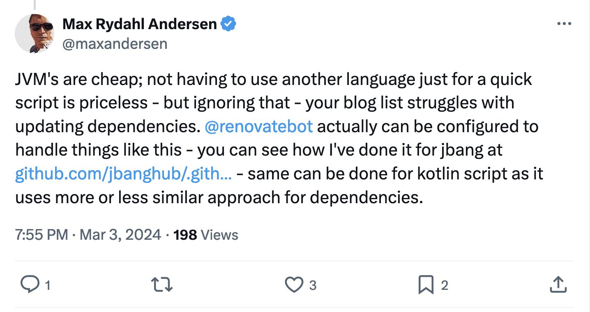

In my earlier post about moving from [Kotlin Scripting to Python](https://blog.frankel.ch/kotlin-scripting-to-python/), I mentioned several reasons:

* Separating the content from the script
* Kotlin Scripting is an unloved child of JetBrains
* [Renovate](https://www.mend.io/renovate/) cannot update Kotlin Scripting files

I was wrong on the third point. Here's my *mea culpa*.

First things first, Renovate does indeed [manages Kotlin Scripting](https://docs.renovatebot.com/modules/manager/kotlin-script/) files - since 2022.

Even better, Renovate can manage *any* type of file. Thanks to Max Andersen for the tip:

You can create your configuration for package managers, which must still be added to Renovate's scope!
> With `customManagers` using `regex` you can configure Renovate so it finds dependencies that are not detected by its other built-in package managers.
>
> -- [Custom Manager Support using Regex](https://docs.renovatebot.com/modules/manager/regex/)

The documentation is good enough, so there's no need to paraphrase it. The point is that you can configure Renovate for every package manager you can think of. Even better, Renovate allows the contribution of new package managers, contrary to Dependabot.

The more I know about Renovate, the more I love it.

**To go further:**

* [JBang Renovate configuration file](https://github.com/jbanghub/.github/blob/main/default.json)
* [Custom Manager Support using Regex](https://docs.renovatebot.com/modules/manager/regex/)
* [Renovate: No Datasource? No problem!](https://secustor.dev/blog/renovate_custom_datasources/)

*** ** * ** ***

*Originally published at [A Java Geek](https://blog.frankel.ch/renovate-for-everything/) on June 23^rd^, 2024*
