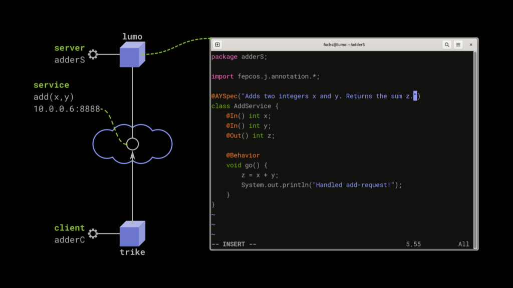

**This is a result of the [FEPCOS-Project](http://fepcos.info), aka @FepcosInfo; #FepcosJ_blog5.**

See how FEPCOS-J relieves developers of the network programming required to implement a client-server application in Java.  
 **External link to** : G. Fuchs: *Video: Easy Implementation of a Client-Server Application in Java with FEPCOS-J*; On: YouTube, FEPCOS-Project (@FepcosInfo); 29-July-2024; https://youtu.be/qtPP7kZbriQ.  
 **Impression of the above-linked video**: FEPCOS-J provides annotations like @AYSpec, @In, @Out, and @Behavior for programming a client-server application in Java. Watch the video for a complete example application of FEPCOS-J.

## Do you want to use FEPCOS-J to implement a Client-Server Application, too?

FEPCOS-J will become a Free/Libre and Open Source Software (FLOSS).

And for this, I need your help!

So far, FEPCOS-J is a prototype that I have independently developed.

Now, I need your support, especially regarding legal issues, the testing environment, and funding.

Please let me know what you think and leave any feedback.

Contact information is available on [my web page](http://fepcos.info/en/fuchs.html).

Thanks for reading!

## See also:

* G. Fuchs: FEPCOS-J (4) Easy programming of a multithreaded TCP/IP server in Java; At: Foojay Today; 2024-03-21; [blog post](https://foojay.io/today/fuchs-2024-fepcos-j-multithreaded-server/).
* G. Fuchs: FEPCOS-J (3) -- Build native executables of Java-coded networked systems; At: Foojay Today; 2023-12-13; [blog post](https://foojay.io/today/fuchs-2023-fepcos-j-03-native-executables/).
* G. Fuchs: FEPCOS-J (2) -- Declaratively compose networked systems in Java; At: Foojay Today; 2023-10-13; [blog post](https://foojay.io/today/fuchs-2023-fepcos-j-02/).
* G. Fuchs: FEPCOS-J (1) -- Description, Impressions of Usage, Current State; At: Foojay Today; 2023-04-26; [blog post](https://foojay.io/today/fuchs-2023-fepcos-j-01/).
