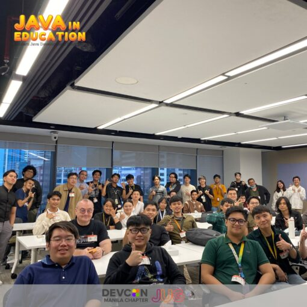
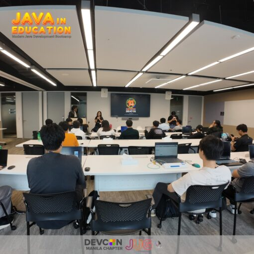
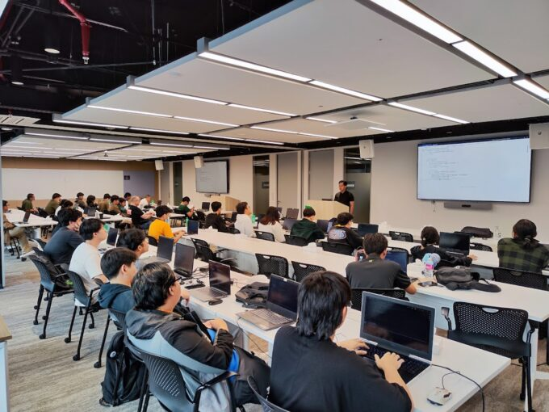
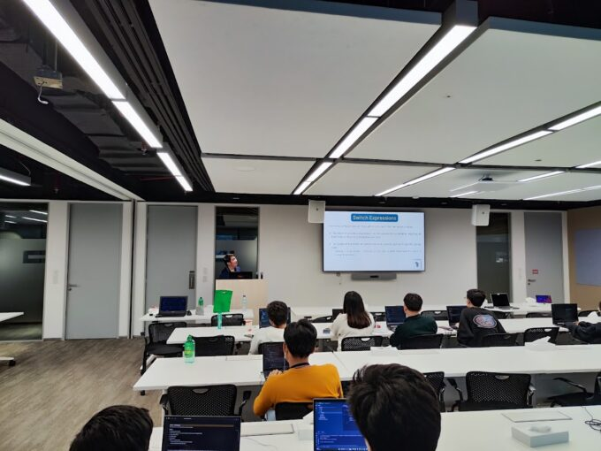
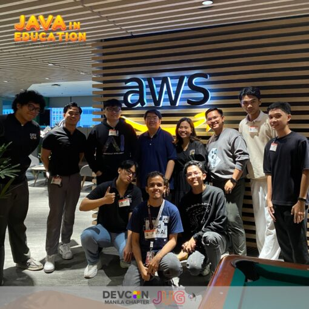

**A 1-Day Modern Java Bootcamp for students, early professionals and career shifters with minimal Java programming or general programming experience.**

The Java User Group Philippines (JUG PH) in partnership with Developer Connect (DEVCON) Philippines/Manila executed its 1st Modern Java Development Bootcamp.

The bootcamp was organized by the JUG Leaders and Volunteers and DEVCON Volunteers.

## Registration

The bootcamp received an overwhelming **110+ registrations** but 50 was only accomodated due to the slots of the venue.

The JUG Leaders evaluated the interested participants that will be joining the event targeting students, early professionals and career shifters with minimal Java programming or general programming experience.

**See the registration of the bootcamp in LUMA:** <https://lu.ma/ohzqexnb>

## Java in Education by Java Community Process (JCP)

JUG PH as a Partner Member of JCP, we integrated the Java in Education initiative of JCP to our curriculum.

The contents of the sessions were modified based on the needs of future and early IT professionals in the Philippines.

For more information about JCP - Java in Education, check out: [JCP - Java in Education GitHub Wiki](https://github.com/jcp-org/Java-in-Education/wiki/Java-in-Education---Wiki-Page "JCP - Java in Education GitHub Wiki")

## Sessions

Before the Java sessions start, the community partners introduced themselves and their initiative for the Philippines!

The bootcamp was splitted into 2 sessions, morning and afternoon. It was hosted by Tristan Mahinay, one of the JUG PH Leader

* **Morning Session** - Eric Martin discussed Java 8 to Java 13 and Java Coding Best Practices with coding exercises
* **Afternoon Session** - Jansen Ang discussed Java 14 to Java 21 with coding exercises

### Development Setup

Before attending the event, the participants were tasked to download and install IntelliJ Community Edition as the IDE and Azul JDK as the OpenJDK build.

### Java Basics and Java 8 to Java 13

The morning session will tackle different features of Java starting from Java 8 to Java 13. Including in the discussion are some Java Best Practices needed in the IT industry.

**Key topics discussed:**

* Java Basic Features (OOP and Generics)
* New Files method
* Streams and Optional
* var keyword
* Old and New Switch Expression in switch

### Java 14 to Java 21

The afternoon session will tackle different features of Java starting from Java 14 to Java 21.

**Key topics discussed:**

* Instance main method and Unnamed Classes
* Sealed Classes
* Records
* Switch Experssions Deep-dive
* Pattern Matching
* Sequenced Collections

**To access the presentation of these sessions, check out:** [JUG PH Bootcamp Slides](https://github.com/JUGPH/java-presentations/tree/main/java-development-bootcamp-1 "JUG PH Bootcamp Slides")

## Community Partners

The bootcamp will not be possible without the help of our community partner.

* **DEVCON Philippines/Manila** - Our community partner is a well-known non-profit organziation in the Philippines. They are empowering IT enthusiasts by creating developer conferences, campus summits and bootcamps. For more information, check out: <https://devcon.ph/>

## Sponsors

This bootcamp was generously sponsored by Azul and AWS Philippines. This is the 1st time that AWS will sponsor for the JUG Philippines through DEVCON Manila. Thanks for these organizations for their support for the Philippine Java Community!

* **Azul (Food Sponsor)** - Focusing in delivering alternative OpenJDK distribution aside from Oracle JDK. Azul JDK offers tremendous savings for your Java applications. For more information, check out <https://www.azul.com/>
* **AWS Philippines (Venue Sponsor via DEVCON)** - Extending the services of Amazon Web Services in the Philippines. For more information, check out <https://aws.amazon.com/>

## Connect with us!

The bootcamp exercises can be access below:

* **Coding Exercises:** [JUG PH Bootcamp Exercises](https://github.com/JUGPH/modern-java-development-bootcamp-1 "JUG PH Bootcamp Exercises")
  * The coding exercises are licensed under *MIT License*, please review the license

Connect with the JUG Philippines Bootcamp Host and Instructors:

* [Tristan Mahinay](https://www.linkedin.com/in/rjtmahinay/ "Tristan Mahinay")
* [Jansen Ang](https://www.linkedin.com/in/jansen-ang/ "Jansen Ang")
* [Eric Martin](https://www.linkedin.com/in/ericmarcmartin/ "Eric Martin")

Visit the Link Tree of Java User Group Philippines and like and follow our social media accounts!

* <https://linktr.ee/jugph>
