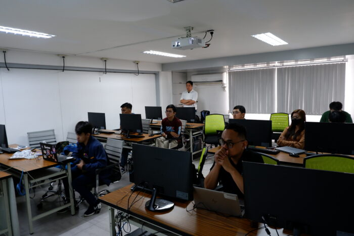
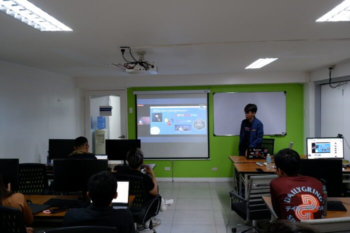
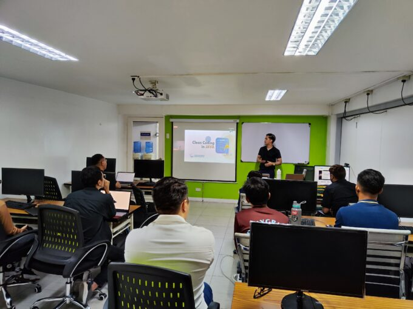
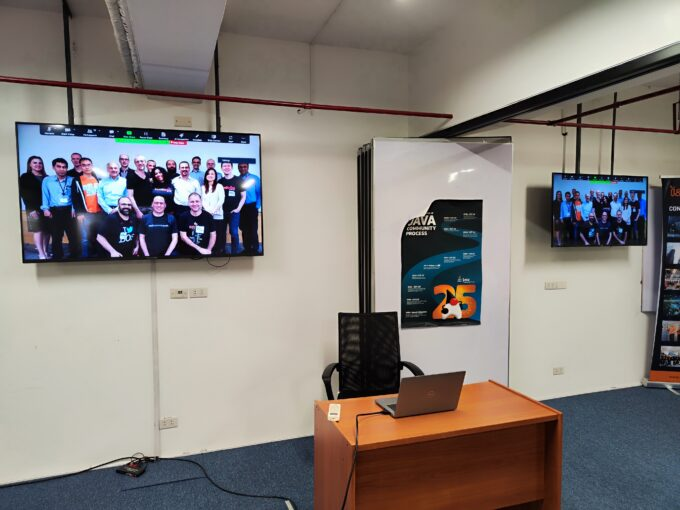
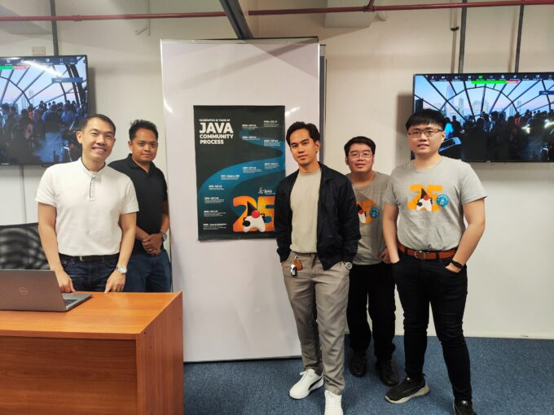
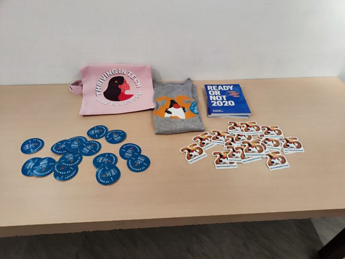
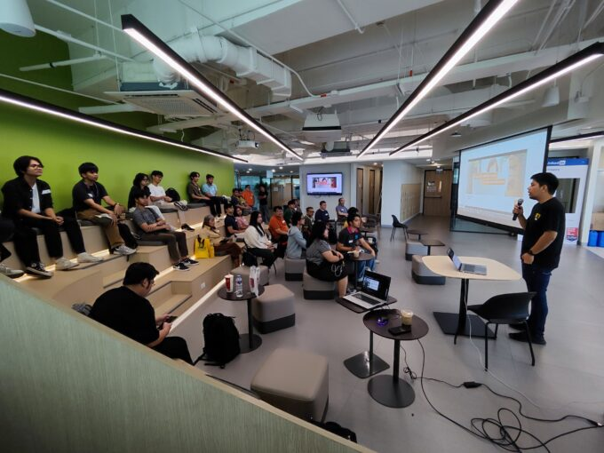
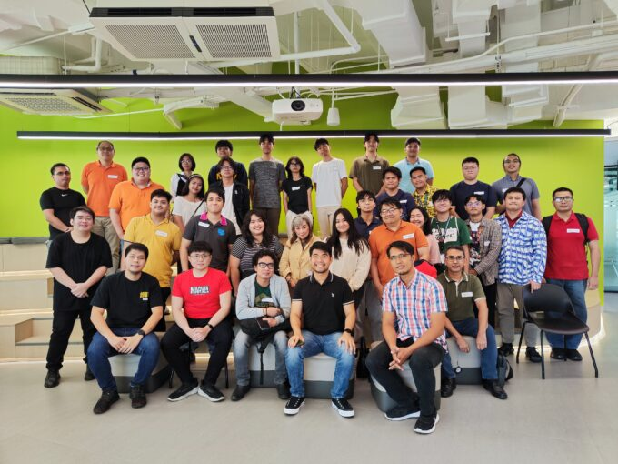
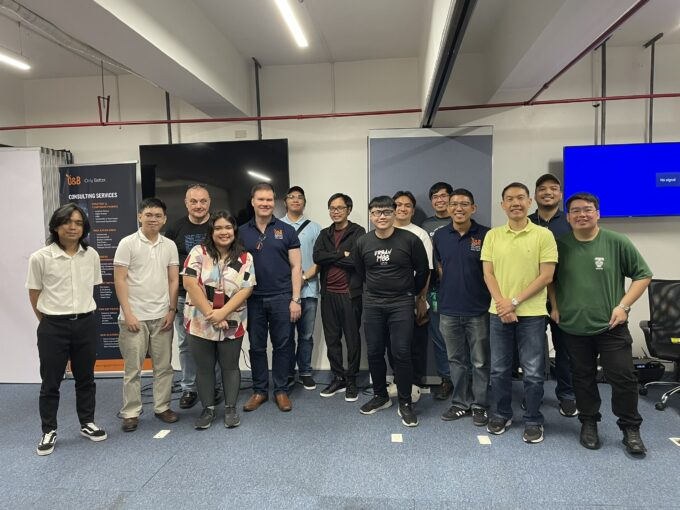

Summary of the meetups done in the 1st half of 2024. We discussed a variety of topics which was useful to our Java enthusiasts and members.

## 2024 Meetup Kickoff

We kicked-off the Java meetup in partnership with Angular Philippines. The meetup had 2 sessions which was demonstrated by Mark Montealto and Eric Martin.

### Progressive Web App using Angular Framework

A 1 hour session by Mark Montealto talking about how to make a Progressive Web aplication using Angular Framework. He started with the concepts and performed a live-coding.

Topics covered:

* What is Angular Framework?
* Progressive Web Application (PWA)
* Build Applications using Angular PWA

### Clean Code in Java

Eric Martin discussed Clean Coding by Robert Martin using Java. He discussed the following topics:

* Meaningful Names
* Functions
* Good Comments
* Code Refactoring

## JCP 25th Anniversary

### JCP Celeberation

We included in this meetup the celebration of Java Community Process 25th Anniversary. The image below is a snapshot of the JCP 25th Anniversary video.

  

The JCP Organization gave us merchandises to be distributed to JUG PH Members  

### Spring Modulith

Lorenzo Dee discussed the use of Spring Modulith and the concepts behind it. He discussed how modularity affects the codebases.

Some keypoints during the talk:

* Domain Partitioning vs Technical Partitioning
* Transactions in Spring Modulith
* Spring Modulith Testing

### Spring Boot Observability

Raymond Del Rosario discussed Spring Boot Micrometer as a tool for observability. He demonstrated on how to observe Spring Boot applications using Prometheus and Grafana.

## GitHub Copilot Day

This meetup focuses on the use of GitHub Copilot in creating a Spring Boot API, Dockerfile and Kubernetes Deployment object. Bryan San Juan demonstrated this in front of the Java Members and Partners.

Sequence of the demonstration using GitHub Copilot

1. Creation of Spring Boot API CRUD
   * Controller, Service, Repository and Model
2. Creation of a Deployment object in Kubernetes

## Modern API Development

This meetup focuses on Modern Java API Development and Testing Frameworks.

### OpenAPI using Quarkus and Vert.x

Stephan Wissel demonstrated the use of OpenAPI using Quarkus and Vert.x. He did a live-coding for our Java Members and Partners.

### API Testing in Spring Boot

Lino Borsoto discussed Spring Boot API Testing and the different annotations of Spring Boot Starter Test. He individually discussed the following:

* @SpringBootTest
* @DataJpaTest
* @WebMvcTest
* Mockito
* and so on..

## Sponsors

The meetups were sponsored generously by Azul, ING Hubs Philippines, Inventive Media, and Orange and Bronze Software Labs. Thanks for these organizations for their continuous support for the Philippine Java Community!

Check-out the product and career opportunities of our sponsors!

* **Azul (Food Sponsor)** - Focusing in delivering alternative OpenJDK distribution aside from Oracle JDK. Azul JDK offers tremendous savings for your Java applications. For more information, check out: <https://www.azul.com/>
* **ING Hubs Philippines (Food and Venue Sponsor)** - Offers good opportunity for Java Engineers as they modernized their retail and wholesale banking applications. For more information, check out: <https://www.linkedin.com/company/ing-hubs-philippines/>
* **Orange and Bronze Software Labs (Venue Sponsor)** - Focusing in IT consulting and services using Java-based technologies. Their organization consists of experts with extensive experience of Java, Spring and Cloud Technologies. For more information, check out, <https://orangeandbronze.com/>
* **Inventive Media (Venue Sponsor)** - An IT Learning Hub focusing in delivering high-quality IT trainings in the Philippines. For more information, check out: <https://www.inventivemedia.com.ph/>

## Connect with us!

The presentations and recording of these meetups can be access below:

* **Presentations:** [JUG PH GitHub Repository](https://github.com/JUGPH/java-presentations "JUG PH GitHub Repository")
* **Recording:** [JUG PH Drive](https://drive.google.com/drive/folders/1QyeCO9B7-haPYjMnQjhMFvZGRbCaUmb_?usp=sharing "JUG PH Drive")

Visit the Link Tree of Java User Group Philippines and like and follow our social media accounts!

* <https://linktr.ee/jugph>
