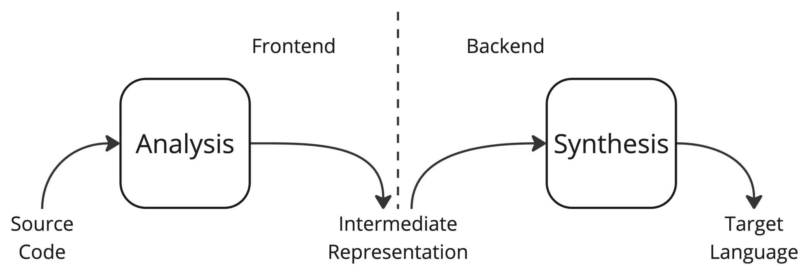
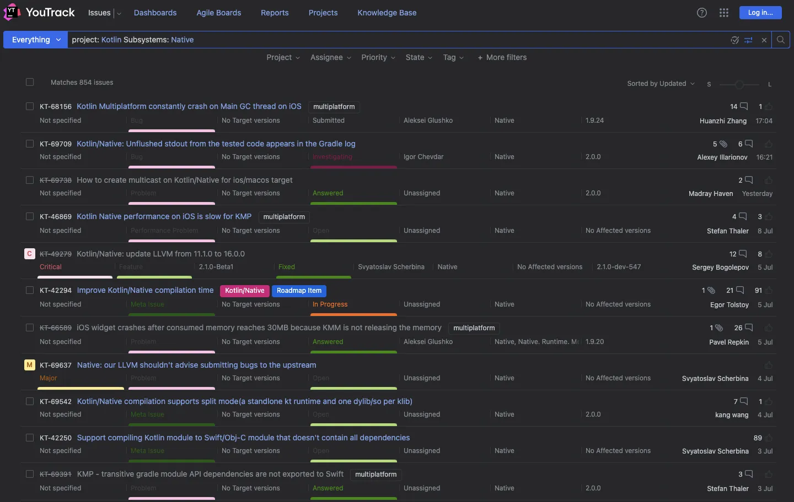
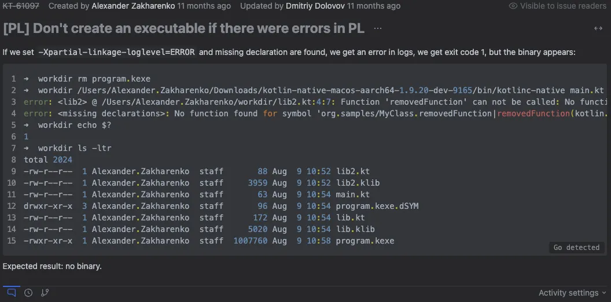
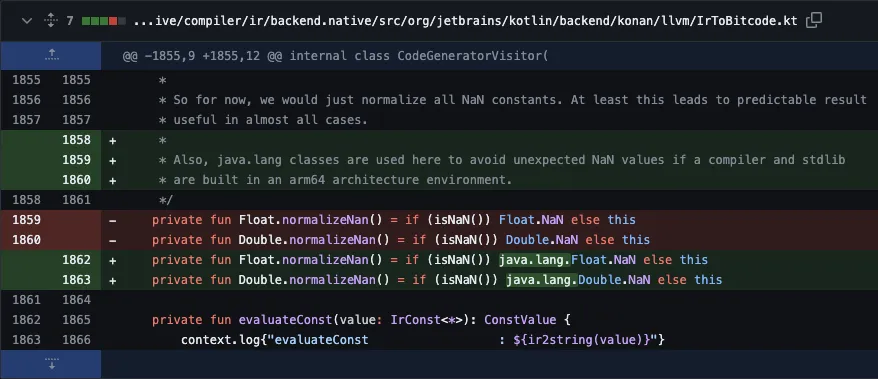
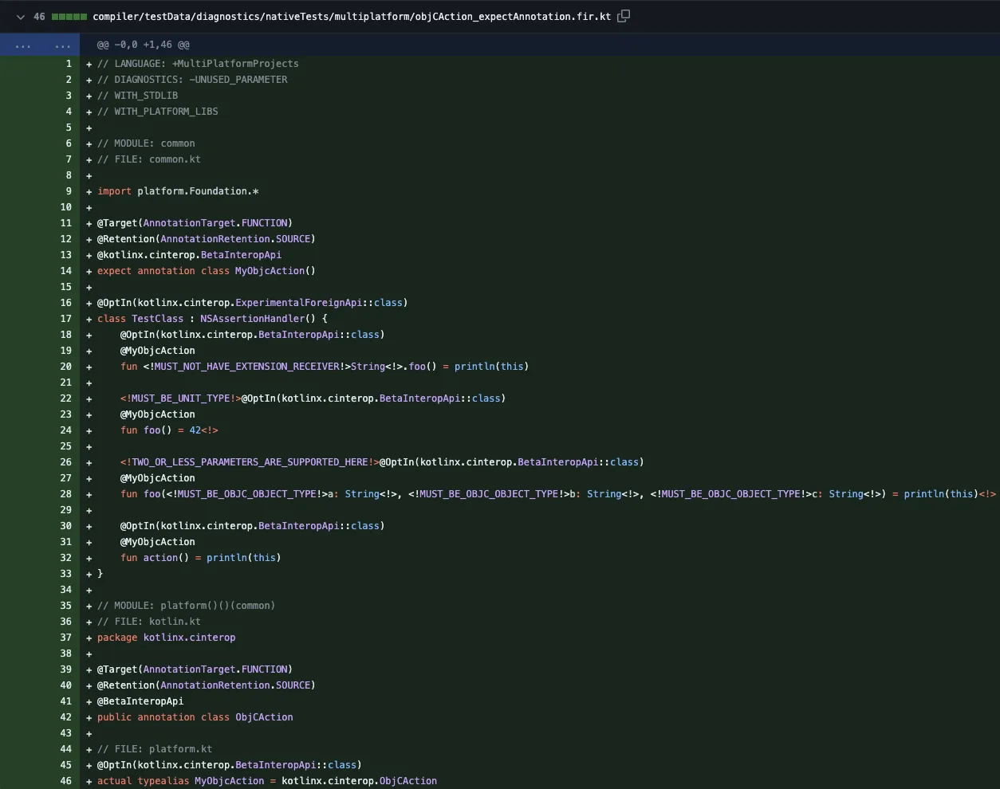

**Hi, my name is Alex. I work as a QA engineer on the [Kotlin/Native](https://kotlinlang.org/docs/native-overview.html "Kotlin/Native") team. I'm often asked by friends and colleagues what it's like to test a compiler, so I decided to write an article about it.**

I'll briefly talk about my path to compiler testing, the Kotlin/Native compiler, the specifics of the tasks, the tools I use, and the knowledge that helps me in my work.

I graduated with a bachelor's and master's degree in Software Engineering and then spent ten years in backend automation testing, including testing email backends (IMAP, POP3 protocols, email storage system, etc.), leading a testing team, and building test processes and test automation from scratch.

In addition, I was involved in testing infrastructure and a bit of backend building --- I believe that a tester needs to know what path a product takes from the code stage in the repository to the production service. By the way, I found a few bugs in the [linking](https://en.wikipedia.org/wiki/Linker_(computing) "linking") of services written in C that no one had noticed for years, and now I work with linking quite often.

As it often happens, it was a matter of chance. At the time, I was considering a career change, and I stumbled upon a job opening at JetBrains. I decided to give it a shot, went through several interview stages, and received an offer.

What I liked about the position was that it was a niche product, and working with such a product is always an interesting and rewarding experience. I already had experience in testing custom tools and technologies, so I understood what it was all about.  

The test assignment, by the way, was to build and test an interpreter written in C++. Even at that stage, I could roughly assess whether I liked doing this or not.

What is a compiler and what does it consist of? A compiler is a program that translates text written in a programming language into another language (the target language). Typically, a compiler translates software modules into equivalent software modules in a low-level language (or directly into machine language), and then assembles them into a program, taking into account static and dynamic linking (often with the help of a separate linker, such as [ld](https://ftp.gnu.org/old-gnu/Manuals/ld-2.9.1/html_chapter/ld_1.html#SEC1 "ld")).

Compilers consist of two parts: frontend and backend. The frontend is responsible for lexical, syntactic, and semantic analysis. For example, if you try to assign a string value to a variable of type Int, an error will be generated --- this is what the frontend is responsible for. The backend, on the other hand, is responsible for generating target language (i.e. machine code).

Kotlin/Native is a technology for compiling Kotlin code to native binaries which can run without a virtual machine. Kotlin/Native includes an [LLVM](https://llvm.org/ "LLVM")-based backend for the Kotlin compiler and a native implementation of the Kotlin standard library.

Kotlin/Native is primarily designed to allow compilation for platforms on which virtual machines are not desirable or possible, such as embedded devices or iOS. It is ideal for situations when a developer needs to produce a self-contained program that does not require an additional runtime or virtual machine.

Kotlin/Native is also used in [Kotlin Multiplatform](https://kotlinlang.org/docs/multiplatform.html "Kotlin Multiplatform").

How does compiler testing differ from backend or mobile app testing? If we abstract away from the product aspect of a compiler, technically it's a program, i. e. an executable file, that can be launched, passed various parameters, and that will output some result based on some logic (in the case of a compiler, this will most likely be a library or executable file).

The difference from testing typical products is that there is no network interface (as in testing an API) and no graphical interface (as in testing web or mobile applications). If you have experience testing console applications, then you are ready to test a compiler from a technical point of view 🙂

<pre class="EnlighterJSRAW" data-enlighter-language="shell">➜ workdir cat main.kt
fun main() {
    println("Hello, Foojay!")
}
➜ workdir ~/Downloads/kotlin-native-prebuilt-macos-aarch64–2.0.20-dev-7391/bin/kotlinc-native main.kt -o main.kexe
➜ workdir ./main.kexe
Hello, Foojay!</pre>

From a product perspective, things are a bit more complex. The compiler has many different parts to work with, such as:

* Language constructions
* Linking with libraries
* Various compilation parameters (e. g., [incremental compilation](https://en.wikipedia.org/wiki/Incremental_compiler "incremental compilation"))
* Various [garbage collector](https://kotlinlang.org/docs/native-memory-manager.html "garbage collector") parameters
* Interoperability ([e. g., with C](https://kotlinlang.org/docs/native-c-interop.html "e. g., with C"))

And so on. We should also not forget about integration with the build system (we use [Gradle](https://gradle.org/ "Gradle")), working with different versions of Xcode (required for building applications for Apple operating systems), working with IDEs, the nuances of working in different operating systems, performance, the size of the binary file, and so on --- it turns out to be quite a large scope that needs to be monitored.

What helps us with this? Of course, first and foremost, automated tests. We have several types of automated tests and different test suites: for merge requests, nightly, weekly, etc. The types include:

* Unit tests
* Integration tests
* UI tests (IDE or syntax highlighting)
* E2E tests (compilation of different projects)
* Performance tests
* Special set of tests that are run on special agents with the latest beta version of Xcode

In addition to automated testing, we also perform [exploratory testing](https://en.wikipedia.org/wiki/Exploratory_testing "exploratory testing"). Some features are challenging to cover with automated tests, so sometimes we manually test them as well.

The typical workflow for tasks looks something like this:

1. A QA engineer picks up a task from the backlog --- tasks in YouTrack that are filtered according to a certain rule.
2. Such tasks usually have either a [Root cause analysis](https://en.wikipedia.org/wiki/Root_cause_analysis "Root cause analysis") (developers use this problem-solving method for all bugs) in a comments section or a "Note for QA" comment in a special format (our internal agreement), which gives the tester context.
3. Then the tester reviews the automated tests and, based on this review, the Note for QA, and sometimes communication with the developer, decides whether exploratory testing is necessary for this task. The tester may also suggest cases for expanding the automated tests.
4. If necessary, exploratory testing is performed.
5. If necessary, automated tests are added (this can be done by the tester or the developer).
6. If there are bugs, then tasks are created.
7. A decision is made on whether the task is ready for release.

A question may arise: what exactly did you have to deal with, what kind of tasks can you encounter?

I will show a few examples of what I had to deal with, without describing detailed solutions or test plans for the tasks. Just random tasks or facts that came to mind first. 🙂

One of the first tasks was <https://youtrack.jetbrains.com/issue/KT-56464/K-N-Allow-HiddenFromObjC-for-classes>. Kotlin/Native has a `@HiddenFromObjC` annotation that can be used to hide specific symbols from being available in Objective-C, and this task implemented the ability to apply the annotation to classes.

I remember that at that time, for the sake of testing simplicity, I wanted to write a bash script that would compile all the necessary code, but I realized that I didn't know what options I needed to compile the project with and what the general compilation order should be --- after all, I had to first compile the Objective-C Framework and then compile the program itself in Objective-C or Swift, which I had never done before. As a result, after some digging, I wrote a script that looked something like this:

<pre class="EnlighterJSRAW" data-enlighter-language="shell">#/bin/zsh
#set -x

./clean.sh

# define some constants with the compiler binaries paths
CURRENT_COMPILER_BIN="kotlinc-native"
BETA_COMPILER_BIN="/Users/Alexander.Zakharenko/Downloads/kotlin-native-prebuilt-macos-aarch64-1.9.0-Beta-162/bin/kotlinc-native"
MASTER_COMPILER_BIN="/Users/Alexander.Zakharenko/Downloads/kotlin-native-macos-aarch64-1.9.20-dev-2534/bin/kotlinc-native"

COMPILER_BIN=$MASTER_COMPILER_BIN

# compile a klib (kotlin library) for macOS target
$COMPILER_BIN -g -enable-assertions -module-name org.example:hiddenfromobjc -no-endorsed-libs -output hiddenfromobjc.klib -produce library -Xshort-module-name=hiddenfromobjc -target macos_arm64 -Xmulti-platform classes.kt

# compile an Ojb-C framework from the intermediate klib
$COMPILER_BIN -g -enable-assertions -Xinclude=hiddenfromobjc.klib -no-endorsed-libs -output Hiddenfromobjc.framework -produce framework -target macos_arm64 -Xmulti-platform

# compile an executable from Obj-C that uses the generated framework
clang -framework Foundation,Hiddenfromobjc -F . -Xlinker -rpath -Xlinker . -Xlinker Hiddenfromobjc.framework/Versions/A/Hiddenfromobjc main.m -o objc.kexe

# compile an executable from Swift that uses the generated framework
swiftc -F . -Xlinker -rpath -Xlinker . main.swift -o swift.kexe

echo "Launching Objective-C compiled Main:"
./objc.kexe
echo

echo "Launching Swift compiled Main:"
./swift.kexe
echo</pre>

What's a test case for such a feature? We compile classes.kt and then use the result in Objective-C or Swift code --- so different contents of classes.kt are the test cases.

The simple example of the new feature usage looks like this:

<pre class="EnlighterJSRAW" data-enlighter-language="kotlin">@file:OptIn(kotlin.experimental.ExperimentalObjCRefinement::class)

@HiddenFromObjC
class Hidden</pre>

The simple regression case would look something like that:

<pre class="EnlighterJSRAW" data-enlighter-language="kotlin">@file:OptIn(kotlin.experimental.ExperimentalObjCRefinement::class)

@HiddenFromObjC
fun hidden() = 1 // just a random function</pre>

It was necessary to test various use cases of the new feature, and in the process, I was able to find a [bug](https://youtrack.jetbrains.com/issue/KT-58839/K-N-Exception-during-HiddenFromObjC-marked-class-extension-function-compiling "bug") that could be reproduced with the following code:

<pre class="EnlighterJSRAW" data-enlighter-language="kotlin">@file:OptIn(kotlin.experimental.ExperimentalObjCRefinement::class)

@HiddenFromObjC
class Hidden

fun Hidden.foo() = 5</pre>

This is an example of a classic language feature task. There are also other types of feature tasks, such as a task for a [change in the klib utility](https://youtrack.jetbrains.com/issue/KT-59486/klib-Serialize-mangled-names-along-with-signatures "change in the klib utility") --- it was necessary to verify the correctness of the utility output. A simplified example showing the essence of the task looks something like this:

<pre class="EnlighterJSRAW" data-enlighter-language="shell">➜ workdir cat kt-59486.sh
#!/bin/bash

echo Old output:
/Users/Alexander.Zakharenko/Downloads/kotlin-native-macos-aarch64-1.9.20-dev-1301/bin/klib signatures liba.klib | head -5

echo New output:
/Users/Alexander.Zakharenko/Downloads/kotlin-native-macos-aarch64-1.9.20-dev-9165/bin/klib signatures liba.klib | head -5
➜ workdir ./kt-59486.sh
Old output:
pkg.liba/abcd|-1737051669930664695[0]
pkg.liba/abcd|8056171871528744167[0]
pkg.liba/abcd|4166264198026952689[0]
pkg.liba/abcd|7488699501299379351[0]
pkg.liba/|1959142612710531654[0]
New output:
pkg.liba/abcd|abcd(kotlin.Int){}[0]
pkg.liba/abcd|abcd(kotlin.Long){}[0]
pkg.liba/abcd|abcd(kotlin.Int){}[0]
pkg.liba/abcd|abcd(kotlin.Long){}[0]
pkg.liba/|(kotlin.Int){}[0]</pre>

There are also tasks for various compiler features --- for example, I once tested a task to improve error reporting during [partial linkage](https://kotlinconf.com/2023/talks/372287/ "partial linkage"). There were no interesting cases in this task, but the essence of the task itself might seem interesting to someone --- after all, we often don't think about how projects are assembled, in particular, how all the libraries needed for assembly are linked together. And here it was initially necessary to artificially create an error case during partial linkage. An example of a bug that can be found when testing such tasks is the [creation](https://youtrack.jetbrains.com/issue/KT-61097/PL-Dont-create-an-executable-if-there-were-errors-in-PL "creation") of an executable file in a situation where it should not be possible to create it.

What else can you encounter when testing a compiler? For example, an incorrect representation of [NaN](https://en.wikipedia.org/wiki/NaN "NaN"). That time we were working on the problem with the developer, they offered a solution that I eventually [merged](https://github.com/JetBrains/kotlin/commit/ce38699dfae3d55b2c0056f26312f658f6193e0a "merged").

Sometimes you have to write simple code generators: for example, to test the performance of one of the new features, I recently generated 500 [classes nested inside each other](https://kotlinlang.org/docs/nested-classes.html "classes nested inside each other") and found a nonlinear dependence of the performance of that feature on the nesting levels of these classes.

<pre class="EnlighterJSRAW" data-enlighter-language="shell">➜ head -15 nested500
// Level: 500
    class Nested1() {
        class Nested2() {
            class Nested3() {
                class Nested4() {
                    class Nested5() {
                        class Nested6() {
                            class Nested7() {
                                class Nested8() {
                                    class Nested9() {
                                        class Nested10() {
                                            class Nested11() {
                                                class Nested12() {
                                                    class Nested13() {
                                                        class Nested14() {</pre>

Sometimes I have to run an app compiled with Kotlin/Native for iOS on my iPhone. To do this, I had to learn how to run apps on the phone from Xcode and activate developer mode on my phone. But now I can download beta versions of iOS as soon as they are released! 🙂

Some of our automated tests are run on special [TeamCity](https://www.jetbrains.com/teamcity/ "TeamCity") agents that have the latest beta version of Xcode installed. Implementing these automated tests was also my task, and thanks to these tests, we find bugs in time during the release of new versions of Xcode.

I also encountered automated tests as part of the task to improve Objective-C interop related annotations inspections. I had to understand some of our automated tests and [add new](https://github.com/JetBrains/kotlin/commit/56b1a09a7d34d83bac7b2a07e6af68c627a3a5bb "add new") ones.

These are just a few examples, but even from them you can see that the tasks can be very diverse: from testing on different code examples to setting up integration automated tests and performance testing.

In fact, there are no specific tools --- I use the console, bash scripts, vim, IDE ([IntelliJ IDEA](https://www.jetbrains.com/idea/ "IntelliJ IDEA")), Gradle, I read documentation and specifications.

Since the Kotlin/Native compiler has many different parameters, we're facing a problem of choosing the optimal set of tests that would not cover all combinations of parameters (this would be a huge test suite), but would find potential bugs at the intersection of using some parameters. I think it's already clear that I'm hinting at [pairwise testing](https://en.wikipedia.org/wiki/All-pairs_testing "pairwise testing") 🙂 We use this test design technique, and the [pict](https://github.com/microsoft/pict "pict") utility helps us with this. Our automated test configuration repository contains a test model for the compiler, and there is a script that generates the necessary methods for the [Kotlin DSL](https://www.jetbrains.com/help/teamcity/kotlin-dsl.html "Kotlin DSL") of TeamCity automated test build configurations.

Sometimes I use [lldb](https://lldb.llvm.org/ "lldb") for debugging --- my experience with [gdb](https://sourceware.org/gdb/ "gdb") at one of my previous jobs helps. In general, my experience with Linux, with setting up infrastructure and building services written in various programming languages (C, C++, Java, Go and even Perl) is very helpful in my work. Specific tools may change, but there is always a basic theory, basic approaches on which everything is built.

In my opinion, it is very important to have and maintain knowledge of this rather than knowledge of specific tools. Today you're testing an HTTP API, and tomorrow they will implement a new service using a custom binary protocol. The QA engineer should not be daunted by this, because the essence remains the same --- you're still testing a service that receives and sends bytes organized according to some specification.

This article is just a brief overview of the work of a QA engineer in a compiler development team.

It does not touch upon the work with the IDE --- there is a separate team for testing Kotlin in the IDE.

It does not say much about automation and performance testing --- we also have dedicated teams for these tasks.

As you can see, compiler testing is a big task!

If you have any questions or want to discuss any technical details, please feel free to leave comments or write to me personally.

If you're engaged in specialized quality assurance, please leave comments, too. Tell us more about working on projects like this! 🙂

 

 
