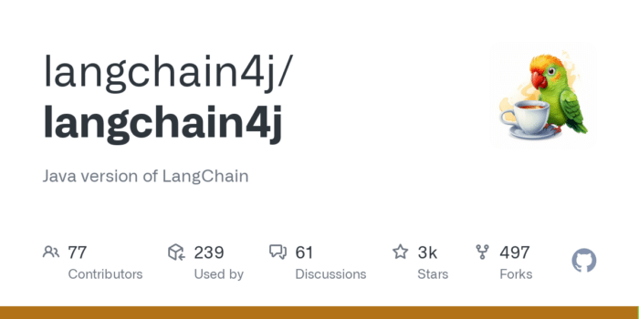
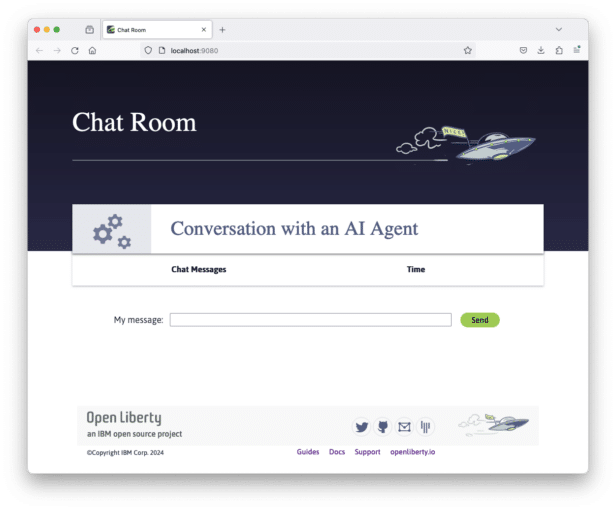

**Artificial Intelligence (AI) is an exciting and disruptive field that is already transforming businesses, and even entire industries, by enabling automation, improving decision-making and unlocking new insights from data.**

With the rise in large language models (LLMs) such as ChatGPT, there is a significant shift in the performance of AI and its potential to drive enterprise value. So, how will this impact on software development and the creation of cloud-native Java applications for enterprises?

In this post, we'll explore what LLMs are and how to use them in Java applications. We'll also get started using them in an example Jakarta EE/MicroProfile app.

* [Find out what LLMs are](#WhatAreLLMs?)
* [Explore app frameworks that simplify the use of LLMs](#Java_LLMs?)
* [Discover how to use LangChain in Java applications](#using_Langchain4j)
* [Try out the jakartaee-microprofile-example application](#tryout)
* [Learn how this sample application works](#how_app_work)

{#WhatAreLLMs?}

## What are LLMs?

A language model is a model of natural language based on probabilities. They are able to generate probabilities of a series of words together. [Large language models (LLMs)](https://www.ibm.com/topics/large-language-models) are simply language models that are categorized by their large size.

They are trained on immense amounts of data, possibly billions of parameters, by using self-supervised and semi-supervised learning techniques. This training enables them to generate natural language and other types of content to perform a wide range of tasks.

See the following introductory video for more information on LLMs, including what they are, how they work, and their business applications.



You can find LLMs in the service offerings of almost all of the major cloud service providers. For example, IBM offers models through its [WatsonX](https://www.ibm.com/watsonx) services, [Microsoft Azure](https://azure.microsoft.com/en-us/solutions/ai) offers LLMs like Llama 2 and OpenAI GPT-4, and [Amazon Bedrock](https://aws.amazon.com/bedrock/) offers models from a range of AI companies.

{#Java_LLMs?}

## How can we take advantage of LLMs in Java applications?

Integrating AI/LLM capabilities into an application can be challenging. The open source LangChain framework was developed in 2022 to help streamline the process of creating generative AI apps.

LangChain provides tools and abstractions to improve the customization, accuracy, and relevancy of the information the models generate. For example, developers can use LangChain components to build new prompt chains or customize existing templates.

LangChain also includes components that allow LLMs to access new data sets without retraining and organizes the large quantities of data these models require so that they can be accessed with ease.

Although LangChain is primarily available in Python and JavaScript/TypeScript versions, options are available to use LangChain in Java applications through community projects like [LangChain4j](https://github.com/langchain4j/langchain4j). LangChain4j APIs can help integrate LLMs into your Java application for different AI platforms, such as OpenAI and Hugging Face.



{#using_Langchain4j}

## How to use LangChain4j in a Jakarta EE and MicroProfile application

Langchain4j has a useful open source [langchain4j-examples](https://github.com/langchain4j/langchain4j-examples) GitHub repository where it stores example applications. However, we could not find any examples showcasing how you could experience these AI technologies in a Jakarta EE or MicroProfile based application.

So, we decided to build one ourselves called `jakartaee-microprofile-example`, which can now be found in this [langchain4j-examples](https://github.com/langchain4j/langchain4j-examples/tree/main/jakartaee-microprofile-example) GitHub repository. This demo application highlights how to use LangChain4j APIs in an application by using Jakarta EE and MicroProfile on Open Liberty.

{#tryout}

## Try out the jakartaee-microprofile-example application

To see how you can apply LangChain4j to your own Jakarta EE and MicroProfile applications, check out this example project for yourself.

### Prerequisites

Before you clone the application to your machine, install JDK 17, and ensure that your `JAVA_HOME` environment variable is set. You can use the [IBM Semeru Runtime](https://developer.ibm.com/languages/java/semeru-runtimes/downloads) as your chosen Java runtime.

This runtime offers performance benefits from deep technology investment in projects such as Eclipse OpenJ9 and is available across a wide variety of hardware and software platforms. To find out more about IBM Semeru Runtime, see [Open Liberty and Semeru Runtimes, cloud-native performance that matters](https://openliberty.io/blog/2022/08/19/open-liberty-semeru-performance.html).

The application uses Hugging Face. You need to get a Hugging Face API Key:

* Sign up and log in to <https://huggingface.co>
* Go to the [Access Tokens page](https://huggingface.co/settings/tokens)
* Create an access token with `read` role

To access the repository remotely, install [Git](https://git-scm.com/book/en/v2/Getting-Started-Installing-Git) if you haven't already. You can clone the `langchain4j-examples` GitHub repository to your local machine by running the following command:

```
git clone https://github.com/langchain4j/langchain4j-examples.git
```

### Environment setup

To run the application, navigate to the `jakartaee-microprofile-example` directory:

```
cd langchain4j-examples/jakartaee-microprofile-example
```

Set the following environment variables:

```
export JAVA_HOME=<your Java 17 home path>
export HUGGING_FACE_API_KEY=<your Hugging Face read token>
```

### Start the application

To start the application, use the provided Maven wrapper to run Open Liberty in [dev mode](https://openliberty.io/docs/latest/development-mode.html):

```
./mvnw liberty:dev
```

After you see the following message, the application is ready:

```
************************************************************************
*    Liberty is running in dev mode.
*        Automatic generation of features: [ Off ]
*        h - see the help menu for available actions, type 'h' and press Enter.
*        q - stop the server and quit dev mode, press Ctrl-C or type 'q' and press Enter.
*
*    Liberty server port information:
*        Liberty server HTTP port: [ 9080 ]
*        Liberty server HTTPS port: [ 9443 ]
*        Liberty debug port: [ 7777 ]
************************************************************************
```

To ensure that the application started successfully, you can run the tests by pressing the `enter/return` key from the command-line session. If the tests pass, you can see output similar to the following example:

```
[INFO] -------------------------------------------------------
[INFO]  T E S T S
[INFO] -------------------------------------------------------
[INFO] Running it.dev.langchan4j.example.ChatServiceIT
[INFO] ...
[INFO] Tests run: 1, Failures: 0, Errors: 0, Skipped: 0, Time elapsed: 0.439 s...
[INFO] ...
[INFO] Running it.dev.langchan4j.example.ModelResourceIT
[INFO] Tests run: 3, Failures: 0, Errors: 0, Skipped: 0, Time elapsed: 0.733 s...
[INFO]
[INFO] Results:
[INFO]
```

### Access the application

After the application is running, you can access it through a browser of your choice at <http://localhost:9080/> and start experimenting with it.



You can type in any text that you want to chat with the AI agent. Here are some suggested messages:

* `What is MicroProfile?`
* `Which top 10 companies contribute MicroProfile?`
* `Any documentation?`

{#how_app_work}

## How does the application work?

The application demonstrates how to use the LangChain4j APIs, [Jakarta Contexts and Dependency Injection](https://openliberty.io/docs/ref/feature/#cdi-4.0.html), [Jakarta WebSocket](https://openliberty.io/docs/latest/reference/feature/websocket-2.1.html), [MicroProfile Config](https://openliberty.io/docs/ref/feature/#mpConfig-3.0.html), and [MicroProfile Metrics](https://openliberty.io/docs/latest/reference/feature/mpMetrics-5.1.html) features.

### Creating the LangChain4j AI service

The application uses the `HuggingFaceChatModel` class to provide the model for building the AI service.

See the [src/main/java/dev/langchain4j/example/chat/ChatAgent.java](https://github.com/langchain4j/langchain4j-examples/blob/17e4f94bc94604ce562878681cc5c676809c3ddc/jakartaee-microprofile-example/src/main/java/dev/langchain4j/example/chat/ChatAgent.java#L48-L65 "ChatAgent.java") file.

```
public Assistant getAssistant() {
    ...
        HuggingFaceChatModel model = HuggingFaceChatModel.builder()
            .accessToken(HUGGING_FACE_API_KEY)
            .modelId(CHAT_MODEL_ID)
            .timeout(ofSeconds(TIMEOUT))
            .temperature(TEMPERATURE)
            .maxNewTokens(MAX_NEW_TOKEN)
            .waitForModel(true)
            .build();
        assistant = AiServices.builder(Assistant.class)
            .chatLanguageModel(model)
            .chatMemoryProvider(
                sessionId -> MessageWindowChatMemory.withMaxMessages(MAX_MESSAGES))
            .build();
   ...
}
```

Through the customized `Assistant` interface, the application can send messages to the LLM by its `chat()` method.

```
interface Assistant {
   String chat(@MemoryId String sessionId, @UserMessage String userMessage);
}
```

### Externalizing the configuration

An API key is required to access the model. For security purposes, the key is not hardcoded in the code. The application externalizes the API key and the LangChain4j model properties with the MicroProfile Config feature that helps the application to run in different environments without code changes. You can learn more from the [External configuration of microservices](https://openliberty.io/docs/latest/external-configuration.html) document.

See the [src/main/java/dev/langchain4j/example/chat/ChatAgent.java](https://github.com/langchain4j/langchain4j-examples/blob/17e4f94bc94604ce562878681cc5c676809c3ddc/jakartaee-microprofile-example/src/main/java/dev/langchain4j/example/chat/ChatAgent.java#L18-L40 "ChatAgent.java") file.

```
@Inject
@ConfigProperty(name = "hugging.face.api.key")
private String HUGGING_FACE_API_KEY;

@Inject
@ConfigProperty(name = "chat.model.id")
private String CHAT_MODEL_ID;

@Inject
@ConfigProperty(name = "chat.model.timeout")
private Integer TIMEOUT;

@Inject
@ConfigProperty(name = "chat.model.max.token")
private Integer MAX_NEW_TOKEN;

@Inject
@ConfigProperty(name = "chat.model.temperature")
private Double TEMPERATURE;

@Inject
@ConfigProperty(name = "chat.memory.max.messages")
private Integer MAX_MESSAGES;
```

To fine tune the LangChain4j model or even try out another LLM, you simply update the values in the [src/main/resources/META-INF/microprofile-config.properties](https://github.com/langchain4j/langchain4j-examples/tree/main/jakartaee-microprofile-example/src/main/resources/META-INF/microprofile-config.properties "microprofile-config.properties") file or provide them through the environment variables.

```
hugging.face.api.key=set it by env variable
chat.model.id=NousResearch/Nous-Hermes-2-Mixtral-8x7B-DPO
chat.model.timeout=120
chat.model.max.token=200
chat.model.temperature=1.0
chat.memory.max.messages=20
```

### Communicating between the client and LLM

The application provides the interactive UI client for users to communicate with the LLM. Jakarta WebSocket enables two-way communication between the client and the `ChatService` service.

Each client makes an HTTP connection to the service and send out the messages by the `send()` method.

See the [src/main/webapp/chatroom.js](https://github.com/langchain4j/langchain4j-examples/tree/main/jakartaee-microprofile-example/src/main/webapp/chatroom.js "chatroom.js") file.

```
const webSocket = new WebSocket('ws://localhost:9080/chat');
...
function sendMessage() {
    ...
    var myMessage = document.getElementById('myMessage').value;
    ...
    webSocket.send(myMessage);
    ...
}
```

The service receives the user messages through the WebSocket `onMessage()` method, forwards them to the LLM by calling the `ChatAgent.chat()` method, and then broadcasts the LLM answers back to the client session through the `sendObect()` method.

See the [src/main/java/dev/langchain4j/example/chat/ChatService.java](https://github.com/langchain4j/langchain4j-examples/blob/17e4f94bc94604ce562878681cc5c676809c3ddc/jakartaee-microprofile-example/src/main/java/dev/langchain4j/example/chat/ChatService.java#L31-L53 "ChatService.java") file.

```
@OnMessage
public void onMessage(String message, Session session) {
    ...
    try {
        ...
        answer = agent.chat(sessionId, message);
    } catch (Exception e) {
        ...
    }

    try {
        session.getBasicRemote().sendObject(answer);
    } catch (Exception e) {
        e.printStackTrace();
    }

}
```

### Enabling metrics

To determine the performance and health of the application, it uses the MicroProfile Metrics feature to collect how much processing time is needed for a chat by applying the `@Timed` annotation to the `onMessage()` method.

See the [src/main/java/dev/langchain4j/example/chat/ChatService.java](https://github.com/langchain4j/langchain4j-examples/blob/17e4f94bc94604ce562878681cc5c676809c3ddc/jakartaee-microprofile-example/src/main/java/dev/langchain4j/example/chat/ChatService.java#L31-L35 "ChatService.java") file.

```
@OnMessage
@Timed(name = "chatProcessingTime",
       absolute = true,
       description = "Time needed chatting to the agent.")
public void onMessage(String message, Session session) {
    ...
```

Visit the <http://localhost:9080/metrics?scope=application> URL to check out the metrics.

```
# HELP chatProcessingTime_seconds Time needed chatting to the agent.
# TYPE chatProcessingTime_seconds summary
chatProcessingTime_seconds{mp_scope="application",quantile="0.5",} 0.0
chatProcessingTime_seconds{mp_scope="application",quantile="0.75",} 0.0
chatProcessingTime_seconds{mp_scope="application",quantile="0.95",} 0.0
chatProcessingTime_seconds{mp_scope="application",quantile="0.98",} 0.0
chatProcessingTime_seconds{mp_scope="application",quantile="0.99",} 0.0
chatProcessingTime_seconds{mp_scope="application",quantile="0.999",} 0.0
chatProcessingTime_seconds_count{mp_scope="application",} 6.0
chatProcessingTime_seconds_sum{mp_scope="application",} 31.674357666
# HELP chatProcessingTime_seconds_max Time needed chatting to the agent.
# TYPE chatProcessingTime_seconds_max gauge
chatProcessingTime_seconds_max{mp_scope="application",} 13.191547042
```

If you are interested in other ways to use the LangChain4j APIs, you can study the REST APIs that are provided by the [src/main/java/dev/langchain4j/example/rest/ModelResource.java](https://github.com/langchain4j/langchain4j-examples/tree/main/jakartaee-microprofile-example/src/main/java/dev/langchain4j/example/rest/ModelResource.java "ModelResource.java") file.

## Where to next?

Check out the [Open Liberty guides](https://openliberty.io/guides) for more information and interactive tutorials that walk you through using more Jakarta EE and MicroProfile APIs with Open Liberty.

**Helpful Links**

* [LangChain4j](https://github.com/langchain4j)
* [Hugging Face LLMs](https://huggingface.co/models)
* [Bidirectional communication between services using Jakarta WebSocket](https://openliberty.io/guides/jakarta-websocket.html)
* [Injecting dependencies into microservices](https://openliberty.io/guides/cdi-intro.html)
* [Configuring microservices](https://openliberty.io/guides/microprofile-config.html)
* [Providing metrics from a microservice](https://openliberty.io/guides/microprofile-metrics.html)
