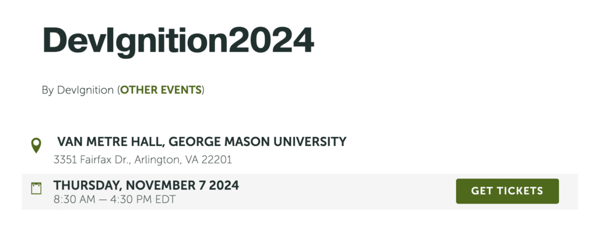
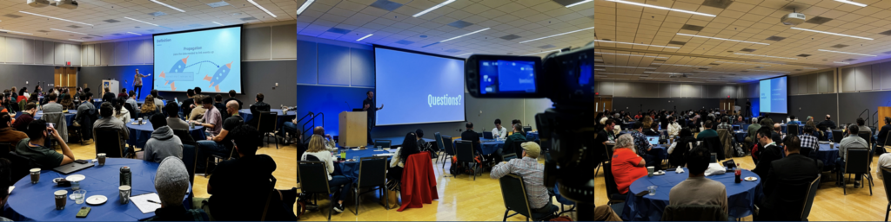

**[DevIgnition](https://devignition.com/) is a fun and informal community event run for and by the Washington DC software development community. One [November 7, a full day of interesting presentations](https://devignition.com/) will be featured from excellent speakers from around the world on a wide variety of technical topics.**

Come discover how the best minds use the latest technologies to build solutions. Network with other DC area software developers, and discuss the newest emerging trends and techniques.

The scope of talks focus on the interests of the Washington DC area's software developer community, including [really a lot of different topics](https://devignition.com/).

**This year DevIgnition is proud to partner with Foojay to include a track of talks by the Friends of OpenJDK, in addition to the normal schedule of diverse technical talks.**

Links:

* [Call for Papers](https://www.papercall.io/devignition2024) (closes September 27, 2024 14:00 UTC)
* [Tickets](https://devignition.ticketleap.com/devignition2024/)

 

 
