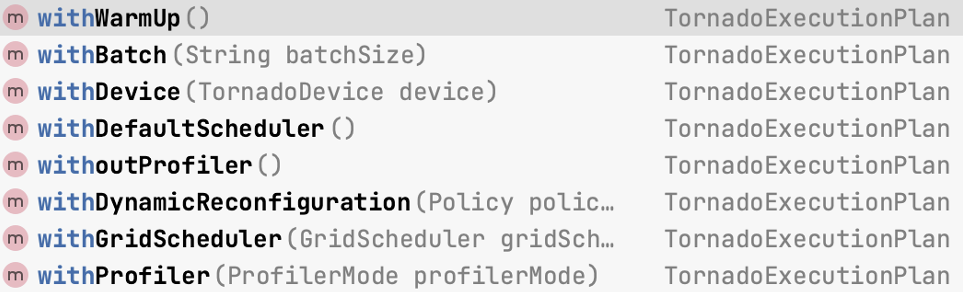
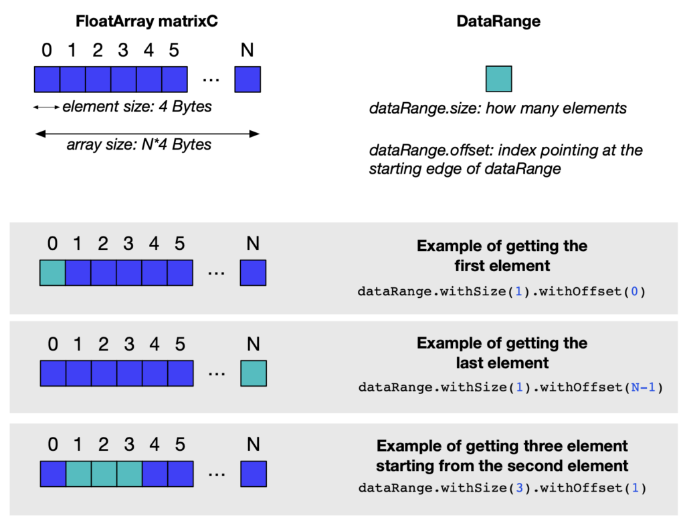

**The TornadoVM API is designed to aid Java programmers in adapting their code bases for hardware acceleration. As explained in a previous [++article++](https://foojay.io/today/migrating-applications-to-tornadovm-v0-15-part-1/), the TornadoVM API exposes two key Java objects for programmers, the [++TaskGraph++](https://github.com/beehive-lab/TornadoVM/blob/master/tornado-api/src/main/java/uk/ac/manchester/tornado/api/TaskGraph.java) and the [++TornadoExecutionPlan++](https://github.com/beehive-lab/TornadoVM/blob/master/tornado-api/src/main/java/uk/ac/manchester/tornado/api/TornadoExecutionPlan.java). The former is used to define which methods should be offloaded on an accelerator as well as how often the data will flow. The latter is used to configure how the execution will take place (e.g., with a warmup, with a specific grid, with a profiler, etc.) and contains a method that actually invokes the execution. More information about how to use those objects are provided [++here++](https://tornadovm.readthedocs.io/en/latest/programming.html#selecting-the-methods-to-be-accelerated-using-a-task-graph-api).**{#viewer-foo}

This article aims to present various patterns of defining the data transfers based on the diverse requirements of Java applications. For instance, some applications may need to transfer data to the accelerator every time that a computation is performed, while others may need to transfer them on demand. Additionally, some applications may need to process more data than the actual memory capacity of the accelerator.

Pattern 1. Data that fit into the GPU memory {#h2-0-pattern-1-data-that-fit-into-the-gpu-memory}
------------------------------------------------------------------------------------------------

The TornadoVM API exposes two methods to configure which data correspond to the input and the output of a TaskGraph. This is happening via the **transferToDevice** for the inputs and **transferToHost** for the outputs. Those methods accept an additional configuration which is the **DataTransferMode**.{#viewer-r55ph1440}

### a) Transferring input data in every execution {#viewer-2r8jb571}

If you configure your TaskGraph to accept inputs in every execution, it will copy the new values of your variables (e.g., matrixA and matrixB) every time the TaskGraph is executed (i.e., executionPlan.execute()).

```java
TaskGraph tg = new TaskGraph("s0")
      .transferToDevice(DataTransferMode.EVERY_EXECUTION, matrixA, matrixB)
      .task("t0", MxM::compute, context, matrixA, matrixB, matrixC, size)
      .transferToHost(DataTransferMode.EVERY_EXECUTION, matrixC);
```


### b) Transferring input data only in the first execution {#h3-2-b-transferring-input-data-only-in-the-first-execution}

If you configure your TaskGraph with the **DataTransferMode.FIRST_EXECUTION**, it will copy the input data only once during the first execution, indicating that they are read-only; so, your program will not modify the values of your variables (e.g., matrixA and matrixB) after the first execution (i.e., executionPlan.execute()).

```java
TaskGraph tg = new TaskGraph("s0")
      .transferToDevice(DataTransferMode.FIRST_EXECUTION, matrixA, matrixB)
      .task("t0", MxM::compute, context, matrixA, matrixB, matrixC, size)
      .transferToHost(DataTransferMode.EVERY_EXECUTION, matrixC);
```


### c) Transferring output data under demand {#h3-3-c-transferring-output-data-under-demand}

Regardless, the configuration of the input data (a, b), you must also define the transferring mode for the outputs of your TaskGraph. Two modes are available: i) the transferring of the outputs after every execution; when the executionPlan.execute() is completed; and ii) the transferring of the outputs under demand.

```java
TaskGraph tg = new TaskGraph("s0")
      .transferToDevice(DataTransferMode.FIRST_EXECUTION, matrixA, matrixB)
      .task("t0", MxM::compute, context, matrixA, matrixB, matrixC, size)
      .transferToHost(DataTransferMode.UNDER_DEMAND, matrixC);
```


The under demand mode can be used if your program does not require the result of the processing to be transferred from the accelerator's memory after every execution. In this case, the programmer can obtain the result on demand by utilizing the **TornadoExecutionResult** object. This object is returned after every invocation of the execute() method to hold the result of each execution:

```java
TornadoExecutionResult executionResult = executionPlan.execute();
executionResult.transferToHost(matrixC);
```


**Note:** The **executionPlan.execute()** is a blocking call that performs all the steps (see the screenshot from the Java editor) in the executionPlan as defined by the programmer.  

<figure class="aligncenter size-full is-resized">
 
</figure>

<br />

<br />

Pattern 2. Data do not fit into the GPU memory {#h2-4-pattern-2-data-do-not-fit-into-the-gpu-memory}
----------------------------------------------------------------------------------------------------

In this case, TornadoVM supports [++batch processing++](https://tornadovm.readthedocs.io/en/latest/programming.html#batch-computing-processing). This feature enables programmers that handle large data sizes (e.g. 20 GB) to configure the TornadoExecutionPlan in order to operate with the batch size (e.g. 512 MB), based on which all data will be split and streamed in the GPU memory to be processed. Note, the batch size should fit into the GPU memory.

The split and streaming is handled automatically by the TornadoVM runtime. Thus, the 20 GB of data will be split in chunks of 512 MB and will be sent for execution on the GPU.

```
ImmutableTaskGraph immutableTaskGraph = taskGraph.snapshot();
TornadoExecutionPlan plan = new TornadoExecutionPlan(immutableTaskGraph);
plan.withBatch("512MB") // Run in blocks of 512MB
```


<br />

<br />

Pattern 3. Transfer only a short range of the result from the GPU memory {#h2-5-pattern-3-transfer-only-a-short-range-of-the-result-from-the-gpu-memory}
--------------------------------------------------------------------------------------------------------------------------------------------------------

TornadoVM also supports the transferring of a small piece of the output data. This may be useful if your program operates on large arrays, and you are interested only at a partial segment of the output array. In this case, you can access a partial segment (e.g., just the first element of the array), as shown below (assuming that the data are defined to operate under demand, i.e., **DataTransferMode.UNDER_DEMAND**, as shown in Pattern 1-C).

```java
TornadoExecutionResult executionResult = executionPlan.execute();
DataRange dataRange = new DataRange(matrixC);
executionResult.transferToHost(dataRange.withSize(1).withOffset(0));
```


An example of this API call is shown in one of the TornadoVM unit-tests, [here](https://github.com/beehive-lab/TornadoVM/blob/faffab7ee2fc9c9f06ece7f7e5f075fc056f379a/tornado-unittests/src/main/java/uk/ac/manchester/tornado/unittests/api/TestAPI.java#L283). Several variations of the above code snippet are shown in the following image.  

<figure class="aligncenter size-large is-resized">
 
</figure>

<br />

<br />

Summary {#h2-6-summary}
-----------------------

This article aims to show how TornadoVM programmers can utilize the API functions for transferring data to the accelerator's (e.g., GPU) memory, and backwards, in the frequency of every execution, first execution or under demand.{#viewer-8gzhf10345}

Note that this blog shows the API functions as exist in the current version TornadoVM v1.0.7 (commit point: [++f1e670d++](https://github.com/beehive-lab/TornadoVM/commit/f1e670d58625f10ed0b18ad2e1b530c55aa1f2e9)).{#viewer-o3lz428286}

<br />

### Useful links {#h3-7-useful-links}

* TornadoVM [++documentation++](https://tornadovm.readthedocs.io/en/latest/introduction.html)
* DataRange [++examples++](https://github.com/beehive-lab/TornadoVM/blob/faffab7ee2fc9c9f06ece7f7e5f075fc056f379a/tornado-unittests/src/main/java/uk/ac/manchester/tornado/unittests/api/TestAPI.java#L283)
* Batch processing [++examples++](https://github.com/beehive-lab/TornadoVM/blob/master/tornado-unittests/src/main/java/uk/ac/manchester/tornado/unittests/batches/TestBatches.java)
