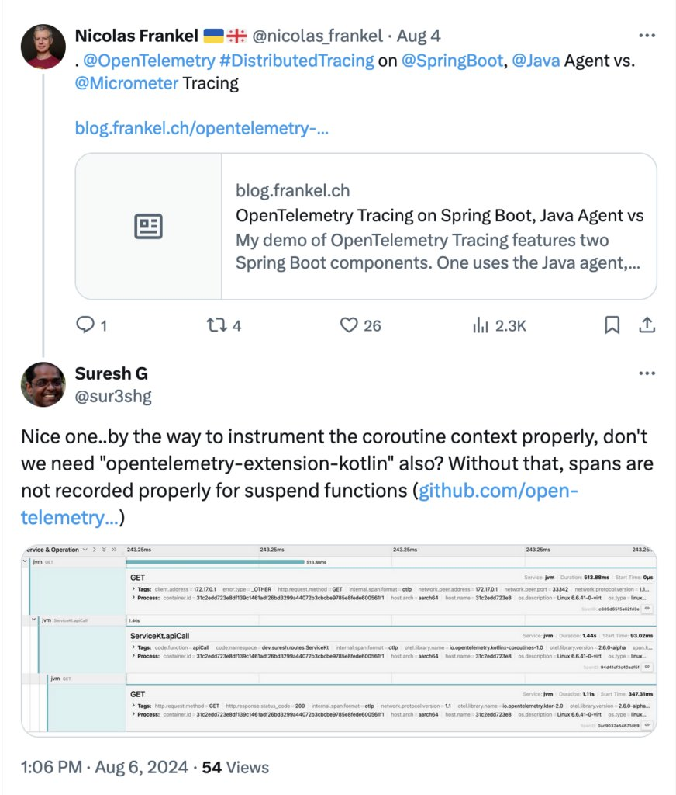
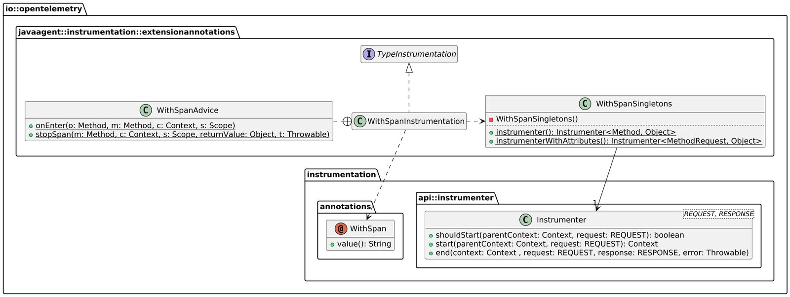
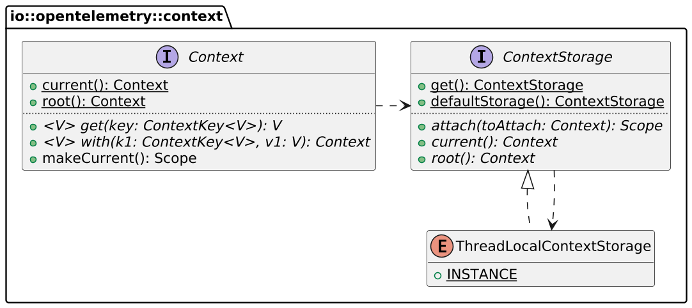
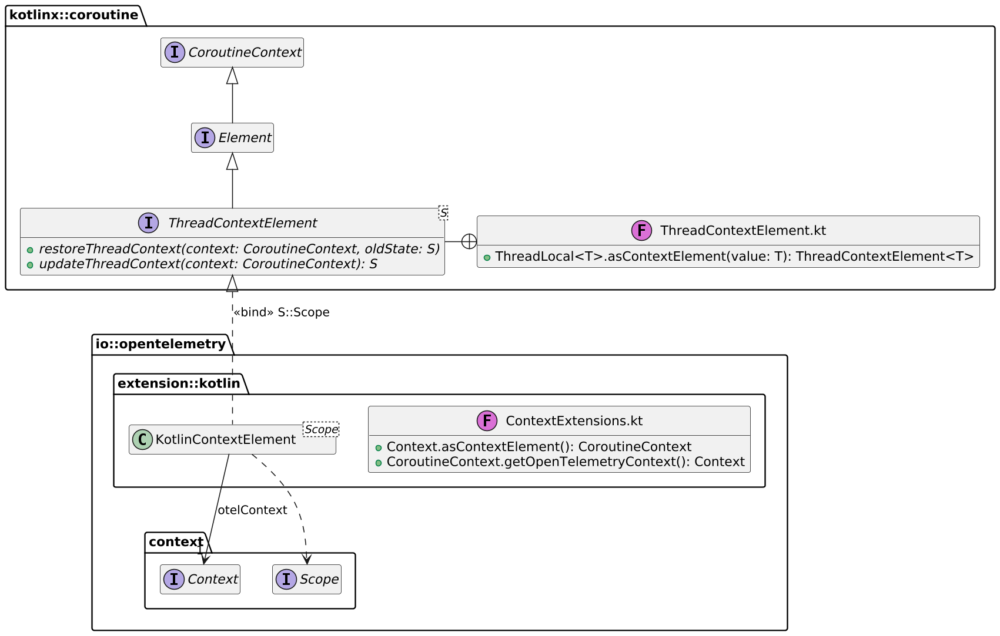
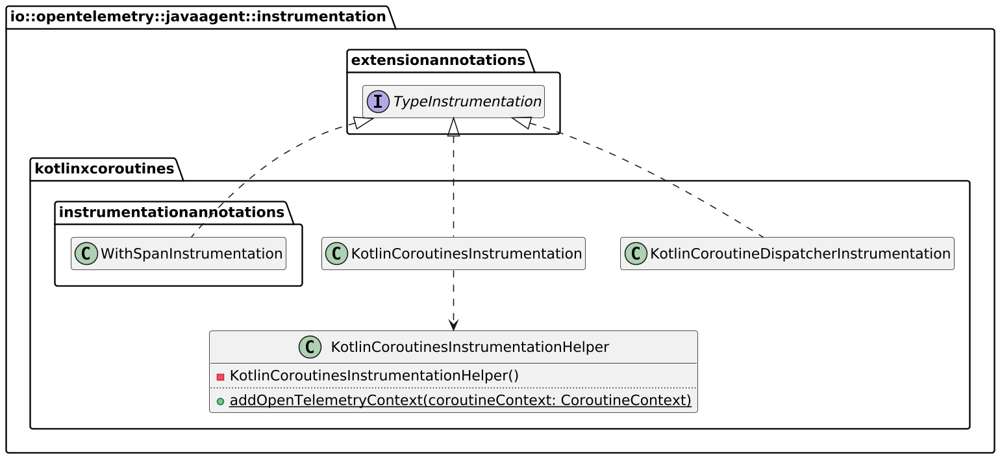

I recently [compared three OpenTelemetry approaches](https://blog.frankel.ch/opentelemetry-tracing-spring-boot/) on the JVM: Java Agent v1, v2, and Micrometer. I used Kotlin and coroutines without overthinking. I received interesting feedback on the usage of `@WithSpan` with coroutines:

[](https://x.com/sur3shg/status/1820808609682321783)

Indeed, the `@WithSpan` annotation works flawlessly in conjunction with coroutines [since some time already](https://github.com/open-telemetry/opentelemetry-java-instrumentation/issues/7124). However, it made me think about the underlying workings of OpenTelemetry. Here are my findings.

## The `@WithSpan` annotation processor

`@WithSpan` is a simple annotation. To be of any use, one needs an annotation processor. If you need a refresher on annotation processors, please check this not-so-new but still [relevant post](https://blog.frankel.ch/introductory-guide-annotation-processor/).

A quick search on the OpenTelemetry repository reveals that the processor involved is `WithSpanInstrumentation`.

Here's an abridged summary of the classes involved:



`WithSpanInstrumentation` does the annotation processing part; it delegates to `WithSpanSingleton`. In turn, the latter bridges calls to the `Instrumenter` class. `Instrumenter` contains the core of creating spans and interacting with the OpenTelemetry collector.

## `Instrumenter` and `Context`

> The `Instrumenter` encapsulates the entire logic for gathering telemetry, from collecting  
>
> the data, to starting and ending spans, to recording values using metrics instruments.
>
> An `Instrumenter` is called at the start and the end of a request/response lifecycle.  
>
> When instrumenting a library, there will generally be four steps.
>
> * Create an `Instrumenter` using `InstrumenterBuilder`. Use the builder to  
>   configure any library-specific customizations, and also expose useful knobs to your user.
> * Call `Instrumenter#shouldStart(Context, Object)` and do not proceed if it returns  
>   `false`.
> * Call `Instrumenter#start(Context, Object)` at the beginning of a request.
> * Call `Instrumenter#end(Context, Object, Object, Throwable)` at the end of a request.
>
> For more detailed information about using the `Instrumenter` see the [Using the Instrumenter API](https://github.com/open-telemetry/opentelemetry-java-instrumentation/blob/main/docs/contributing/using-instrumenter-api.md) page.
>
> -- [Instrumenter class](https://github.com/open-telemetry/opentelemetry-java-instrumentation/blob/main/instrumentation-api/src/main/java/io/opentelemetry/instrumentation/api/instrumenter/Instrumenter.java)

`Instrumenter` works in conjunction with `Context`. OpenTelemetry API users should be familiar with it, specifically the call to `Context.current()`. Let's describe it in more detail.



`Context` stores data in a `ContextStorage` instance, whose default is `ThreadLocal`. The `ThreadLocal` class has been the old-age way to pass data around without interfering with method signatures. It stores data in the current thread.

## Kotlin's OpenTelemetry extension

`ThreadLocal` works perfectly - until you spawn other threads. In this case, you must explicitly pass data around. So-called Reactive Programming frameworks, such as Spring WebFlux, do spawn other threads; most, if not all, provide utilities to handle the passing automatically.

Coroutines implement Reactive Programming. Not only do they spawn threads, but they also decouple coroutine from threads. A coroutine may "jump" across several threads in its lifetime. Thus, storing the OpenTelemetry context in a `ThreadLocal` doesn't work.

Yet, coroutines provide a dedicated storage mechanism, the [coroutine context](https://kotlinlang.org/docs/coroutine-context-and-dispatchers.html). We need a way to move the OpenTelemetry context from the `ThreadLocal` to the coroutine context and back again. The way exists in the `opentelemetry-extension-kotlin` jar:



The only part that needs to be added is where these functions are called. Unsurprisingly, the magic happens in the Java Agent and all other instrumentation classes. You might remember the `TypeInstrumentation` interface on the first diagram, which the class `WithSpanInstrumentation` implemented. The Java Agent caters to many different frameworks and libraries, *e.g.* , Spring WebFlux, and Kotlin Coroutines. Its developers designed it so each `TypeInstrumentation` concrete class focuses on the instrumentation of a specific aspect of the framework or library; coroutines are no exception.



Note that the code provides a more specific instrumentation of `WithSpanInstrumentation`, which is dedicated to coroutines.

It turns out the `KotlinCoroutinesInstrumentationHelper` contains the magic to copy the context from the `ThreadLocal` to the coroutine context:

```java
package io.opentelemetry.javaagent.instrumentation.kotlinxcoroutines;

import io.opentelemetry.context.Context;
import io.opentelemetry.extension.kotlin.ContextExtensionsKt;
import kotlin.coroutines.CoroutineContext;

public final class KotlinCoroutinesInstrumentationHelper {

  public static CoroutineContext addOpenTelemetryContext(CoroutineContext coroutineContext) {
    Context current = Context.current();                                                      //1
    Context inCoroutine = ContextExtensionsKt.getOpenTelemetryContext(coroutineContext);
    if (current == inCoroutine || inCoroutine != Context.root()) {
      return coroutineContext;
    }
    return coroutineContext.plus(ContextExtensionsKt.asContextElement(current));              //2
  }

  private KotlinCoroutinesInstrumentationHelper() {}
}
```

1. Get the OpenTelemetry context - from the `ThreadLocal`
2. Add the context to the coroutine context

And that's a wrap.

## Summary

In this post, I've analyzed the working of `@WithSpan` in general and in the context of Kotlin Coroutines. The Java Agent provides many different instrumenting classes, each dedicated to a unique facet of a framework or library. The `WithSpanInstrumentation` in the `io.opentelemetry.javaagent.instrumentation.extensionannotations` manages "regular" code; the one in `io.opentelemetry.javaagent.instrumentation.kotlinxcoroutines` manages coroutines.

The biggest challenge is that OpenTelemetry stores data in a `ThreadLocal` by default. The coroutine library doesn't guarantee the same thread will be used. On the contrary, a coroutine will likely bounce across different threads during its lifetime.

The Java Agent provides the mechanism to cope with it. One part focuses on moving OpenTelemetry data from the `ThreadLocal` to the coroutine context; the other provides a dedicated instrumentation to call the above code when it enters the latter.

**To go further:**

* [OpenTelemetry auto-instrumentation and instrumentation libraries for Java](https://github.com/open-telemetry/opentelemetry-java-instrumentation)
* [Coroutine context and dispatchers](https://kotlinlang.org/docs/coroutine-context-and-dispatchers.html)

*Originally published at [A Java Geek](https://blog.frankel.ch/kotlin-coroutines-otel-tracing/) on August 18th, 2024*
