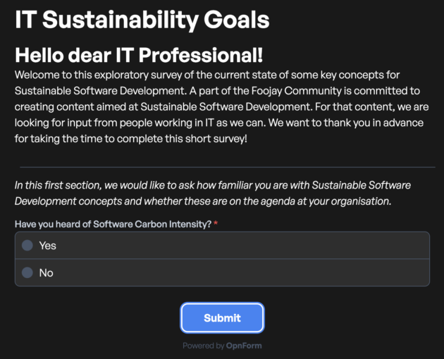

**The Foojay community has a strong tradition around the creation of content on all things Java and OpenJDK. Since about a year ago, the community has a group of people that are working on a book with tips and information on Sustainable Software Engineering. For some of the topics in the book, we are looking for data to either support claims that are made, or inform us on the best direction to write a topic.**

That is why in this post, I am going to ask for your help!

We have created a survey that aims to provide insight in how organizations, IT departments and teams are dealing with topics around green computing and sustainable software development.

Now we just need a lot of people filling out the survey and providing us with that data. E

ven you or your organization does not do anything, we still want to ask you to fill in the survey, because that is also a valid outcome.

**The survey is anonymous and it is in no way passing any judgment to anyone. You would be of immense help if you fill out the survey and share it with as many people as you can.**

 

[You can find the survey here.](https://opnform.com/forms/it-sustainability-goals-ewq3yc)
