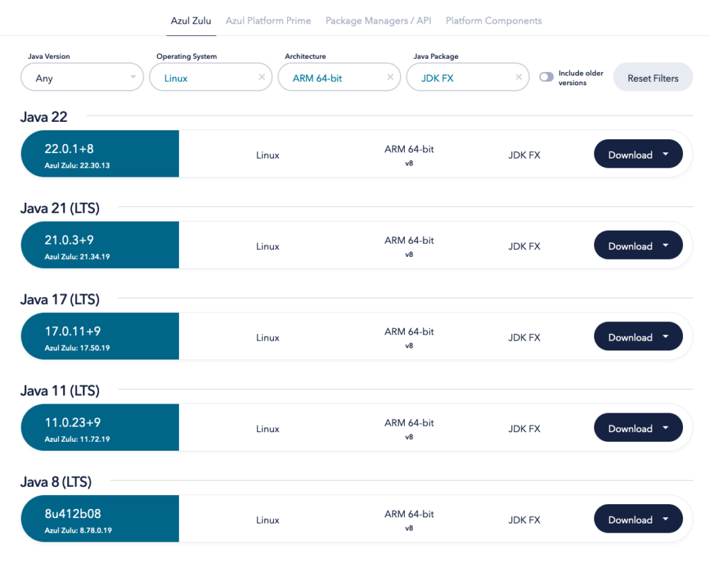

**Since the April release of Azul Zulu Builds of OpenJDK, packages with JavaFX support for ARM 64-bit systems have been available.**

As ARM processors are the "core" of most embedded systems, these runtimes provide the additional benefit of bringing user interface development into the Java space. Having your full code base, from server to end device, based on the same Java code and dependencies, brings many improvements in total cost, development approach, and test and deployment strategies.

The Raspberry Pi is a perfect board for testing Java and JavaFX on ARM, and that's exactly what we do in this article and which is demonstrated in this video:



Azul Zulu Builds with JavaFX {#RunningJavaFXonRaspberryPiwithAzulZulu-AzulZuluBuildswithJavaFX}
-----------------------------------------------------------------------------------------------

As [described in our documentation](https://docs.azul.com/core/install/debian), there are multiple ways to get the latest version of Zulu for your system. This post highlights two of these options.

### Downloading From Azul Downloads {#RunningJavaFXonRaspberryPiwithAzulZulu-DownloadingFromAzulDownloads}

You can check the [available builds on the Azul Downloads page](https://www.azul.com/downloads/?os=linux&architecture=arm-64-bit&package=jdk-fx#zulu). Thanks to the search filters, it's very easy to find the correct download for, for instance, a Linux ARM system:


### Using SDKMAN {#RunningJavaFXonRaspberryPiwithAzulZulu-UsingSDKMAN}

Another very convenient way to install Java and switch between different versions is the [SDKMAN](https://sdkman.io/) tool. For instance, when using it on a Raspberry Pi 5 with the 64-bit Raspberry Pi Operating System, `sdk list java` gives you a nice list of the available Zulu runtimes for the platform, of which several with JavaFX.

Installing one of these versions is a one-line command `sdk install java VERSION`. As you can see in the following output SDKMAN shows it has detected that it's running on a `Linux ARM 64bit` system, and it only shows the versions created for this platform:

```
$ sdk list java
================================================================================
Available Java Versions for Linux ARM 64bit
================================================================================
 Vendor        | Use | Version      | Dist    | Status     | Identifier
--------------------------------------------------------------------------------
...
 Zulu          |     | 22.0.2       | zulu    |            | 22.0.2-zulu
               |     | 22.0.1.crac  | zulu    |            | 22.0.1.crac-zulu
               |     | 22.0.1.fx    | zulu    | installed  | 22.0.1.fx-zulu
...
               |     | 21.0.3.fx    | zulu    |            | 21.0.3.fx-zulu
...
               | >>> | 17.0.11.fx   | zulu    | installed  | 17.0.11.fx-zulu
...
               |     | 11.0.23.fx   | zulu    |            | 11.0.23.fx-zulu
...
               |     | 8.0.412.fx   | zulu    |            | 8.0.412.fx-zulu
...

# Install Azul Zulu 22.0.1 with JavaFX:
$ sdk install java 22.0.1.fx-zulu

# Check the installed version:
$ java -version
openjdk version "22.0.1" 2024-04-16
OpenJDK Runtime Environment Zulu22.30+13-CA (build 22.0.1+8)
OpenJDK 64-Bit Server VM Zulu22.30+13-CA (build 22.0.1+8, mixed mode, sharing)

# If you already installed a version before and want to switch back to it, use:
$ sdk use java 22.0.1.fx-zulu
Using java version 22.0.1.fx-zulu in this shell.
```


JavaFX Demo Experiment {#RunningJavaFXonRaspberryPiwithAzulZulu-JavaFXExperiment}
---------------------------------------------------------------------------------

Let's try it out with a simple JavaFX application on this Raspberry Pi. You can find the complete code in [this GitHub Gist](https://gist.github.com/FDelporte/c69a02c57acc892b4c996a9779d4f830). It starts a user interface with labels to show the Java and JavaFX versions and a framerate counter. Additionally, one or more circles are added that bounce around on the screen and change direction when they hit a border of the application.

As you can see in the code, changing the value of `NUMBER_OF_BALLS` allows you to quickly test how much animation your system can handle before the framerate drops. All the code is included in one file, and the first three lines enable us to run it with [J'BANG!](https://www.jbang.dev/) to avoid the need to build a full Maven or Gradle project.

```java
///usr/bin/env jbang "$0" "$@" ; exit $?

//DEPS org.openjfx:javafx-controls:22.0.2
//DEPS org.openjfx:javafx-graphics:22.0.2:${os.detected.jfxname}

...

public class FxDemo extends Application {

    private static int NUMBER_OF_BALLS = 10_000;

    ...

    @Override
    public void start(Stage stage) {
        var javaVersion = System.getProperty("java.version");
        var javaVendor = System.getProperty("java.vendor");
        var javaVendorVersion = System.getProperty("java.vm.version");
        var javafxVersion = System.getProperty("javafx.version");

        VBox holder = new VBox();
        holder.setFillWidth(true);
        holder.setAlignment(Pos.TOP_CENTER);
        holder.setSpacing(5);
        holder.getChildren().addAll(
            new Label("Java: " + javaVersion + ", " 
               + javaVendor + ", " + javaVendorVersion),
            new Label("JavaFX: " + javafxVersion),
            getFramerateLabel(),
            getBouncingBallPane()
        );

        scene = new Scene(holder, 400, 700);
        stage.setTitle("JavaFX Demo");
        stage.setScene(scene);
        stage.show();
    }

    public static void main(String[] args) {
        launch();
    }

    ...
}
```


As we already used SDKMAN to install Java, we can also use it to install J'BANG! and check if it installed correctly by running these commands:

```
$ sdk install jbang
$ jbang --version
0.117.1
```


Get the code from GitHub and save it as FxDemo.java. You can now start the application without the need to compile any code, J'BANG! will handle this for us:

```
$ jbang FxDemo.java
[jbang] Building jar for FxDemo.java...

# If you are connected via SSH, add the display.
# Otherwise you get this error:
# "UnsupportedOperationException: Unable to open DISPLAY"
$ DISPLAY=:0 jbang FxDemo.java
```


Conclusion {#RunningJavaFXonRaspberryPiwithAzulZulu-Conclusion}
---------------------------------------------------------------

Once more, Azul brings Java to more platforms by adding JavaFX support for ARM 64-bit Linux systems.

Thanks to the many components built in JavaFX and the [libraries created by the community](https://www.jfx-central.com/libraries), JavaFX is the ideal solution for any use case where a modern and stable user interface is needed.

The Raspberry Pi is a perfect platform for experimenting with Java (and JavaFX) on ARM. It allows one to quickly prototype edge devices where a Java application connects sensors with cloud services or any other type of device where interaction with the user is needed.

Based on your requirements, there are many more embedded platforms available based on ARM, and they all bring the same profit that they can be fully integrated into your Java development.
