**Learn how you could create cloud-native Java apps that are portable, scalable, and reliable with the 12 factor app methodology and open source Java frameworks.**

Created in 2012, the 12-factor app methodology was designed to provide a set of guidelines for helping developers and organizations to design and build cloud-native applications. We'll explore how you can take advantage of each of these 12 factors to create applications, utilizing open source technologies, that thrive in the cloud.



## What is a 12-factor application and why should you care?

The 12-factor app is a methodology defined by the developers at Heroku for building cloud-native applications that (quoting from [12factor.net](http://12factor.net "12factor.net")):

* Use declarative formats for setup automation, which minimizes time and cost for new developers joining the project
* Have a clean contract with the underlying operating system, offering maximum portability between execution environments
* Are suitable for deployment on modern cloud platforms
* Minimize divergence between development and production, enabling continuous deployment for maximum agility
* Can scale up without significant changes to tooling, architecture, or development practices

The original 12 factors from this methodology are:

1. **[Codebase](#Codebase)** -- One codebase tracked in revision control, many deploys
2. **[Dependencies](#Dependencies)** -- Explicitly declare and isolate dependencies
3. **[Configuration](#Configuration)** -- Store configuration in the environment
4. **[Backing services](#BackingServices)** -- Treat backing services as attached resources
5. **[Build, release, run](#BuildReleaseRun)** -- Strictly separate build and run stages
6. **[Processes](#Processes)** -- Execute the app as one or more stateless processes
7. **[Port binding](#PortBinding)** -- Export services via port binding
8. **[Concurrency](#Concurrency)** -- Scale-out via the process model
9. **[Disposability](#Disposability)** -- Maximize robustness with fast start-up and graceful shutdown
10. **[Dev/prod parity](#DevProdParity)** -- Keep development, staging, and production as similar as possible
11. **[Logs](#Logs)** -- Treat logs as event streams
12. **[Admin processes](#Admin)** -- Run admin/management tasks as one-off processes

## A practical application of these 12 factors

Rather than just talk about the 12 factors as abstract concepts, we have developed a demo application to use as a reference. This application makes use of many open source technologies, including [Open Liberty](https://openliberty.io/ "Open Liberty"), [Quarkus](https://quarkus.io/ "Quarkus"), [MicroProfile](https://microprofile.io/ "MicroProfile"), [Vert.x](https://vertx.io/ "Vert.x"), [Kubernetes](https://kubernetes.io/ "Kubernetes"), and [Maven](https://maven.apache.org/ "Maven")).

This application comprises two microservices: [Service-A](https://github.com/Emily-Jiang/12factor-app-a "Service-A") running on Open Liberty and [Service-B](https://github.com/Emily-Jiang/12factor-app-b "Service-B") running on Quarkus.

If you want to see this application being created, check out the live demo Emily does at the Devoxx UK conference in the video within our [Open Liberty blog](https://openliberty.io/blog/2019/09/05/12-factor-microprofile-kubernetes.html "Open Liberty blog").

Alternatively, throughout this article there are links to many of the Open Liberty interactive guides you can try yourself to help you learn (in a practical way), how to use the tools and technologies detailed below that enable each factor within this methodology. If you are unfamiliar with Open Liberty and it's many benefits, check out our articles detailing [why cloud-native Java developers love Liberty](https://developer.ibm.com/articles/why-cloud-native-java-developers-love-liberty/ "why cloud-native Java developers love Liberty") and [why WebSphere and Open Liberty are ideal for cloud-native Java applications](https://developer.ibm.com/articles/6-reasons-why-open-liberty-is-an-ideal-choice-for-developing-and-deploying-microservices/ "why WebSphere and Open Liberty are ideal for cloud-native Java applications").

{#Codebase}

## Factor 1 -- Codebase

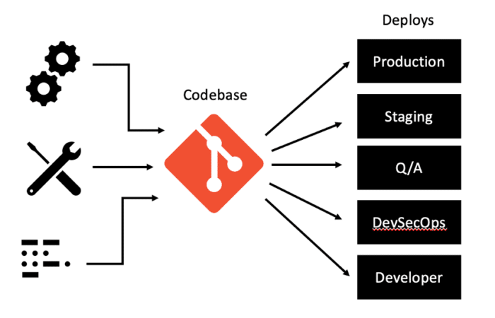

Cloud-native applications must always consist of a single codebase that is tracked in a version-control system. A *codebase* is a source-code repository or a set of repositories that share a common root and is used to produce any number of immutable releases. There should be a 1:1 relationship between an application and a codebase, but a one-to-many relationship between the codebase and deployments of an application. This single codebase helps to support collaboration between development teams and helps to enable proper versioning of applications.

This codebase could be a Git repository (including GitHub, GitHub Enterprise, GitLab, etc). Our demo application is stored in a Git repository hosted on GitHub. Git is a revision control tool to allow more than one person to develop a project at once and ensure that all the code is safe. Alternatively, you could make use of other tools like BitBucket, SourceForge, cloud specific source repositories, etc.

{#Dependencies}

## Factor 2 -- Dependencies

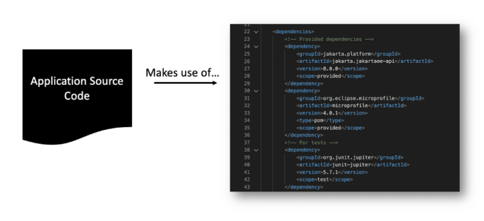

Most applications require the use of external *dependencies* -- for example, in our sample application, we have dependencies on certain Liberty features, more specifically servlet-3.1, jsonp-1.0, and jaxrs-2.0. These dependencies must be pulled down during the build process, as it cannot be guaranteed that the specific dependencies your application relies on already exist in the system/runtime. A cloud-native application can never rely on the implicit existence of system-wide packages. This is what this factor focuses on -- encouraging the explicit declaration and isolation of application dependencies. This helps to provide consistency between development and production environments, simplifies the setup for developers new to the application, and supports portability between cloud platforms.

The first step to achieving this factor is to identify, declare, and isolate any external dependencies within your application. Most contemporary programming languages have tools or facilities for managing these dependencies. In Java, two of the most popular tools for dependency management are Maven and Gradle. These tools help simplify the complexity that is inherent to dependency management, thereby enabling developers to declare their dependencies and then let the tool be responsible for actually ensuring that those dependencies are satisfied. So, instead of packaging the third-party libraries inside your microservice, you can specify all dependencies in a Maven `pom.xml` file or a Gradle `settings.gradle` file. This enables you to freely move up to newer versions and allows responsibility for ensuring the dependencies are satisfied to be given to the build tool rather than the developer.

In our demo application, we utilize Maven, but you can use either Maven or Gradle with Open Liberty applications. When using Maven, you must declare the dependencies in a build file (`pom.xml` for Maven) and the required packages are downloaded from the Maven Central Repository at build time to compile the code. The packaging step uses the Maven or Gradle Liberty plug-ins to pull down a Liberty runtime from the repository and produce a packaged Liberty server containing the server configuration and a `WAR` file with the compiled application code. As a result, the application does not have any dependencies that it assumes will already exist on the system.

**Try these out:**

* [Building a web application with Maven](https://openliberty.io/guides/maven-intro.html "Building a web application with Maven")
* [Building a web application with Gradle](https://openliberty.io/guides/gradle-intro.html "Building a web application with Gradle")
* [Injecting dependencies into microservices](https://openliberty.io/guides/cdi-intro.html "Injecting dependencies into microservices")

{#Configuration}

## Factor 3 -- Configuration

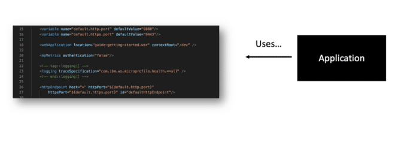

*Configuration* refers to any value that can vary across deployments (e.g., developer workstation, QA, and production). This could include:

* URLs and other information about backing services, such as web services, and SMTP servers
* Information necessary to locate and connect to databases
* Credentials to third-party services such as Amazon AWS or APIs like Google Maps, X (formally known as Twitter), and Facebook
* Information that might normally be bundled in properties files or configuration XML, or YML

It is important that configuration and credentials are separated from the application code. Credentials are highly sensitive pieces of information and should never be shipped within application code as it runs the risk of exposing your application's backing services, internal URLs, the resources and services your application relies on, etc. Externalizing configuration is also important as it enables us to deploy our applications to multiple environments regardless of which cloud runtime we're using. In other words, the application shouldn't care what environment it is running in, and we shouldn't need to change the app to run it in a different environment. Storing these configuration values in environment variables is considered best practice for externalizing this configuration. This approach helps to simplify application deployment to multiple environments, reduces the risk of leaking credentials and passwords, and enables more effective release management.

Utilizing tools like MicroProfile Config can help you to externalize your configuration by placing configuration in properties files that can be easily updated without recompiling your microservices. This ensures that our configuration is stored in the environment and accessed at runtime rather than ingrained in the code itself. It also enables the ability to dynamically change configuration values easily. In our demo application, we make use of MicroProfile Config and store our configuration in properties files like our `microprofile-config.properties` file, externalized outside of the application code.

**Try these out:**

* [Configuring microservices](https://openliberty.io/guides/microprofile-config.html "Configuring microservices")
* [Separating configuration from code in microservices](https://openliberty.io/guides/microprofile-config-intro.html "Separating configuration from code in microservices")
* [Configuring microservices running in Kubernetes](https://openliberty.io/guides/kubernetes-microprofile-config.html "Configuring microservices running in Kubernetes")

{#BackingServices}

## Factor 4 -- Backing services

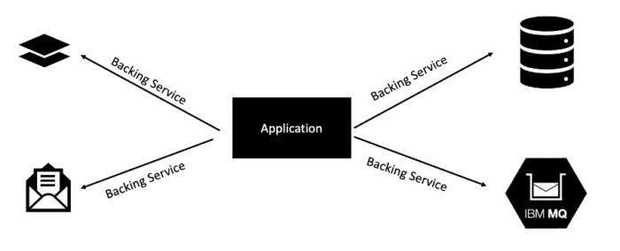

A *backing service* is any service on which your application relies for its functionality. Some of the most common types of backing services include data stores, messaging systems, caching systems, and any number of other types of service, including services that perform line-of-business functionality or security.

This factor focuses on treating these backing services as bound resources. A *bound resource* is just a means of connecting your application to a backing service. A resource binding for a database might include a username, a password, and a URL that allows your application to consume that resource. An application should declare its need for a given backing service but allow the cloud environment to perform the actual resource binding. The binding of an application to its backing services should be done via external configuration. It should be possible to attach and detach backing services from an application at will, without re-deploying the application. There should never be a line of code in your application that tightly couples the application to a specific backing service.

Embracing backing services as bound resources enables cloud-native applications to have greater flexibility and resilience, enabling loose-coupling between services and deployment (e.g., an administrator who notices that the database is failing can bring up a fresh instance of that database and then change the binding of their application to point to this new database).

**Try these out:**

* [Caching HTTP session data using JCache and Hazelcast](https://openliberty.io/guides/sessions.html "Caching HTTP session data using JCache and Hazelcast")
* [Persisting data with MongoDB](https://openliberty.io/guides/mongodb-intro.html "Persisting data with MongoDB")
* [Accessing and persisting data in microservices using Java Persistence API (JPA)](https://openliberty.io/guides/jpa-intro.html "Accessing and persisting data in microservices using Java Persistence API (JPA)")

{#BuildReleaseRun}

## Factor 5 -- Build, release, and run

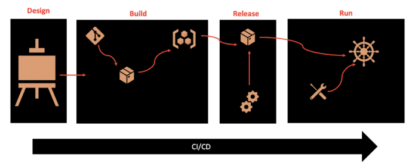

This factor focuses on getting a clearly defined process with no cycles and calls for strict separation of each of these deployment stages. Essentially, a single codebase is taken through the build process to produce a compiled artifact, which is then merged with configuration information that is external to the application to produce an immutable release, which is then delivered to a cloud environment (development, QA, production, etc) and run. The key takeaway is that each of the deployment stages is isolated and occurs separately.

The *build* stage focuses on building everything needed for our application; there should be no additional build steps when packaging a build with configuration to form a release artifact nor when running the application. It is within this stage that the dependencies declared during the design phase are gathered and bundled into the build artifact (e.g. a WAR or JAR file). The output of a build is a packaged server containing all of the environment-agnostic configuration required to run the application. This is especially important for cloud-native applications that need to be able to be deployed to multiple different environments.

The *release* stage focuses on combining the output of the build stage with configuration values (both environmental and app-specific) to produce another a release. By labeling these releases with unique IDs, it enables greater capacity for rolling back to previous versions if anything goes from and historical auditing.

The *run* stage, which occurs on the cloud provider, usually uses tooling like containers and processes to launch the application. Once that operation is running, the cloud runtime is responsible for its maintenance, health, and dynamic scaling.

{#Processes}

## Factor 6 -- Processes

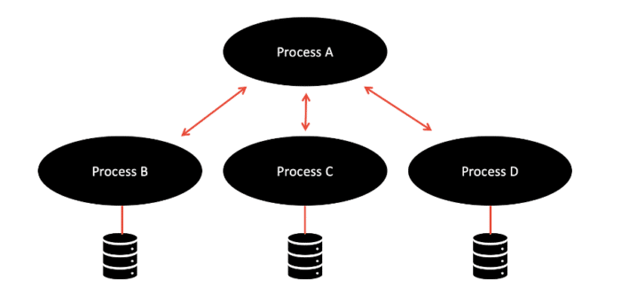

The *processes* factor enforces the notion that applications should execute as a single, stateless process. In other words, all long-lasting states should be external to the application, provided by backing services. State should not be maintained within your application. This is a useful factor as it means that if one instance of your application goes down, you don't lose the current state. It also simplifies workload balancing as your application doesn't have an affinity to any particular instance of a service.

REST is a widely adopted transport protocol, and JAX-RS can be used to achieve a RESTful architecture. Systems that utilize the REST paradigm are stateless. In this way, underlying infrastructure can destroy or create new microservices without losing any information. Jakarta RESTful Web Services and MicroProfile Rest Client are [useful APIs for writing and consuming RESTful services](https://openliberty.io/blog/2019/01/24/async-rest-jaxrs-microprofile.html "useful APIs for writing and consuming RESTful services"). Our demo application does not store state within the microservices themselves. Instead, it makes use of the REST protocol and utilizes the Jakarta REST and MicroProfile Rest Client to do this.

**Try these out:**

* [Creating a RESTful web service](https://openliberty.io/guides/rest-intro.html "Creating a RESTful web service")
* [Consuming RESTful services with template interfaces](https://openliberty.io/guides/microprofile-rest-client.html "Consuming RESTful services with template interfaces")

{#PortBinding}

## Factor 7 -- Port binding

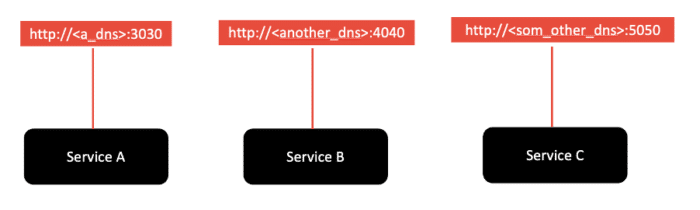

The *port-binding* factor states that cloud-native applications should export services using port binding. In other words, the host and port used to access the service should be provided by the environment, not baked into the application, so that you aren't relying on pre-existing or separately configured services for that endpoint. Your cloud provider should be managing the port assignment for you because it is likely also managing routing, scaling, high availability, and fault tolerance, all of which require the cloud provider to manage certain aspects of the network, including routing host names to ports and mapping. Web applications, especially those already running within an enterprise, are often executed within some kind of server container -- Open Liberty, Liberty, WebSphere, etc. In a non-cloud environment, web applications are deployed to these containers, and the container is then responsible for assigning ports for applications when they start up.

When deploying them in the cloud, the ports need to have the ability to be able to change, so it is important to have a way to rebind the port. MicroProfile Config can be a useful tool to help with this. You can specify the new port in a Kubernetes ConfigMap, and MicroProfile Config automatically picks up the value to give the correct information to the deployed microservices. MicroProfile Rest Client is another useful tool. It helps create client code to connect from one microservice to another. Our demo application makes use of both MicroProfile Config and MicroProfile Rest Client.

The [Open Liberty Operator](https://openliberty.io/docs/latest/open-liberty-operator.html "Open Liberty Operator") can also be another useful tool for facilitating the behaviours encouraged by this factor by enabling automated service binding. The operator automates updates of binding information among applications, meaning that it connects applications and maintains information about whether a particular application produces or consumes a service. With this information, the operator automatically handles Kubernetes-level details, including creating and injecting Kubernetes Secrets, so that your applications can connect to required services without interruption.

**Try this out:**

* [Deploying a microservice to Kubernetes using Open Liberty Operator](https://openliberty.io/guides/openliberty-operator-intro.html "Deploying a microservice to Kubernetes using Open Liberty Operator")

{#Concurrency}

## Factor 8 -- Concurrency

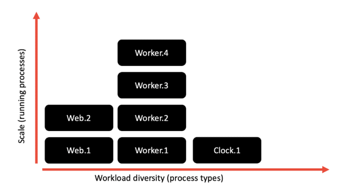

The *concurrency* factor stresses that microservices should be able to be scaled up or down, elastically, depending on their workload. Previously, when many applications were designed as monoliths and were run locally, this scaling was achieved through vertical scaling (i.e., adding CPUs, RAM, and other resources, virtual or physical). However, now that our applications are more fine-grained and running in the cloud, a more modern approach, one ideal for the kind of elastic scalability that the cloud supports, is to scale out, or horizontally. Rather than making a single big process even larger, you create multiple processes, and distribute the load of your application among those processes.

The Kubernetes auto-scaler tool can help with this. The Horizontal Pod Autoscaler automatically scales the number of pods in a replication controller, deployment, replica set, or stateful set based on observed CPU utilization (or, with custom metrics support, on some other application-provided metrics). It is implemented as a Kubernetes API resource and a controller. The resource determines the behavior of the controller. The controller periodically adjusts the number of replicas in a replication controller or deployment to match the observed average CPU utilization to the target specified by user.

Another useful tool, especially when deploying to OpenShift is the Open Liberty Operator. You can configure horizontal auto-scaling to create and delete instances of your application based on resource consumption. This ability to run multiple instances of your application and auto-scale them means that your application is made highly available.

**Try these out:**

* [Deploying microservices to Kubernetes](https://openliberty.io/guides/kubernetes-intro.html "Deploying microservices to Kubernetes")
* [Deploying microservices to OpenShift by using Kubernetes Operators](https://openliberty.io/guides/cloud-openshift-operator.html "Deploying microservices to OpenShift by using Kubernetes Operators")

{#Disposability}

## Factor 9 -- Disposability

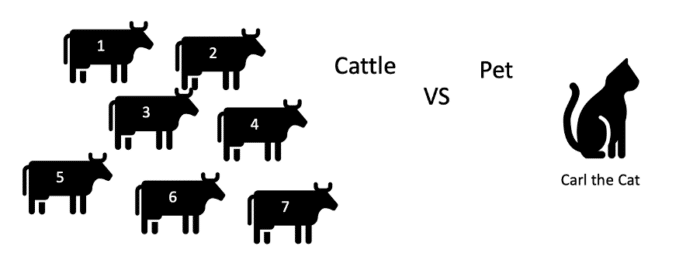

On a cloud instance, an application's life is as transient as the infrastructure that supports it. A cloud-native application's processes must be *disposable*, which means they can be started or stopped rapidly. An application cannot scale, deploy, release, or recover rapidly if it cannot start rapidly and shut down gracefully. This is especially important in cloud-native applications because, if you are bringing up an application, and it takes minutes to get into a steady state, in today's world of high traffic, that could mean hundreds or thousands of requests get denied while the application is starting. Additionally, depending on the platform on which your application is deployed, such a slow start-up time might trigger alerts or warnings as the application fails its health check. Extremely slow start-up times can even prevent your app from starting at all in the cloud. If your application is under increasing load, and you need to rapidly bring up more instances to handle that load, any delay during start-up can hinder its ability to handle that load. If the app does not shut down quickly and gracefully, that can also impede the ability to bring it back up again after failure. The inability to shut down quickly enough can also run the risk of failing to dispose of resources, which could corrupt data.

One way of looking at this is the cattle vs. pet model. Our application instances should be treated more as cattle (i.e., no emotional attachment to them, fairly easy to replace, numbered not named, etc.), rather than pets (i.e., there is an emotional attachment, nurse back to health rather than replace, etc.).

A great feature of Open Liberty is its rapid server start-up and shutdown times which helps to support the purpose of this factor. To learn more about this, check out our [Faster startup time for Open Liberty](https://openliberty.io/blog/2019/10/30/faster-startup-open-liberty.html "Faster startup time for Open Liberty") and [Liberty InstantOn: Serverless for Java, without compromise](https://developer.ibm.com/blogs/liberty-instanton-serverless-for-java-without-compromise/ "Liberty InstantOn: Serverless for Java, without compromise") blogs. You can also use this in collaboration with fast, open-source JVMs like OpenJ9. For more on this, see our [IBM Semeru Runtimes blog](https://developer.ibm.com/blogs/introducing-the-ibm-semeru-runtimes/ "IBM Semeru Runtimes blog") which makes use of OpenJ9 or check out this [Eclipse blog](https://www.eclipse.org/openj9/performance/ "Eclipse blog") detailing the performance benefits you could gain from OpenJ9. You can also see the performance benefits of Open Liberty in the blog, [How does Open Liberty's performance compare to other cloud-native Java runtimes](https://openliberty.io/blog/2022/10/17/memory-footprint-throughput-update.html "How does Open Liberty’s performance compare to other cloud-native Java runtimes").

Our demo application makes use of Open Liberty's fast start-up and shutdown times and in addition to this, it does not perform extra configuration steps during start-up and does not require any clean-up operations to be performed during shutdown to further enhance these. As a result, we have an application that starts quickly and can be easily restarted if something goes wrong.

Additionally, implementing fault-tolerant behaviors can enable this disposable behavior, helping to implement graceful shutdowns of any failing or unhealthy microservices. MicroProfile Fault Tolerance can help with this.

**Try these out:**

* [Adding health reports to microservices](https://openliberty.io/guides/microprofile-health.html "Adding health reports to microservices")
* [Checking the health of microservices on Kubernetes](https://openliberty.io/guides/kubernetes-microprofile-health.html "Checking the health of microservices on Kubernetes")
* [Building fault-tolerant microservices with the @Fallback annotation](https://openliberty.io/guides/microprofile-fallback.html "Building fault-tolerant microservices with the @Fallback annotation")
* [Failing fast and recovering from errors](https://openliberty.io/guides/retry-timeout.html "Failing fast and recovering from errors")

{#DevProdParity}

## Factor 10 -- Dev/Prod parity

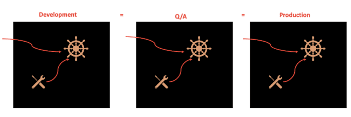

The *dev/prod parity* factor focuses on the importance of keeping development, staging, and production environments as similar as possible. This is important so that you can ensure that all potential bugs/failures can be identified in development and testing instead of when the application is put into production. This helps to eliminate the stereotypical development statement, "It runs on my laptop." With many applications now running in the cloud, interacting with many other services in a large ecosystem of services, it is important that we replicate this environment when developing and testing our applications.

Tools like Docker can help enable this dev/test/prod parity. The benefit of a container is that it provides an absolutely uniform environment for running code. This environment is trivial to "throw away" and recreate. The ease of locking down every detail of the environment is an important factor for this goal of eliminating the differences between the development, testing, and prod environments. Containers enable the creation and use of the same image in development, staging, and production. It also helps to ensure that the same backing services are used in every environment. Utilizing this concept of containerization, testing tools like [TestContainers](https://testcontainers.com/ "TestContainers") enable us to ensure that the testing environment is as close to production as possible, too.

Taking this one step further, in many cloud platforms there is the opportunity to develop, test, and run applications directly on/within the cloud environment -- for example, the Red Hat OpenShift Do (ODO) tool. Check out [Develop cloud-native Java applications directly in OpenShift with Open Liberty and ODO](https://openliberty.io/blog/2021/01/20/open-liberty-devfile-stack.html "Develop cloud-native Java applications directly in OpenShift with Open Liberty and ODO") to see how you could utilize Open Liberty and the ODO tool to develop directly in the cloud.

In our demo application, we are making use of container technologies like Docker and Kubernetes to ensure that our environments are as similar as possible.

**Try these out:**

* [Building true-to-production integration tests with Testcontainers](https://openliberty.io/guides/testcontainers.html "Building true-to-production integration tests with Testcontainers")
* [Using Docker containers to develop microservices](https://openliberty.io/guides/docker.html "Using Docker containers to develop microservices")

{#Logs}

## Factor 11 -- Logs

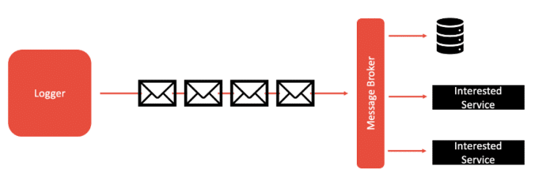

The *logs* factor highlights the importance of ensuring that your application doesn't concern itself with routing, storage, or analysis of its output stream (i.e., logs). In cloud-native applications, the aggregation, processing, and storage of these logs is the responsibility of the cloud provider or other tool suites (e.g., ELK stack, Splunk, Sumologic, etc.) running alongside the cloud platform being used. This is especially important in cloud-native applications due to the elastic scaling capabilities they have -- for example, when your application dynamically changes from 1 to over 100 instances, it can be hard to know where those instances are running and keep track of and organize all of the logs. By simplifying your application's part in this log aggregation and analysis, an application's codebase can be simplified and focus more on business logic. This factor helps to improve flexibility for introspecting behavior over time and enables real-time metrics to be collected and analyzed effectively over time.

In order to enact this factor, logs should be treated as event streams: You should stream out logs in real time so that killing an instance does not cause logs to go missing. All of the log entries should be logged to `stdout` and `stderr` only.

Open Liberty has a unified logging component that handles messages that are written by applications and the runtime and provides First Failure Data Capture (FFDC) capability. Logging data that is written by applications by using the `System.out`, `System.err`, or `java.util.logging.Logger` streams is combined into the server logs.

**Try these out:**

* [Providing metrics from a microservice](https://openliberty.io/guides/microprofile-metrics.html "Providing metrics from a microservice")
* [Enabling distributed tracing in microservices with OpenTelemetry and Jaeger](https://openliberty.io/guides/microprofile-telemetry-jaeger.html "Enabling distributed tracing in microservices with OpenTelemetry and Jaeger")

{#Admin}

## Factor 12 -- Administrative processes

This factor discourages putting one-off admin or management tasks inside your microservices. Examples given on [12factor.net](https://12factor.net/ "12factor.net") include migrating databases and running one-time scripts to do clean-up. Instead, these should be run as one-off process and they can be run as Kubernetes tasks. In this way, your microservices can focus on business logic. It also enables safe debugging and admin of production applications and enables greater resiliency for cloud-native applications.

## Summary and next steps

We hope this article has helped you to put these cloud native factors into context, understand how they apply to real-life applications, and understand what tools are available to help you when you are developing your application.

If you'd like to take this learning further, take a look at our article: [Beyond the 12 factors: 15-factor cloud-native Java applications](https://developer.ibm.com/articles/15-factor-applications/ "Beyond the 12 factors: 15-factor cloud-native Java applications").
