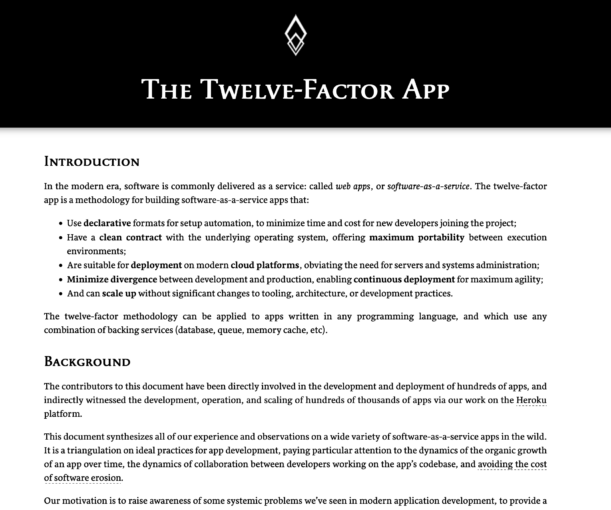

**The 12 factor application methodology is being updated and we need your help with it! Be a part of this project helping to update and modernize the original methodology to enable it to be even more effective for modern cloud-native applications.**

## What is the 12 factor app methdology?

Originally created back in 2012, the [12-factor app methodology](https://12factor.net/ "12-factor app methodology") was designed to provide a set of guidelines for helping developers and organizations to design and build cloud-native applications. This methodology was defined by the developers at Heroku, but has been adopted and even in some cases extended by the community since then.

If you'd like to learn more about the 12 factors and how to achieve them using OSS tools and technologies for Java applications, check out this FooJay article:  
<https://foojay.io/today/creating-cloud-native-java-applications-with-the-12-factor-app-methodology/>

## Why update them?

Although these factors have been a fantastic resource and guide for developers looking to create effective cloud-native applications (in many diferent langauges and platforms), the cloud-native landscape and our application requirements have changed significantly over the last decade. So, to ensure this methodology remains a useful, effective tool/guide to use, we need to ensure it is best suited to the needs, requirements and expectations of modern cloud-native development.

So, it's time to modernize Twelve-Factor for the next decade of technological advancements, and we want this to be a community effort!

While the folks at Heroku originally wrote Twelve-Factor on their own, it's now time that we define and implement these principles with the community, together — taking lessons that we've all learned from building and operating modern apps and systems and sharing them. There's already a small group of communtity members helping to drive this work forward, including myself, but we're looking for more ideas and more keen individuals who are interested in helping update this methdology.

**So, let's do this together, if you're interested in getting involved, you can either email to join our Google group ([twelve-factor@googlegroups.com](mailto:twelve-factor@googlegroups.com)) or tell us about your ideas and perspectives through a blog and tag #12factor (X / LinkedIn) or @heroku when you publish it. We'd love to hear your ideas!**

## Find out more:

If you'd like to find out more about this, check out the announcement blog posted by Heroku here:  
<https://blog.heroku.com/updating-twelve-factor-call-for-participation>
