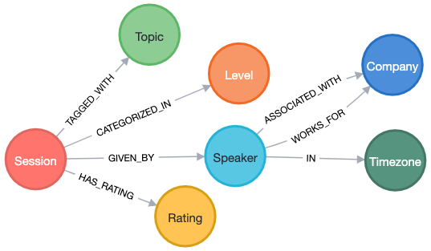

**Putting together a conference schedule for NODES 2024 (one of my favorite events of the year) is a massive undertaking, but my colleague and I used technologies and tools at our disposal to make this process a little more efficient and greatly reduce opportunities for mistakes.**

Every year, Neo4j hosts the virtual event NODES 2024 - a free, technical event spanning global timezones and a variety of graph-related topics. This is one of my favorite events of the year, but it doesn't happen without countless hours of planning and work to make it valuable to the graph community.

This year, my colleague and I were put in charge of organizing the schedule, determining how sessions are lined up between the start and end time of the event. If you have undertaken this task before, you know that it is a gargantuan effort with high risks for errors on timezone calculations.

While any tool won't completely make the pain go away, my colleague and I used technologies and tools at our disposal to make this process a little more efficient and greatly reduce opportunities for mistakes.

Let's dive in!

## Platform + Data

A very common platform for managing events is called [Sessionize](https://sessionize.com/). Sessionize has a lot of really nice features, and the platform feels intuitive to use. Events are a complex beast, with each person/company/event probably having their own custom approach or features to handle certain things. Pair this with individual events vying for audience appeal, and you end up with unique challenges all over.

The NODES 2024 event is a completely virtual and free conference, focusing on live technical content for every timezone on Earth. We see around 200 sessions submitted that span 3 global regions (Asia/Pacific, Europe, and Americas) and 4 tech category tracks (applications, AI, data science, and all things graph).

Sessionize houses data for sessions (topics to present), speakers (bio, social links, timezone), and evaluation results (scoring how well a submitted session fits for that event). As organizers, we can view each of these aspects and start assembling them into an event schedule, right?

## The Problem

*Right??* Not quite...​

Sessionize has each of those data views and also includes several data export options and a nice drag-and-drop scheduler tool. While we can see each of the views outlined above with its related data, it doesn't seem like we can put all the data together in a single view.

This may not be as much of a problem for events confined to a specific focus criteria, but for a global event with requirements for diverse technical topic lengths and speakers that spans nearly 24 hours of continuous content, this becomes a challenge.

We have 15-minute talks and 30-minute sessions, so we don't know how many of each we actually need to fill roughly 5 hours of content for each of the 4 tracks times 3 regions. We also strive for a diverse set of topics and distribution across introduction, intermediate, advanced technical levels. Creating good schedule flow from start to finish without overwhelming or boring attendees feels intimidating.

As a developer and data lover, I automatically turn to databases. They store and manage all kinds of structures, filtering, number crunching, and more every day. Why should conference scheduling be the exception?

## (Graph) Database to the Rescue

While many databases could probably solve this problem, there are a couple of reasons for choosing a graph in this scenario.

1. Combining data. We already have the issue of siloed data in Sessionize, so we want something that can pull it together into connected information. Graphs do that by storing the relationships with the entities.
2. Flexible schema. Many graph databases don't require a schema definition upfront, allowing you to dump data in and refactor it as you go. This avoids manipulating data by hand and looking at multiple data views.
3. Visualization. Seeing the data can help you explore and analyze what is there. This is good for understanding the data, but also for showing others how the data is connected.

## How-To

Here's what we did...​

First, I mentioned that Sessionize had some really nice data views and export features. The first step for me was to export the data as spreadsheets from Sessionize.

* Sessions table
* Speakers table
* Evaluation results table
* Sessions and speakers table (combined view)

**Side note:** I did have to convert the Excel-formatted exports to plain CSV after downloading to make it easier to load. This just required opening each spreadsheet and doing a "save as"/"export to" function.

Remember that our event criteria requires us to need all these views. Let's import these to Neo4j!

### Data Import

I spun up a local instance of Neo4j using the Neo4j Desktop application and started with sessions data. Here's the import statement:

```cypher
LOAD CSV WITH HEADERS FROM "file:///sessions.csv" as row
MERGE (s:Session {sessionId: row.`Session Id`})
 SET s.title = row.Title, s.description = row.Description,
    s.status = row.Status, s.setup = row.`Internet/AV Setup`,
	s.notes = row.`Owner Notes`, s.dateSubmitted = row.`Date Submitted`,
	s.sessionFormat = row.`Session format`
RETURN count(s);
```

That Cypher statement gives us 200 `Session` nodes. We left out a few fields due to not needing them for scheduling purposes, so we can always import later if requirements change. There are also a couple fields that need special attention because the values are lists. Let's add those to our existing session nodes.

```cypher
LOAD CSV WITH HEADERS FROM "file:///sessions.csv" as row
MATCH (s:Session {sessionId: row.`Session Id`})
WITH row, s, apoc.text.split(row.`Speaker Ids`,',') as speakerIds
UNWIND speakerIds as speakerId
MERGE (sp:Speaker {speakerId: speakerId})
MERGE (s)-[r:GIVEN_BY]->(sp)
WITH row, s, apoc.text.split(row.`Topic of your presentation`,',') as topics
UNWIND topics as topic
MERGE (t:Topic {name: trim(topic)})
MERGE (s)-[r2:TAGGED_WITH]->(t)
WITH row, s, apoc.text.split(row.`Level`,',') as levels
UNWIND levels as level
MERGE (l:Level {level: trim(level)})
MERGE (s)-[r3:CATEGORIZED_IN]->(l)
RETURN count(row);
```

Next, we need to hydrate the `Speaker` entities with a little more data - specifically, timezone, company affiliation, and whether they are a part of Neo4j or a special Neo4j community program.

```cypher
LOAD CSV WITH HEADERS FROM "file:///speakers.csv" as row
MERGE (sp:Speaker {speakerId: row.`Speaker Id`})
 SET sp.lastName = row.LastName, sp.firstName = row.FirstName,
	sp.email = row.Email, sp.tagline = row.TagLine, sp.profilePicLink = row.`Profile Picture`
WITH row, sp, apoc.text.split(row.timezone,',') as timezones
UNWIND timezones as zone
MERGE (t:Timezone {timezone: trim(zone)})
MERGE (sp)-[r:IN]->(t)
WITH row, sp
CALL {
    WITH row, sp
    WHERE row.Company = "Neo4j" OR row.`Company Website` STARTS WITH "https://neo4j.com" OR row.Email ENDS WITH "@neo4j.com"
        SET sp:Neo4j
    RETURN sp as neo4jSp
}
WITH row, sp
CALL {
    WITH row, sp
    WHERE row.Ninja = "Checked"
        SET sp:Ninja
    RETURN sp as ninjaSp
}
RETURN count(row);
```

Next, I'll add an extra label for each timezone to make it easier to filter sessions by region.

```cypher
MATCH (t:Timezone)
WITH t, CASE t.timezone
WHEN = "GMT+5", = "GMT+6", = "GMT+7", = "GMT+8", = "GMT+9", = "GMT+10", = "GMT+11", = "GMT+12"
    THEN "APAC"
WHEN = "GMT+0", = "GMT+1", = "GMT+2", = "GMT+3", = "GMT+4" THEN "EMEA"
ELSE "AMER"
END AS result
WITH t, result
 CALL apoc.create.addLabels( t, [ result ] )
YIELD node
RETURN count(node);
```

**Side note:** The offset numbers for each timezone would be different for daylight savings time.

Last, but not least, we need to import session ratings so that we can filter sessions by rating.

```cypher
LOAD CSV WITH HEADERS FROM "file:///evaluation-results.csv" as row
MATCH (s:Session {sessionId: row.`Session Id`})
MERGE (r:Rating {rating: toFloat(row.`Final Evaluation`)})
MERGE (s)-[r2:HAS_RATING]->(r)
RETURN count(row);
```

With all the data in, let's see what the data model looks like!



Now we can start querying the data to see what we have and how we can start to piece together a schedule.

### Data Query #1: Sessions by Region and Rating

First, we need to see what sessions are available in each region. We started with anything over a specific rating threshold and filtered by region timezones. The query looked something like this for Asia/Pacific:

```cypher
//Retrieve sessions in APAC region timezones with rating threshold
MATCH (s:Session)-[r1:GIVEN_BY]->(sp:Speaker)-[r2]->(t:Timezone)
WHERE t:APAC
WITH s, sp, t
MATCH (s)-[r2:HAS_RATING]->(r:Rating)
WHERE r.rating >= 4.0
RETURN s.sessionId, s.title, sp.lastName, sp.firstName, collect(t.timezone), r.rating;
```

This query returned a list of sessions that met the criteria, which we used to start building a schedule. I was able to export to a CSV straight from Neo4j Browser tool. Then we did similar queries for Europe and Americas regions.

The custom spreadsheets included session details, speaker data, and the rating in a single view, which was what we had trouble getting from Sessionize. Then we could review the data and drag and drop these sessions into the schedule. We were able to rearrange the sessions into the time blocks and determine whether we needed more or less content to fill in any gaps.

Once we had a good idea of the schedule, we could then accept the desired sessions and export that data to update Neo4j with accepted content/speakers.

### Data Query #2: Speaker Cards

With our content solidified, we wanted to create speaker cards for each session, so that Neo4j and the speakers can highlight and promote their upcoming content. Because some sessions have a single speaker and some have multiple speakers, I needed two separate queries to populate two different templates.

```cypher
//Single speaker session card
MATCH (s:Session)-[r:GIVEN_BY]->(sp:Speaker)
WHERE s.status = "Accepted"
AND COUNT { (s)-[:GIVEN_BY]->(:Speaker) } = 1
RETURN sp.firstName+" "+sp.lastName as speakerName, sp.tagline as tagline, sp.profilePic as profilePicture, s.title as sessionTitle
```

## Wrapping Up!

In the end, Neo4j allowed us to create custom data views that we couldn't get from Sessionize. There were three different tasks we were able to easily accomplish this way.

1. Accepting sessions. We could filter by rating, timezone, and other criteria to see what sessions we wanted to include in the schedule.
2. Building a schedule. We could see all the sessions in a single view to verify the schedule, avoiding multiple Sessionize tabs for each piece.
3. Populating speaker cards. We could create templates for speaker cards and assemble only the data pieces we needed to fill them.

We solved quite a diverse set of tasks through data queries that were fast and consistent. Need something different? Just update the data or tweak the query and run it again!

Do you want to be a part of the event and learn more about problems you can solve with graphs? And maybe see how we did with the schedule and speaker cards (publishing soon)? 😉 Check out NODES 2024 and register for free at [dev.neo4j.com/nodes24](https://dev.neo4j.com/nodes24).

Happy coding!

## Resources

* [NODES 2024 event](https://dev.neo4j.com/nodes24)
* [Neo4j Cypher CASE](https://neo4j.com/docs/cypher-manual/current/queries/case/)
* [Neo4j APOC dynamic labels](https://neo4j.com/docs/apoc/current/overview/apoc.create/apoc.create.addLabels/)
