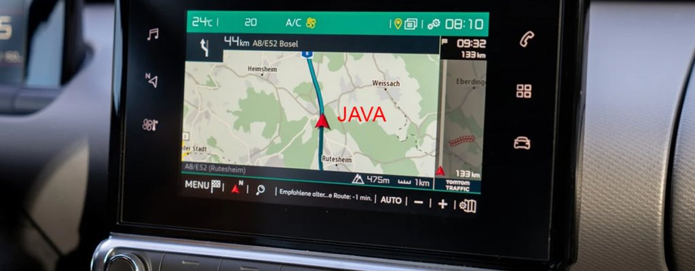
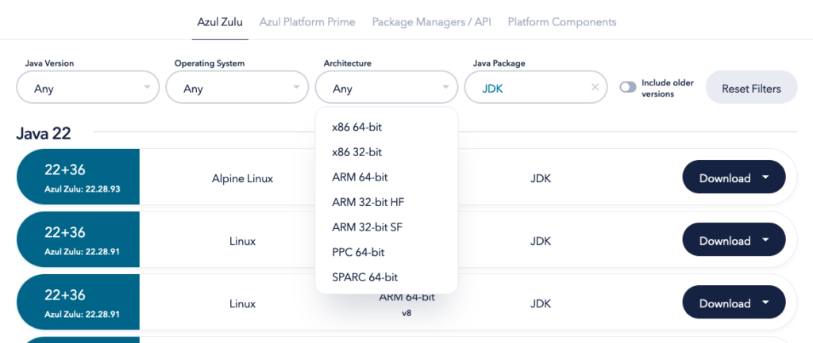

**Since its inception, Java has promised to "Write Once, Run Anywhere." In its early days, the main focus of Java was embedded devices, such as set-top boxes and televisions.**

But soon, it became one of the leading programming languages powering high-scale business applications that can handle massive amounts of transactions with high throughput.

Because those use cases are very visible and there are a lot of job opportunities within that area, we tend to forget that Java on embedded is also still very much alive and kicking!

Java is used on embedded platforms for in-car infotainment and information displays, home automation and production environment edge gateways, medical devices, appliances, and the list goes on.

## Java on embedded

"Embedded" has a very broad spectrum. It spans a range from very small microcontrollers (ESP32, Arduino, etc.) to powerful, mostly ARM-powered System-On-Chips (SOC) used in mobile phones, edge devices, Raspberry Pi boards, etc. Java is not intended for the smallest end of this spectrum, but it can provide many benefits on the other platforms! It's the ideal solution for delivering high productivity to developers and a stable runtime environment to guarantee reliable use in the field.

An essential but not well-known fact is the energy efficiency Java delivers compared to other programming languages. This is another important fact in today's economy, where ecological and energy costs become increasingly critical. According to the study [Energy Efficiency across Programming Languages: How does Energy, Time and Memory Relate?](https://sites.google.com/view/energy-efficiency-languages/results#h.p_nggWE5Z-iDZ0), Java is, for example, up to 38 times more energy-efficient than Python!

With modern, powerful systems based on ARMv7 or newer, the exact same Java runtime used in big cloud environments or on powerful machines runs just as smoothly on the smallest Linux systems. Azul provides builds of OpenJDK for various platforms, as you can see on the [download page](https://www.azul.com/downloads/?package=jdk#zulu). If your system is not on the list of downloads, you can contact Azul as they have other builds available for customers who are not listed on the free download page.

## Use cases for Java on Embedded

The many evolutions in the Java language and runtimes from the last years, thanks to the 6-month release cycle, have lifted Java development to a higher level. It provides a smooth development experience and allows developers to build complex and powerful methods with minimal code, thanks to its rich ecosystem of libraries.

Because the runtime manages the memory use and handles the threads, developers can focus on the business logic with improved productivity. Java shines where solutions are needed to handle large amounts of data, create summaries, interact with other services, etc. As such, edge devices that collect data from various sensors and need to transform it before sending it to a backend system are just one of the many examples where Java is the most logical choice to develop that edge application.

But thanks to JavaFX – to build appealing user interfaces – there is also a big opportunity for embedded devices with a screen.

*"The biggest car brands rely on Java to handle screens and sensor data in their cars," says Azul Consultant Marc Maathuis. "But Azul runtimes are also used in medical devices, Point-of-Sale (POS) systems, ticket vending machines, home-automation edge devices, and many more. For example, you can remotely check the temperature in your house or open the door, thanks to Java!"*

## What Azul Offers for Embedded Java

Both the Java language and runtime live and evolve within the open-source OpenJDK project. Multiple distributions are available for embedded platforms, or you can create your own build, starting from the OpenJDK sources.

But the Azul OpenJDK Builds offers much-added value to assist you with Java on embedded. Azul provides the world's most trusted open-source Java platform, delivered by the world's most expert Java engineering team! Some of the key advantages:

* **Long-term support, even on old Java versions** : Azul offers [long-term and ongoing support on many Java versions](https://www.azul.com/products/azul-support-roadmap/) other providers no longer maintain, such as Java 6, 7, and 8.
* **Security** : As Azul follows a three-month release cycle to provide builds with the latest fixes for [Common Vulnerabilities and Exposures (CVE)](https://docs.azul.com/core/cve), you are guaranteed to run on the safest platform.
* **Custom Builds**: Azul can provide custom builds that perfectly align with your quality and performance expectations to fit, for example, within predefined storage and memory sizes.
* **Support for any type of processor and kernel**: Azul can even create builds for platforms or custom kernels where no other Java build has been created yet.
* **Legal protection**: In addition to all that, the Azul builds protect you from legal issues (guaranteed non-contamination of your Java applications by open-source licenses).
* **Faster startup**: Thanks to technology created by Azul, solutions are available to minimize the startup time of your application (CRaM and CRaC).

"*Many companies build prototypes of new products based on off-the-shelf devices like the Raspberry Pi and later move the software to their own custom hardware," Maathuis says. "Azul can help by building a Java runtime that perfectly fits your product and provides the libraries needed for your application.*"

## Protect your code from license contamination

The OpenJDK project aims to protect users of the Java ecosystem from "contamination." Because of the GPL + ClassPathException license model, you are protected from infringements when using one of the many included libraries or pieces of code that are contributed by many thousands of developers.

Many of the source files used to build OpenJDK are covered by the GPLv2 license (without the Classpath Exception). Invoking such code from your Java application can potentially contaminate your Java application code with the GPLv2 license. Azul guarantees that the customer builds of the Java runtime are fully compliant with the GPL + ClassPathException license model.

This way, you won't need to publish the sources of your application after distributing it to your end-users.

*"Software licensing has become a big challenge in all languages," notes Pavel Petroshenko, Azul's vice president of Product Management. "The open-source community has brought big evolutions in the software industry, but it comes with some "strings attached." We at Azul are entirely focused on Java and know and understand every piece of it. We can help any company that has questions or challenges, either with the development, runtime environment, or the legal part."*

## Faster startup with Azul runtimes

Azul has multiple solutions to minimize the startup time of applications. CRaM (Checkpoint Restore at Main) and CRaC (Coordinated Restore at Checkpoint) are available in the Zulu Builds of OpenJDK.

These projects were born within Azul, based on our customers' needs. They were looking for a solution to start Java applications very fast. For instance, in a car, you want the rearview camera to be available within seconds after starting your vehicle.

That's precisely what is possible with CRaM and CRaC. Both solutions can speed up the startup of an application by either storing the state of the loaded JVM and Java classes at Main (CRaM) or, at a later moment, including the loaded application classes at a customer-defined Checkpoint (CRaC).

**CRaM (Checkpoint Restore at Main) in Zulu Builds of OpenJDK**

* Developed for embedded use-cases
* Creates a checkpoint with classes, profiler data, and dumps of portions of the heap at main
* Provides the highest gains on systems with a slow memory bus
* Reduces the startup time by up to 20%
* Doesn't need any code modification
* Only available for Azul Platform Core customers

**CRaC (Coordinated Restore at Checkpoint) in Zulu Builds of OpenJDK**

* Works on all 64-bit Linux/x64 and Linux/Arm64 platforms
* Creates a checkpoint of the full application and memory at a moment you decide (e.g., when the application is fully warmed up)
* Allows the application to restart from the created checkpoint
* May need code changes
* Potential improvements are exponential. Azul has seen improvements from 5 seconds being reduced to 50 milliseconds = 0.05 seconds!
* It is being developed within the OpenJDK project: <https://openjdk.org/projects/crac/>
* Read more: <https://docs.azul.com/core/crac/crac-introduction>

## Conclusion

Azul is here to help you get the most out of every Java platform with our Zulu and Zing Builds of OpenJDK. Java is the environment that offers the highest developer productivity thanks to its many amazing tools, evolutions, and community. [Contact Azul for any questions](https://www.azul.com/contact/) regarding Java on any platform, as Azul offers you the best Java runtime environment for each type of use.
