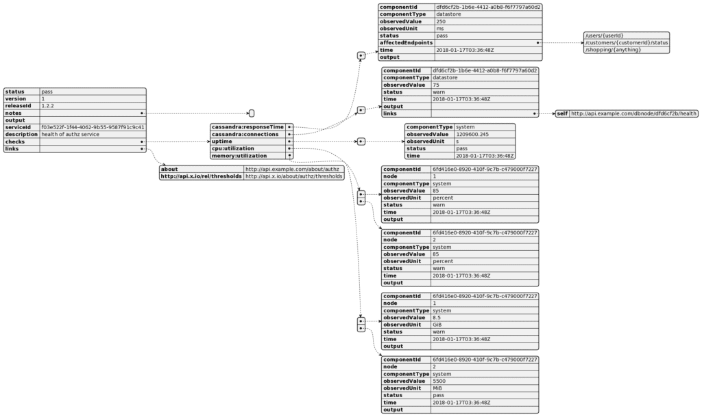
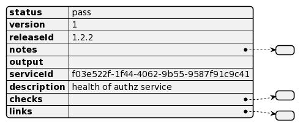
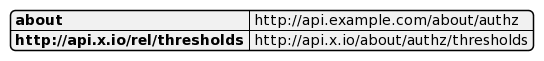
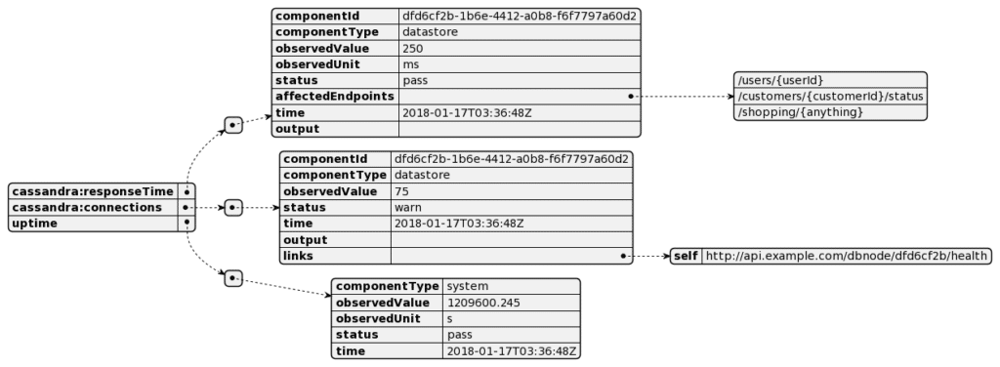
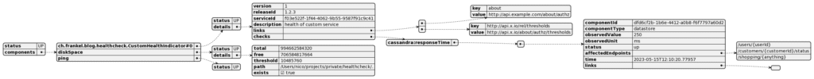

I'm continuing my journey on getting more familiar with HTTP APIs by reading related . This time, I read the [Health Check Response Format for HTTP APIs](https://datatracker.ietf.org/doc/html/draft-inadarei-api-health-check) on the suggestion of [Stefano Fago](https://twitter.com/stefanofago/). In this article, I'd like to summarize my reading.

Note that it's a draft. Moreover, it has been dormant for nearly two years and, thus, has been automatically expired. However, it's the closest to a specification on health checks and thus deserves some love.

Sample data visualization
-------------------------

Even though it's not a long read, it's a bit "dry". Fortunately, the specification offers a JSON sample. I copy-pasted it in PlantUML, and presto, it shows a visual representation of it:

Let's have a look at the proposed structure element by element.

The root object
---------------

At its simplest, the response is a JSON object with a mandatory `status` property:

Values can be:

* `pass` for healthy status. The value can also be `ok` (for NodeJS) and `up` (for Spring Boot) to account for existing health check libraries. The HTTP status code must be in the range from 2xx to 3xx.
* `warn` for healthy status but with concerns with the same HTTP status range.
* `fail` to indicate unhealthy status. Possible alternative values include `error` (NodeJS) and `down` (Spring Boot). The HTTP status code must be in the range from 4xx to 5xx.

One can add additional *optional* values:

* `version`: *public* version of the service
* `releaseId`: internal version of the service. For example, the `version` would be incremented for non-compatible change, while the `releaseId` could be the commit hash or a semantic version.
* `serviceId`: the unique identifier of the service
* `description`: self-explanatory
* `notes`: array of non-structured notes
* `output`: plain error message in case of `pass` or `warn`. The field should be left blank for `pass`.

The `links` objects
-------------------

The `links` object consists of object pairs. Values are URIs, while keys can be URIs or common/registered ones: see [RFC5988](https://www.rfc-editor.org/rfc/rfc5988#section-6.2.2) for common values, *e.g.* , `self`.

The `checks` objects
--------------------

Keys of `checks` objects consist of two terms separated by a colon, component name, and measurement name. The latter can be either:

* A pre-defined value: `utilization`, `responseTime`, `connections`, or `uptime`
* A standard term from a well-known source, *e.g.*, IANA, microformat.org, etc.
* An URI

Values consist of one of the following keys:

* `componentId`: unique id of this component
* `componentType`:
  * A pre-defined value, `component`, `datastore`, or `system`
  * A standard term from a well-known source, *e.g.*, IANA, microformat.org, etc.
  * An URI
* `observedValue`: any valid JSON value
* `observedUnit`: unit of measurement
* `status`: as the parent object's status, but for this component, only
* `affectedEndpoints`: if the component is not `pass`, lists all affected endpoints
* `time`: date-time in ISO8601 format of the observation
* `output`: as the parent object's output, but for this component, only
* `links`: see the previous section
* Any other non-standard value

I tried implementing the above with Spring Boot using a custom `HealthIndicator`. Here's the best I could come up with:

The current structure of the JSON response needs to be (easily?) customizable. You'd need to create your endpoint. I hope the Spring Boot team provides the option to generate a compatible structure.

Conclusion
----------

The Healthcheck IETF draft is a great initiative to standardize health checks across the industry. It would allow monitoring tools to rely on HTTP status and response body without ad-hoc configuration on each service.

Unfortunately, the draft is expired because of a lack of activity. I'd love to see it revived, though.

**To go further:**

* [Health Check API](https://datatracker.ietf.org/doc/html/draft-inadarei-api-health-check)
* ["Spring Boot Actuator: Health"](https://docs.spring.io/spring-boot/docs/3.1.x/actuator-api/htmlsingle/#health)

*Originally published at [A Java Geek](https://blog.frankel.ch/healthcheck-http-apis/) on May 28^th^, 2023*

*[RFCs]: Request For Comment
