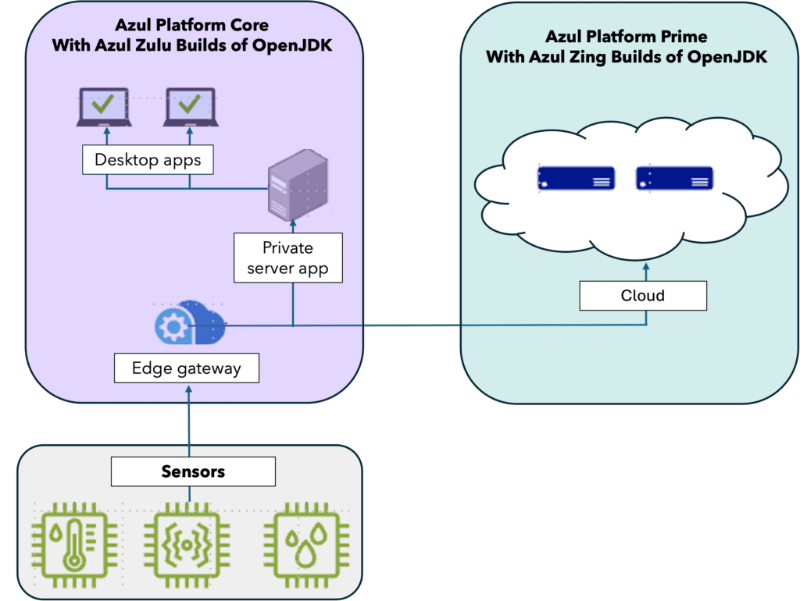

In Part 1 of this series, "[A Fresh Look at Embedded Java](https://foojay.io/today/a-fresh-look-at-embedded-java/)," we explored the use of Java for embedded use cases.

Azul and its Zulu Build of OpenJDK (Zulu) are the ideal partners in this part of the software world.

Let's expand and look at the cloud part of a typical end-to-end solution with sensors, edge devices, client applications, and cloud services.

## Azul Platform Core for edge devices and client applications

Because Java delivers fast development speed thanks to its amazing methods and tools and its impressive performance in handling massive amounts of data, it's the ideal programming language for building applications for edge devices that collect data from various sensors.

We can find such systems in home automation, car diagnostics and infotainment systems, industrial production facilities, etc. Such edge devices can be based on many types of CPUs or SOCs (System-on-Chip) and different flavors of Linux.

Azul is the only provider of Java runtimes for all these platforms, even when support is still needed for older versions starting from Java 6. Many of these Zulu runtimes are available for free on the [Azul Downloads](https://www.azul.com/downloads/#zulu) page.

On top of the free Zulu Builds of OpenJDK, [Azul provides Platform Core](https://www.azul.com/products/core/) to its paying customers. This product provides access to more builds, specifically targeting less-used platforms and Linux distributions. Platform Core also provides extra services as described in [part 1](https://www.azul.com/blog/a-fresh-look-at-embedded-java/).

* **Long-term support, even on old Java versions** : Azul offers [long-term and ongoing support on many Java versions](https://www.azul.com/products/azul-support-roadmap/) other providers no longer maintain, such as Java 6, 7, and 8.
* **Security** : As Azul follows a three-month release cycle to provide builds with the latest fixes for [Common Vulnerabilities and Exposures (CVEs)](https://docs.azul.com/core/cve), you are guaranteed to run on the safest platform.
* **Custom Builds**: Azul can provide custom builds that perfectly align with your quality and performance expectations to fit, for example, within predefined storage and memory sizes.
* **Support for any processor and kernel**: We can even create builds for platforms or custom kernels where no other Java build has been created yet.
* **Legal protection**: Azul builds protect you from legal issues (non-contamination of your Java applications by open-source licenses).
* **Faster startup**: Thanks to technology created by Azul, we can provide solutions to minimize the startup time of your application (CRaM and CRaC).

Desktop and other client-side applications can also be developed and distributed using Azul Zulu. It's the most secure, up-to-date Java runtime for Windows, macOS, and Linux.

Check the [Azul Platform Core Documentation website](https://docs.azul.com/core/) to get started with Azul Zulu.

## Azul Platform Prime for cloud services

Where Zulu shines on edge, desktop, and multiple platforms, Azul Zing Builds of OpenJDK (Zing) is built to run in the cloud. It's a Java runtime based on OpenJDK, but Azul improved it to handle bigger data loads with a better compiler and garbage collector. It's available for [free for evaluation](https://www.azul.com/downloads/#prime) and as part of [Azul Platform Prime](https://www.azul.com/products/prime/) for our customers. Prime brings a lot of value:

* **Better customer experience for big data workloads:**Crunching large amounts of data at scale is difficult. Zing guarantees the highest throughput at the lowest latencies, whether you're running tools like Kafka for ingestion, Spark for analytics, Elastic/Solr for search, or Java-based DBs like Apache, or implementing your own logic in custom Java apps.
* **Quicker time to market and lower support costs:**Solve performance and scaling problems, cutting development time and reducing extra code that has to be maintained. This leads to fewer performance-related tickets, which distract engineers from delivering new features.
* **Smoother DevOps deployability at scale:** Solving the Java warmup problem on all Java versions with no code changes allows you to fully embrace reactive autoscaling and make more frequent CI/CD deployments of new features.
* **Lower cloud cost**: Prime's higher carrying capacity, lower outliers, more efficient use of resources, and better scalability deliver the world's lowest cost for cloud services built on top of embedded device data.

Quote **Jiří Holuša,**Sr. Product Manager -- Platform Prime

*"Zing JVM has gone a long way from the original sweet spot of low-latency use cases where every millisecond matters," says Azul Senior Product Manager Jiří Holuša. "In the modern world of high cloud bills due to the waste of resources, Zing JVM also helps bring back efficiency and save tons of money as it allows you to compute more with the same resources. Success stories of customers getting 200%+ ROI on their investment into Azul Platform Prime and saving hundreds of thousands of dollars prove that improving resource utilization through the right JVM choice makes a lot of sense."*

To learn more about Azul Platform Prime, check these documentation sources:

* [Falcon Compiler](https://docs.azul.com/prime/Falcon-Compiler): This is the default optimizing JIT (Just-In-Time) compiler in Zing with the main focus of generating high-performance code.
* [C4 Garbage Collector](https://www.azul.com/products/components/pgc/): This is the default garbage collector in Zing and uses a 4-stage concurrent execution mechanism that eliminates almost all stop-the-world pauses. This lets your application continue executing while garbage collection is ongoing. When testing your application under real-world conditions, you will see reduced latencies across all percentiles, especially in eliminating large outliers in latency.
* [ReadyNow](https://docs.azul.com/prime/Use-ReadyNow): This is a feature of Azul Platform Prime that, when enabled, dramatically improves the application's warm-up behavior (the time taken for the Java application to reach optimal performance). ReadyNow persists the profiling information gathered during the application's run so that subsequent runs do not have to learn from scratch again. Warm-up improves each application run until optimal performance is reached.
* [Optimizer Hub](https://docs.azul.com/optimizer-hub/): This component of Azul Platform Prime makes your Java programs start fast and stay fast by providing two services:
  * [Cloud Native Compiler](https://docs.azul.com/optimizer-hub/about/cloud-native-compiler.html): Provides a server-side optimization solution that offloads JIT compilation to separate and dedicated service resources, providing more processing power to JIT compilation while freeing your client JVMs from the burden of doing JIT compilation locally.
  * [ReadyNow Orchestrator](https://docs.azul.com/optimizer-hub/about/readynow-orchestrator.html): Records and serves ReadyNow profiles. This greatly simplifies the operational use of ReadyNow and removes the need to configure any local storage for writing the profile. ReadyNow Orchestrator can record multiple profile candidates from multiple JVMs and promote the best-recorded profile.

[Many tools](https://www.azul.com/downloads/#platform-components), [documentation](https://docs.azul.com/prime/), and [support](https://www.azul.com/support/): Azul is [recognized by its many customers and in different articles](https://www.azul.com/newsroom/) for its ongoing research and high customer satisfaction.

## Conclusion

Azul is your one-stop partner for all questions related to using Java, from edge devices over client applications to cloud services.

Whether you are looking for a solution related to licensing, cost, performance, or total lifetime cost, you will find the best partner in our support team.
