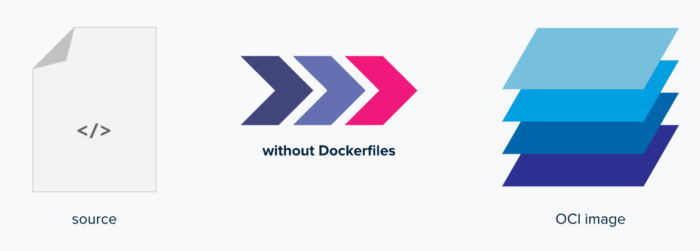
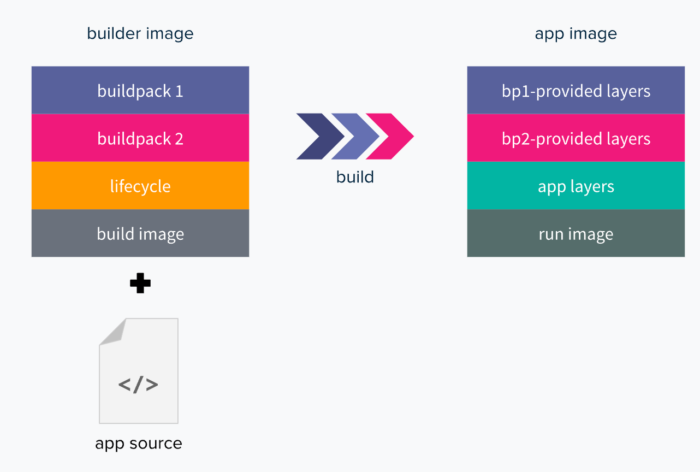
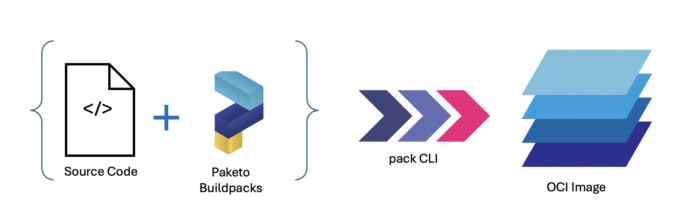

**The concept of containers has helped to bring Java developers closer than ever to the cloud-native idiom of 'write once, run anywhere.'**

Effectively and efficiently containerizing your Java application can be much more of a challenge than you might originally expect, especially when you might not be a container expert. Having to write and maintain a dockerfile, run a Docker daemon as root, wait for all the builds to complete, and then finally push the image to a remote registry can be complex, time-consuming, and frustrating!

In response to this challenge, several open source projects have provided effective solutions. These include projects such as [Jib](https://github.com/GoogleContainerTools/jib "Jib"), [Source-to-Image (S2I)](https://github.com/openshift/source-to-image "Source-to-Image (S2I)"), [Cloud Native Buildpacks](https://buildpacks.io/ "Cloud Native Buildpacks") and [Paketo Buildpacks](https://paketo.io/ "Paketo Buildpacks"). These projects are open source technologies and offer benefits and advantages over traditional dockerfiles.

This article focuses on Cloud Native Buildpacks, an open source project that is gaining significant momentum within the developer community, offering a polyglot solution with impressive features and advantages.

Let's take a closer look at what buildpacks are, why they're advantageous, and how you can use them for your cloud-native Java applications.

## What are cloud native buildpacks?

The Cloud Native Buildpacks project was initiated by several organizations that were already using the concept of buildpacks. This project was donated to the Cloud Native Computing Foundation in 2018.

The aim of this open source project was to unify the buildpack ecosystem with a well-defined platform-to-buildpack contract.

### But what is a cloud native buildpack?

A [buildpack](https://buildpacks.io/docs/for-app-developers/concepts/ "buildpack") is a set of executables that can analyze your app source code, create a build plan, and generate a container image that is ready for deployment to run your application. In essence, buildpacks help you to convert your source code into a secure, efficient, production-ready container image.



This image is from the [Cloud Native Buildpacks docs](https://buildpacks.io/docs/for-app-developers/concepts/buildpack/ "Cloud Native Buildpacks docs").

Buildpacks are designed to be flexible and modular. They can be customized to include additional dependencies or to modify the build process. Developers can create their own buildpacks or use pre-existing buildpacks provided by the community.

Cloud Native Buildpacks embrace modern container standards, such as the [OCI image format](https://github.com/opencontainers/image-spec "OCI image format"), and take advantage of the latest capabilities of these standards. Cloud Native Buildpacks aim to bring advanced caching, multi-language support, minimal app images, and reproducibility to your images without forcing you, as the developer, to take care of all this yourself.

### How do Cloud Native Buildpacks work?

Each buildpack comprises two phases: **detect** and **build**.

First, the detect phase runs against your application source code to determine if the buildpack is applicable or not. For example, for a Java application, it would look for the presence of a *pom.xml* or *build.gradle* file, depending on your build tool of choice. If a buildpack is detected, it returns a contract of what is required for creating an image, and then it proceeds to the build phase.

During the build phase, the buildpack transforms the codebase, fulfilling the contract requirements that were determined in the detect phase. It sets up the build-time and runtime environments, downloads required dependencies, compiles the code (if needed), and sets appropriate entry points and startup scripts.

To run these two phases (detect and build), builders are used. Under the hood, a builder runs the detect phase for all the buildpacks in order, and then it proceeds to run the build phase.

### What is a builder?

The flexibility and modularity of buildpacks comes from the use of builders. A builder is an ordered combination of components that are required for building a container image.

The following image is from the [Cloud Native Buildpacks docs](https://buildpacks.io/docs/for-app-developers/concepts/builder/ "Cloud Native Buildpacks docs"):



Builders consist of the following components:

* [Buildpacks](https://buildpacks.io/docs/for-app-developers/concepts/buildpack/ "Buildpacks")
* [Stack](https://buildpacks.io/docs/for-app-developers/concepts/base-images/stack/ "Stack") (combination of build and run images):
  * Build image, which provides the base environment for the builder
  * Run image, which provides the base environment for the app image during runtime
* [Lifecycle](https://buildpacks.io/docs/for-platform-operators/concepts/lifecycle/ "Lifecycle"), which is a set of binaries that are used to run the detect phase for all the buildpacks and then to run the build phase for all buildpacks that passed detection.

This combination of components allows developers to use a single builder to automatically detect and build a wide variety of applications in different languages.

## Advantages of using buildpacks over alternative solutions

Buildpacks offer several critical advantages to developers:

* **Consistency**: Buildpacks provide a standardized way in which to build and package applications. This encourages consistency and reduces the risk of human errors.
* **Portability**: Buildpacks enable developers to easily move applications between cloud environments or providers by providing container images that are easily deployed on any cloud infrastructure or platform.
* **Flexibility**: Buildpacks' modular nature enables great customization options for developers.
* **Automation**: Buildpacks' automation helps to reduce the amount of manual work that is required by developers for creating, maintaining, and updating tools for building and packaging their applications.
* **Compliance and security**: Buildpacks use layered images based on known, secure base images, thus significantly lowering the risk of potentially introducing security vulnerabilities.

In summary, buildpacks enable developers to be more productive. They simplify the process of building and packaging applications, reduce errors, and improve efficiency and security, which all results in saved time and effort that allows developers to focus on writing code and delivering value.

In comparison to other similar, alternative solutions, such as source-to-image and jib, Cloud Native Buildpacks has several features that developers can take advantage of, including:

* **Rebasing**, which allows developers to instantly update base images without rebuilding your source code by patching the OS layer of your image.
* **Advanced caching**, you can use built-in caching to improve performance so you can quickly rebuild your application by updating only the layers that have changed.
* **Software bill of materials (SBOM)**, which provides insights into the contents of the application image.

Read [this document](https://buildpacks.io/features/ "this document") to dive deeper into the feature comparisons between all of these technologies.

## What are Paketo Buildpacks?

[Paketo Buildpacks](https://github.com/paketo-buildpacks "Paketo Buildpacks") is an open source project that makes use of the Cloud Native Buildpacks specification to provide production-ready buildpacks for the most popular frameworks and languages, including Java.



Many runtimes and frameworks have produced their own Paketo buildpacks for developers to use in their own applications. For example, the [Paketo Buildpack for Liberty](https://blog.paketo.io/posts/introducing-liberty-buildpack/ "Paketo Buildpack for Liberty") provides the [Open Liberty](http://openliberty.io/ "Open Liberty") runtime to a workflow and is included in the Java buildpack.

For this buildpack, the [Open Liberty](http://openliberty.io/ "Open Liberty") runtime is provided by default, although it can provide the WebSphere Liberty runtime if preferred. We'll use this buildpack in the following instructions to show you how you can make use of buildpacks and try them out for yourself.

## Getting started with buildpacks in 6 easy steps

To get started, you'll need your application source code, Docker, and the Pack CLI.

It is important to note that there are some difficulties with using Paketo buildpacks locally on machines that run with an M1 or M2 processor. See [this blog](https://www.cloudfoundry.org/blog/arm64-paketo-buildpacks/ "this blog") for more details or [this documentation](https://buildpacks.io/docs/for-app-developers/how-to/special-cases/build-for-arm/ "this documentation") for how to run buildpacks on ARM architecture.

**Step 1:** The first step is to make sure that Docker is up and running. If you do not have Docker, follow [these instructions to install Docker](https://docs.docker.com/get-docker "these instructions to install Docker").

**Step 2:** After this, the next step is to install the [Pack CLI](https://buildpacks.io/docs/for-platform-operators/how-to/integrate-ci/pack/ "Pack CLI,"), if you do not already have it. This is a Command Line Interface (CLI) maintained by Cloud Native Buildpacks that you can use to work with buildpacks.

**Step 3:** Our example uses the Open Liberty getting started application as the application source, which, you'll need to download.

```
git clone https://github.com/openliberty/guide-getting-started.git
```

Then, change directories to the finish directory.

```
cd guide-getting-started/finish
```

**Step 4:** Now, you'll need to set a builder. In this case, we're using the Ubuntu jammy-based builder.

```
pack config default-builder paketobuildpacks/builder-jammy-base
```

**Step 5:** Next, you need to create a *project.toml* file in the *finish* directory with the following content.

```
[[build.env]]
    name = "BP_JAVA_APP_SERVER"
    value = "liberty"
[[build.env]]
    name = "BP_MAVEN_BUILT_ARTIFACT"
    value ="target/*.[ejw]ar src/main/liberty/config/*"
[[build.buildpacks]]
  uri = "docker://gcr.io/paketo-buildpacks/eclipse-openj9"
[[build.buildpacks]]
  uri = "docker://gcr.io/paketo-buildpacks/java"
```

**Step 6:** Finally, we're going to build the application on Liberty with IBM Semeru OpenJ9 and required Liberty features.

```
pack build myapp
```

Your application is now transformed into an OCI image! With your OCI image, you can run your application locally with the following docker run command.

```
docker run --rm -p 9080:9080 myapp
```

Or, you can deploy your application to any Kubernetes-based platform, such as [Red Hat OpenShift](https://www.redhat.com/en/technologies/cloud-computing/openshift "Red Hat OpenShift"), by using an [Open Liberty operator](https://github.com/OpenLiberty/open-liberty-operator "Open Liberty operator").

If you'd like to be able to view the SBOM information, which is one of the advantages of using buildpacks, use the following commands and open the file in an IDE of your choosing.

```
pack sbom download myapp --output-dir /tmp/demo-app-sbom
find /tmp/demo-app-sbom/layers/sbom -name "*.json"
```

## Summary and next steps

As this article has shown, developers can easily set up and use buildpacks and their many features when they develop cloud-native applications.

If you'd like to view the Open Liberty buildpack referenced and used within the instructions in this article in more detail, check out its [open source GitHub repository](https://github.com/paketo-buildpacks/liberty/blob/main/README.md "open source GitHub repository").

Alternatively, if you'd like to explore more of what Open Liberty can offer as an open source, cloud-native runtime, or even try it out in a cloud- hosted environment, check out our ["6 reasons why Open Liberty" article](https://developer.ibm.com/articles/6-reasons-why-open-liberty-is-an-ideal-choice-for-developing-and-deploying-microservices/ "“6 reasons why Open Liberty” article") or try the interactive exercises on the [Open Liberty guides page](https://openliberty.io/guides/ "Open Liberty guides page").
