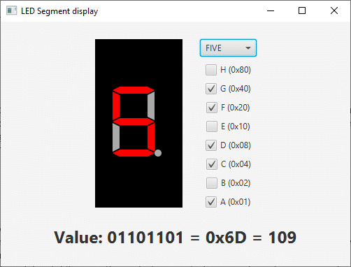
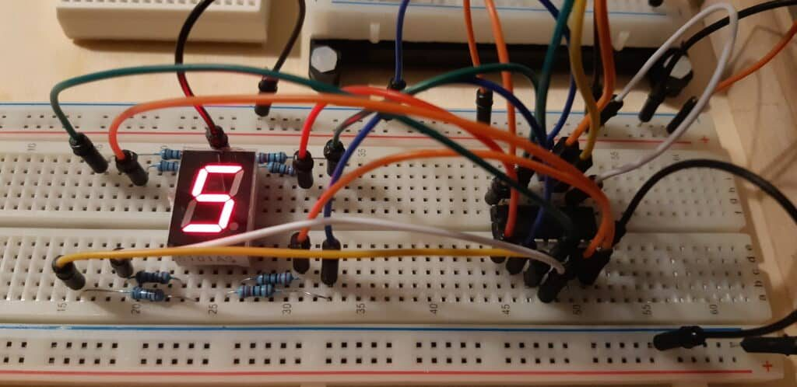
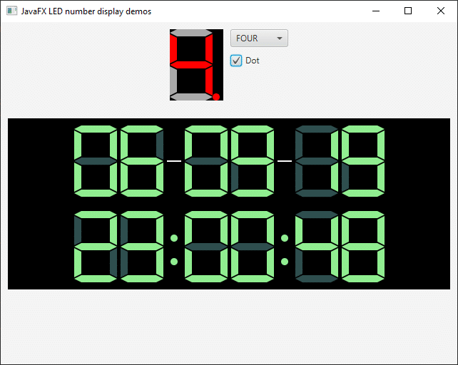

On the Pi4J discussion list, someone recently asked what the [best and easiest way is in Java to convert a byte value](https://github.com/Pi4J/pi4j-v2/discussions/379). In Java, there is no distinction between signed and unsigned bytes, which can be confusing. My book ["Getting Started with Java on the Raspberry Pi"](https://webtechie.be/books/) contains an explanation about this, and I am happy to share it in this post with some more info and code examples...

You can find all the [code of this post on GitHub](https://gist.github.com/FDelporte/ab37b64d379560ae3f8db0403f5a8ed1).



## The Basics: Bits

Let's start with the basics: bits, 0 or 1.

A bit (binary digit) is the smallest unit of data in a computer, and has two possible values: 0 or 1. Bits are the foundation of everything that happens in a computer. All instructions or data stored in memory are represented as combinations of bits. Bits are mostly grouped together into larger units such as bytes or words, so they can represent numbers, characters, or control signals, depending on the context in which they are used.

In everyday life, we are used to decimal values where we group everything by 10, 20, 30,... In programming, hexadecimal (or hex) values are often used, which group numbers by sixteen. Hexadecimal values range from 0 to 15, which matches perfectly with the maximum value of four bits (`1111` in binary). Each hex digit can represent a value from 0 to F, where F is 15 in decimal. A hex value is typically written as `0x0` to `0xF` to distinguish it from decimal notation.

Each binary digit (bit) represents a power of 2, starting from the rightmost bit (which is `2^0`) and moving left. The value of the binary number is the sum of the powers of 2 where there is a bit 1.

The following table shows all possible combinations of 4 bits ranging from "0000" to "1111".

| Bits | 2\^3 | 2\^2 | 2\^1 | 2\^0 |    +    | Number | HEX |
|------|------|------|------|------|---------|--------|-----|
|      | 8    | 4    | 2    | 1    |         |        |     |
| 0000 | 0    | 0    | 0    | 0    | 0+0+0+0 | 0      | 0x0 |
| 0001 | 0    | 0    | 0    | 1    | 0+0+0+1 | 1      | 0x1 |
| 0010 | 0    | 0    | 1    | 0    | 0+0+2+0 | 2      | 0x2 |
| 0011 | 0    | 0    | 1    | 1    | 0+0+2+1 | 3      | 0x3 |
| 0100 | 0    | 1    | 0    | 0    | 0+4+0+0 | 4      | 0x4 |
| 0101 | 0    | 1    | 0    | 1    | 0+4+0+1 | 5      | 0x5 |
| 0110 | 0    | 1    | 1    | 0    | 0+4+2+0 | 6      | 0x6 |
| 0111 | 0    | 1    | 1    | 1    | 0+4+2+1 | 7      | 0x7 |
| 1000 | 1    | 0    | 0    | 0    | 8+0+0+0 | 8      | 0x8 |
| 1001 | 1    | 0    | 0    | 1    | 8+0+0+1 | 9      | 0x9 |
| 1010 | 1    | 0    | 1    | 0    | 8+0+2+0 | 10     | 0xA |
| 1011 | 1    | 0    | 1    | 1    | 8+0+2+1 | 11     | 0xB |
| 1100 | 1    | 1    | 0    | 0    | 8+4+0+0 | 12     | 0xC |
| 1101 | 1    | 1    | 0    | 1    | 8+4+0+1 | 13     | 0xD |
| 1110 | 1    | 1    | 1    | 0    | 8+4+2+0 | 14     | 0xE |
| 1111 | 1    | 1    | 1    | 1    | 8+4+2+1 | 15     | 0xF |

This [video by Mathmo14159](https://www.youtube.com/watch?v=zELAfmp3fXY) very nicely illustrates how this works.

And we can achieve the same result with the following Java code:

```
System.out.println("Value\tBits\tHex");
for (int i = 0; i <= 15; i++) {
    System.out.println(i 
        + "\t" + String.format("%4s", Integer.toBinaryString(i)).replace(' ', '0')
        + "\t0x" + Integer.toHexString(i).toUpperCase());
}

// Output
Value   Bits    Hex
0       0000    0x0
1       0001    0x1
2       0010    0x2
3       0011    0x3
4       0100    0x4
5       0101    0x5
6       0110    0x6
7       0111    0x7
8       1000    0x8
9       1001    0x9
10      1010    0xA
11      1011    0xB
12      1100    0xC
13      1101    0xD
14      1110    0xE
15      1111    0xF
```

## Bits to Byte

A byte consists of 8 bits and has the range of 0x00 (= 0) to 0xFF (= 255).

So we need to extend the table above to have 8 bits. Let's take a few examples:

|   Bits   | 2\^7 | 2\^6 | 2\^5 | 2\^4 | 2\^3 | 2\^2 | 2\^1 | 2\^0 |     +     | Total | HEX |
|----------|------|------|------|------|------|------|------|------|-----------|-------|-----|
|          | 128  | 64   | 32   | 16   | 8    | 4    | 2    | 1    |           |       |     |
| 00000001 | 0    | 0    | 0    | 0    | 0    | 0    | 0    | 1    | 1         | 1     | x01 |
| 00000010 | 0    | 0    | 0    | 0    | 0    | 0    | 1    | 0    | 2         | 2     | x02 |
| 00000011 | 0    | 0    | 0    | 0    | 0    | 0    | 1    | 1    | 2+1       | 3     | x03 |
| 00000100 | 0    | 0    | 0    | 0    | 0    | 1    | 0    | 0    | 4         | 4     | x04 |
| 00001111 | 0    | 0    | 0    | 0    | 1    | 1    | 1    | 1    | 8+4+2+1   | 15    | x0F |
| 00011111 | 0    | 0    | 0    | 1    | 1    | 1    | 1    | 1    | 16+...+1  | 31    | x1F |
| 00100000 | 0    | 0    | 1    | 0    | 0    | 0    | 0    | 0    | 32        | 32    | x20 |
| 11111111 | 1    | 1    | 1    | 1    | 1    | 1    | 1    | 1    | 128+...+1 | 255   | xFF |

Again, outputting the same with Java code:

```
System.out.println("Value\tBits\tHex");
for (int i = 0; i <= 255; i++) {
    System.out.println(i 
        + "\t" + String.format("%8s", Integer.toBinaryString(i)).replace(' ', '0')
        + "\t0x" + Integer.toHexString(i).toUpperCase());
}

// Output
Value   Bits    Hex
0       00000000        0x0
1       00000001        0x1
2       00000010        0x2
3       00000011        0x3
...
15      00001111        0xF
16      00010000        0x10
17      00010001        0x11
...
253     11111101        0xFD
254     11111110        0xFE
255     11111111        0xFF
```

## Value Ranges in Java

A bit doesn't really exist as a data type in Java. However, the closest match is a `boolean` type, which can represent two states: `true` (equivalent to `1`) and `false` (equivalent to `0`). To store numeric whole values (without decimals), Java provides different primitive types, each with its own range and characteristics.

### Difference between Byte, Short, Integer and Long

All these are numeric objects and each uses a fixed number of bytes in memory:

| Type  | N° of bits | N° of bytes |      Minimum       |      Maximum       |
|-------|------------|-------------|--------------------|--------------------|
| byte  | 8          | 1           | 0x00               | 0xFF               |
| short | 16         | 2           | 0x0000             | 0xFFFF             |
| int   | 32         | 4           | 0x00000000         | 0xFFFFFFFF         |
| long  | 64         | 8           | 0x0000000000000000 | 0xFFFFFFFFFFFFFFFF |

### Minimum and maximum values in Java

Let's go back to Java and check how values are represented with the following code:

```
System.out.println("Byte");
System.out.println("    Min: " + Byte.MIN_VALUE);
System.out.println("    Max: " + Byte.MAX_VALUE);

System.out.println("Short");
System.out.println("    Min: " + Short.MIN_VALUE);
System.out.println("    Max: " + Short.MAX_VALUE);

System.out.println("Integer");
System.out.println("    Min: " + Integer.MIN_VALUE);
System.out.println("    Max: " + Integer.MAX_VALUE);

System.out.println("Long");
System.out.println("    Min: " + Long.MIN_VALUE);
System.out.println("    Max: " + Long.MAX_VALUE);
```

As a result, we get these values:

```
Byte
    Min: -128
    Max: 127
Short
    Min: -32768
    Max: 32767
Integer
    Min: -2147483648
    Max: 2147483647
Long
    Min: -9223372036854775808
    Max: 9223372036854775807
```

Hmm, this is unexpected! Does a byte have the range of -128 to 127, instead of 0 to 255?! That's why we need to understand the difference between signed and unsigned values.

## Signed versus Unsigned

* **Signed Byte**: The most significant bit (MSB = the most left one) is used as the sign bit, indicating whether the value is positive or negative. This results in a range for a byte of -128 to 127.
* **Unsigned Byte**: All bits are used for the value, without a sign bit. This results in a range for a byte of 0 to 255.

Java does not have a native unsigned byte type, but you can achieve unsigned behavior by treating a byte as an int or using bitwise operations.

When you calculate the byte value to a signed number value, the major bit (the most left one) is handled as an indicator for a negative number (1) or a positive number (0). Let's try a few examples:

```
System.out.println("Bits to byte");
System.out.println("Byte value 00000001: " + ((byte) Integer.parseInt("00000001", 2)));
System.out.println("Byte value 00001111: " + ((byte) Integer.parseInt("00001111", 2)));
System.out.println("Byte value 01111111: " + ((byte) Integer.parseInt("01111111", 2)));
System.out.println("Byte value 10000000: " + ((byte) Integer.parseInt("10000000", 2)));
System.out.println("Byte value 10000001: " + ((byte) Integer.parseInt("10000001", 2)));
System.out.println("Byte value 10001111: " + ((byte) Integer.parseInt("10001111", 2)));

// Output
Bits to byte
Byte value 00000001: 1
Byte value 00001111: 15
Byte value 01111111: 127
Byte value 10000000: -128
Byte value 10000001: -127
Byte value 10001111: -113
```

### Using Masks

A mask is a value used in bitwise operations to extract or manipulate specific bits of another value. By applying a mask in the format `byte & 0xFF`, we can convert a byte value to it's unsigned integer value. By applying the mask `0xFF`, which has only 8 bits, you effectively keep only the lower 8 bits of the byte value when it's converted to an integer.

As you can see from the following code example, applying a mask converts a byte to an integer, and shows the unsigned value for `10001111`.

```
System.out.println("Byte to Integer with mask");
var b = (byte) Integer.parseInt("10001111", 2);
System.out.println("Byte value: " + b);
var bWithMask = b & 0xff;
System.out.println("Byte value with mask: " + bWithMask);
System.out.println("Object Type: " + printObjectType(bWithMask));

// Helper method to show the type of object
private static String printObjectType(Object obj) {
    if (obj != null) {
        return obj.getClass().getName();
    } else {
        return "NULL";
    }
}

// Output
Byte value: -113
Byte value with mask: 143
Object Type: java.lang.Integer
```

### Using Helper Methods

Applying a mask is a short piece of code and you can easily add it to your code to convert a signed byte to its unsigned integer equivalent. However, there are also built-in helper methods available in Java that return the same result but are more readable. This is important for code reviews or when you or someone else need to mainten or extend the code: `Byte.toUnsignedInt(b)` and `Byte.toUnsignedLong(b)`.

```
System.out.println("Byte to Integer with toUnsignedInt");
var unsignedInt = Byte.toUnsignedInt(b);
System.out.println("Byte to unsigned integer: " + unsignedInt);
System.out.println("Object Type: " + printObjectType(unsignedInt));

// In case you need it as a Long...
System.out.println("Byte to Long with toUnsignedLong");
var unsignedLong = Byte.toUnsignedLong(b);
System.out.println("Byte to unsigned long: " + unsignedLong);
System.out.println("Object Type: " + printObjectType(unsignedLong));

// Output
Byte to Integer with toUnsignedInt
Byte to unsigned integer: 143
Object Type: java.lang.Integer

Byte to Long with toUnsignedLong
Byte to unsigned long: 143
Object Type: java.lang.Long
```

### Same Approach for Short

A `short` in Java uses 16 bits (or 2 bytes) and can be handled similarly when converting from its binary representation. A short is also a signed data type, with a range of -32,768 to 32,767.

```
System.out.println("Example with short");
short s1 = (short) Integer.parseInt("1000000000000000", 2);
System.out.println("Short value 1000000000000000: " + s1);
System.out.println("Short value 1000000000000000 with mask: " + (s1 & 0xFFFF));
System.out.println("Using Short.toUnsignedLong: " + Short.toUnsignedInt(s1));
short s2 = (short) Integer.parseInt("1111111111111111", 2);
System.out.println("Short value 1111111111111111: " + s2);
System.out.println("Short value 1111111111111111 to unsigned: " + Short.toUnsignedInt(s2));

// Output
Example with short
Short value 1000000000000000: -32768
Short value 1000000000000000 with mask: 32768
Using Short.toUnsignedLong: 32768
Short value 1111111111111111: -1
Short value 1111111111111111 to unsigned: 65535
```

## Example use of Bits

A nice example of the use of bits and bytes, is included in my book. A LED number display is a typical component used in a lot of experiments with electronics and is also used in e.g. alarm clocks. Such a display has 7 segments to for the number, and one for the dot. So a total of 8 true/false values to define what must be displayed. This makes it the perfect example of how 8 booleans can be combined into one byte.

<figure class="wp-block-gallery has-nested-images columns-default is-cropped wp-block-gallery-1 is-layout-flex wp-block-gallery-is-layout-flex">
 <figure class="wp-block-image size-large">
  <a href="https://foojay.io/?attachment_id=114458" target="_blank" rel="noopener"></a>
 </figure>
 <figure class="wp-block-image size-large">
  <a href="https://foojay.io/?attachment_id=114459" target="_blank" rel="noopener"></a>
 </figure>
 <figure class="wp-block-image size-large">
  <a href="https://foojay.io/?attachment_id=114460" target="_blank" rel="noopener"></a>
 </figure>
</figure>

In 2019, I even published a JavaFX library with a component to visualize such a display, as you can [read here: "LED number display JavaFX library published on Maven"](https://webtechie.be/post/2019-10-02-led-number-display-javafx-library-published-to-maven/).

## Conclusion

Understanding how to work with bits, bytes and shorts in Java is essential for effective programming, especially when dealing with low-level data manipulation for electronic components, such as with Raspberry Pi and [Pi4J](https://www.pi4j.com/) projects. The way Java handles signed data types can sometimes be confusing, but by using masks and/or the helper methods like `Byte.toUnsignedInt()` and `Short.toUnsignedInt()`, you can efficiently convert these values.

## Remark

This is a returning question, so this blog post is not completely new. 😉 A [shorter version was published on October 25, 2019](https://webtechie.be/post/2019-10-25-the-mystery-of-the-negative-byte-value-in-java-a-story-of-bits-bytes-signed-and-unsigned/). I created this new post to provide a deeper explanation, a video, and more Java code examples.
