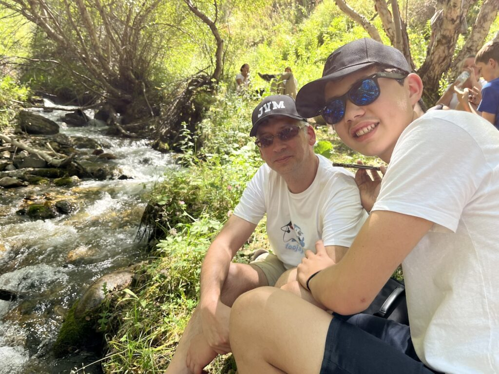
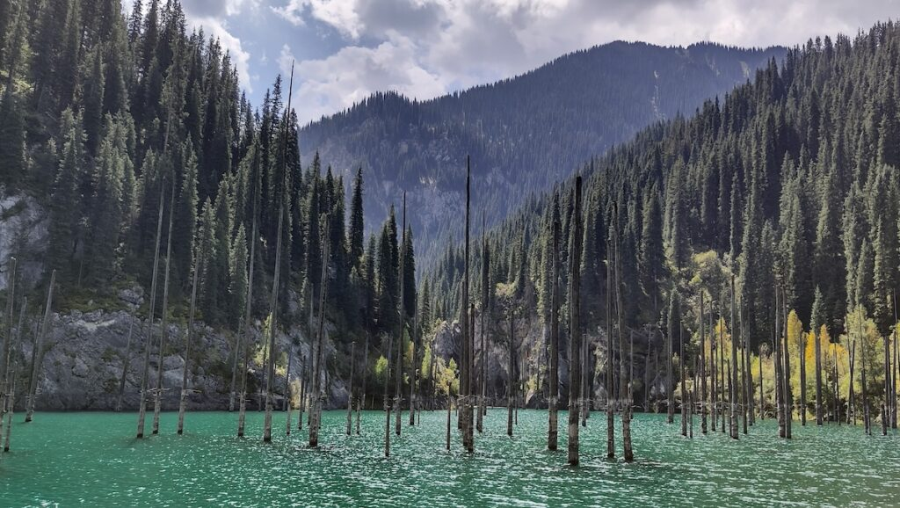
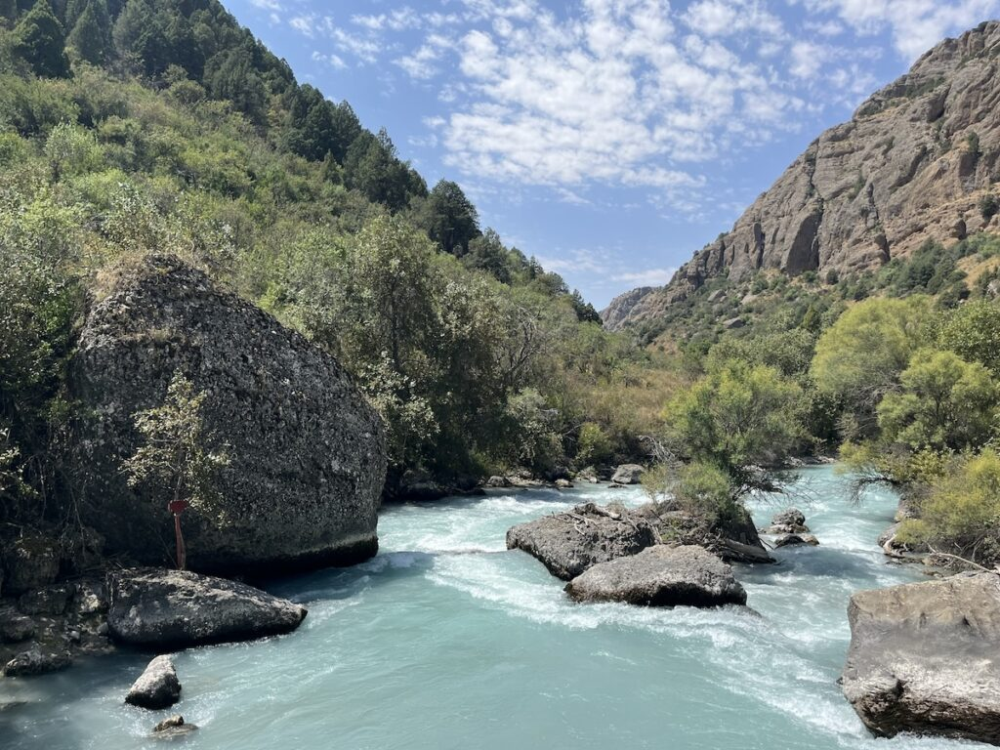
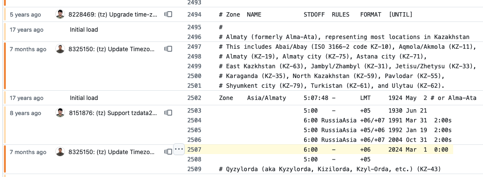

**A family vacation as a topic for a Foojay blog post? Really? Yes, because, very unexpectedly, it was influenced by a change in the OpenJDK project...**

Traveling to Kazakhstan
-----------------------

In August, our family vacation brought us to Kazakhstan. An important trip, as it is the birth country of our (now) 14 year old son. It was over 13 years that we had been there, and we planned to go back earlier, but some stupid virus messed up everyone's life a few years ago...

So finally, early this year, we decided to start organizing our trip. And it was amazing, visited different cities and national parks, and had a fantastic time.

<figure class="wp-block-gallery has-nested-images columns-default is-cropped wp-block-gallery-1 is-layout-flex wp-block-gallery-is-layout-flex">
 <figure class="wp-block-image size-large">
  
 </figure>
 <figure class="wp-block-image size-large">
  
 </figure>
 <figure class="wp-block-image size-large">
  
 </figure>
</figure>

*(yes, I may have walked around in a Foojay T-shirt and JVM cap)*

Flight Time Change
------------------

But why am I telling this story here on a technical, Java blog? Because we almost missed our flight home, and that wouldn't have happened if I had paid more attention to a specific change in one of the latest Java release notes...!

In 2023, I wrote the blog post "[Time Zone and Currency Database in JDK](https://www.azul.com/blog/time-zone-and-currency-database-in-jdk/)" for the Azul website. In that post, I explained how the OpenJDK sources contain a full database with information and the full history of timezones, daylight savings, and currencies. I even gave the example of the change in January 2023 with the currency of Croatia changing from the Kuna to the Euro.

Apparently, something similar happened when [IANA database 2024a](https://www.iana.org/time-zones) got integrated into OpenJDK with JDK-8325150: "(tz) Update Timezone Data to 2024a". That ticket contains several changes, including: "Kazakhstan unifies on UTC+5 beginning 2024-03-01." Indeed, Kazakhstan changed their timezone on March 1st of this year! You can find the [changed data here](https://github.com/openjdk/jdk/blame/master/src/java.base/share/data/tzdata/asia#L2507), modified by [commit 917838e](https://github.com/openjdk/jdk/commit/917838e0a564b1f2cbfb6cc214ccbfd1a237019f).

Because we wanted to be sure of a good price for our plane tickets, we bought them well in advance, in January. For our flight back, we had a departure time of **05:20** . But because of the time zone change, that flight actually departed at **04:20**, an hour earlier. Because of delays, we didn't notice that change in the arriving flight...

Luckily we checked the departure time the day before as we had to leave the hotel in the middle of the night. According to our trip organizer we were not the first ones who got confused about changed flight times in Kazakhstan this year.

Conclusion
----------

Is Kazakhstan worth a visit? Definitely! Take your time and travel around as it's a very big country with a lot of beautiful spots. And, before you leave for your next trip, double-check the tickets and the OpenJDK code to validate the times 😉
