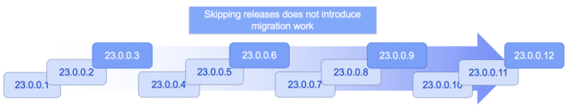

**In today's production environments, it is not only expected, but critical to keep your technology stack as up-to-date as possible.**

Staying current helps to mitigate security risks, while also benefiting from bug fixes, performance improvements, and new features and function that can help drive your business's success.

This is true whether you're deploying to a cloud or locally, and applies regardless of the deployment type, whether container images, VMs, or bare metal.

## The challenge of keeping microservices up to date

Updating an application runtime is, however, typically a grueling task to undertake. With each new version, breaking changes can be introduced that directly impact your application, your configuration, or your operations. Breaking changes translate to significant development effort being needed to re-run all the tests and address any regressions. Similarly, the operations team also need to ensure that all their automation still works with the new version, and that it remains compatible with their target deployment environment.



Now multiply these concerns by the hundreds or thousands of deployments of your microservices, each containing an instance of the application runtime, and it's no wonder that many applications remain on old versions and teams pursue upgrades only when deemed absolutely necessary. This growing technical debt not only delays the benefits provided by newer releases, including security fixes, but can also snowball into making the eventual migration process that much more difficult and risky.

Although container image scanning is improving, containers can further exacerbate the problem by obfuscating old, possibly unsupported, runtimes and dependencies. Teams might not even be aware of an aging runtime and the potential security risks it could pose.

## Zero-migration architecture

This is where the benefit of a [zero-migration architecture](https://openliberty.io/docs/latest/zero-migration-architecture.html?utm_source=foojay&utm_medium=article&utm_id=zeromigration "zero-migration architecture") comes in. Zero migration is a core design principle of the [Open Liberty](https://openliberty.io/?utm_source=foojay&utm_medium=article&utm_id=zeromigration "Open Liberty") Java application runtime and it seeks to make updating the application runtime quick and easy.

Zero migration ensures that a valid runtime configuration from one Liberty release functions the same for all future releases. This means that you're able to update the Liberty application runtime and gain all the benefits of the newer version: security and bug fixes, performance enhancements, and new functionality and features, but without any disruption to your existing application logic and operations.

## How does zero-migration architecture work?

New versions of the application runtime (Liberty, in our case) only add new capabilities; new versions never remove or change existing capabilities. So the configuration that you create for your application today will work and behave in the same way for every future version.

### Modularity

Modularity is essential here. For Liberty, *features* are what provide its modularity. Each Liberty capability is associated with a feature; for example, the Admin Center feature provides an administrative GUI, and the Audit feature provides tracking of auditable events. Features are composed of the feature name and the feature version, which you specify in the [configuration files](https://openliberty.io/docs/latest/reference/config/server-configuration-overview.html?utm_source=foojay&utm_medium=article&utm_id=zeromigration "configuration files") (e.g. `server.xml` file) for the Liberty instance on which the application runs. The versions of the features are not tied to the version of Liberty.

You can upgrade the version of Liberty on which your application runs (e.g. to get a security update) without upgrading the versions of the features that the application uses. Whenever a breaking change needs to be introduced into a feature, its feature version is incremented, but Liberty continues to support all previous feature versions as well as the new feature version. This means that you control if and when you want your application to use a newer version of the feature.

For example, if your application is using MicroProfile Config 2.0 (the `mpConfig-2.0` feature), it's up to you if and when you want to move up to `mpConfig-3.0`, `mpConfig-3.1`, or any other future versions of MicroProfile Config. Your application can continue to use `mpConfig-2.0` while Liberty receives updates, including bug and security fixes, new features and functionality, and performance enhancements.

## Easily upgrade to a new version of Liberty

A new version of Liberty is released every four weeks, though you can skip one or more versions when upgrading. So upgrading to a new Liberty version has to be easy, yet decoupled from the feature versions.

Our prebuilt [Liberty container images](https://openliberty.io/docs/latest/container-images.html?utm_source=foojay&utm_medium=article&utm_id=zeromigration "Liberty container images") are rebuilt weekly, pulling in any Java and UBI fixes that have been released since the previous build of the image. Just update the version tag or image digest to point to the new version of Liberty and then [rebuild your image](https://openliberty.io/docs/latest/container-images.html?utm_source=foojay&utm_medium=article&utm_id=zeromigration#build "rebuild your image").

In a development environment, update the `version` attribute in the `runtimeArtifact` parameter in your `pom.xml` file or the `libertyRuntime` dependency in your `build.gradle` file. If you don't specify the Liberty version in Maven or Gradle, it defaults to the latest version available in the repository.

After upgrading, your application configuration remains unchanged so that your app continues to run using the same versions of the features that it uses (zero migration). When you're ready to upgrade the feature version, you can change the feature version number in the app's server configuration file (`server.xml`) and then test that the app still runs as expected and make any modifications needed to the source code.

## Caveats

It wouldn't be the full story without the caveats. Thankfully, in Liberty, there are only a few and they mainly relate to important security fixes and circumstances outside of the control of the Liberty developers:

Exceptions:

* Security fixes: Whenever we perform a security hardening or patching, we try to maintain the existing behavior of Liberty, configuration, or features. When this is not possible, we work to limit the scope of the change to only what is needed to address the security concern.

Out of scope of Liberty's zero migration policy:

* Third-party API requirements: Updates to third-party components are not guaranteed to be compatible with earlier Liberty versions.
* Undocumented configuration properties: Configuration options not documented in our platform's documentation can cause issues if used---and might even be removed or changed at any time. An example would be any beta functionality.
* Incompatible Java changes: While rare, breaking changes in new Java SE versions can sometimes affect your application.

If you're running your applications in a business production environment and you find yourself unable to quickly move to a newer version of Liberty, but need a specific bug or security fix, a [paid subscription with IBM](https://openliberty.io/support/?utm_source=foojay&utm_medium=article&utm_id=zeromigration "paid subscription with IBM") means you can contact IBM Support to receive an iFix that you can apply to your existing supported version. That iFix is then included in future releases of Liberty, meaning you won't need to reapply it when you do move to the latest version.

## Summary: Zero migration vs technical debt

Zero migration not only reduces your technical debt, the overhead of keeping a runtime current, but in many cases eliminates it entirely, allowing you to focus on the higher value items of development and operations.

From the start, we designed Liberty to be modular and to follow this principle of zero-migration architecture to make it easy to upgrade without breaking or even changing your running applications.

If you're not familiar with Open Liberty, it is a small, lightweight Java application runtime designed with modern cloud-native application development in mind. It supports the full MicroProfile and Jakarta EE APIs and is composable, meaning that you can use only the features that you need and keep everything lightweight, which is great for microservices. It also deploys to every major cloud optimized-platform, including Docker, Kubernetes, and Cloud Foundry. You can give it a go with our [Open Liberty Getting Started guide](https://openliberty.io/guides/getting-started.html?utm_source=foojay&utm_medium=article&utm_id=zeromigration).

(*Image by [Aristal](https://pixabay.com/illustrations/frustrated-man-laptop-hands-on-face-8836744/).)*
