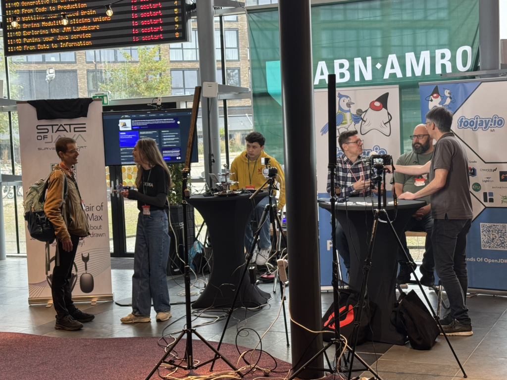
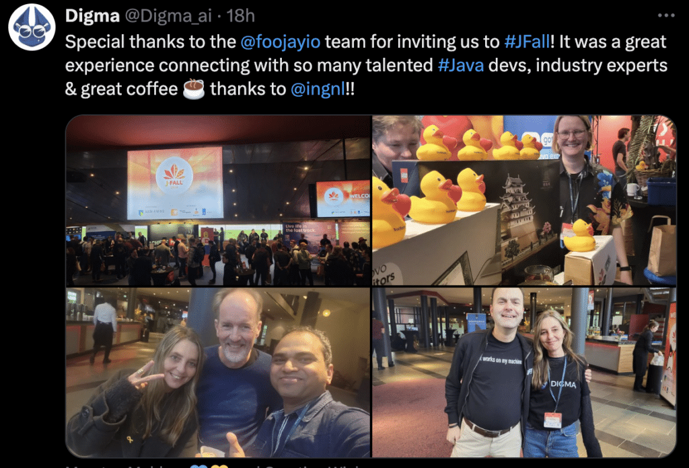
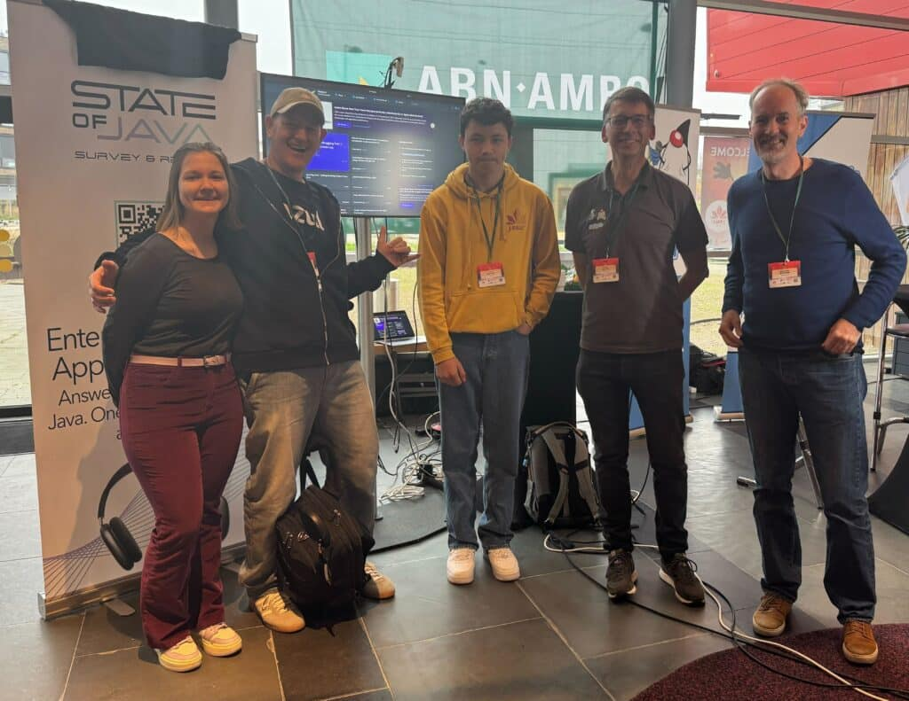

Last week [JFall](https://jfall.nl/)---the "Biggest Java Conference of the Netherlands"---took place. Foojay.io, the Friends of OpenJDK, were there in full force, including a booth with stickers and other swag, as well as Frank Delporte with his popular Foojay.io Podcast, doing live interviews with attendees.

Not only Frank was present throughout the day, doing interviews for upcoming podcast episodes, but so was his 14-year-old son Vik (in yellow sweater in the pic above), handling the technical side and directing the interviews like a true and enthusiastic professional.

You can find all the interviews [in this YouTube playlist](https://www.youtube.com/watch?v=31bhIAR_oc4&list=PL-3Bf_FLNZLAZzQ0hdt6nzV5wH-jQKWSf) and these will be bundled in the next Foojay.io podcasts.



What was also great is that Digma, in the form of [Lee Sheinberg](https://www.linkedin.com/in/leesheinberg/), actively participated in the Foojay.io booth too, i.e., Foojay.io is a global network of enthusiastic Java and, more broadly, OpenJDK developers, which was reflected in the participation at the booth.

It was also an opportunity for [Nataliia Dziubenko](http://Nataliia Dziubenko), new engineer at Azul, to meet several of her new colleagues in person, such as Gerrit, Frank, and myself.

There was also an ongoing Java survey, more about that later when the Java survey results are released, however, a raffle for Apple AirPods Max was held throughout the day.

**And the winner is, plus he has already been notified, [Jan Brekelmans](https://www.linkedin.com/in/jan-brekelmans/), senior consultant at [SynTouch in Eindhoven](https://www.syntouch.nl/)!**

It was a great day, with a lot of reconnecting to new and existing (not old!) friends, a solid basis for more Foojay.io booths at conferences, just like this and last year at JFall, with many thanks to NLJUG, the organizer, and especially Richelle Bussenius and Sander Aarts, both from [Reshift](https://www.reshift.nl/), for the fantastic support at the booth.
