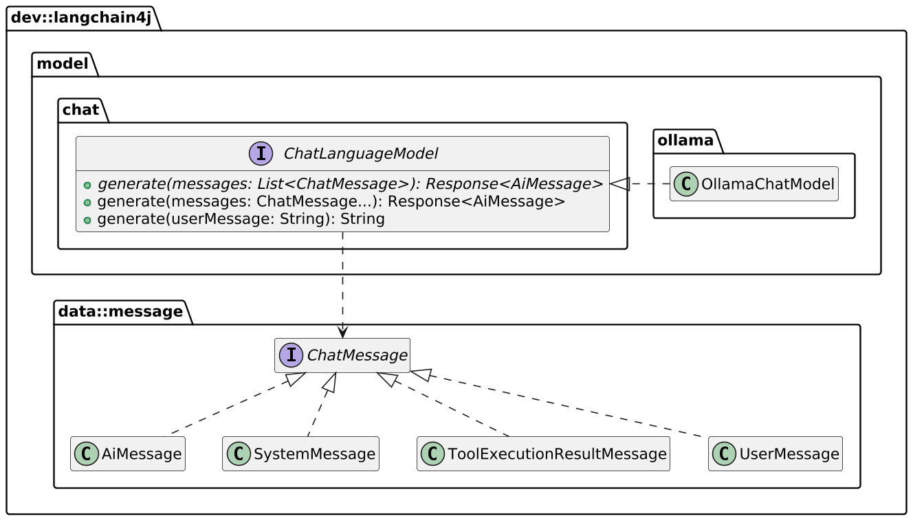
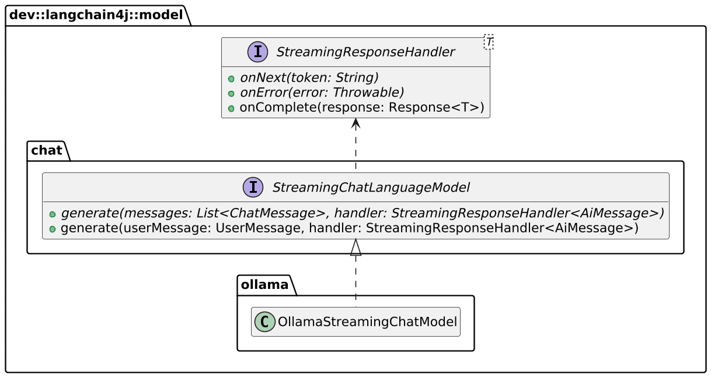
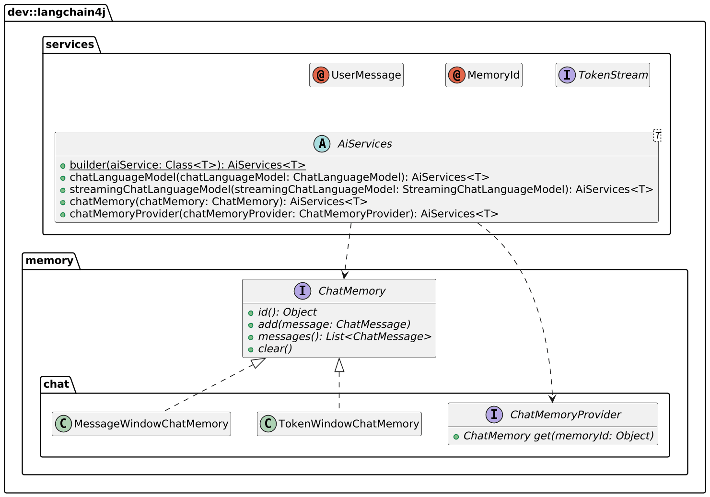

I'm coming relatively late to the LLM party, but I rarely come very early in the hype cycle.


For example, I never bought into blockchain, the solution still searching for problems to solve, nor in microservices, the latest in the cargo cult IT trends. Despite my late arrival at the LLM party, I have been a regular user of LLMs. I use OpenAI for non-controversial questions outside my cone of knowledge, *e.g*., linguistics or legal; I use GitHub Copilot in my IDE to improve my code.

The main focus of this post is to integrate a chatbot into my application and explore its capabilities.

## Choosing a LLM

A plethora of LLMs is available at the moment. I mentioned OpenAI, but plenty of others beg for your attention: Google Gemini, Cohere, Amazon Bedrock, ad nauseam. Each has pros and cons, which are irrelevant to this introductory post.

My main requirement in the context of this post is that it needs to run locally. Besides, I want an abstraction layer over the LLM to learn the abstractions, not the specifics.

I chose [LangChain4J](https://docs.langchain4j.dev) and [Ollama](https://ollama.com/) because they are well-known and meet my specific requirements for this project.

## Quick introduction to LangChain4J and Ollama

Here's how LangChain4J introduces itself in its own words:
> The goal of LangChain4j is to simplify integrating LLMs into Java applications.
>
> Here's how:
>
> 1. **Unified APIs**: LLM providers (like OpenAI or Google Vertex AI) and embedding (vector) stores (such as Pinecone or Milvus) use proprietary APIs. LangChain4j offers a unified API to avoid the need for learning and implementing specific APIs for each of them. To experiment with different LLMs or embedding stores, you can easily switch between them without the need to rewrite your code. LangChain4j currently supports 15+ popular LLM providers and 20+ embedding stores.
> 2. **Comprehensive Toolbox**: Since early 2023, the community has been building numerous LLM-powered applications, identifying common abstractions, patterns, and techniques. LangChain4j has refined these into a ready to use package. Our toolbox includes tools ranging from low-level prompt templating, chat memory management, and function calling to high-level patterns like AI Services and RAG. For each abstraction, we provide an interface along with multiple ready-to-use implementations based on common techniques. Whether you're building a chatbot or developing a RAG with a complete pipeline from data ingestion to retrieval, LangChain4j offers a wide variety of options.
> 3. **Numerous Examples**: These examples showcase how to begin creating various LLM-powered applications, providing inspiration and enabling you to start building quickly.
>
> ---- <https://docs.langchain4j.dev/intro>

Ollama's introduction is even shorter:
> Get up and running with large language models.
>
> Run Llama 3.2, Phi 3, Mistral, Gemma 2, and other models. Customize and create your own
>
> ---- <https://ollama.com/>

One runtime, multiple models.

## Getting our feet wet

I'll split this section into the LangChain4j app and the Ollama infrastructure.

### The LangChain4j app

LangChain4j provides a Spring Boot integration starter. Here's our minimal dependencies:

```xml
<dependencies>
    <dependency>
        <groupId>org.springframework.boot</groupId>
        <artifactId>spring-boot-starter-web</artifactId>
    </dependency>
    <dependency>
        <groupId>dev.langchain4j</groupId>
        <artifactId>langchain4j-ollama-spring-boot-starter</artifactId>
        <version>0.35.0</version>
    </dependency>
</dependencies>
```

LangChain4j offers an abstraction API over the specifics of different LLMs. Here's a focus on what we will use in this section:



The fundamental API `model.generate(String)` passes the user's message to the Ollama instance and returns its response. We need to create an endpoint to wrap the call; the details are unimportant.

LangChain4J's Spring Boot starter automatically creates a `ChatLanguageModel` from the exact dependency set - here, Ollama. Furthermore, it offers lots of configuration options via Spring Boot.

```yaml
langchain4j.ollama.chat-model:
  base-url: http://localhost:11434                                       #1
  model-name: llama3.2                                                   #2
```

1. Point to the running Ollama instance
2. Model to use

When the app starts, LangChain4j creates a bean of type `ChatLanguageModel` and adds it to the context. Note that the concrete type depends on the dependency found on the classpath.

### The Ollama infrastructure

For ease of use, I'll use Docker, and more specifically Docker Compose. Here's my Compose file:

```yaml
services:
  langchain4j:
    build:
      context: .
    environment:
      LANGCHAIN4J_OLLAMA_CHAT_MODEL_BASE_URL: http://ollama:11434        #1
    ports:
      - "8080:8080"
    depends_on:
      - ollama
  ollama:
    image: ollama/ollama                                                 #2
    volumes:
      - ./ollama:/root/.ollama                                           #3
```

1. Override the URL configured in the JAR to use the Docker container on Docker Compose
2. Use the latest images; it's not production
3. Keep a copy of the models on the host - see below

As mentioned above, Ollama is a runtime with switchable models. There's no model by default. To download a model, `docker exec` into the container and run the following command:

```bash
ollama run llama3.2
```

Be careful, `llama3.2` is a whopping 20Gb; for this reason, you want to avoid downloading the model from each `docker compose up`. This is the reason for the volume mapping above.

Of course, you can substitute `llama3.2` with any other smaller model, *e.g* ., `tinyllama`.

At this point, we can `curl` our app and see the results:

```bash
curl localhost:8080 -d 'Hello I am Nicolas and I am a DevRel'
```

## Enhancing with streaming

The above solution works, but the user experience has room for improvement. The command hangs, and the response comes after several seconds, unlike the traditional OpenAI UI, which streams tokens back to the user.

We can readily replace `ChatLanguageModel` with `StreamingChatLanguageModel` to achieve this. Methods are slightly different:



We need to change the app configuration accordingly:

```yaml
services:
  langchain4j:
    build:
      context: .
    environment:
      LANGCHAIN4J_OLLAMA_STREAMING_CHAT_MODEL_BASE_URL: http://ollama:11434 #1
    ports:
      - "8080:8080"
    depends_on:
      - ollama
```

1. Was formerly `LANGCHAIN4J_OLLAMA_CHAT_MODEL_BASE_URL`

In parallel, we must migrate from Spring Web MVC to Spring Webflux. Then, we pipe the LLM result stream to the app result stream like so:

```kotlin
class AppStreamingResponseHandler(private val sink: Sinks.Many<String>) : StreamingResponseHandler<AiMessage> {

    override fun onNext(token: String) {                                 //1
        sink.tryEmitNext(token)
    }

    override fun onError(error: Throwable) {                             //1
        sink.tryEmitError(error)
    }

    override fun onComplete(response: Response<AiMessage>) {             //2
        println(response.content()?.text())
        sink.tryEmitComplete()
    }
}

class PromptHandler(private val model: StreamingChatLanguageModel) {

    suspend fun handle(req: ServerRequest): ServerResponse {
        val prompt = req.awaitBody<String>()                             //3
        val sink = Sinks.many().unicast().onBackpressureBuffer<String>() //4
        model.generate(prompt, AppStreamingResponseHandler(sink))        //5
        return ServerResponse.ok().bodyAndAwait(sink.asFlux().asFlow())  //6
    }
}
```

1. Pipe tokens and errors to the sink
2. The function is **not** abstract and does nothing; hence, it won't close the stream. Remember to override it.
3. Get the request body asynchronously
4. Create a the sink
5. Call the model and pass the sink as a reference
6. Return the sink

We can now use curl in stream mode with the `-N` flag:

```bash
curl -N localhost:8080 -d 'Hello I am Nicolas and I am a DevRel'
```

The result is already better!

## Remembering history

Every chatbot request is independent of others at this stage - they don't keep a context. Chat history is an important feature that we miss from off-the-shelf AI assistants. We need to refactor the app in two directions: first, store each message from the user and the model, and second, compartmentalize users' histories from each other.

I started to store the history by myself in memory at first. If interested, check the commit history to see how I did it. However, LangChain4j offers an integrated approach via its `AiServices` class. `ChatLanguageModel` represents the basic request-response interface to the LLM, while `AiServices` wraps additional services: chat memory, RAG, and external function calls.



Here's the relevant code:

```kotlin
data class StructuredMessage(val sessionId: String, val text: String)    //1

interface ChatBot {                                                      //2
    fun talk(@MemoryId sessionId: String, @UserMessage message: String): TokenStream //3-4-5
}

class PromptHandler(private val chatBot: ChatBot) {

    suspend fun handle(req: ServerRequest): ServerResponse {
        val message = req.awaitBody<StructuredMessage>()
        val sink = Sinks.many().unicast().onBackpressureBuffer<String>()
        chatBot.talk(message.sessionId, message.text)                    //6
            .onNext(sink::tryEmitNext)                                   //7
            .onError(sink::tryEmitError)                                 //7
            .onComplete { sink.tryEmitComplete() }                       //7
            .start()
        return ServerResponse.ok().bodyAndAwait(sink.asFlux().asFlow())
    }
}

fun beans() = beans {
    bean {
        coRouter {
            val chatBot = AiServices                                     //8
                .builder(ChatBot::class.java)
                .streamingChatLanguageModel(ref<StreamingChatLanguageModel>())
                .chatMemoryProvider { MessageWindowChatMemory.withMaxMessages(40) }
                .build()
            POST("/")(PromptHandler(chatBot)::handle)
        }
    }
}
```

1. We need a way to pass a correlation ID to group messages with the same chat history. Given we are using curl and not a browser, we explicitly pass an ID along with the user message
2. Define an interface with no hierarchy requirements. Functions are free-form, but you can set hints
3. `@MemoryId` marks the correlation ID
4. `@UserMessage` marks the message sent from the user to the model
5. `TokenStream` you can subscribe to
6. LangChain4j calls the configured model
7. Pipe the `TokenStream` to the sink as in our custom implementation
8. Build the `ChatBot`: `AiServices` will create the implementation at runtime

Here's how to use it:

```bash
curl -N -H 'Content-Type: application/json' localhost:8080 -d '{ "sessionId": "1", "message": "Hello I am Nicolas and I am a DevRel" }'
curl -N -H 'Content-Type: application/json' localhost:8080 -d '{ "sessionId": "2", "message": "Hello I am Jane Doe and I am a test sample" }'
```

## Adding Retrieval-Augmented Generation

LLMs are only as good as the data they are trained on, and there's a high chance you want your chatbot to be trained on your own custom data. RAG is the answer to this problem. The idea is to index content ahead of time, store it somewhere, and add the indexed data to the search - called retrieval. For more details, LangChain4j does a great job of [explaining RAG](https://docs.langchain4j.dev/tutorials/rag).

In this section, we will add an embryo of RAG to our app using data from my blog.

LangChain4j offers a dependency literally called [Easy RAG](https://docs.langchain4j.dev/tutorials/rag#easy-rag). It provides two sources, files and URLs, and an in-memory embedding store. In a regular app, you would index offline and store embeddings in a regular database, but we will do it in memory at startup time. It's good enough for our prototyping purposes.

```kotlin
class BlogDataLoader(private val embeddingStore: EmbeddingStore<TextSegment>) {

    private val urls = arrayOf(
        "https://blog.frankel.ch/speaking/",
        // Other URLs
    )

    @EventListener(ApplicationStartedEvent::class)                       //1
    fun onApplicationStarted() {
        val parser = TextDocumentParser()
        val documents = urls.map { UrlDocumentLoader.load(it, parser) }
        EmbeddingStoreIngestor.ingest(documents, embeddingStore)
    }
}

fun beans() = beans {
    bean<EmbeddingStore<TextSegment>> {
        InMemoryEmbeddingStore<TextSegment>()                            //2
    }
    bean {
        BlogDataLoader(ref<EmbeddingStore<TextSegment>>())               //3
    }
    bean {
        coRouter {
            val chatBot = AiServices
                .builder(ChatBot::class.java)
                .streamingChatLanguageModel(ref<StreamingChatLanguageModel>())
                .chatMemoryProvider { MessageWindowChatMemory.withMaxMessages(40) }
                .contentRetriever(EmbeddingStoreContentRetriever.from(ref<EmbeddingStore<TextSegment>>())) //4
                .build()
        }
    }
}
```

1. Run the code when the application starts
2. Define the embedding store. Regular applications should use a persistent data store: LangChain4j supports [more than a few](https://docs.langchain4j.dev/tutorials/embedding-stores).
3. Inject the store in the loader code
4. Configure the chatbot to retrieve data from the store

We can test the RAG by asking questions related to the documents ingested.

On OpenAI, I asked, "What books did Nicolas Fränkel write?". It answered: Learning Vaadin (correct), Spring Security in Action (could be, but it's hallucinating), and Mastering Java EE Development with WildFly (no chance, and it's hallucinating again).

Let's do the same on the RAG'ed app:

```bash
curl -N -H 'Content-Type: application/json' localhost:8080 -d '{ "sessionId": "1", "message": "What books did Nicolas Fränkel write?" }'
```

The answer is much better:
> The provided information doesn't mention specific books written by Nicolas Fränkel. It only provides metadata for his blog, which has a section dedicated to his "Books". ...​

It's not really correct—I actually mentioned that I wrote the books mentioned, but it's at least not hallucinating.

## Conclusion

In this post, I showed how to start your Langchain4j journey in several incremental steps.

First, we used Langchain4j as a simple façade over Ollama.

Then, we switched to streaming tokens. We refactored the codebase to add chat history using Langchain4j's abstractions.

We finished the demo by adding RAG via a simple in-memory store and static links.

The complete source code for this post can be found on [GitHub](https://github.com/ajavageek/langchain4j-musings).

**To go further**:

* [LangChain4j](https://docs.langchain4j.dev)
* [Ollama](https://ollama.com/)
* [Streaming with REST API for LangChain Applications](https://chalise-arun.medium.com/streaming-with-rest-api-for-langchain-applications-f3a164a207d7)

*Originally published at [A Java Geek](https://blog.frankel.ch/langchain4j-musings/) on November 10^th^, 2024*
