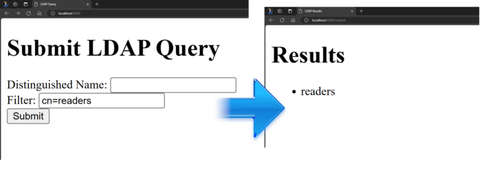

**LDAP (Lightweight Directory Access Protocol)** is essential for managing and accessing directory information in Java web applications. However, it's crucial to understand and prevent **LDAP Injection**, a serious security vulnerability that can lead to unauthorized access and data breaches.

Following **OWASP Recommendations** , such as validating user inputs and using parameterized queries, is vital for securing your applications. In this article, we'll dive into LDAP, explore LDAP Injection, share OWASP's best practices, and demonstrate secure coding in **Spring Boot**.

## Summary

1. Introduction to LDAP
2. Understanding LDAP Injection
3. OWASP Recommendations
4. Coding Demonstration

## 1️⃣ Introduction to LDAP (Lightweight Directory Access Protocol)

### ☝️ What is LDAP?

**LDAP stands for Lightweight Directory Access Protocol.** It is used to access and manage directory information over a network. **Think of it like a digital phone book** ☎📙—but much more versatile and scalable.

### 🔐 What is LDAP Used For?

**LDAP is commonly used** in IT environments **for**:

* Authentication
* Authorization
* **Centralized User Management**

For example, when you log into a corporate network, LDAP plays a crucial role in verifying your credentials and granting access.

### ⚙️ How Does LDAP Work?

**Imagine LDAP as a tree**:

* Roots: e.g., 

```
dc=example, dc=com
```

* Branches: Like departments 

```
cn=readers
```

* Leaves: Entries like users, printers, or shared resources

LDAP organizes data hierarchically, making it easy to query and retrieve specific information efficiently.

### Why is LDAP Important?

* LDAP simplifies user management.
* LDAP provides a single source of truth for user data.

## 2️⃣ What is LDAP Injection?

### LDAP Injection

LDAP Injection is a**type of injection attack that exploits user input**. If the input is not properly validated, attackers can access unauthorized data.

### How Does LDAP Injection Work?

You typically input a filter like this:

```
cn=readers
```

. If the input is

```
cn=*
```

, you get access to all the data, potentially **exposing sensitive information** .

### How to Prevent LDAP Injection?

* **Sanitize User Input**
* **Escape special** LDAP **characters** like

```
*, (, ), and .
```

## 3️⃣ OWASP Recommendations

According to OWASP, the distinguished name (DN) and the search filter have their own sets of meta-characters, which should be escaped to prevent injection attacks.

### Escaping Distinguished Name:

```java
public static String escapeDN(String name) {
      StringBuffer sb = new StringBuffer(); // If using JDK >= 1.5 consider using StringBuilder
      if ((name.length() > 0) && ((name.charAt(0) == ' ') || (name.charAt(0) == '#'))) {
          sb.append('\\'); // add the leading backslash if needed
      }
      for (int i = 0; i < name.length(); i++) {
          char curChar = name.charAt(i);
          switch (curChar) {
              case '\\':
                  sb.append("\\\\");
                  break;
              case ',':
                  sb.append("\\,");
                  break;
              case '+':
                  sb.append("\\+");
                  break;
              case '"':
                  sb.append("\\\"");
                  break;
              case '<':
                  sb.append("\\<");
                  break;
              case '>':
                  sb.append("\\>");
                  break;
              case ';':
                  sb.append("\\;");
                  break;
              default:
                  sb.append(curChar);
          }
      }
      if ((name.length() > 1) && (name.charAt(name.length() - 1) == ' ')) {
          sb.insert(sb.length() - 1, '\\'); // add the trailing backslash if needed
      }
      return sb.toString();
  }
```

### Escaping Filter:

```java
public static final String escapeLDAPSearchFilter(String filter) {
      StringBuffer sb = new StringBuffer(); // If using JDK >= 1.5 consider using StringBuilder
      for (int i = 0; i < filter.length(); i++) {
          char curChar = filter.charAt(i);
          switch (curChar) {
              case '\\':
                  sb.append("\\5c");
                  break;
              case '*':
                  sb.append("\\2a");
                  break;
              case '(':
                  sb.append("\\28");
                  break;
              case ')':
                  sb.append("\\29");
                  break;
              case '\u0000': 
                  sb.append("\\00"); 
                  break;
              default:
                  sb.append(curChar);
          }
      }
      return sb.toString();
  }
```

For more detailed guidelines, visit: <https://wiki.owasp.org/index.php/Preventing_LDAP_Injection_in_Java>

## 4️⃣ Coding Demonstration

**Here's a quick demo** of those escaping methods and how they function:

### 🚀 Starting the LDAP Server

```bash
docker run --detach --rm --name openldap5 -p 1389:1389 
--env LDAP_ADMIN_USERNAME=admin 
--env LDAP_ADMIN_PASSWORD=adminpassword 
--env LDAP_USERS=customuser 
--env LDAP_PASSWORDS=custompassword 
--env LDAP_ROOT=dc=example,dc=org 
--env LDAP_ADMIN_DN=cn=admin,dc=example,dc=org bitnami/openldap:latest
```

OpenLDAP Image: <https://hub.docker.com/r/bitnami/openldap>  

### 🧪 Testing the LDAP Server

#### Open a terminal session to the OpenLDAP container

```

```

`docker exec -it -u root openldap5 /bin/bash`

#### Navigate to the database files folder:

`cd /bitnami/openldap/slapd.d/cn=config/`

#### Verify entries:

`ldapsearch -x -H ldap://localhost:1389 -D "cn=admin,dc=example,dc=org" -W -b "dc=example,dc=org" -s sub "(objectclass=*)"`

*password: **adminpassword***  



Entries in LDAP

### 🍃 Spring Boot part

* **I created a Spring Boot** application using Spring Initializer, **including** dependencies for**Web, LDAP, and Thymeleaf** .  
  [](https://uploads.strikinglycdn.com/files/6d011c45-5775-4276-9d55-af400cd5a7ef/ladp-3.png?t=1733143487&id=4207982 "Spring Boot dependencies")  
  This **lets me input the filter** and distinguished names (DN)**in the** Thymeleaf **form** . The form **then directs to a Spring Boot endpoint** , **which initiates the search** **in the** Open **LDAP** server.

<!-- -->

* **Initially** ,**I input a valid value** such as `cn=readers` into the form, and the form responds correctly.



* **Next** ,**I input a prohibited value** `cn=*` into the form, and due to the escaping methods, it effectively blocks the rendering of all LDAP data.


* **Without** these escaping methods, we would have accessed **prohibited data.** 😱


## **👨‍💻 The related code:**

```java
@PostMapping("/submit")
   public String submitForm(@ModelAttribute LdapRequest ldapRequest, Model model) {
       try {
           // Debug logging for distinguishedName and filter
           String distinguishedName = ldapRequest.getDistinguishedName();
           System.out.println( "Distinguished Name: " + distinguishedName );
           String filter = ldapRequest.getFilter();
           System.out.println( "Filter: " + filter );

           //Protection BEGIN
           distinguishedName = LdapUtils.escapeDN( distinguishedName );
           System.out.println( "Sanitized Distinguished Name: " + distinguishedName );
           filter = LdapUtils.escapeLDAPFilter( filter );
           System.out.println( "Sanitized Filter: " + filter );
           //Protection END

           // Execute LDAP query
           List<String> results = ldapTemplate.search(
                   distinguishedName,
                   filter,
                   (AttributesMapper<String>) attrs -> attrs.get("cn").get().toString()
                                                     );
           model.addAttribute("results", results);
       } catch (Exception e) {
           model.addAttribute("error", e.getMessage());
       }
       return "result";
   }
```

from <https://github.com/vinny59200/java-ldap-prevention>

## **📺 Demo Video on YouTube:**



## **🙏 Thanks for Reading!**

This article provided a comprehensive overview of LDAP, its importance, the risks associated with LDAP Injection, and how to prevent it. By following these guidelines, you can ensure that your LDAP implementations are secure and robust.

## 🌐 Related

<https://foojay.io/today/top-security-flaws-hiding-in-your-code-right-now-and-how-to-fix-them/>
