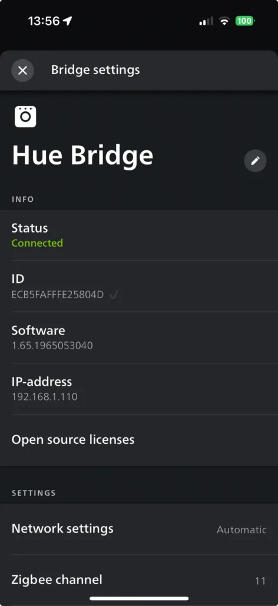
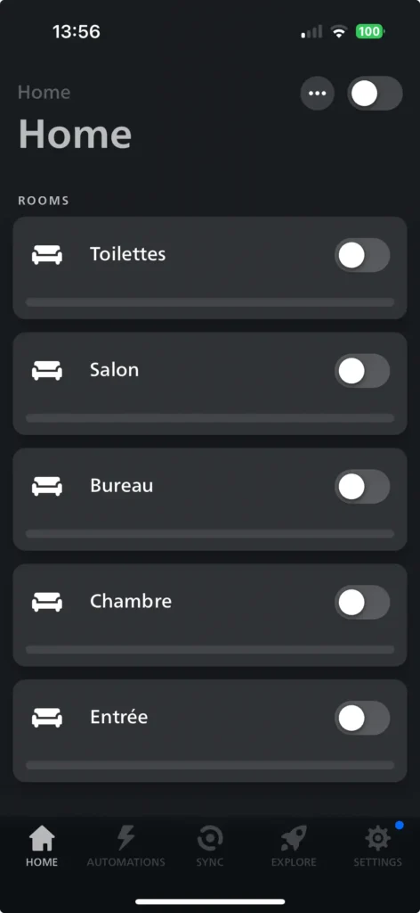
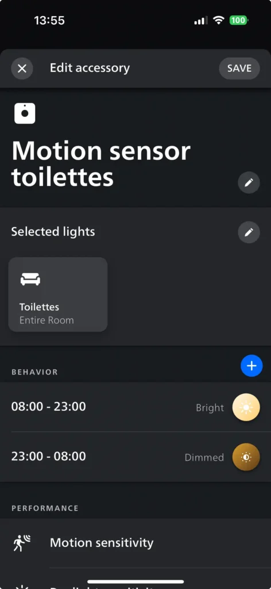
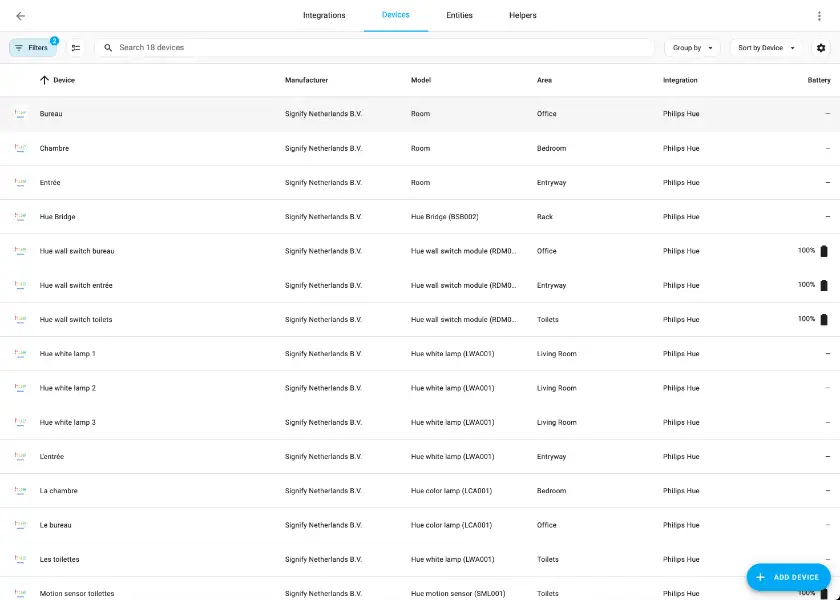
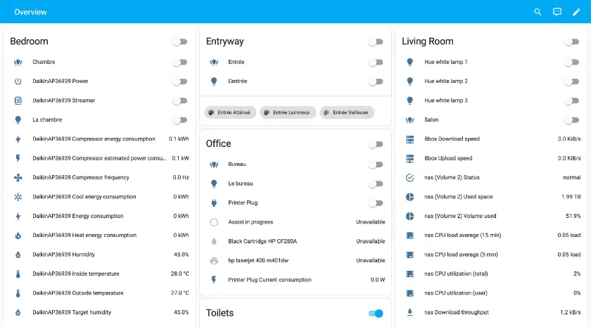
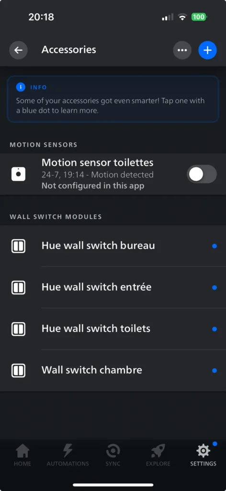
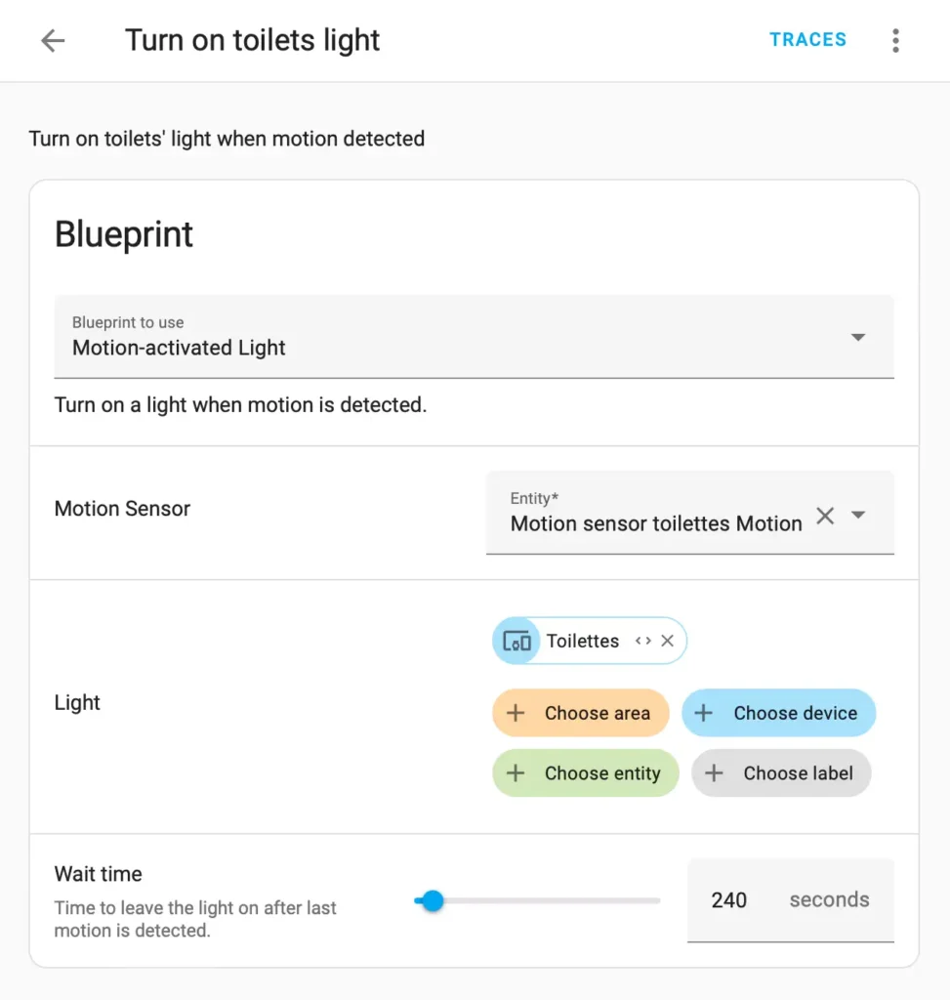

I've been the happy owner of several Philips Hue-connected lights for a few years. Some of them are coloured, some of them regular. In addition, I bought a sensor to go along with the light I installed in my toilets: it turns on automatically when it detects a movement there.

In this post, I want to document how I replaced the proprietary automation with Home Assistant's.

## The current Philips Hue automation

I mentioned the light and the sensor in the introduction. To manage both directly or via Google Home, you **need** an additional component - the Hue Hub. The Hub needs an Ethernet connection, but you can't connect it to Wifi.

The next step is to register the device. Installing the dedicated Philips Hue app on your phone or tablet is the first step. Once installed, you can proceed to register the Hub itself. You must then register the Hub itself.



You must long push the button on top of the hub, probably for security reasons. If everything goes well, as it did for me, you should see your devices on the app.



The process goes the same for the motion sensor. After registering it, you can configure it to turn on the light when it detects motion. Even better, you can set the light's intensity (and colour if it's a coloured bulb) to adapt to the time of the day. Indeed, it's better to have a low-intensity reddish light at night to keep your [melatonin](https://en.wikipedia.org/wiki/Melatonin).



## Migrating to Home Assistant

We will migrate step-by-step, as I did, to show you how straightforward and manageable it is. The first mandatory step is to add the Philips Hue integration.

### Integrating Philips Hue

Go to the left `Settings` menu, then select the `Devices & services` item on the screen. The opening window displays four tabs: *Integrations* , *Devices* , *Entities* , and *Helpers* . The default tab is *Integrations* : click the `Add Integration` button at the bottom left corner.

Select `Philips > Hue`, then configure the IP of the Hue Hub. After Home Assistant has detected the latter, it will display it and all associated devices.

Note that you can add multiple hubs, even though one hub can manage (a bit more than) fifty connected devices. At this point, Home Assistant should display every device added to your Hub.



At this point, the devices appear in your default dashboard overview. I'll probably write about it in a later post. Suffice it to say that the default dashboard overview automatically displays every device added.



We can now turn on the lights via Home Assistant's UI.

### Binding the light to the sensor

Before binding the light to the sensor in Home Assistant, we must unbind it in the proprietary Hub. Go to the `Settings > Accessories` menu in the Philips app. Select the motion sensor and click the `Configure in another app` button. You can ensure it's unbound if the sensor now appears in the previous screen with a *Not configured in this app* label. Additionally, the slider should be disabled.



We are now ready to bind the light to the sensor **in Home Assistant** via an `Automation`. I mentioned `Automation` objects in the [previous post on concepts](https://blog.frankel.ch/home-assistant/2/#other-objects). As a reminder, an `Automation` consists of three components:

1. A *when* condition, the event that triggers the automation
2. A *then* clause, what to do when the event happens
3. An optional `if` condition.

Each component can consist of one or multiple components assembled via boolean logic.

It's time to dive a bit deeper.

You can create an automation via the UI by going to the `Settings > Automations & scenes` menu. It brings you to a screen with three tabs; `Automations` is the default. Click on the bottom right `Create Automation`. The `Automation` is so standard that it has a dedicated menu item!



The non-generic menu items use a `Blueprint`. I'll keep the explanation of `Blueprint` objects for a later post; suffice to say for now that it's akin to a *template*.



It's pretty straightforward to configure it. The `Blueprint` is already selected. You must choose your motion sensor and the light(s) you want to turn on. The UI lists all available choices for the former. For the latter, you can choose a single light `Device` or a group in an `Area` or via a `Label`. The final parameter is self-describing: "Time to leave the light on after last motion is detected." Click on `Save`.



Congratulations, you've successfully implemented your first automation! It's a significant step in your journey with Home Assistant, and it's just the beginning of what you can achieve. When the sensor detects a motion, it sends the event to Home Assistant. The latter sees there's a related automation and turns on the light. It also starts a timer and resets it every time it receives an event from the sensor. When it reaches zero, it turns the light off.

You can achieve this by directly writing the YAML configuration. Locate the file `automation.yaml` file; by default, it should be under the `/config` folder. It displays the newly created automation:

```yaml
- id: '1719829445000'
  alias: Turn on the toilet light
  description: Turn on the toilet's light when motion is detected
  use_blueprint:
    path: homeassistant/motion_light.yaml
    input:
      motion_entity: binary_sensor.motion_sensor_toilettes_motion
      light_target:
        device_id: 0bd1f534865dae40ae66b805c9b2c499
      no_motion_wait: 240
```

You can update the YAML snippet, but creating a new automation entry in YAML doesn't reflect in the UI.

We replaced the proprietary Hub automation with the Home Assistant one. Yet, the replacement was not on feature parity: we miss the light brightness! During the night, the brightness is the same as during the day, whereas we configured it differently in the previous setup.

## Conclusion

In this, we moved from the proprietary Philips Hue automation between a sensor and a light to one in Home Assistant. It's a common scenario, so Home Assistant makes it straightforward via a `Blueprint`. Yet, in the end, we missed a crucial feature: brightness adjustment based on the time. In our next post, we are going to address this gap.

**To go further:**

* [Home Assistant](https://www.home-assistant.io/)
* [Philips Hue](https://www.philips-hue.com)
* [Emulated Hue](https://www.home-assistant.io/integrations/emulated_hue)

*Originally published at [A Java Geek](https://blog.frankel.ch/home-assistant/3/) on December 8^th^, 2024*
