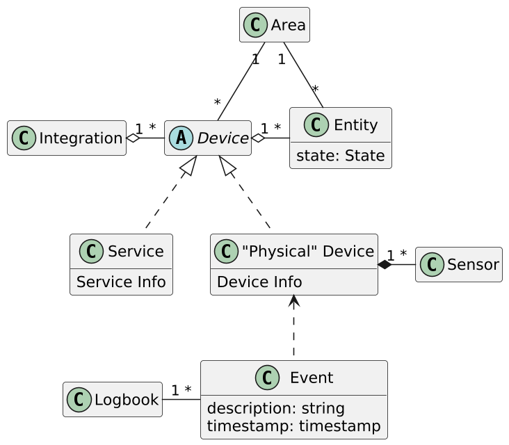
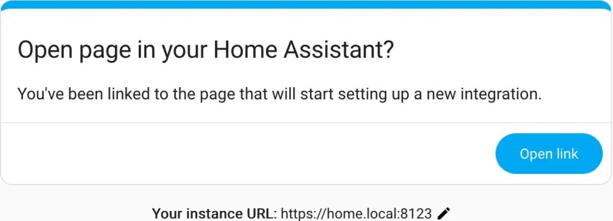
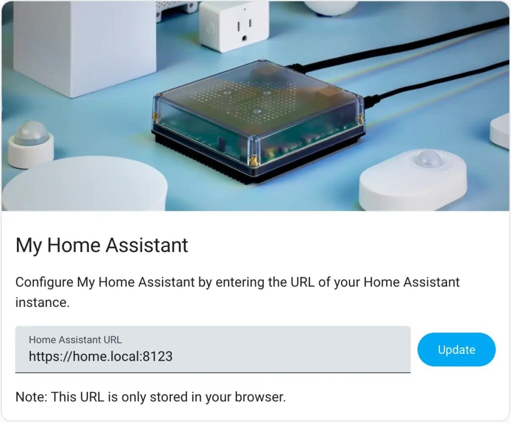
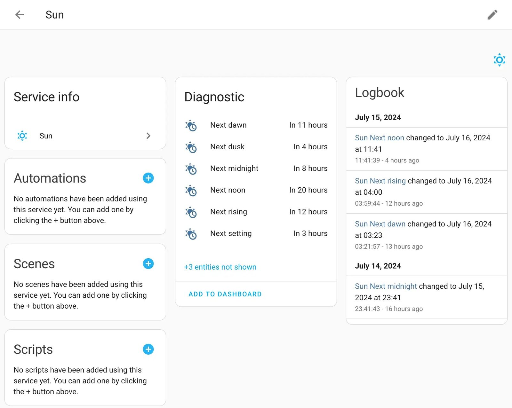
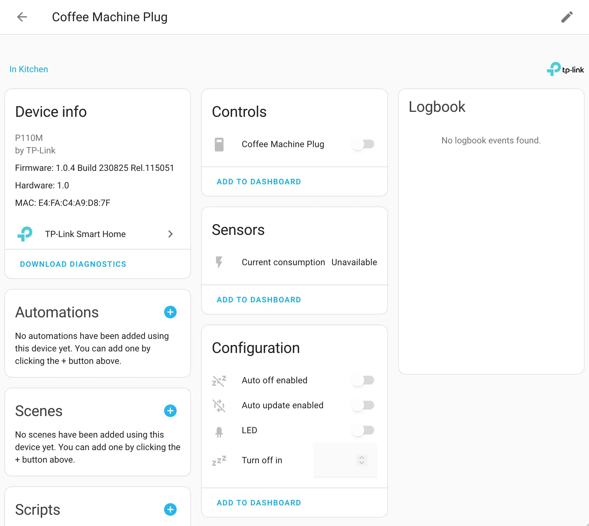
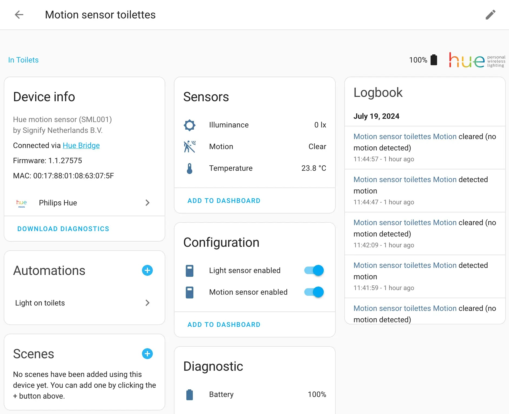

Home Assistant ([home-assistant.io](https://www.home-assistant.io/)) is a massive beast. It can be overwhelming for a newcomer; it was for me.

In this article, I want to describe the underlying model of Home Assistant, which is a good entry point for your home automation journey.

The biggest issue in describing the Home Assistant is the number of conflicting sources for this model:

* The `helpers` package of the [GitHub repository](https://github.com/home-assistant/core/tree/dev/homeassistant/helpers)
* The database; disclaimer: I didn't find the schema generation in the code, and I wasn't bold enough to check the deployed SQLite database
* The [documentation](https://www.home-assistant.io/getting-started/concepts-terminology/)
* The web interface

As far as I understand it, here's the conceptual model.

## Integrations

> Integrations are pieces of software that allow Home Assistant to connect to other software and platforms. For example, a product by Philips called Hue would use the Philips Hue integration and allow Home Assistant to talk to the hardware controller Hue Bridge. Any Home Assistant compatible devices connected to the Hue Bridge would appear in Home Assistant as devices.
>
> -- [Home Assistant documentation](https://www.home-assistant.io/getting-started/concepts-terminology/#integrations)

When you switch on Home Assistant for the first time, it's a blank slate. You must make it communicate with your different devices. That's the role of `Integration`; thus, I think it's a critical entity.

You can add an `Integration` on the [integration dashboard](https://home.frankel.ch:8443/config/integrations/dashboard): there's a *ADD INTEGRATION* in the lower left corner. Alternatively, you can add it from its documentation page, via a *ADD INTEGRATION TO MY HOME ASSISTANT* button. In this case, clicking on the latter opens a new page.

You can change it; the URL is stored on the browser.

Some integrations require additional configuration, *e.g.*, authentication.

## Devices

> Devices are a logical grouping for one or more entities. A device may represent a physical device, which can have one or more sensors. The sensors appear as entities associated with the device. For example, a motion sensor is represented as a device. It may provide motion detection, temperature, and light levels as entities. Entities have states such as detected when motion is detected and clear when there is no motion.
>
> -- [Home Assistant documentation](https://www.home-assistant.io/getting-started/concepts-terminology/#devices)

Once you've added the integration, you can add `Device`:

* some categorize as *Service* , when they need a Cloud connection, *e.g.* , [Google Cloud SDK](https://www.home-assistant.io/integrations/google_assistant_sdk/) or [GitHub](https://www.home-assistant.io/integrations/github/)
* some as *Device* , when they need one, *e.g.* , [Philips Hue](https://www.home-assistant.io/integrations/hue/).

## Entities

> Entities are the basic building blocks to hold data in Home Assistant. An entity represents a sensor, actor, or function in Home Assistant. Entities are used to monitor physical properties or to control other entities. An entity is usually part of a device or a service. Entities have states.
>
> -- [Home Assistant documentation](https://www.home-assistant.io/getting-started/concepts-terminology/#entities)

For example, the Philips Hue motion sensor device has three different available sensors:

* Illuminance in Lux
* Motion as a boolean
* Temperature in Celsius

Unexpectedly, a motion sensor provides a temperature sensor. Check your devices for such sensors; you might be in for a good surprise.

## Other objects

* Areas:An `Area` represents a location. You can put a **physical** `Device` in an `Area`.
* Automations:An `Automation` is pretty self-explanatory. Each consists of two main components: a trigger and an action. Note that you can add an optional condition.

  For example, let's imagine a Welcome Home `Automation`:
  * The trigger is when the user enters a geofenced perimeter around one's home
  * The action is to switch on the lights
  * Yet, switching on the lights in daylight doesn't make sense.

  The condition would be "only during the night".
* Scripts:As per the documentation, a `Script` is akin to an `Automation` but with no trigger; it's a named action. It lets you define the action once and reuse it across several `Automation` objects. Think .
* Add-ons:While an `Integration` allows interfacing with an external device or service, an `Add-On` provides a service. In other words, an `Add-On` extends the platform itself. For example, I installed the [Let's Encrypt](https://letsencrypt.org/) add-on to my Home Assistant installation to automatically manage a TLS certificate.
* Scenes:A `Scene` for a `Device` is akin to a *profile* for your phone. It's a named set of configurations that you save and reuse. I must admit that I don't use profiles on my phone; I don't have any `Scene` objects at the moment, and I have to understand their usage beyond lighting.

## Conclusion

In this article, I described the model objects available in Home Assistant. In the next post, I'll migrate from the proprietary Philips Hue automation to Home Assistant.

**To go further:**

* [Home Assistant](https://www.home-assistant.io/)
* [Concepts and terminology](https://www.home-assistant.io/getting-started/concepts-terminology/)

*Originally published at [A Java Geek](https://blog.frankel.ch/home-assistant/2/) on December 2^nd^, 2024*

*[DRY]: Don't Repeat Yourself
