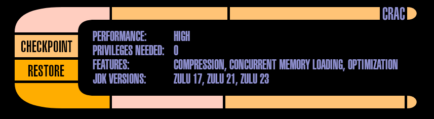

**Many regular Foojay readers are already familiar with project CRaC - a technology that can checkpoint (suspend) running Java application into a snapshot image and later restore it to the already warmed-up state. The most common motivation for this is significantly faster startup than if the application (and JVM) started normally. Traditionally this was supported by CRIU (Checkpoint and Restore in Userspace), coming with the burden of root privileges required for execution. Since Azul Zulu October 2024 release, this pain-point can be gone: meet Warp.**

On the high level CRaC checkpoint and restore work in two phases: in the first phase the application and JVM close all files and sockets and do any other cleanup. In the second phase JVM passes the control to CRIU: this connects to the process using ptrace (the same interface a native debugger like GDB would use) and records the state of the process into file.

During restore, a thin wrapper calls CRIU to restore the process and when this is complete the application and JVM can reconnect any resources it needs for its operation. In this model we call CRIU the checkpoint/restore (**C/R** ) **engine** ; OpenJDK CRaC has alternative C/R engines `simengine` and `pauseengine` that mock the snapshotting part (don't do anything) for testing/development purposes, especially for Windows an MacOS.

Warp is a new engine available in **Azul Zulu** builds that can fully replace CRIU, and does not require any extra priviledges.

In the last release, CRIU is still the default, but all you need to do in order to switch to Warp is one VM option: `-XX:CRaCEngine=warp`. So your command line would look like

<pre class="EnlighterJSRAW EnlighterJSRAW" data-enlighter-language="generic" data-enlighter-theme="" data-enlighter-highlight="" data-enlighter-linenumbers="" data-enlighter-lineoffset="" data-enlighter-title="" data-enlighter-group="">java -XX:CRaCEngine=warp -XX:CRaCCheckpointTo=/path/to/image_dir -jar my-app.jar
...
java -XX:CRaCEngine=warp -XX:CRaCRestoreFrom=/path/to/image_dir</pre>

and that's it. Of course you can check more options [in the documentation](https://docs.azul.com/core/crac/crac-vm-options).

Warp enters Docker {#h2-0-warp-enters-docker}
---------------------------------------------

People sometimes want to perform the warmup and checkpoint as a part of their container build. While it is possible [with BuildKit and privileged build](https://github.com/CRaC/example-spring-boot?tab=readme-ov-file#checkpoint-as-dockerfile-build-step) with Warp it becomes much easier: let's see an example using [CRaCed Spring Boot application](https://github.com/CRaC/example-spring-boot) and two-stage Dockerfile:

<pre class="EnlighterJSRAW EnlighterJSRAW" data-enlighter-language="dockerfile" data-enlighter-theme="" data-enlighter-highlight="" data-enlighter-linenumbers="" data-enlighter-lineoffset="" data-enlighter-title="" data-enlighter-group=""># syntax=docker/dockerfile:1.7-labs
ARG BASE_IMAGE=azul/zulu-openjdk:23-jdk-crac-latest

FROM $BASE_IMAGE AS builder
ENV ENDPOINT=http://localhost:8080
RUN apt-get update &amp;&amp; apt-get install -y curl maven siege wget
ADD . /example-spring-boot # Build the application
RUN cd /example-spring-boot &amp;&amp; mvn -B install &amp;&amp; \
    mv target/example-spring-boot-0.0.1-SNAPSHOT.jar /example-spring-boot.jar
# We use here-doc syntax to inline the script that will
# start the application, warm it up and checkpoint
RUN &lt;&lt;END_OF_SCRIPT
#!/bin/bash
$JAVA_HOME/bin/java -XX:CPUFeatures=generic -XX:CRaCEngine=warp \
    -XX:CRaCCheckpointTo=/cr -jar /example-spring-boot.jar &amp;
PID=$!
# Wait until the connection is opened
until curl --output /dev/null --silent --head --fail $ENDPOINT; do
    sleep 0.1;
done
# Warm-up the server by executing 100k requests against it
siege -c 1 -r 100000 -b $ENDPOINT
# Trigger the checkpoint
$JAVA_HOME/bin/jcmd /example-spring-boot.jar JDK.checkpoint
# Wait until the process completes, returning success
# (wait would return exit code 137)
wait $PID || true
END_OF_SCRIPT

FROM $BASE_IMAGE
ENV PATH="$PATH:$JAVA_HOME/bin"
COPY --from=builder /cr /cr
COPY --from=builder /example-spring-boot.jar /example-spring-boot.jar
CMD [ "java", "-XX:CRaCEngine=warp", "-XX:CRaCRestoreFrom=/cr" ]</pre>

To boldly hack what no one hacked before {#h2-1-to-boldly-hack-what-no-one-hacked-before}
-----------------------------------------------------------------------------------------

Why haven't we just "fixed" CRIU? How does Warp work? *It works very well, thank you* , even without [Heisenberg compensator](https://memory-alpha.fandom.com/wiki/Heisenberg_compensator). Let's dive a bit into history: the initial idea was based around crash dumps generated by Linux kernel. These coredumps contain the contents of process memory as well as state of each thread.

Normally the developer just inspects this to find the cause for the crash. However theoretically it is possible to create a process in this very state and continue from the point where it was interrupted. We don't have to do it from 'outside' as CRIU, though - the (restoring) process can read the coredump on its own, map the memory to the correct addreses, start the right number of threads and reset registers to the original values - and boom, the original application is in place.

If you are wondering how you could set values of all thread registers, there's a neat trick using POSIX signal handlers: Upon receiving a signal, Linux kernel writes the values of registers onto the stack, and prepares a new function call frame for the actual signal handler. When the signal handler returns, the execution enters 'signal trampoline' in which the `sigreturn` syscall is invoked and kernel reads back the register values, unwinding the stack.

Warp installs its own signal handler and sends the signal to each thread; this handler receives the location of register values before the signal was received, and can arbitrarily rewrite those. This way it is possible to return to a completely different location than where the signal was received: the thread finds itself on the program counter used before checkpoint and with the original stack.

When it is possible to change the state of the thread in the signal handler it is also possible to read it. These days we don't create the checkpoint image by crashing the process anymore: instead each thread receives a signal and writes its state down to the checkpoint image. For practical reasons we still use the ELF format (used by Linux kernel for coredumps) for these images: it is possible to open it using debugger (GDB) and inspect state of the application, and there are other utilities that work with this format.

Linux processes can introspect own state, can allocate memory at fixed addresses and can setup signal handlers and send signals to itself - there is nothing that would require any additional privileges. This is different from one process peeking into another and mutating it as CRIU does.

It all sounds too good to be true - is there a catch? Yes, but nothing that Java developers should be concerned of. One thing that Warp cannot restore without additional privileges are **process and thread identifiers** (PIDs or TIDs). Since starting a new process or thread with specific PID requires `CAP_SYS_ADMIN` or `CAP_CHECKPOINT_RESTORE` capabilities, Warp does not try to do that, and the restored process runs with any PID/TIDs it was assigned.

We can afford that; while CRIU is intended as a transparent mechanism to C/R arbitrary Linux application (even one consisting of multiple processes), and these can often use PIDs/TIDs internally, Warp is intended to be a C/R engine only for JVM. Therefore it patches only the few places in GLIBC/MUSL that could cache these values, with the new PID/TIDs. Both JVM and most other native multi-threaded applications/libraries also use `pthread_t` to work with threads, rather than TIDs. Luckily `pthread_t` holds a pointer to an opaque structure - and that's memory, something that Warp completely restores.

In the end a Java CRaC-able application will run smoothly after the restore - and if it somehow uses its own PID, it should update it using the regular `Resource.beforeCheckpoint/afterRestore` mechanism.

Adding the dilithium crystal chamber {#h2-2-adding-the-dilithium-crystal-chamber}
---------------------------------------------------------------------------------

Okay, so we can avoid the hassle with setting up privileges and capabilities for CRIU, in exchange for a little fixup in the application (if needed at all). Is this all Warp can offer? Of course not. We have a ton of ideas how to make CRaC faster and more convenient for various use-cases, and Warp works very well as the vehicle for these improvements.

One of those is image compression: the CRIU distributed with CRaC already implements a basic LZ4 compression functionality, but in Warp we can integrate this more deeply than with CRIU. We don't want to wait for the decompression of complete image (which could be hundreds of gigabytes, if your machine is big enough). Warp supports **Concurrent Memory Loading**: the application can be resumed before all the data is in memory; in fact it can start running when no memory is loaded at all.

When the application accesses memory that is not present, it triggers a segfault: in the handler it waits until the memory is backed and then retries the access.

In this concurrent memory loading mode, we don't fetch the missing pages lazily: the latency for individual page fetches would kill the improvements. Instead we 'optimize' the image: after checkpoint the application is immediately restored and on each page miss we record the address to a profile.

When the restore completes the profile is analyzed and the checkpoint image is reordered to provide the data that was needed early sooner. You can control this with `-XX:CRaCOptimizeImage=N` where `N` is the number of these training runs. This is how your commands would look like:

<pre class="EnlighterJSRAW EnlighterJSRAW" data-enlighter-language="generic" data-enlighter-theme="" data-enlighter-highlight="" data-enlighter-linenumbers="" data-enlighter-lineoffset="" data-enlighter-title="" data-enlighter-group="">java -XX:CRaCEngine=warp -XX:CRaCCheckpointTo=/path/to/image_dir \
    -XX:+CRaCImageCompression -XX:CRaCOptimizeImage=3 -jar my-app.jar
...
java -XX:CRaCEngine=warp -XX:CRaCRestoreFrom=/path/to/image_dir \
    -XX:+CRaCConcurrentMemoryLoading</pre>

Currently, these extra features are available only to Azul customers.

Fasten all seatbelts and prepare for ludicrous speed! {#h2-3-fasten-all-seatbelts-and-prepare-for-ludicrous-speed}
------------------------------------------------------------------------------------------------------------------

This is not all we have on our minds.

In the future, Warp will save you the worry about mounting volumes to the container; you will be able to store the checkpoint image in AWS S3 (or compatible storage).

If you're worried about confidentiality of the data inside the image, Warp will encrypt and decrypt it, the same way it runs compression and decompression.

You will be able to repeatedly checkpoint and restore.

Try Warp now and see how it can make CRaC easy to use!

Live long and prosper, with Warp!
