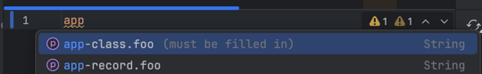

Introduction {#h2-0-introduction}
---------------------------------

I recently did a (long overdue) **migration from Spring Boot 2 to 3** on one of our larger applications.

Something that surprised me was that classes marked with `@ConfigurationProperties` had properties that were properly bound when running in Spring Boot 2 but were **no longer** bound after the upgrade.

Luckily, the automated testing suite caught this issue at *run time* , but it's obvious that such a thing silently failing can be **quite problematic**.

To showcase what went wrong and how to write proper classes holding your configuration, I've created [following repository.](https://github.com/wimdetroyer/spring-boot-2to3-config-prop-changes-with-lombok)

It's a maven multi-module project with three modules:

* **module-spring2** contains more or less the same set-up we had running in the application I migrated from SB 2.7.x
* **module-spring3-wrong** running on SB 3 breaks at run time. Some properties were not bound...
* **module-spring3** is the 'proper' way - but more on that later!

The modules each contain the following:

<pre class="EnlighterJSRAW" data-enlighter-language="yaml">app:
  url: 'foo'
  username: 'bar'
  required: true
  nested:
    foo: 'foonest'</pre>

And you can run the `DemoApp` to see what the `ApplicationProperties` contain at run time.

The initial set-up in Spring Boot 2. {#h2-1-the-initial-set-up-in-spring-boot-2}
--------------------------------------------------------------------------------

Let's take a look at the configuration properties in the initial setup of module-spring2:

<pre class="EnlighterJSRAW" data-enlighter-language="java">@Setter
@Getter
@ConfigurationProperties(prefix = "app")
@ToString
@RequiredArgsConstructor
public class ApplicationProperties {

        private String url;
        private String username;
        private boolean required;

        private final NestedApplicationProperties nested;
}</pre>

Nothing special here except maybe some *lombok magic* 🪄

Running the `DemoApp` gives us what we expect, though:
>
> ```
> ApplicationProperties(
>  url=foo,
>  username=bar,
>  required=true,
>  nested=NestedApplicationProperties(foo=foonest)
> )
> ```

Spring boot 3: Some of my properties are suddenly empty! {#h2-2-spring-boot-3-some-of-my-properties-are-suddenly-empty}
-----------------------------------------------------------------------------------------------------------------------

**Module-spring3-wrong** contains the **exact same setup** we've just seen in **module-spring2** but running the `DemoApp` gives us:
> ApplicationProperties(  
>
> url=null,  
>
> username=null,  
>
> required=false,  
>
> nested=NestedApplicationProperties(foo=foonest)  
>
> )

`url` and `username` now contains a `null` value, while `required` went from true to false... Not good!

Strangely, the `nested` property is still filled in...

So, can you spot what changed from spring boot 2 to spring boot 3?

When *delombok'ing* the class, it turns out the configuration properties has a constructor like this:

<pre class="EnlighterJSRAW" data-enlighter-language="java">private String url;
private String username;
private boolean required;
private final NestedApplicationProperties nested;
// Delombok'ed.
public ApplicationProperties(NestedApplicationProperties nested) {
    this.nested = nested;
}</pre>

That worked fine for Spring Boot 2 because the fields were all still bound via the *setters* .  

But Spring Boot 3 strongly favours *constructor binding* , and **if a single parameterized constructor is found** , it will **assume** you want constructor binding.  

(Take a look at the difference in the docs of [spring boot 2](https://docs.spring.io/spring-boot/docs/2.7.5/api/org/springframework/boot/context/properties/ConstructorBinding.html) and [spring boot 3](https://docs.spring.io/spring-boot/docs/3.1.3/api/org/springframework/boot/context/properties/bind/ConstructorBinding.html) aswell as the [Spring Boot 3 release notes](https://github.com/spring-projects/spring-boot/wiki/Spring-Boot-3.0-Release-Notes#improved-constructorbinding-detection) for more information on this)

The ApplicationProperties in our example have a sole constructor which only contains the `nested` property, so the other properties are simply not bound or have *default* values.

Normally using Lombok sparsely isn't all that bad, but in this case the sole constructor we made was somewhat hidden by using `@RequiredArgsConstructor` , obscuring the problem for me...

The **easy** solution I first saw was to just replace the `@RequiredArgsConstructor` with a `@AllArgsConstructor` or mark the fields final. Problem solved.  

But while we're busy upgrading, you might as well do some [code gardening](https://blog.codinghorror.com/tending-your-software-garden/) and look for the more **proper and maintainable** solution instead of the easy one.

The proper way to define your configuration properties {#h2-3-the-proper-way-to-define-your-configuration-properties}
---------------------------------------------------------------------------------------------------------------------

Let's take a look at the refined ApplicationProperties in **module-spring3**:

<pre class="EnlighterJSRAW" data-enlighter-language="java">/**
 * Some description.
 * (3)
 * @param url Must be filled in.
 * @param username Must be filled in.
 * @param required is it required?
 * @param nested nested props.
 */
@ConfigurationProperties(prefix = "app")
@Validated

// (1)
public record ApplicationProperties(
        @NotBlank String url, // (2)
        @NotBlank String username, // (2)
        boolean required,
        // (2) &amp; (3)
        @Valid @NestedConfigurationProperty NestedApplicationProperties nested
) {
}</pre>

### 1. Simplify your code \& get rid of lombok: use records instead of classes {#h3-4-1-simplify-your-code-get-rid-of-lombok-use-records-instead-of-classes}

Since configuration is bound at start-up time and should be **immutable** , it makes sense to refactor the class to a **record**.

By doing this, we can get rid of all the Lombok annotations we had before.

* Getters, setters, and a toString() method are all provided by the record.
* A record and all its components are also *final* , and an implicit *canonical* constructor will be created by the compiler. So no need for the `@RequiredArgsConstructor` and you won't need to remember to add the final keyword to the field.

### 2. Acquire 'start-up' time security: validate your configuration {#h3-5-2-acquire-start-up-time-security-validate-your-configuration}

We've added some [bean validation](https://beanvalidation.org/) to the configuration, too:

* `@NotBlank` on the url and username
* `@Valid` on the nested configuration properties to cascade the validation.

Now, when a property is missing for whatever reason, Spring will fail while wiring up its beans:

<pre class="EnlighterJSRAW" data-enlighter-language="raw">***************************
APPLICATION FAILED TO START
***************************

Description:

Binding to target com.example.ApplicationProperties failed:

    Property: app.username
    Value: "null"
    Reason: must not be blank

    Property: app.url
    Value: ""
    Origin: class path resource [application.yml] - 6:7
    Reason: must not be blank

Action:

Update your application's configuration</pre>

Note also that to cascade the validation to the nested properties, we had to add `@Valid` , which is in line with what the Bean Validation specification lays out, but which spring boot [did not follow](https://github.com/spring-projects/spring-boot/wiki/Spring-Boot-3.4-Release-Notes#bean-validation-of-configuration-properties%0A) up until recently.

To start using bean validation, just add the following dependency:

<pre class="EnlighterJSRAW" data-enlighter-language="xml">&lt;dependency&gt;
    &lt;groupId&gt;org.springframework.boot&lt;/groupId&gt;
    &lt;artifactId&gt;spring-boot-starter-validation&lt;/artifactId&gt;
&lt;/dependency&gt;</pre>

### 3. Bonus: Document your configuration and let your IDE help you. {#h3-6-3-bonus-document-your-configuration-and-let-your-ide-help-you}

Spring boot has an *annotation processor* that can read your configuration at compile-time and generate a JSON file with meta-data describing your configuration.  

This metadata is then stored under a /META-INF/spring-configuration-metadata.json as such:

<pre class="EnlighterJSRAW" data-enlighter-language="json">{
  "groups": [
    {
      "name": "app",
      "type": "com.example.ApplicationProperties",
      "sourceType": "com.example.ApplicationProperties"
    },
    {
      "name": "app.nested",
      "type": "com.example.NestedApplicationProperties",
      "sourceType": "com.example.ApplicationProperties",
      "sourceMethod": "nested()"
    }
  ],
  "properties": [
    {
      "name": "app.nested.foo",
      "type": "java.lang.String",
      "sourceType": "com.example.NestedApplicationProperties"
    },
    {
      "name": "app.required",
      "type": "java.lang.Boolean",
      "description": "is it required?",
      "sourceType": "com.example.ApplicationProperties",
      "defaultValue": false
    },
    {
      "name": "app.url",
      "type": "java.lang.String",
      "description": "Must be filled in.",
      "sourceType": "com.example.ApplicationProperties"
    },
    {
      "name": "app.username",
      "type": "java.lang.String",
      "description": "Must be filled in.",
      "sourceType": "com.example.ApplicationProperties"
    }
  ],
  "hints": []
}</pre>

Note that we also used the annotation `@NestedConfigurationProperty` in the revised example, which provides a *hint* to the annotation processor to view `com.example.NestedApplicationProperties` as [a nested type](https://docs.spring.io/spring-boot/api/java/org/springframework/boot/context/properties/NestedConfigurationProperty.html).

Now... the good thing is that your IDE probably supports reading out this JSON file and can give you neat things like:

* autocompletion
* error indication (the 'red squiggly' line)
* 'click through' from the properties file to the Java class
* descriptions (based upon Javadoc)



Descriptions and autocompletion in IntelliJ.{#caption-attachment-115257}

To start using configuration processing, it's as simple as adding:

<pre class="EnlighterJSRAW" data-enlighter-language="xml">&lt;dependency&gt;
    &lt;groupId&gt;org.springframework.boot&lt;/groupId&gt;
    &lt;artifactId&gt;spring-boot-configuration-processor&lt;/artifactId&gt;
    &lt;optional&gt;true&lt;/optional&gt;
&lt;/dependency&gt;</pre>

and enabling annotation processing in your favorite IDE.

Read more {#h2-7-read-more}
---------------------------

* <https://docs.spring.io/spring-boot/specification/configuration-metadata/index.html>

*** ** * ** ***

This blog was originally published on [my personal blog](https://wimdetroyer.com/blog/the-proper-way-of-using-configuration-properties-in-spring) the 1st of January, 2025.
