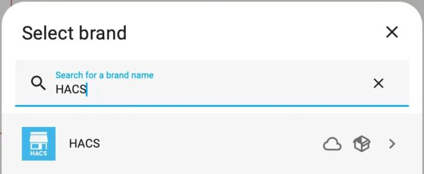
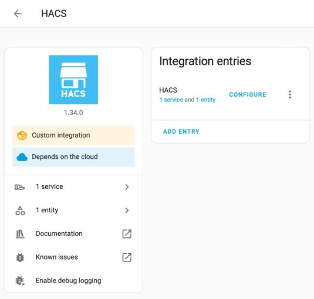
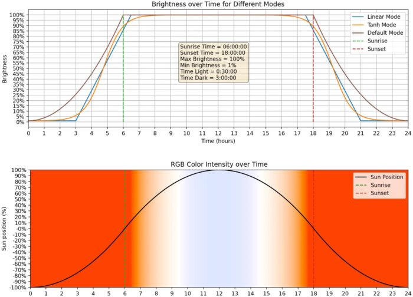
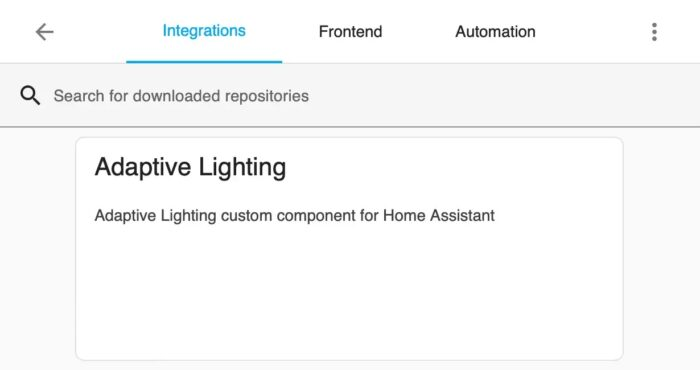
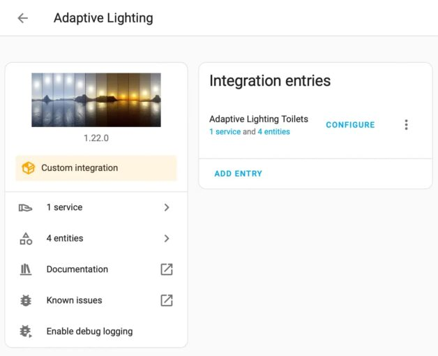
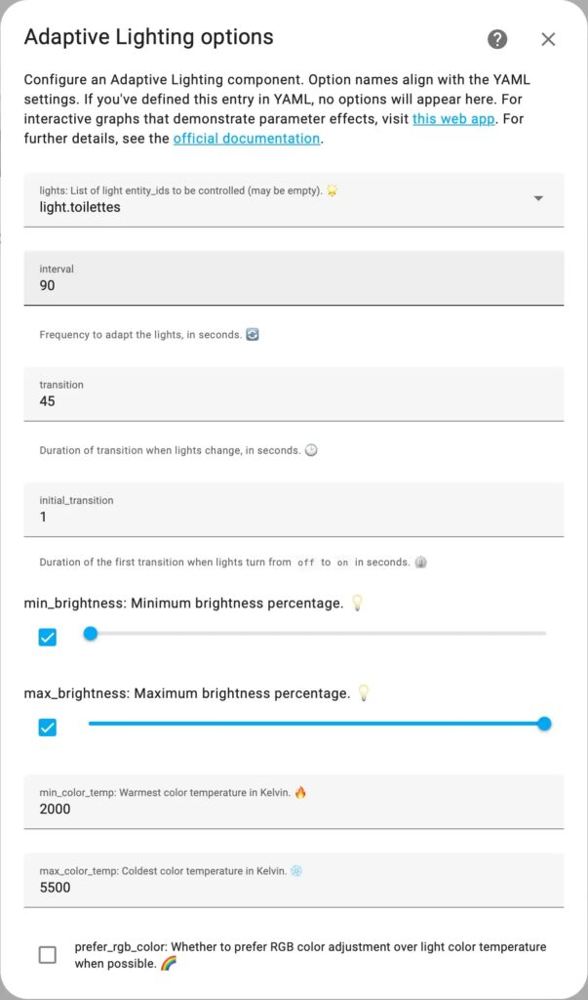
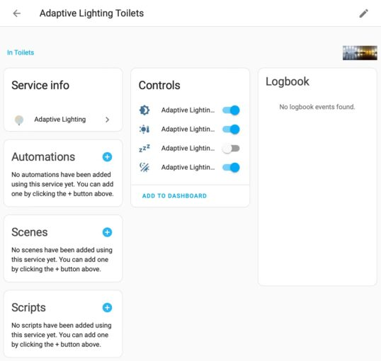

**In the [previous post](https://blog.frankel.ch/home-assistant/3/) of this focus, we replaced Philips Hue automation with the one from Home Assistant. One significant gap we noticed was that Home Assistant doesn't automatically adjust the brightness according to the time of the day, a feature Philips Hue offers. In this post, we are going to address this gap.**

The first step when wanting to add a feature to Home Assistant is to browse through available integrations. While there was no out-of-the-box integration, I discovered an alternative: HACS.

## The Home Assistant Community Store

Before implementing your integration, you should know about [Home Assistant Community Store](https://hacs.xyz/) or HACS. HACS is a **third-party integration store**. If Home Assistant doesn't offer the necessary integration, there's a considerable chance somebody published it on HACS.

HACS itself is available as an integration.

Once you install it, it appears in the integration list.

On HACS, we can search for a relevant integration. Indeed, there's [Adaptive Lighting](https://github.com/basnijholt/adaptive-lighting):

### Adaptive Lighting

> Adaptive Lighting is a custom component for Home Assistant that intelligently adjusts the brightness and color of your lights 💡 based on the sun's position, while still allowing for manual control.
>
> -- [GitHub - Adaptive Lighting](https://github.com/basnijholt/adaptive-lighting)

The original app allowed the light to be configured according to time ranges. Adaptive Lighting is head and shoulders above that: it takes into account sunrise and sunset time. Even better, it provides an [app](https://basnijholt.github.io/adaptive-lighting/) for configuration.

To add any repository to HACS, click on the *HACS \> Integrations* item on the main left menu. Then click on the bottom right *Explore and download repositories* button. Add the [Adaptive Lighting](https://github.com/basnijholt/adaptive-lighting) repo.

Home Assistant features the Adaptive Lighting integration at this stage, ready to be configured and used.

We can now add a new entry. Click on the *Add Entry* button. Name it accordingly. Once the service is created, click the *Configure* button.

The configuration can be quite intimidating, with its many parameters. You can use the companion app mentioned above to help you with it. I kept all parameters to their default value, but the most important one: the light is to adapt according to the time of the day.

Depending on your setup, you can configure a single light, a couple of them, or all. I added only a single one, the one managed by the sensor.

## Conclusion

In this article, we configured the Adaptive Lighting integration to our Home Assistant. We can now benefit from different intensities based on the time of the day.

Even better, we learned to search the HACS when we didn't find the relevant out-of-the-box integration.

**To go further:**

* [Home Assistant](https://www.home-assistant.io/)
* [Home Assistant Community Store](https://hacs.xyz/)
* [Adaptive Lighting](https://github.com/basnijholt/adaptive-lighting)
* [Replace Philips Hue automation with Home Assistant's](https://blog.frankel.ch/home-assistant/3/)

*Originally published at [A Java Geek](https://blog.frankel.ch/home-assistant/4/) on December 22^nd^, 2024*
