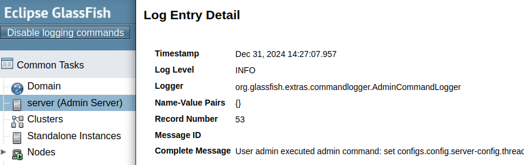
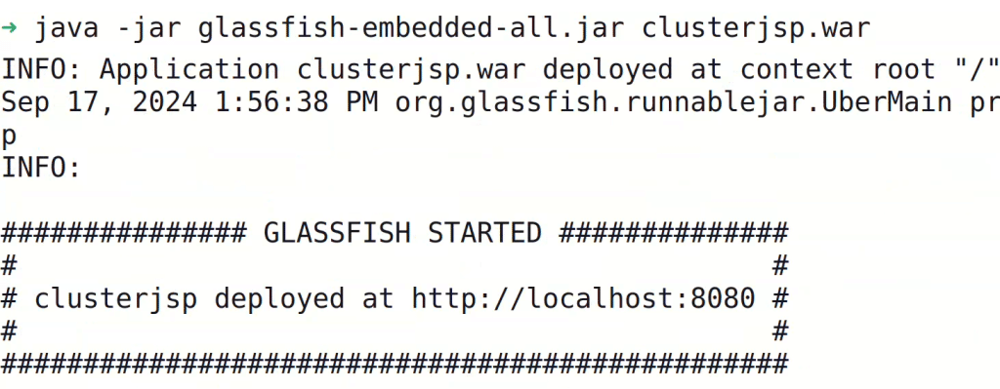

**As 2025 slowly gets started, it's a perfect moment to reflect on what we at [OmniFish](https://omnifish.ee/) have achieved this year. It has been a year of growth, innovation, and dedication to the open-source community and the products we're deeply passionate about.**

From expanding our team to pushing the boundaries of what GlassFish and Piranha can do, this year has been nothing short of transformative. Let's take a look back at some of the highlights and share our hopes for an even brighter future.

**OmniFish: Growing into a leading Jakarta EE and GlassFish player**

This year, OmniFish made its mark across the globe, showcasing our commitment to the Java ecosystem and the open-source community. We participated in several major conferences, either with our own booth or as part of the Jakarta EE booth. Notable highlights include:

* **Booth Exhibitions:** JAX in Mainz, W-JAX in Munich, and Jakarta EE booths at DevNexus in Atlanta, JCon in Cologne, and DevBCN in Barcelona.
* **Conference Talks:** Our team presented at WeAreDevelopers World Congress, GeeCon, JavaCro, and TestCon Europe, sharing insights and expertise with the developer community.

We're thrilled to have acquired several new customers this year, providing them with robust, high-quality open-source products and expert services. Our customers benefit from having peace of mind, building applications on solid, reliable and productive Java runtimes, knowing that they're supported by a team dedicated to resolving their issues and optimizing performance.

On the home front, OmniFish grew stronger by expanding our team with a junior developer, a sales representative, and a marketing specialist. We also revamped our website to include more informative articles and resources and increased our social media presence, becoming active on BlueSky while maintaining engagement on X (formerly Twitter) and LinkedIn. We also followed our mantra of joyful development and added a whole new [section for developers](https://omnifish.ee/developers/), with useful guides, tips \& tricks to make developers more productive.

**GlassFish: Building for Today and Tomorrow**

As the most active contributor to the GlassFish project, we've continued to lead its development, focusing on enhancing its capabilities and usability for both the community and our customers.

* **Improvements in GlassFish 7:**
  * Fixed critical issues in WebSocket and security.
  * Enhanced logging and resolved multiple resource leaks.
  * Modernized for Java 21 and virtual threads.
  * Improved performance and reduced startup times.
  * Added new features:
    * **Admin Command Logger:** Logs admin commands for scripting and auditing.
    * **Runnable GlassFish Embedded:** Enables starting Jakarta EE apps with `java -jar glassfish-embedded.jar application.war`.
    * **Official Docker Images:** We donated our Docker images for GlassFish to the Eclipse GlassFish Project.
    * **Embedded Support in Docker:** Enabled GlassFish Embedded to run seamlessly in the official GlassFish Docker container.
  * Consistently updated dependencies to address security and compatibility concerns.

<figure class="wp-block-image size-full is-resized">
 
</figure>

* **Progress on GlassFish 8:**
  * Released eight milestones, closely tracking Jakarta EE 11 developments.
  * Achieved compatibility with JDK 22 and JDK 23.
  * Prepared for future Java versions by removing references to Java SE SecurityManager.

These efforts have not only improved GlassFish but also helped many of our customers seamlessly upgrade to GlassFish 7, ensuring their applications continue to thrive with modern Java and Jakarta EE versions. We helped some of our customers migrate easily to GlassFish 7 even from other application servers like Payara or JBoss in order to benefit from the quality of GlassFish server and our dedicated support service and additional tools. And we're preparing new tooling and guides to help WebLogic users with straightforward migration to GlassFish so that they can enjoy the same benefits much more easily.

**Piranha: Innovating Java Runtimes**

Our contributions to [Piranha](https://piranha.cloud/) have further solidified its reputation as a lightweight, modern runtime for Java applications. Key achievements this year include:

* Introduction of new distributions: **SinglePiranha** and **MultiPiranha**.
* Development of an Uber module for simplified deployments.
* Compatibility with Java 22 and 23.
* Numerous enhancements to the CLI tool and build plugins.
* Improvements in Jakarta Servlet compatibility, closing some of the remaining gaps in making Piranha fully compatible

These advancements have made Piranha more feature-rich and user-friendly, offering developers a compelling alternative as a lightweight and flexible Java runtimes with high support for Jakarta EE.

**Jakarta EE: Driving the Future of Enterprise Java**

Our involvement with Jakarta EE continues to be a cornerstone of our work. This year, we actively contributed to the Jakarta EE 11 release, leading community-driven initiatives and adding new features that address real-world needs. Arjan Tijms, one of our own, played a pivotal role in steering the Jakarta EE 11 release. In 2024, all the individual specifications for Jakarta EE 11 have been released. The complicated refactoring effort in the Jakarta TCK (testing kit) has delayed the final release of Jakarta EE 11. However, we're working hard together with experts from Oracle, Red Hat, IBM, and Microsoft to resolve all remaining issues and release Jakarta EE 11 in early 2025.

**Looking Ahead to 2025**

As we look to the future, our momentum only grows stronger.

In 2025, we aim to:

* Release GlassFish 8 alongside Jakarta EE 11.
* Continue enhancing GlassFish with a focus on observability, developer experience, virtual threads, and AI integration.
* Further innovate with Piranha, expanding its features and usability.
* Strengthen our involvement in Jakarta EE and open-source initiatives.

We're excited about what's to come and deeply grateful to our team, customers, and the wider community for their support. Together, we're building a future where Java and its ecosystem continue to thrive, evolve, and empower developers worldwide.

Here's to an even more remarkable 2025!

