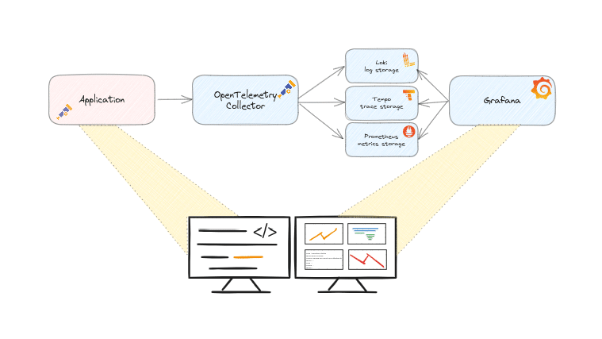
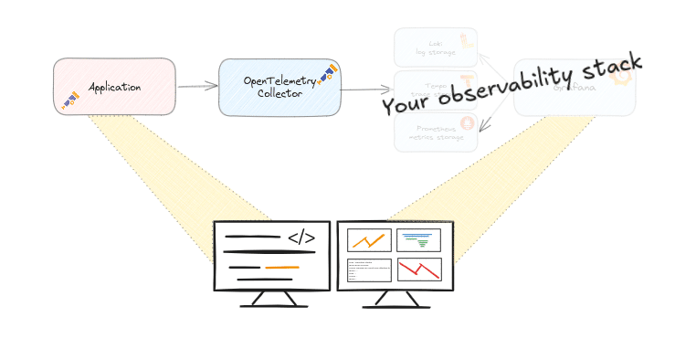
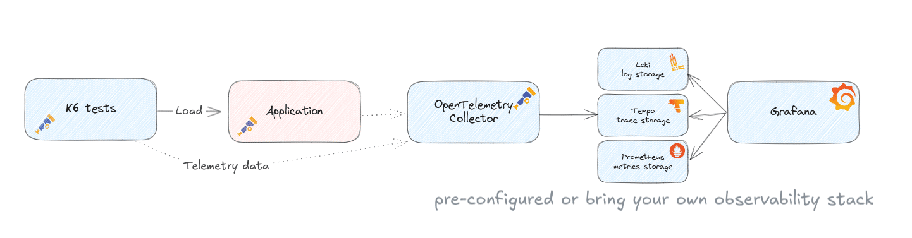
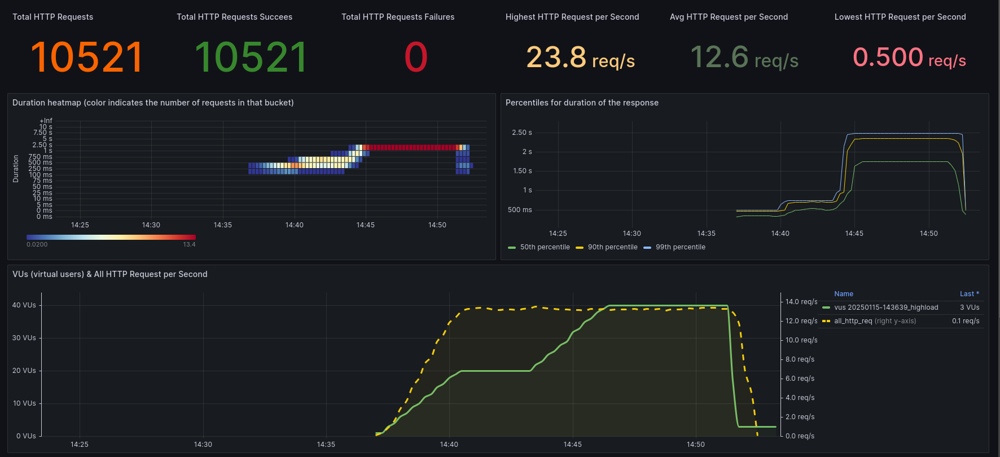

Code challenges are a nice way to challenge yourself with programming, resulting in some great challenges like [#1brc](https://github.com/gunnarmorling/1brc) and the yearly [Advent of Code (#AoC)](https://adventofcode.com).

While these challenges often include a competitive element, the Application Observability Code Challenges are focussed on the learning about observability practices.

What are the Application Observability Code Challenges?
-------------------------------------------------------

The idea of these challenges came to me based on the challenges above and the fact that I see in practice that quite a few developers are struggling to get up to speed with applying observability practices.

The challenges are small applications or code samples. When you normally write your code, you build the application with a goal in mind and you test the behaviour of your application.

But do you know that your application does what it is supposed to do? Observability is about:
> How effectively you can understand the behaviour of the system from the outside, using the data it generates.

The sample application has a certain behaviour, and can you understand this behaviour from outside the system?

If you put your own application into production and you get paged in the middle of the night because of some problems, how do you know for sure that the system is behaving as expected?

This requires two things: first, that your application is observable, and second, that you have the skills to use your observability tools.

But also during development, when you run your (performance) tests, you need to understand the behaviour of your application to make the right decisions about whether your code changes are production-ready.

Observability data can help you make that decision.

The goal of these code challenges is to practice and gain more experience in both making your application observable and using the observability tools.

Goals
-----

The goals of the challenges:

* 🎉 - Have fun !
* 🖵 - Learn to understand the behaviour of the code
* 📈 - Learn how to use observability tools to understand code behaviour 📈
* 🔍 - Spot the unexpected behaviour!
* 🤗 - Practice and learn!
* 🎁 - Share your findings and solution, either as a comment or as a pull request

The goal is not to discuss the libraries, frameworks or specific code implementation used, but to practice and learn!

What do the code challenges look like?
--------------------------------------

My background is in Java development, so most of the challenges I will provide will be Java challenges. I have a number of them in mind.

The challenge will be available in a git repository, all prepared to run on your system as smooth as possible.

The application will already produce some telemetry data with OpenTelemetry.

The **challenge** is to find the problem and **extend the observability** to get better insights and also **proof** that a potential **solution works** as expected.

Using the [Observability Toolkit](https://github.com/cbos/observability-toolkit) you can easily spin up OpenTelemetry and Grafana based observability tools.

You can then run a sample application and a test script.

In Grafana you can see the first results, then it is up to you to continue. Some hints will be provided.

The whole setup will look like this:  

Your own stack
--------------

If you usually use other observability tools, I encourage you to use them!

The sample application is prepared to send data using OpenTelemetry, so any setup that supports OTLP will work.

Online environment(s)
---------------------

Besides running it locally, I am also preparing a guided online environment with Killercoda, [https://killercoda.com/observability-code-challenges](https://goto.ceesbos.nl/aocckk).  

That way you don't have to mess with your local machine and it will give you some more guidance.

I may also add a setup with devcontainers so you can easily run it in other ways. Please let me know if you are interested.

The first challenge
-------------------

The steps to follow for the first challenge:

* Run the sample application
* Run the tests to see what happens
* Try to find out what happens, make a hypothesis❗
* **Improve the observability** of the application to **prove the hypothesis**
* Optional: fix the problem and **prove it with observability data that it is really fixed**
* Optional, but highly appreciated 🙏: Share your findings, insights you learned and potential solution, either as a ['discussion'](https://github.com/cbos/application-observability-code-challenges/discussions) or as a pull request

🛠️ How to Get Started
----------------------

All the details you need to jump in can be found here:  

👉 [https://github.com/cbos/application-observability-code-challenges/tree/main/challenge-01](https://goto.ceesbos.nl/ghch01)

Prefer an online environment? No problem! Use KillerCode to get started with just a few clicks:  

👉 [https://killercoda.com/observability-code-challenges](https://goto.ceesbos.nl/aocckk)

Challenge details
-----------------

* The sample application is a simple **Spring Boot** application with a REST endpoint implemented in Jersey/JAX-RS.
* The application is instrumented using **OpenTelemetry** auto instrumentation.
* You can either run the application with Docker or directly.
* Pre-configured **K6 load scripts** to simulate traffic and reveal performance bottlenecks.
* You can use the **pre-configured [Observability Toolkit](https://github.com/cbos/observability-toolkit)** or you can use **your own Observability stack**

The setup looks like this:  

After running one of the scripts you can get more details in a Grafana dashboard like this:  

In this screenshot you can see that the application is **reaching a limit for some reason** , more load does not give more requests per second and **with more load the response times increase** a lot.

Are you able to improve the observability, find the cause and maybe even fix it?

👉 Go to the challenge: [https://github.com/cbos/application-observability-code-challenges/tree/main/challenge-01](https://goto.ceesbos.nl/ghch01)

*Originally published on [ceesbos.nl](https://ceesbos.nl) in January 2025*
